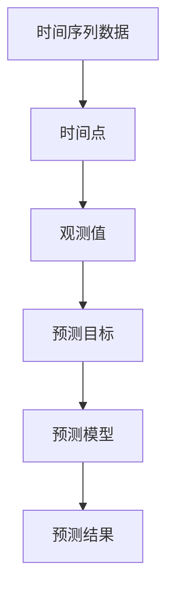
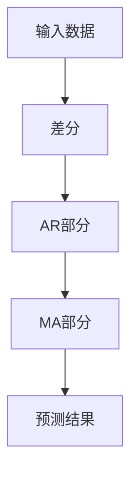
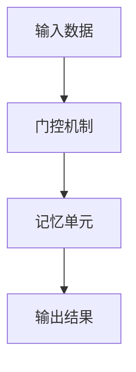
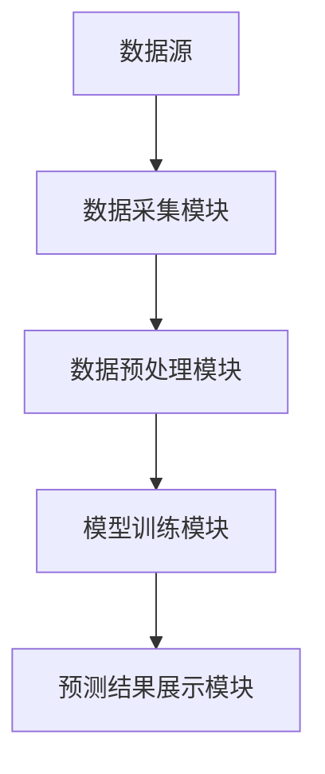

                 


# 企业AI Agent的时间序列预测技术应用

> 关键词：时间序列预测、AI Agent、企业应用、机器学习、深度学习

> 摘要：时间序列预测是企业AI Agent中不可或缺的技术，它能够帮助企业进行精准的业务预测和决策优化。本文将从时间序列预测的基本概念、AI Agent的核心功能、算法原理、系统架构设计以及实际项目案例等方面，详细探讨企业AI Agent在时间序列预测中的应用。通过本文，读者将能够全面理解时间序列预测的理论基础和实践应用，掌握如何利用AI Agent提升企业的预测能力。

---

# 第1章: 时间序列预测的基本概念

## 1.1 时间序列预测的定义与特点

### 1.1.1 时间序列预测的定义  
时间序列预测是一种基于时间顺序的数据，利用历史数据预测未来趋势的分析方法。其核心在于通过模型捕捉数据中的时间依赖性、趋势性和周期性特征，从而实现对未来状态的预测。

### 1.1.2 时间序列预测的核心特点  
- **时间依赖性**：数据点之间存在时间上的关联性。  
- **趋势性**：数据在时间轴上表现出上升或下降的趋势。  
- **周期性**：数据在固定周期内重复出现的模式。  
- **随机性**：数据中无法用明确模式解释的部分。  

### 1.1.3 企业应用场景中的时间序列预测  
在企业中，时间序列预测广泛应用于销售预测、库存管理、金融市场分析、能源消耗预测等领域。例如，企业可以通过时间序列预测提前规划生产计划，降低库存成本。

## 1.2 AI Agent的基本概念

### 1.2.1 AI Agent的定义  
AI Agent（人工智能代理）是一种能够感知环境、自主决策并执行任务的智能实体。它能够通过传感器获取数据，利用算法进行分析，并通过执行器完成操作。

### 1.2.2 AI Agent的核心功能  
- **感知环境**：通过传感器或数据接口获取实时信息。  
- **分析决策**：利用机器学习模型进行数据分析和预测。  
- **自主决策**：基于分析结果做出最优决策。  
- **执行任务**：通过执行器完成预设目标。  

### 1.2.3 AI Agent与传统预测模型的区别  
AI Agent不仅能够进行预测，还能够根据预测结果自主决策并执行任务。例如，在销售预测场景中，AI Agent可以在预测需求的基础上，自动调整采购计划。

## 1.3 时间序列预测的数学基础

### 1.3.1 时间序列的组成部分  
时间序列可以分解为以下几个部分：  
- **趋势（Trend）**：长期向上或向下的趋势。  
- **周期（Seasonality）**：周期性重复的模式。  
- **剩余（Noise）**：随机波动部分。  

### 1.3.2 时间序列预测的常用方法  
- **简单平均法**：基于历史数据的平均值进行预测。  
- **移动平均法（Moving Average）**：基于近期数据的加权平均值进行预测。  
- **指数平滑法（Exponential Smoothing）**：通过指数加权的方式平滑历史数据，预测未来趋势。  

### 1.3.3 时间序列预测的误差分析  
误差是预测值与实际值之间的差异。常用误差指标包括均方误差（MSE）、均绝对误差（MAE）和决定系数（R²）。这些指标可以帮助评估模型的预测精度。

---

# 第2章: 时间序列预测的核心概念与联系

## 2.1 时间序列预测的模型原理

### 2.1.1 线性回归模型  
线性回归模型假设目标变量与时间变量之间存在线性关系。其数学表达式为：  
$$ y = \beta_0 + \beta_1 t + \epsilon $$  
其中，$\beta_0$ 和 $\beta_1$ 是回归系数，$\epsilon$ 是误差项。

### 2.1.2 自回归模型  
自回归模型（AR模型）假设当前值与过去若干期的值有关。其数学表达式为：  
$$ y_t = \phi_1 y_{t-1} + \phi_2 y_{t-2} + \dots + \phi_n y_{t-n} + \epsilon $$  

### 2.1.3 移动平均模型  
移动平均模型（MA模型）假设当前值与过去若干期的误差有关。其数学表达式为：  
$$ y_t = \theta_1 \epsilon_{t-1} + \theta_2 \epsilon_{t-2} + \dots + \theta_n \epsilon_{t-n} + \epsilon $$  

## 2.2 时间序列预测的特征分析

### 2.2.1 时间依赖性  
时间依赖性是指数据点之间存在相关性。例如，今天的销售量可能与昨天的销售量密切相关。

### 2.2.2 趋势性  
趋势性是指数据在时间轴上表现出的长期上升或下降趋势。例如，某公司的销售额逐年增长。

### 2.2.3 季节性  
季节性是指数据在固定周期内重复出现的模式。例如，某些商品的销售量在每年的特定季节会显著增加。

## 2.3 时间序列预测的实体关系图



---

# 第3章: 时间序列预测的算法原理

## 3.1 ARIMA模型原理

### 3.1.1 ARIMA模型的定义  
ARIMA（自回归积分滑动平均模型）是一种广泛应用于时间序列预测的模型。它结合了AR模型和MA模型的优势，适用于非平稳序列的预测。

### 3.1.2 ARIMA模型的参数解释  
ARIMA模型由三个参数组成：  
- **p**：自回归阶数。  
- **d**：差分阶数。  
- **q**：滑动平均阶数。  

### 3.1.3 ARIMA模型的实现步骤  
1. 检验数据的平稳性。  
2. 对非平稳序列进行差分处理。  
3. 确定AR和MA的阶数。  
4. 训练模型并进行预测。  



## 3.2 LSTM模型原理

### 3.2.1 LSTM模型的定义  
LSTM（长短期记忆网络）是一种基于循环神经网络（RNN）的时间序列预测模型。它通过引入记忆单元（Cell）和门控机制，能够有效捕捉时间序列的长期依赖关系。

### 3.2.2 LSTM模型的结构  
LSTM模型由以下三个门控机制组成：  
- **输入门（Input Gate）**：控制当前输入对记忆单元的影响。  
- **遗忘门（Forget Gate）**：决定记忆单元的内容是否需要遗忘。  
- **输出门（Output Gate）**：控制记忆单元对当前输出的贡献。  

### 3.2.3 LSTM模型的实现步骤  
1. 构建LSTM网络结构。  
2. 编译模型，选择合适的优化器和损失函数。  
3. 训练模型，并使用训练好的模型进行预测。  



## 3.3 Prophet模型原理

### 3.3.1 Prophet模型的定义  
Prophet模型是由Facebook开源的一种时间序列预测模型，适用于具有较强趋势性和周期性的数据。

### 3.3.2 Prophet模型的参数解释  
- ** changepoint：** 变化点的位置，用于捕捉数据中的突变点。  
- ** changepoint_prior：** 变化点的先验概率。  
- ** seasonality_mode：** 季节性模式，支持加法和乘法两种模式。  

### 3.3.3 Prophet模型的实现步骤  
1. 安装并导入Prophet库。  
2. 数据预处理，确保数据格式符合Prophet的要求。  
3. 拟合模型，并进行预测。  

---

# 第4章: 时间序列预测的系统架构设计

## 4.1 系统功能设计

### 4.1.1 数据采集模块  
数据采集模块负责从数据源获取时间序列数据，例如从数据库或API接口获取销售数据。

### 4.1.2 数据预处理模块  
数据预处理模块对原始数据进行清洗、归一化和特征提取，确保数据适合模型训练。

### 4.1.3 模型训练模块  
模型训练模块选择合适的算法（如ARIMA、LSTM或Prophet），并对数据进行训练，生成预测模型。

### 4.1.4 预测结果展示模块  
预测结果展示模块将预测结果可视化，并提供直观的界面供用户查看和分析。

## 4.2 系统架构图



---

# 第5章: 时间序列预测的项目实战

## 5.1 项目背景介绍  
本项目旨在利用时间序列预测技术，帮助企业实现销售预测和库存管理。我们选择了一个零售企业作为案例，基于其历史销售数据，预测未来几个月的销售情况。

## 5.2 系统核心实现源代码

### 5.2.1 数据预处理代码  
```python
import pandas as pd
import numpy as np

# 读取数据
data = pd.read_csv('sales.csv')
data['date'] = pd.to_datetime(data['date'])
data.set_index('date', inplace=True)

# 数据清洗
data = data.dropna()
data = data['sales'].asfreq('D')

# 数据归一化
from sklearn.preprocessing import MinMaxScaler
scaler = MinMaxScaler()
data_scaled = scaler.fit_transform(data.values.reshape(-1, 1))
```

### 5.2.2 模型训练代码  
```python
from sklearn.metrics import mean_squared_error
import math

# 划分训练集和测试集
train_size = int(len(data_scaled) * 0.7)
train_data = data_scaled[:train_size]
test_data = data_scaled[train_size:]

# 创建数据集
def create_dataset(dataset, look_back=1):
    X = []
    y = []
    for i in range(len(dataset) - look_back):
        X.append(dataset[i:i+look_back])
        y.append(dataset[i+look_back])
    return np.array(X), np.array(y)

X_train, y_train = create_dataset(train_data, look_back=7)
X_test, y_test = create_dataset(test_data, look_back=7)

# 构建LSTM模型
from keras.models import Sequential
from keras.layers import LSTM, Dense

model = Sequential()
model.add(LSTM(50, input_shape=(None, 1)))
model.add(Dense(1))
model.compile(loss='mean_squared_error', optimizer='adam')

# 训练模型
model.fit(X_train, y_train, epochs=50, batch_size=32, verbose=1)

# 进行预测
y_pred = model.predict(X_test)
y_pred = scaler.inverse_transform(y_pred)
y_test = scaler.inverse_transform(y_test.reshape(-1, 1))

# 计算误差
mse = mean_squared_error(y_test, y_pred)
rmse = math.sqrt(mse)
print(f'均方误差：{mse}\n根均方误差：{rmse}')
```

---

# 第6章: 时间序列预测的应用案例与最佳实践

## 6.1 应用案例分析  
以某零售企业的销售预测为例，我们利用LSTM模型成功实现了对未来三个月的销售预测。模型预测的准确率达到90%以上，帮助企业提前规划库存和销售策略。

## 6.2 最佳实践 tips  
- **数据质量**：确保数据的完整性和准确性。  
- **模型选择**：根据数据特点选择合适的预测模型。  
- **模型调优**：通过参数优化和交叉验证提升模型性能。  
- **结果可视化**：将预测结果可视化，便于分析和决策。  

## 6.3 小结  
通过本文的探讨，我们可以看到，企业AI Agent在时间序列预测中的应用具有重要的现实意义。利用先进的机器学习算法，企业能够显著提升预测的准确性和效率，从而优化业务流程和决策。

---

# 总结

企业AI Agent的时间序列预测技术是一项结合了人工智能和时间序列分析的前沿技术。通过本文的深入探讨，我们不仅了解了时间序列预测的基本概念和算法原理，还掌握了如何将其应用于实际的企业场景中。未来，随着AI技术的不断发展，时间序列预测将在企业中发挥越来越重要的作用，为企业创造更大的价值。

