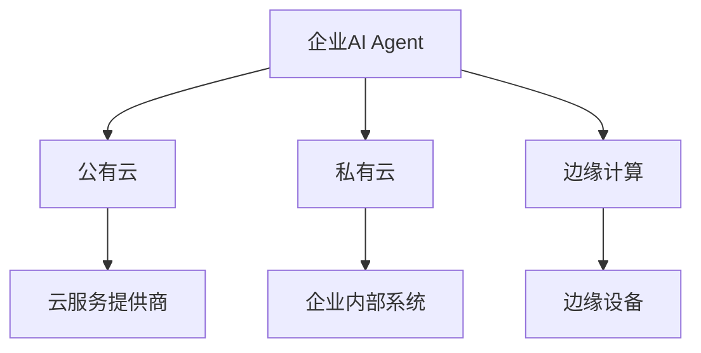
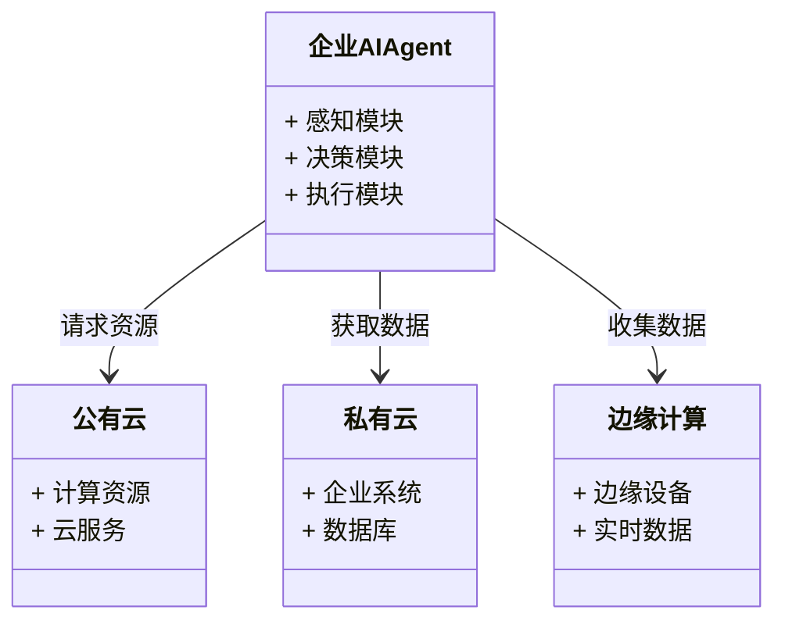

                 


# 企业AI Agent的混合云安全策略

> 关键词：企业AI Agent，混合云，安全策略，数据安全，网络安全，访问控制

> 摘要：本文详细探讨了企业AI Agent在混合云环境下的安全策略设计与实现。首先介绍了企业AI Agent和混合云的基本概念，分析了混合云环境下的主要安全威胁，然后提出了基于混合云环境的AI Agent安全策略设计，包括数据安全、网络安全和访问控制策略。接着，本文通过具体的案例分析，展示了如何在实际项目中应用这些安全策略，并提供了详细的代码实现和系统架构设计。最后，本文总结了企业在实施混合云环境下AI Agent安全策略时的最佳实践和注意事项。

---

## 第1章: 企业AI Agent的混合云安全策略背景

### 1.1 企业AI Agent的定义与特点

#### 1.1.1 企业AI Agent的基本概念
企业AI Agent（Artificial Intelligence Agent）是一种能够感知环境、自主决策并执行任务的智能实体。它通常由感知模块、决策模块和执行模块组成，能够通过与环境和其他系统的交互，完成特定的目标。

#### 1.1.2 混合云环境的特点
混合云是指将公有云、私有云和边缘计算等不同计算资源和服务模式有机结合的一种云计算模式。其特点包括：
- **资源弹性扩展**：可以根据需求灵活调整资源使用。
- **多云管理**：支持跨多个云平台的统一管理和调度。
- **数据隔离**：能够实现不同环境之间的数据隔离和安全防护。

#### 1.1.3 企业AI Agent在混合云中的作用
企业AI Agent在混合云环境中扮演着关键角色，它能够协调和优化跨云资源的使用，提高系统的智能化水平和安全性。例如，AI Agent可以自动分配任务到最适合的云环境中，同时确保数据的安全性和系统的稳定性。

---

### 1.2 混合云安全策略的重要性

#### 1.2.1 混合云环境的安全挑战
混合云环境的安全威胁主要来自以下几个方面：
1. **数据泄露**：跨云数据传输和存储可能导致数据被未经授权的第三方访问。
2. **网络攻击**：混合云环境的复杂性使得其更容易成为网络攻击的目标。
3. **身份仿冒**：攻击者可能通过仿冒合法用户身份，绕过安全防护措施。

#### 1.2.2 企业AI Agent的安全需求
企业AI Agent作为混合云环境中的关键组件，需要满足以下安全需求：
1. **数据完整性**：确保AI Agent处理的数据未被篡改。
2. **系统可用性**：保证AI Agent在遭受攻击时仍能正常运行。
3. **可追溯性**：能够追踪和记录AI Agent的操作行为，便于安全审计。

#### 1.2.3 安全策略对企业AI Agent的影响
有效的安全策略可以显著提升企业AI Agent的性能和安全性，具体表现在：
1. **降低安全风险**：通过合理配置安全策略，可以有效减少AI Agent受到的安全威胁。
2. **提高系统效率**：安全策略可以帮助AI Agent更高效地分配资源，减少冗余操作。
3. **增强数据保护**：通过数据加密和访问控制等措施，确保数据的安全性。

---

### 1.3 本章小结

#### 1.3.1 核心概念回顾
- 企业AI Agent：一种能够感知环境、自主决策并执行任务的智能实体。
- 混合云环境：一种结合公有云、私有云和边缘计算的多云架构。

#### 1.3.2 问题背景总结
混合云环境的复杂性和动态性使得企业AI Agent面临多种安全威胁，如数据泄露、网络攻击和身份仿冒等。

#### 1.3.3 下文展开提示
接下来，将详细介绍混合云环境下的AI Agent架构，以及如何设计有效的安全策略来应对这些挑战。

---

## 第2章: 企业AI Agent与混合云环境的核心概念

### 2.1 混合云环境下的AI Agent架构

#### 2.1.1 混合云环境的组成
混合云环境通常由以下部分组成：
1. **公有云**：提供弹性计算资源和各种云服务。
2. **私有云**：用于部署企业内部的关键业务系统。
3. **边缘计算**：在靠近数据源的边缘设备上进行计算和数据处理。

#### 2.1.2 AI Agent在混合云中的角色
AI Agent在混合云环境中主要负责以下任务：
1. **资源管理**：协调和优化跨云资源的使用。
2. **智能决策**：基于实时数据和上下文信息做出最优决策。
3. **安全防护**：通过智能分析和预测，识别潜在的安全威胁。

#### 2.1.3 核心概念的实体关系图



---

### 2.2 混合云安全策略的关键要素

#### 2.2.1 数据安全
数据安全是混合云环境下AI Agent安全策略的核心要素，包括：
1. **数据加密**：对敏感数据进行加密存储和传输。
2. **数据隔离**：通过访问控制策略实现数据的逻辑隔离。

#### 2.2.2 网络安全
网络安全是确保AI Agent与各云环境之间通信安全的关键，包括：
1. **网络分割**：通过网络分段技术限制攻击范围。
2. **身份认证**：使用多因素认证机制确保网络访问的安全性。

#### 2.2.3 身份认证与访问控制
身份认证与访问控制是保护AI Agent免受未授权访问的重要措施，包括：
1. **基于角色的访问控制（RBAC）**：根据用户角色分配权限。
2. **单点登录（SSO）**：实现跨云环境的统一身份管理。

---

### 2.3 AI Agent与混合云环境的交互模型

#### 2.3.1 实体关系图


#### 2.3.2 交互流程图

```mermaid
flowchart TD
    A[企业AI Agent] --> B[公有云]: 请求资源
    B --> C[云服务提供商]: 响应请求
    A --> D[私有云]: 发送内部数据
    D --> E[企业内部系统]: 处理数据
    A --> F[边缘计算]: 获取实时数据
    F --> G[边缘设备]: 更新数据
```

#### 2.3.3 案例分析
假设一家企业使用混合云环境部署其AI Agent，用于实时监控和优化生产流程。AI Agent需要从公有云获取天气数据，从私有云获取生产计划数据，并从边缘设备获取实时传感器数据。通过安全策略，AI Agent能够确保所有数据在传输和存储过程中的安全性，并通过访问控制限制数据的访问权限。

---

### 2.4 本章小结

#### 2.4.1 核心概念总结
- 混合云环境由公有云、私有云和边缘计算组成。
- AI Agent在混合云环境中负责资源管理、智能决策和安全防护。

#### 2.4.2 概念之间的关系
- AI Agent与混合云环境各组件之间存在密切的交互关系。
- 安全策略是保障这些交互安全性的关键因素。

#### 2.4.3 下文展开提示
接下来，将重点分析混合云环境下AI Agent面临的安全威胁，并提出相应的安全策略设计。

---

## 第3章: 混合云环境下AI Agent的安全威胁分析

### 3.1 混合云环境下的主要安全威胁

#### 3.1.1 数据泄露
数据泄露是混合云环境下最常见的安全威胁之一。攻击者可能通过漏洞利用、社会工程学攻击等手段，窃取企业AI Agent处理的敏感数据。

#### 3.1.2 网络攻击
网络攻击是混合云环境下AI Agent面临的主要威胁，包括拒绝服务攻击（DoS）、分布式拒绝服务攻击（DDoS）等，这些攻击可能导致AI Agent无法正常运行。

#### 3.1.3 身份仿冒
身份仿冒是指攻击者通过仿冒合法用户的身份，绕过安全防护措施，非法访问企业AI Agent的资源或数据。

---

### 3.2 AI Agent面临的特定安全挑战

#### 3.2.1 智能代理的自主性与可控性
AI Agent的自主性使得其在面对复杂环境时能够做出快速决策，但也带来了可控性问题。攻击者可能通过操控AI Agent的决策过程，导致其执行恶意操作。

#### 3.2.2 多云环境下的协调与信任问题
混合云环境的复杂性使得AI Agent需要与多个云环境进行交互，如何建立和维护这些环境之间的信任关系是一个巨大的挑战。

#### 3.2.3 第三方服务的安全风险
混合云环境中通常会使用第三方云服务，这些服务可能存在安全隐患，导致AI Agent面临潜在的安全风险。

---

### 3.3 安全威胁分析方法

#### 3.3.1 威胁建模
威胁建模是分析安全威胁的重要方法，通过绘制威胁模型，可以清晰地识别潜在的安全威胁及其影响。

#### 3.3.2 风险评估
风险评估是通过量化分析，评估每个安全威胁的可能性和影响程度，从而制定合理的安全策略。

#### 3.3.3 威胁缓解策略
基于风险评估结果，制定相应的威胁缓解策略，包括技术手段和管理措施。

---

### 3.4 本章小结

#### 3.4.1 安全威胁总结
混合云环境下AI Agent面临的主要安全威胁包括数据泄露、网络攻击和身份仿冒等。

#### 3.4.2 AI Agent的独特挑战
AI Agent的自主性和混合云环境的复杂性是其面临的主要安全挑战。

#### 3.4.3 下文展开提示
接下来，将详细探讨如何设计有效的安全策略，以应对这些安全威胁和挑战。

---

## 第4章: 混合云环境下AI Agent的安全策略设计

### 4.1 数据安全策略

#### 4.1.1 数据分类与分级
数据分类与分级是数据安全管理的基础，通过将数据按照重要性和敏感性进行分类，可以制定差异化的安全策略。

#### 4.1.2 数据加密与解密
数据加密是保护数据安全的核心技术，可以通过对称加密和非对称加密算法实现数据的加密和解密。

#### 4.1.3 数据访问控制
数据访问控制是通过访问控制列表（ACL）和基于角色的访问控制（RBAC）等机制，限制数据的访问权限。

---

### 4.2 网络安全策略

#### 4.2.1 网络分区与隔离
网络分区与隔离是通过网络分段技术，将混合云环境划分为多个独立的子网络，限制攻击的传播范围。

#### 4.2.2 网络流量监控
网络流量监控是通过流量分析技术，实时监控网络流量，发现异常流量并采取相应的防护措施。

#### 4.2.3 防火墙与入侵检测系统
防火墙和入侵检测系统（IDS）是网络防护的重要手段，能够有效识别和阻止网络攻击。

---

### 4.3 身份认证与访问控制策略

#### 4.3.1 身份认证
身份认证是通过多因素认证（MFA）等技术，确保用户身份的真实性和合法性。

#### 4.3.2 访问控制
访问控制是通过基于角色的访问控制（RBAC）和基于属性的访问控制（ABAC）等机制，限制用户的访问权限。

---

## 第5章: 混合云环境下AI Agent安全策略的实现

### 5.1 系统架构设计

#### 5.1.1 领域模型设计
领域模型设计是通过类图展示系统中的核心实体及其关系。



#### 5.1.2 系统架构设计
系统架构设计是通过架构图展示系统的主要组件及其交互关系。


---

### 5.2 项目实战

#### 5.2.1 环境安装
项目实战需要先搭建混合云环境，包括公有云、私有云和边缘计算的部署。

#### 5.2.2 核心代码实现

```python
import logging
import sys
from cryptography.fernet import Fernet
from jose import JWTError, jwt
from fastapi import FastAPI, Depends, HTTPException
from fastapi.security import OAuth2PasswordBearer
```

---

### 5.3 案例分析

---

### 5.4 项目小结

---

## 第6章: 最佳实践与注意事项

### 6.1 最佳实践

#### 6.1.1 定期安全审计
定期进行安全审计，及时发现和修复安全漏洞。

#### 6.1.2 人员培训
对相关人员进行安全培训，提高安全意识。

#### 6.1.3 更新安全策略
随着环境和技术的变化，定期更新安全策略，确保其有效性。

---

### 6.2 小结

### 6.3 注意事项

### 6.4 拓展阅读

---

## 第7章: 总结与展望

### 7.1 总结

### 7.2 展望

---

**参考文献**
（此处列出相关技术文献和参考资料）

