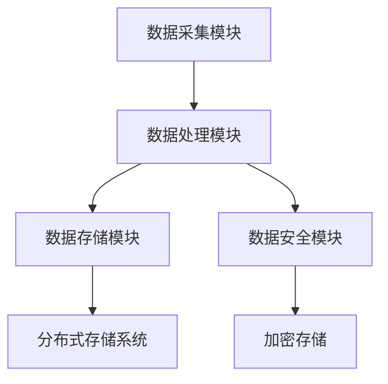

                 


# 企业AI Agent的混合云数据管理策略

> 关键词：企业AI Agent、混合云、数据管理、数据同步、数据安全、系统架构

> 摘要：随着企业智能化转型的加速，AI Agent在混合云环境下的数据管理变得至关重要。本文将深入探讨企业AI Agent的混合云数据管理策略，涵盖数据存储、同步、安全等关键技术，并结合实际案例分析，提供系统架构设计和最佳实践。

---

# 第一部分: 企业AI Agent的混合云数据管理概述

## 第1章: 企业AI Agent与混合云数据管理概述

### 1.1 什么是企业AI Agent

#### 1.1.1 AI Agent的基本概念

AI Agent（人工智能代理）是指能够感知环境、自主决策并执行任务的智能实体。企业AI Agent通常用于自动化操作、数据处理和决策支持，能够在复杂环境中实现高效协作。

#### 1.1.2 企业AI Agent的特点

- **自主性**：能够自主决策和执行任务。
- **反应性**：实时感知环境变化并做出响应。
- **学习能力**：通过机器学习不断优化自身行为。
- **可扩展性**：能够适应企业规模的扩展。

#### 1.1.3 混合云环境下的AI Agent

混合云是将公有云和私有云结合的架构，能够提供更高的灵活性和成本效益。AI Agent在混合云中需要处理跨云的数据存储和计算资源，这增加了数据管理的复杂性。

### 1.2 混合云数据管理的背景与挑战

#### 1.2.1 混合云的定义与优势

- **定义**：混合云是将公有云和私有云结合，提供按需资源扩展的能力。
- **优势**：灵活性高、成本优化、资源隔离。

#### 1.2.2 数据管理在混合云中的重要性

- 数据是企业AI Agent的核心资源，数据管理直接影响系统的性能和安全性。
- 混合云环境中，数据分布在不同云平台和本地服务器中，增加了管理的复杂性。

#### 1.2.3 当前数据管理的主要挑战

- **数据一致性**：如何保证分布在不同云平台的数据一致性。
- **数据安全**：跨云数据传输和存储的安全性问题。
- **数据冗余**：如何避免数据冗余和存储浪费。

---

## 第2章: 企业AI Agent的混合云数据管理策略

### 2.1 数据存储与访问策略

#### 2.1.1 数据存储的多云策略

- **数据分片存储**：将数据分割存储在不同的云平台和本地服务器中。
- **数据冗余**：通过备份和冗余确保数据的高可用性。

#### 2.1.2 数据访问的权限管理

- **基于角色的访问控制（RBAC）**：根据用户角色分配数据访问权限。
- **细粒度权限控制**：对数据的读写权限进行精确控制。

#### 2.1.3 数据分层与分区策略

- **冷热数据分离**：将数据分为冷数据（低访问频率）和热数据（高访问频率），分别存储在不同类型的存储介质中。
- **数据分区**：根据业务需求将数据划分为多个分区，便于管理和扩展。

### 2.2 数据同步与一致性保障

#### 2.2.1 混合云环境下的数据同步机制

- **基于区块链的同步**：利用区块链技术确保数据同步的透明性和不可篡改性。
- **分布式一致性协议**：使用如Paxos、Raft等协议确保数据一致性。

#### 2.2.2 数据一致性保障技术

- **分布式锁机制**：防止数据冲突，确保并发操作的原子性。
- **版本控制**：通过数据版本号管理数据变更，避免数据覆盖问题。

#### 2.2.3 数据冲突的解决策略

- **乐观并发控制**：假设数据在修改时不会发生冲突，通过版本号检查解决冲突。
- **悲观并发控制**：采用锁机制，限制并发访问，确保数据一致性。

### 2.3 数据安全与隐私保护

#### 2.3.1 数据加密与解密技术

- **端到端加密**：数据在传输和存储过程中全程加密，确保数据隐私。
- **同态加密**：在不解密的情况下对数据进行计算，适用于隐私保护场景。

#### 2.3.2 数据访问控制策略

- **基于身份的访问控制（IBAC）**：根据用户身份和权限控制数据访问。
- **最小权限原则**：赋予用户最小的必要权限，减少潜在的安全风险。

#### 2.3.3 数据隐私保护的法律与合规要求

- **GDPR合规**：确保数据处理符合《通用数据保护条例》（GDPR）的要求。
- **数据 residency**：数据存储位置符合相关法律法规。

---

## 第3章: 混合云数据管理的核心技术

### 3.1 数据同步算法

#### 3.1.1 基于区块链的数据同步算法

- **区块链的共识机制**：确保数据同步的一致性和不可篡改性。
- **链下存储**：将数据存储在区块链节点之外的分布式存储系统中，提高扩展性。

#### 3.1.2 基于分布式一致性协议的同步算法

- **Paxos协议**：通过选举主节点实现数据一致性。
- **Raft协议**：通过日志复制实现数据一致性，适合大规模分布式系统。

#### 3.1.3 数据同步的数学模型与公式

- **数据一致性模型**：通过数学模型描述数据在不同节点之间的状态关系。
- **同步延迟公式**：$D = \frac{N \cdot L}{B}$，其中$D$是同步延迟，$N$是节点数，$L$是数据量，$B$是带宽。

### 3.2 数据存储优化算法

#### 3.2.1 数据压缩与去重算法

- **压缩算法**：使用Gzip、Snappy等压缩算法减少数据存储空间。
- **去重算法**：通过哈希算法识别重复数据块，减少存储空间占用。

#### 3.2.2 数据分片与负载均衡算法

- **分片算法**：将数据按哈希值分片，确保数据均匀分布。
- **负载均衡算法**：通过轮转法、随机法等算法实现数据均衡分布。

#### 3.2.3 数据存储的数学模型与公式

- **存储空间优化模型**：通过数学模型计算最优存储策略，$S = \sum_{i=1}^{n} s_i$，其中$S$是总存储空间，$s_i$是第$i$个数据块的存储空间。
- **存储性能公式**：$P = \frac{I}{T}$，其中$P$是存储性能，$I$是输入/输出次数，$T$是时间。

### 3.3 数据安全与加密算法

#### 3.3.1 对称加密算法

- **AES算法**：Advanced Encryption Standard，广泛应用于数据加密。
- **加密模式**：ECB、CBC、CFB、OFB、CTR等模式，适用于不同场景。

#### 3.3.2 非对称加密算法

- **RSA算法**：基于大整数分解的公钥加密算法，适用于数字签名和身份验证。
- **椭圆曲线加密（ECC）**：安全性高，密钥长度短，适用于资源受限的环境。

#### 3.3.3 数据加密的数学模型与公式

- **加密函数**：$E(m) = (m^{e}) \mod n$，其中$m$是明文，$e$是公钥指数，$n$是模数。
- **解密函数**：$D(c) = (c^{d}) \mod n$，其中$c$是密文，$d$是私钥指数。

---

## 第4章: 混合云数据管理的系统架构设计

### 4.1 系统功能设计

#### 4.1.1 数据采集模块

- **数据源**：包括公有云、私有云、本地服务器等多数据源。
- **数据采集接口**：提供API接口，支持多种数据格式的采集。

#### 4.1.2 数据处理模块

- **数据清洗**：去除无效数据，确保数据质量。
- **数据转换**：将数据转换为统一格式，便于后续处理。

#### 4.1.3 数据存储模块

- **分布式存储系统**：采用分布式文件系统或数据库，支持高并发和高可用性。
- **数据索引**：建立索引结构，提高数据查询效率。

#### 4.1.4 数据安全模块

- **加密模块**：对数据进行加密存储和传输。
- **访问控制模块**：基于角色和权限控制数据访问。

### 4.2 系统架构图



### 4.3 系统功能设计

#### 4.3.1 数据采集模块

- **功能**：采集来自不同数据源的数据，支持多种数据格式。
- **接口设计**：提供RESTful API，支持GET、POST、PUT、DELETE等操作。

#### 4.3.2 数据处理模块

- **功能**：对采集到的数据进行清洗、转换和 enrichment（丰富数据）。
- **算法选择**：根据数据类型选择合适的处理算法，如机器学习模型训练。

#### 4.3.3 数据存储模块

- **功能**：将处理后的数据存储到分布式存储系统中，确保高可用性和可扩展性。
- **技术选型**：采用分布式文件系统（如Hadoop HDFS）或分布式数据库（如MongoDB）。

#### 4.3.4 数据安全模块

- **功能**：对数据进行加密存储和传输，确保数据安全。
- **技术选型**：采用AES加密算法，结合HMAC进行数据完整性验证。

---

## 第5章: 项目实战与案例分析

### 5.1 项目环境配置

#### 5.1.1 环境要求

- 操作系统：Linux（推荐）或Windows。
- 开发工具：IntelliJ IDEA、Eclipse、PyCharm等。
- 依赖库：Python（3.8+）、TensorFlow、Keras、Flask、Pandas、NumPy。

#### 5.1.2 数据源配置

- 数据采集接口：配置API密钥和访问权限。
- 数据存储配置：配置分布式存储系统的连接信息。

### 5.2 核心代码实现

#### 5.2.1 数据采集模块

```python
import requests

def fetch_data(api_key, endpoint):
    headers = {'Authorization': f'Bearer {api_key}'}
    response = requests.get(endpoint, headers=headers)
    if response.status_code == 200:
        return response.json()
    return None
```

#### 5.2.2 数据处理模块

```python
import pandas as pd
from sklearn.model

