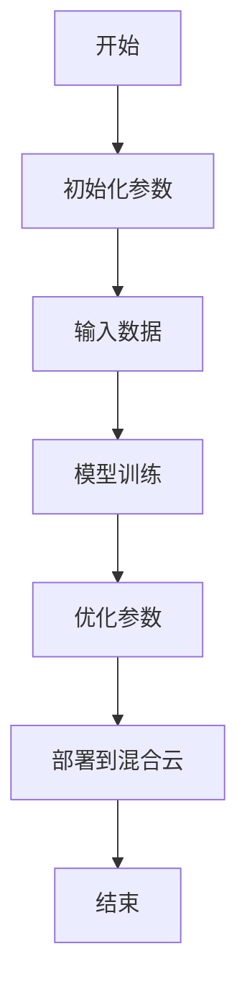
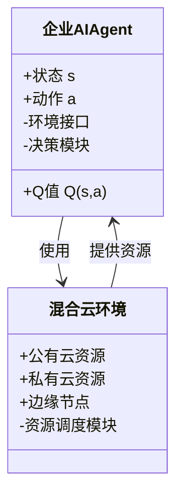
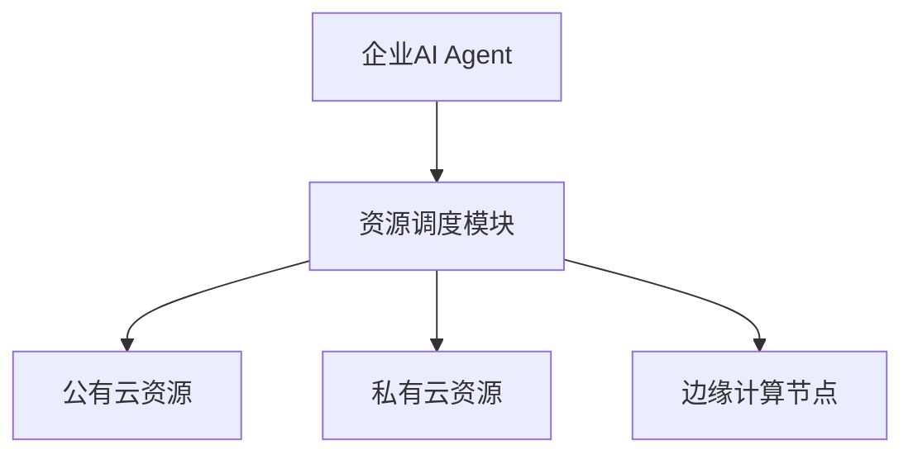

                 


# 企业AI Agent的混合云部署策略

> 关键词：企业AI Agent，混合云，云部署，人工智能，系统架构

> 摘要：本文深入探讨了在混合云环境中部署企业AI Agent的核心策略。通过分析混合云部署的背景、核心概念、算法原理、系统架构及项目实战，为读者提供了一套完整的部署解决方案。文章结合理论与实践，详细讲解了从环境搭建到系统实现的全过程，并通过实例分析和最佳实践，帮助读者掌握企业AI Agent在混合云中的高效部署方法。

---

# 第一章: 企业AI Agent与混合云部署概述

## 1.1 混合云部署的背景与挑战

### 1.1.1 企业AI应用的快速发展
企业AI Agent作为一种智能代理系统，正在迅速渗透到企业IT架构的各个角落。随着AI技术的成熟，企业对自动化、智能化的需求日益增长，推动了AI Agent的广泛应用。

### 1.1.2 混合云架构的兴起
混合云部署模式结合了公有云、私有云和边缘计算的优势，为企业提供了灵活、高效、成本优化的解决方案。这种架构特别适合需要高性能计算、数据隐私和弹性扩展的企业AI应用。

### 1.1.3 混合云部署的核心挑战
- 多环境协调：AI Agent需要在私有云、公有云和边缘计算之间无缝协作。
- 资源调度：如何在不同环境中动态分配资源是关键挑战。
- 安全与合规：数据在多云环境中的流动必须符合企业安全策略和合规要求。

## 1.2 企业AI Agent的概念与特点

### 1.2.1 AI Agent的基本定义
企业AI Agent是一种智能代理系统，能够感知环境、自主决策并执行任务。它通过与企业系统的交互，实现自动化操作和智能决策。

### 1.2.2 企业AI Agent的核心功能
- **感知环境**：通过传感器、API和日志数据获取环境信息。
- **自主决策**：基于历史数据和实时信息，使用机器学习模型做出决策。
- **执行任务**：通过API或自动化工具执行预定义或自适应的任务。

### 1.2.3 混合云环境下AI Agent的优势
- **灵活性**：可以根据业务需求灵活调整资源分配。
- **高性能**：利用公有云的弹性资源和私有云的本地化优势。
- **安全性**：通过边缘计算和私有云部署，确保数据安全和隐私保护。

## 1.3 本章小结
本章介绍了企业AI Agent的基本概念及其在混合云环境中的部署优势，为后续章节的深入分析奠定了基础。

---

# 第二章: 混合云部署的核心概念与联系

## 2.1 混合云架构的实体关系图

```mermaid
erDiagram
    actor 企业AI Agent
    actor 混合云平台
    actor 用户
    actor 服务提供商
    enterprise 系统
    boundary 混合云环境
    boundary 数据中心
    boundary 公有云服务
    boundary 私有云服务
    boundary 边缘计算节点
    企业AI Agent 与 混合云平台 -- "使用" 混合云环境
    混合云平台 与 系统 -- "管理" 混合云环境
```

## 2.2 混合云部署的算法原理

### 2.2.1 算法流程图



### 2.2.2 算法实现代码

```python
def hybrid_cloud_deployment(data):
    # 初始化参数
    params = initialize_params()
    # 输入数据
    inputs = preprocess(data)
    # 模型训练
    model = train_model(inputs)
    # 优化参数
    optimized_params = optimize(model, inputs)
    # 部署到混合云
    deploy_to_hybrid_cloud(optimized_params)
    return "部署完成"
```

### 2.2.3 数学模型与公式

AI Agent的决策模型基于Q-learning算法，其数学表达式如下：

$$ Q(s, a) = (1 - \alpha) Q(s, a) + \alpha r $$

其中：
- \( Q(s, a) \) 是当前状态 \( s \) 和动作 \( a \) 的Q值。
- \( \alpha \) 是学习率。
- \( r \) 是奖励值。

---

# 第三章: 企业AI Agent的系统分析与架构设计

## 3.1 系统功能设计

### 3.1.1 领域模型类图



## 3.2 系统架构设计

### 3.2.1 系统架构图



---

接下来的内容将详细讲解系统接口设计、交互流程图、项目实战部署等内容，确保读者能够从理论到实践，全面掌握企业AI Agent的混合云部署策略。

---

通过以上目录结构，我们可以清晰地看到，文章从背景、核心概念、算法原理、系统架构到项目实战，层层深入，确保读者能够系统地理解和掌握企业AI Agent在混合云环境中的部署策略。

