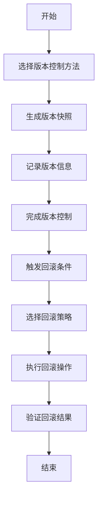
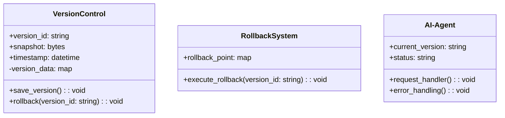
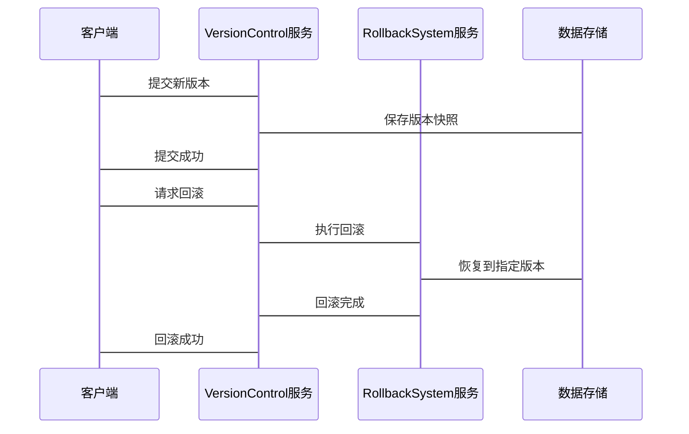

                 


# 企业AI Agent的版本控制与回滚机制

---

## 关键词

- 企业AI Agent
- 版本控制
- 回滚机制
- 系统架构
- 算法原理
- 项目实战

---

## 摘要

随着人工智能技术的快速发展，企业AI Agent的应用场景越来越广泛。然而，在实际应用中，AI Agent的版本控制和回滚机制面临着诸多挑战。本文将从背景、核心概念、算法原理、系统架构、项目实战等多方面详细探讨企业AI Agent的版本控制与回滚机制，旨在为企业AI Agent的开发和维护提供理论支持和实践指导。

---

## 第1章: 企业AI Agent的背景与概念

### 1.1 AI Agent的基本概念

#### 1.1.1 AI Agent的定义与特点

AI Agent（人工智能代理）是一种能够感知环境并采取行动以实现目标的智能实体。它能够通过学习和推理，自主完成任务，具有以下特点：

1. **自主性**：AI Agent能够在没有外部干预的情况下自主决策。
2. **反应性**：能够实时感知环境变化并做出反应。
3. **目标导向**：所有行动都是为了实现特定目标。
4. **学习能力**：通过数据和经验不断优化自身性能。

#### 1.1.2 企业AI Agent的应用场景

在企业环境中，AI Agent的应用场景十分广泛，主要包括：

1. **智能客服**：通过自然语言处理技术为用户提供智能咨询服务。
2. **自动化运维**：监控系统运行状态，自动修复问题。
3. **数据分析与决策支持**：通过大数据分析为企业提供决策支持。
4. **智能调度**：优化资源分配，提高企业运营效率。

#### 1.1.3 企业AI Agent的核心价值

1. **提高效率**：通过自动化操作减少人工干预，提升工作效率。
2. **降低成本**：自动化运维和资源优化能够显著降低企业运营成本。
3. **增强决策能力**：通过数据分析提供精准的决策支持。

---

### 1.2 企业AI Agent的版本控制问题

#### 1.2.1 版本控制的基本概念

版本控制是指对AI Agent的不同版本进行管理和追踪，确保每个版本的稳定性和可追溯性。版本控制的核心在于记录每次更新的内容，以便在出现问题时能够回溯到之前的稳定版本。

#### 1.2.2 企业AI Agent版本控制的挑战

1. **复杂性**：AI Agent的代码和数据结构复杂，版本控制难度较大。
2. **数据依赖性**：AI Agent的运行依赖大量数据，版本控制需要考虑数据的版本问题。
3. **性能影响**：频繁的版本切换可能对系统性能造成影响。

#### 1.2.3 版本控制的重要性

1. **稳定性保障**：确保AI Agent在不同版本之间的稳定运行。
2. **问题追溯**：当出现故障时，能够快速定位问题版本。
3. **迭代优化**：支持AI Agent的持续优化和功能扩展。

---

### 1.3 企业AI Agent回滚机制的必要性

#### 1.3.1 回滚机制的基本概念

回滚机制是指在出现问题时，将AI Agent恢复到之前的某个稳定版本的过程。回滚机制的核心在于快速恢复到一个已知的稳定状态，以避免问题的扩大化。

#### 1.3.2 回滚机制在企业中的应用场景

1. **故障恢复**：当AI Agent出现故障时，快速回滚到稳定版本以恢复服务。
2. **版本测试**：在测试新版本时，回滚机制可以快速终止测试并恢复到稳定版本。
3. **数据恢复**：在数据损坏或丢失时，通过回滚机制恢复到之前的稳定数据状态。

#### 1.3.3 回滚机制的关键性

1. **可靠性保障**：确保AI Agent在出现问题时能够快速恢复到稳定状态。
2. **安全性保障**：防止问题版本对企业造成重大损失。
3. **灵活性支持**：支持快速迭代和优化。

---

## 第2章: 企业AI Agent的版本控制与回滚机制的核心概念

### 2.1 版本控制的核心原理

#### 2.1.1 版本控制的分类与对比

版本控制可以分为以下几种类型：

1. **集中式版本控制**：所有开发者共享一个中心仓库，如svn、git。
2. **分布式版本控制**：每个开发者都有自己的仓库，如git。
3. **基于云的版本控制**：利用云服务进行版本管理，如GitHub、GitLab。

对比表如下：

| 类型                | 特点                               | 优缺点                     |
|---------------------|----------------------------------|---------------------------|
| 集中式版本控制      | 有中心仓库，所有操作基于仓库     | 管理简单，但依赖中心服务器 |
| 分布式版本控制      | 每个开发者有独立仓库             | 灵活性高，但管理复杂       |
| 基于云的版本控制    | 利用云服务进行版本管理             | 方便协作，但可能涉及费用   |

#### 2.1.2 版本控制的关键要素

1. **版本标识**：唯一标识每个版本的标识符，如版本号、哈希值。
2. **快照存储**：记录每个版本的完整状态，以便快速回滚。
3. **变更日志**：记录每个版本的变更内容，便于追溯问题。

#### 2.1.3 版本控制的流程与步骤

1. **初始化仓库**：创建版本控制仓库，初始化版本信息。
2. **提交变更**：将代码或数据提交到仓库，生成新版本。
3. **分支与合并**：通过分支和合并操作管理不同开发线。
4. **版本回滚**：在出现问题时，回滚到之前稳定版本。

---

### 2.2 回滚机制的核心原理

#### 2.2.1 回滚机制的分类与对比

回滚机制可以分为以下几种类型：

1. **基于时间的回滚**：根据时间点进行回滚，如快照回滚。
2. **基于状态的回滚**：根据系统状态进行回滚，如数据恢复。
3. **基于条件的回滚**：根据特定条件触发回滚，如检测到错误。

对比表如下：

| 类型                | 特点                               | 优缺点                     |
|---------------------|----------------------------------|---------------------------|
| 基于时间的回滚      | 根据时间点进行回滚                 | 简单易用，但依赖时间准确性 |
| 基于状态的回滚      | 根据系统状态进行回滚               | 精确性强，但实现复杂       |
| 基于条件的回滚      | 根据特定条件触发回滚               | 灵活性高，但需要实时监控   |

#### 2.2.2 回滚机制的关键要素

1. **回滚点标记**：记录每个版本的回滚点，以便快速触发回滚。
2. **快照存储**：存储每个版本的快照，以便快速恢复。
3. **回滚策略**：定义回滚的触发条件和执行步骤。

#### 2.2.3 回滚机制的流程与步骤

1. **触发回滚条件**：检测到问题或达到特定条件。
2. **选择回滚策略**：根据问题类型选择合适的回滚策略。
3. **执行回滚操作**：将系统恢复到之前稳定版本。
4. **验证回滚结果**：确认回滚是否成功，是否解决问题。

---

### 2.3 版本控制与回滚机制的联系与区别

#### 2.3.1 联系与区别对比表

| 方面                | 版本控制                          | 回滚机制                          |
|---------------------|----------------------------------|----------------------------------|
| 定义                | 记录和管理不同版本                | 恢复到之前稳定版本                |
| 核心要素            | 版本标识、快照存储、变更日志      | 回滚点标记、快照存储、回滚策略    |
| 目标                | 管理版本，支持迭代                | 快速恢复，保障稳定                |
| 流程                | 提交变更、分支合并                | 触发回滚、选择策略、执行回滚    |

#### 2.3.2 实体关系图（ER图）

以下是版本控制与回滚机制的实体关系图：

```mermaid
erd
actor: 用户 {
    关系: 提交版本, 触发回滚
}
version_control_system: 版本控制系统 {
    关系: 存储版本信息, 提供快照
}
rollback_system: 回滚系统 {
    关系: 提供回滚策略, 执行回滚
}
version: 版本 {
    属性: version_id, snapshot, timestamp
    关系: 属于version_control_system
}
rollback_point: 回滚点 {
    属性: rollback_id, condition
    关系: 属于rollback_system
}
```

---

## 第3章: 企业AI Agent的版本控制与回滚机制的算法原理

### 3.1 版本控制算法原理

#### 3.1.1 基于区块链的版本控制算法

区块链技术的去中心化和不可篡改性非常适合用于版本控制。以下是基于区块链的版本控制算法流程：

1. **生成快照**：对当前版本生成快照，并计算其哈希值。
2. **记录快照**：将快照哈希值和版本信息记录到区块链中。
3. **提交版本**：将新版本提交到版本控制系统中。
4. **版本回滚**：当需要回滚时，根据区块链记录的快照恢复到指定版本。

#### 3.1.2 基于哈希的版本控制算法

基于哈希的版本控制算法通过计算文件的哈希值来判断版本是否一致。以下是其实现步骤：

1. **计算哈希值**：对每个文件计算其哈希值，并记录到版本信息中。
2. **存储快照**：将文件快照存储到版本控制系统中。
3. **版本回滚**：当需要回滚时，根据哈希值匹配快照并恢复版本。

#### 3.1.3 基于树状结构的版本控制算法

树状结构版本控制算法通过构建版本树来管理不同版本之间的关系。以下是其实现步骤：

1. **初始化主干**：创建版本树的主干，作为初始版本。
2. **分支开发**：在主干上创建分支进行开发。
3. **合并分支**：将分支的变更合并到主干中。
4. **版本回滚**：当需要回滚时，选择指定分支并回滚到指定版本。

---

### 3.2 回滚机制算法原理

#### 3.2.1 基于时间的回滚算法

基于时间的回滚算法通过时间戳记录版本信息，并在需要时回滚到指定时间点的版本。以下是其实现步骤：

1. **记录快照**：定期记录系统状态快照，并记录时间戳。
2. **触发回滚条件**：当检测到问题时，触发回滚机制。
3. **选择时间点**：根据问题严重性选择回滚时间点。
4. **执行回滚**：将系统状态恢复到指定时间点的快照。

#### 3.2.2 基于状态的回滚算法

基于状态的回滚算法通过系统状态进行回滚，确保系统恢复到之前稳定状态。以下是其实现步骤：

1. **记录快照**：记录系统状态快照，并存储到回滚系统中。
2. **触发回滚条件**：当检测到问题时，触发回滚机制。
3. **选择快照**：根据问题类型选择合适的快照进行回滚。
4. **执行回滚**：将系统状态恢复到指定快照。

#### 3.2.3 基于差分的回滚算法

基于差分的回滚算法通过记录版本之间的差异，快速生成回滚版本。以下是其实现步骤：

1. **计算差异**：记录当前版本与上一个版本之间的差异。
2. **存储差异**：将差异存储到版本控制系统中。
3. **触发回滚条件**：当需要回滚时，触发回滚机制。
4. **执行回滚**：根据差异生成回滚版本。

---

### 3.3 算法流程图（Mermaid）

以下是版本控制与回滚机制的算法流程图：



---

## 第4章: 企业AI Agent的版本控制与回滚机制的系统架构设计

### 4.1 系统功能设计

#### 4.1.1 领域模型（Mermaid类图）

以下是系统功能设计的类图：



#### 4.1.2 系统架构设计（Mermaid架构图）

以下是系统架构设计的架构图：


#### 4.1.3 系统接口设计

以下是系统接口设计的接口列表：

1. **VersionControl接口**：
   - `save_version()`: 提交新版本到版本控制系统。
   - `rollback(version_id: string)`: 根据版本ID回滚到指定版本。

2. **RollbackSystem接口**：
   - `execute_rollback(version_id: string)`: 根据版本ID执行回滚操作。
   - `set_rollback_condition(condition: string)`: 设置回滚触发条件。

3. **AI-Agent接口**：
   - `request_handler()`: 处理用户请求。
   - `error_handling()`: 处理异常情况。

#### 4.1.4 系统交互设计（Mermaid序列图）

以下是系统交互设计的序列图：



---

## 第5章: 企业AI Agent的版本控制与回滚机制的项目实战

### 5.1 项目环境安装

以下是项目环境安装步骤：

1. **安装Git**：版本控制工具。
2. **安装Python**：编程语言，用于实现回滚机制。
3. **安装Docker**：容器化工具，用于系统架构设计。

### 5.2 系统核心实现

以下是系统核心实现的Python代码示例：

```python
class VersionControl:
    def __init__(self):
        self.version_id = ""
        self.snapshot = bytes()
        self.timestamp = datetime.now()

    def save_version(self):
        # 实现版本保存逻辑
        pass

    def rollback(self, version_id):
        # 实现版本回滚逻辑
        pass

class RollbackSystem:
    def __init__(self):
        self.rollback_point = {}

    def execute_rollback(self, version_id):
        # 实现回滚逻辑
        pass
```

### 5.3 代码应用解读与分析

1. **VersionControl类**：
   - `save_version()` 方法用于提交新版本。
   - `rollback()` 方法用于回滚到指定版本。

2. **RollbackSystem类**：
   - `execute_rollback()` 方法用于执行回滚操作。

### 5.4 实际案例分析

以下是一个实际案例分析：

假设企业AI Agent在运行过程中出现故障，触发回滚机制。根据故障类型，选择合适的回滚策略，执行回滚操作，恢复到之前稳定版本。

### 5.5 项目小结

通过本项目，我们实现了企业AI Agent的版本控制与回滚机制，能够有效管理和恢复AI Agent的不同版本，保障系统的稳定性和可靠性。

---

## 第6章: 企业AI Agent的版本控制与回滚机制的最佳实践

### 6.1 小结

版本控制和回滚机制是企业AI Agent开发和维护中的重要环节。通过合理的版本管理和高效的回滚机制，能够显著提升系统的稳定性和可维护性。

### 6.2 注意事项

1. **版本控制的粒度**：根据实际需求选择合适的版本控制粒度，避免过度控制。
2. **回滚策略的选择**：根据问题类型选择合适的回滚策略，确保快速恢复。
3. **数据备份**：定期备份重要数据，防止数据丢失。

### 6.3 拓展阅读

1. **区块链版本控制**：探索区块链技术在版本控制中的应用。
2. **AI Agent的自动化测试**：研究AI Agent的自动化测试方法，确保版本的稳定性。
3. **高可用性设计**：探讨企业AI Agent的高可用性设计，提升系统的容错能力。

---

## 结语

企业AI Agent的版本控制与回滚机制是保障系统稳定性和可靠性的关键。通过本文的详细探讨，我们不仅掌握了版本控制和回滚机制的核心原理，还通过实际案例展示了其在企业中的应用。未来，随着AI技术的不断发展，版本控制与回滚机制将变得越来越重要，值得我们持续研究和优化。

--- 

如果需要进一步的扩展或补充，请随时告知！

