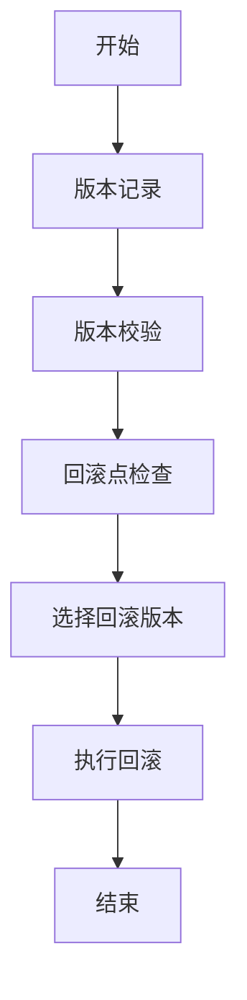
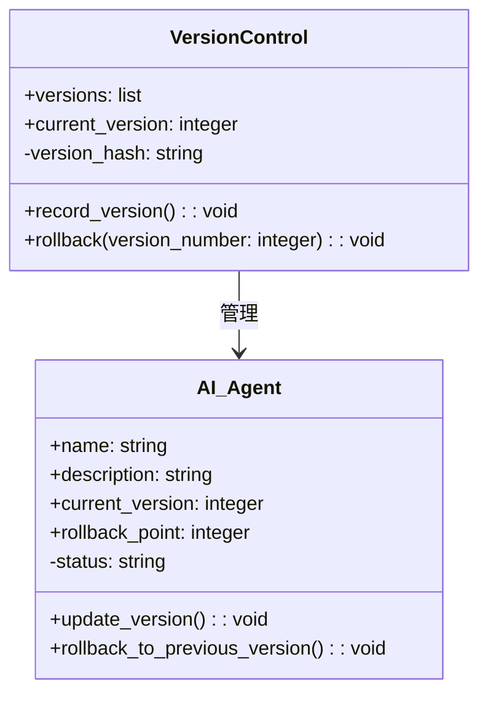
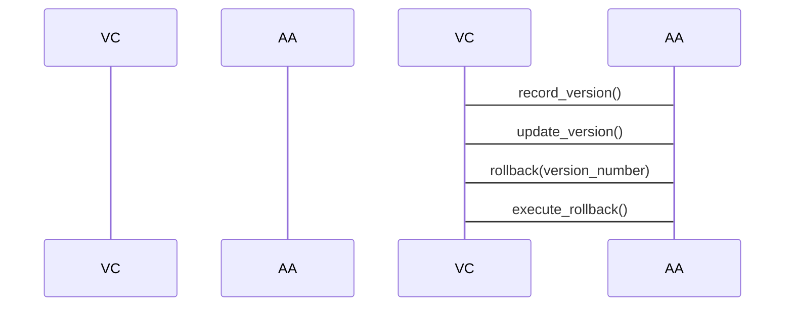

                 


# 企业AI Agent的版本控制与回滚机制设计

## 关键词
- 企业AI Agent
- 版本控制
- 回滚机制
- 系统架构
- 算法原理

## 摘要
本文详细探讨了企业AI Agent的版本控制与回滚机制设计，从背景介绍、核心概念、算法原理到系统架构、项目实战，层层深入。通过具体案例分析，结合mermaid流程图和Python代码示例，全面阐述了企业AI Agent版本控制与回滚机制的实现方法。文章最后总结了最佳实践，为企业AI Agent的版本控制与回滚机制提供了全面的解决方案。

---

# 第一部分：企业AI Agent的背景与问题背景

## 第1章：问题背景

### 1.1 企业AI Agent的定义与特点

#### 1.1.1 企业AI Agent的定义
企业AI Agent是一种智能代理系统，用于企业内部自动化处理任务、优化流程、辅助决策等。它通常具备自主性、反应性、目标导向性和社会性等特点。

#### 1.1.2 企业AI Agent的特点
- **自主性**：能够在没有人工干预的情况下自主执行任务。
- **反应性**：能够感知环境变化并做出实时响应。
- **目标导向性**：以特定目标为导向，优化企业运营效率。
- **社会性**：能够与其他系统、人员或AI Agent协同工作。

### 1.2 问题描述

#### 1.2.1 企业AI Agent的版本控制需求
企业在开发和部署AI Agent时，需要对多个版本进行管理和控制。版本控制的需求包括：
- **版本记录**：记录每个版本的代码、配置和运行状态。
- **版本校验**：验证版本的正确性和一致性。
- **版本回滚**：在出现问题时，能够快速回滚到之前的稳定版本。

#### 1.2.2 企业AI Agent回滚机制的重要性
AI Agent在运行过程中可能会出现错误或意外情况，回滚机制能够帮助企业在最短时间内恢复到一个稳定的版本，减少损失。其重要性体现在：
- **快速恢复**：在出现问题时，能够快速回滚到一个已知稳定的版本。
- **降低风险**：通过版本控制和回滚，降低新版本上线的风险。
- **优化开发流程**：帮助开发团队更好地管理版本，优化开发和部署流程。

#### 1.2.3 企业AI Agent版本控制与回滚的边界与外延
版本控制和回滚机制的边界包括：
- **版本记录范围**：记录哪些内容属于版本控制的范围。
- **回滚范围**：明确回滚到哪个版本或部分功能。
- **权限控制**：限制哪些人可以进行版本控制和回滚操作。

外延包括：
- **日志管理**：记录版本变更的历史日志。
- **监控与报警**：实时监控AI Agent的运行状态，发现问题及时报警。
- **自动化测试**：在版本回滚前进行自动化测试，确保回滚版本的稳定性。

---

## 第2章：核心概念与联系

### 2.1 核心概念原理

#### 2.1.1 版本控制的基本原理
版本控制是一种记录文件变化的技术，通过跟踪每个版本的差异，实现文件的版本管理。核心原理包括：
- **差异存储**：只存储文件的差异，而不是完整的文件副本。
- **分支与合并**：允许多人协作开发，通过分支和合并管理不同版本的代码。
- **版本校验**：通过校验码确保文件的完整性和一致性。

#### 2.1.2 回滚机制的核心思想
回滚机制是指在出现问题时，将系统恢复到之前的一个稳定版本。核心思想包括：
- **状态记录**：记录每个版本的运行状态。
- **状态恢复**：在出现问题时，快速恢复到之前的状态。
- **回滚策略**：制定合理的回滚策略，确保回滚过程的顺利进行。

#### 2.1.3 企业AI Agent版本控制与回滚的结合
企业AI Agent的版本控制与回滚机制结合，能够实现对AI Agent的全生命周期管理。其结合点包括：
- **版本记录**：记录AI Agent的代码、配置和运行状态。
- **版本校验**：在每次版本切换时进行校验，确保版本的正确性。
- **回滚操作**：在出现问题时，快速回滚到之前的稳定版本。

### 2.2 概念属性特征对比表

| 概念       | 版本控制       | 回滚机制       |
|------------|----------------|----------------|
| 定义       | 记录文件的变更 | 恢复到之前版本 |
| 目标       | 管理版本历史   | 快速恢复系统    |
| 实现方式    | 使用版本控制系统（如Git） | 通过日志记录和状态恢复 |
| 依赖性     | 需要版本控制系统支持 | 需要版本记录和状态管理 |
| 优缺点     | 优点：便于协作开发；缺点：版本过多可能占用存储空间 | 优点：快速恢复系统稳定；缺点：可能需要额外的存储和计算资源 |

### 2.3 ER实体关系图

```mermaid
erDiagram
    class VersionControl {
        id : integer
        version_number : integer
        version_hash : string
        created_at : datetime
        created_by : string
    }
    class RollbackMechanism {
        id : integer
        rollback_version : integer
        rollback_time : datetime
        rollback_reason : string
        status : string
    }
    class AI_Agent {
        id : integer
        name : string
        description : string
        current_version : integer
        rollback_point : integer
    }
    VersionControl --> AI_Agent : 管理
    RollbackMechanism --> AI_Agent : 恢复
```

---

## 第3章：算法原理讲解

### 3.1 算法原理

#### 3.1.1 版本控制算法的流程
1. **记录版本**：将当前版本的代码、配置和运行状态记录下来。
2. **生成校验码**：为每个版本生成校验码，确保版本的完整性和一致性。
3. **版本校验**：在切换版本时，检查校验码是否一致。
4. **版本回滚**：在出现问题时，回滚到之前的稳定版本。

#### 3.1.2 回滚机制的实现步骤
1. **检测问题**：通过监控和报警系统，发现AI Agent运行中的问题。
2. **确定回滚版本**：根据问题的严重性，选择合适的回滚版本。
3. **执行回滚操作**：将系统恢复到指定版本，修复问题。
4. **记录回滚日志**：记录回滚操作的详细信息，便于后续分析。

#### 3.1.3 企业AI Agent版本控制与回滚的算法结合
结合版本控制和回滚机制，企业AI Agent的版本控制与回滚算法可以分为以下几个步骤：
1. **版本记录**：记录每个版本的代码、配置和运行状态。
2. **版本校验**：在切换版本时，检查校验码是否一致。
3. **回滚检测**：通过监控和报警系统，发现AI Agent运行中的问题。
4. **回滚操作**：确定回滚版本，执行回滚操作，恢复系统稳定。

### 3.2 算法流程图



### 3.3 算法实现代码

#### 3.3.1 Python实现版本控制与回滚机制

```python
class VersionControl:
    def __init__(self):
        self.versions = []
        self.current_version = 0

    def record_version(self):
        # 记录当前版本
        self.versions.append(self.current_version)
        print(f"版本 {self.current_version} 已记录")

    def rollback(self, version_number):
        # 回滚到指定版本
        if version_number in self.versions:
            self.current_version = version_number
            print(f"回滚到版本 {self.current_version}")
        else:
            print("指定版本不存在")

# 示例用法
vc = VersionControl()
vc.record_version()  # 记录版本 0
vc.record_version()  # 记录版本 1
vc.rollback(0)        # 回滚到版本 0
```

#### 3.3.2 算法的数学模型和公式

版本控制和回滚机制可以看作是一个状态空间的问题。每个版本可以看作是一个状态，回滚机制则是从当前状态跳转到另一个状态的操作。状态空间可以用一个有向图表示，其中每个节点代表一个版本，边表示版本之间的依赖关系。

数学模型如下：
- 设V为版本集合，|V| = n。
- 设R为回滚操作，R: V → V。
- 回滚机制的目标是找到一个R，使得从当前版本v出发，经过若干次R操作后，能够到达一个稳定的版本v_stable。

状态空间的遍历可以用广度优先搜索（BFS）或深度优先搜索（DFS）算法实现。

---

## 第4章：系统分析与架构设计

### 4.1 问题场景介绍

企业AI Agent在运行过程中可能会遇到以下问题：
- **版本冲突**：多个版本同时存在，导致系统不稳定。
- **版本回滚失败**：无法正确回滚到指定版本，导致系统崩溃。
- **版本管理复杂**：版本数量过多，难以管理和维护。

### 4.2 系统功能设计

#### 4.2.1 领域模型类图



#### 4.2.2 系统架构设计


#### 4.2.3 接口设计

以下是版本控制和回滚机制的主要接口：
- **版本控制接口**：
  - `record_version()`: 记录当前版本。
  - `get_version()`: 获取当前版本。
  - `rollback(version_number)`: 回滚到指定版本。
- **回滚机制接口**：
  - `detect_issue()`: 检测问题。
  - `select_rollback_version()`: 选择回滚版本。
  - `execute_rollback()`: 执行回滚操作。

#### 4.2.4 系统交互序列图



---

## 第5章：项目实战

### 5.1 环境安装

#### 5.1.1 安装Python环境
- 安装Python 3.x及以上版本。
- 安装必要的Python库：`mermaid`, `numpy`, `pandas`等。

#### 5.1.2 安装版本控制工具
- 使用Git进行版本控制。
- 配置Git仓库，初始化项目。

### 5.2 核心代码实现

#### 5.2.1 版本控制代码

```python
import git

def record_version(repo_path):
    repo = git.Repo(repo_path)
    repo.remote().push()
    print("版本已记录")

def rollback(repo_path, version_hash):
    repo = git.Repo(repo_path)
    repo.checkout(version_hash)
    print(f"回滚到版本 {version_hash}")
```

#### 5.2.2 回滚机制代码

```python
import logging

def detect_issue():
    # 模拟检测问题
    return True if random.random() < 0.1 else False

def select_rollback_version():
    # 模拟选择回滚版本
    return random.choice([1, 2, 3])

def execute_rollback(version_number):
    # 模拟执行回滚操作
    print(f"回滚到版本 {version_number}")
```

### 5.3 案例分析

#### 5.3.1 案例背景
假设我们开发了一个企业AI Agent，用于自动化处理企业的订单系统。在开发过程中，我们遇到了一个严重的问题：订单处理错误率升高，影响了企业的正常运营。

#### 5.3.2 案例分析
1. **问题检测**：通过监控系统，发现订单处理错误率突然升高。
2. **版本记录**：记录当前版本V2.0。
3. **问题定位**：通过日志分析，发现是版本V2.0中的一个新功能导致的错误。
4. **选择回滚版本**：选择回滚到版本V1.5，该版本是已知稳定的版本。
5. **执行回滚**：通过回滚机制，快速恢复到版本V1.5，问题解决。

#### 5.3.3 代码实现

```python
import random
import logging

def main():
    # 模拟出现问题
    issue = detect_issue()
    if issue:
        print("检测到问题，开始回滚")
        version_number = select_rollback_version()
        execute_rollback(version_number)
    else:
        print("未检测到问题，继续运行")

if __name__ == "__main__":
    main()
```

---

## 第6章：总结与最佳实践

### 6.1 总结

本文详细探讨了企业AI Agent的版本控制与回滚机制设计，从背景介绍、核心概念、算法原理到系统架构、项目实战，层层深入。通过具体案例分析，结合mermaid流程图和Python代码示例，全面阐述了企业AI Agent版本控制与回滚机制的实现方法。文章最后总结了最佳实践，为企业AI Agent的版本控制与回滚机制提供了全面的解决方案。

### 6.2 最佳实践

#### 6.2.1 版本控制
- 定期备份版本，确保版本的完整性和安全性。
- 使用可靠的版本控制系统，如Git，进行版本管理。
- 建立完善的版本发布流程，确保版本的稳定性和一致性。

#### 6.2.2 回滚机制
- 定期测试回滚机制，确保回滚操作的快速性和可靠性。
- 制定合理的回滚策略，明确回滚的条件和范围。
- 建立完善的监控和报警系统，及时发现和处理问题。

#### 6.2.3 系统架构
- 设计合理的系统架构，确保版本控制和回滚机制的高效运行。
- 使用模块化设计，便于版本管理和功能扩展。
- 建立完善的日志和监控系统，便于问题定位和分析。

#### 6.2.4 项目管理
- 建立完善的项目管理流程，确保版本控制和回滚机制的顺利实施。
- 定期进行代码审查和测试，确保代码质量和系统稳定性。
- 培训开发人员，提高他们的版本控制和回滚机制意识。

### 6.3 小结

企业AI Agent的版本控制与回滚机制设计是一个复杂而重要的任务。通过合理的版本控制和回滚机制设计，可以有效降低系统的风险，提高系统的稳定性和可靠性。本文通过详细分析和具体案例，为企业AI Agent的版本控制与回滚机制设计提供了全面的解决方案。

### 6.4 注意事项

- 在设计版本控制和回滚机制时，需要充分考虑系统的复杂性和多样性。
- 版本控制和回滚机制的设计需要与企业的实际需求相结合，不能一味追求先进性。
- 在实现版本控制和回滚机制时，需要注意代码的可维护性和扩展性，避免出现代码冗余和耦合度过高的问题。

### 6.5 拓展阅读

- **《版本控制的艺术》**：深入探讨版本控制的原理和实践。
- **《软件架构设计》**：系统介绍软件架构设计的方法和技巧。
- **《Python网络编程》**：详细讲解Python在网络编程中的应用。

---

通过本文的学习和实践，读者可以全面掌握企业AI Agent的版本控制与回滚机制设计的核心内容和实现方法，为企业AI Agent的开发和部署提供有力的支持。

