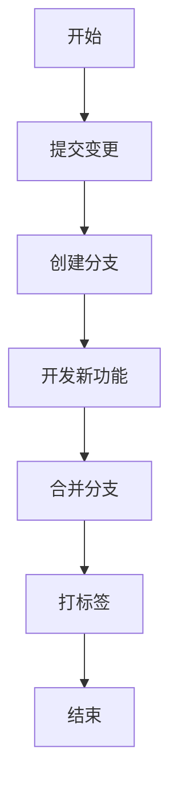
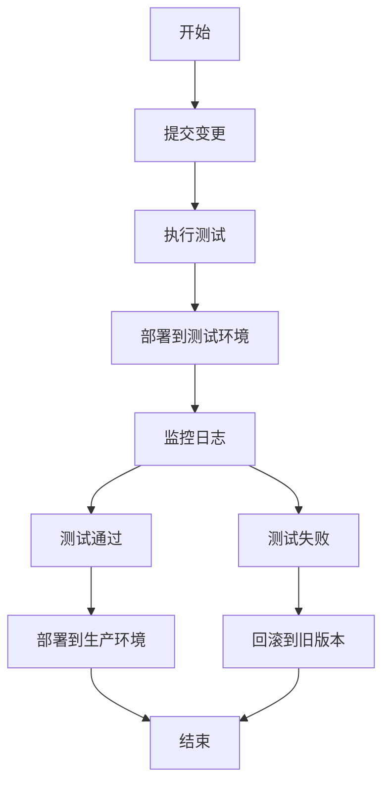
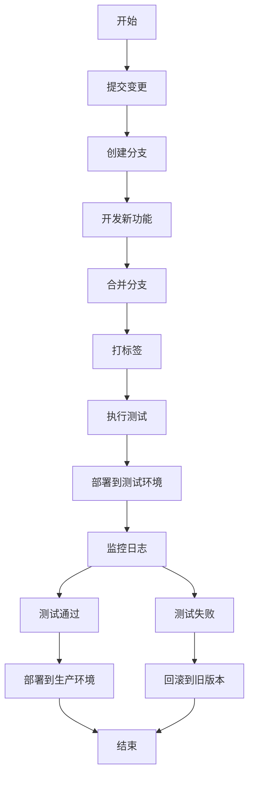
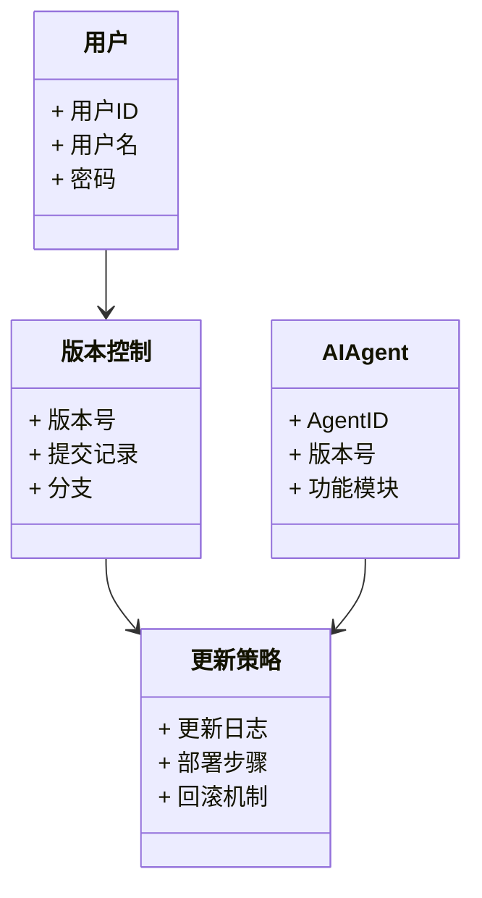
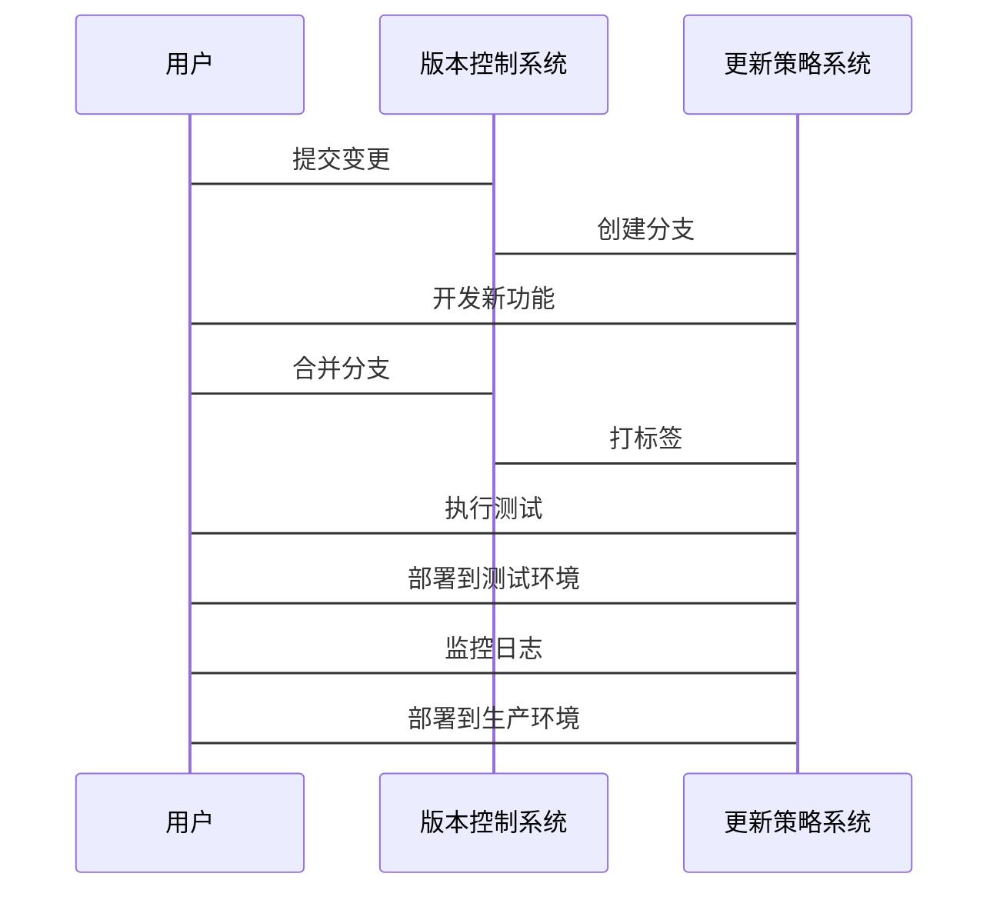

                 


# 企业AI Agent的版本控制与更新策略

> 关键词：企业AI Agent、版本控制、更新策略、系统架构、项目实战、最佳实践

> 摘要：本文将深入探讨企业AI Agent的版本控制与更新策略，从背景介绍、核心概念、算法原理到系统架构、项目实战，最后总结最佳实践，为您提供全面的解决方案。

---

## 第1章：企业AI Agent的背景与问题背景

### 1.1 问题背景

#### 1.1.1 企业AI Agent的发展现状

随着人工智能技术的迅速发展，企业AI Agent（智能代理）的应用越来越广泛。AI Agent能够自动化处理企业中的多种任务，如数据处理、决策支持和流程自动化。然而，随着AI Agent的复杂性和规模不断增加，版本控制和更新策略的重要性日益凸显。

#### 1.1.2 企业AI Agent版本控制的必要性

企业在开发和部署AI Agent时，通常会经历多次迭代和更新。每个版本可能包含不同的功能和修复，因此需要一种系统化的方法来管理和跟踪这些版本，确保在不同环境中使用正确的版本。

#### 1.1.3 企业AI Agent更新策略的重要性

AI Agent需要不断适应新的业务需求和技术变化，因此更新策略是保持其功能和性能的关键。有效的更新策略能够确保在更新过程中最小化风险，最大化系统的可用性和稳定性。

---

### 1.2 问题描述

#### 1.2.1 企业AI Agent版本控制的痛点

1. **版本混乱**：在开发和部署过程中，多个版本可能同时存在，导致版本混淆和冲突。
2. **更新风险**：直接更新生产环境中的AI Agent可能导致服务中断或功能异常。
3. **回滚困难**：当新版本出现问题时，快速回滚到旧版本是企业必须具备的能力。

#### 1.2.2 企业AI Agent更新策略的挑战

1. **兼容性问题**：新版本可能与现有系统或数据不兼容。
2. **性能影响**：更新过程中可能对系统性能造成影响。
3. **安全风险**：更新过程中可能引入安全漏洞。

#### 1.2.3 企业AI Agent版本控制与更新策略的核心问题

- 如何实现高效、安全的版本控制？
- 如何制定灵活且可靠的更新策略？
- 如何在更新过程中最小化风险并确保系统的稳定性？

---

## 第2章：企业AI Agent版本控制与更新策略的核心概念

### 2.1 核心概念原理

#### 2.1.1 企业AI Agent版本控制的原理

版本控制的核心原理是通过记录每次修改，确保每个版本都可以追溯和管理。这通常涉及版本号、变更日志和分支管理等技术手段。

#### 2.1.2 企业AI Agent更新策略的原理

更新策略的核心在于制定一个有序的流程，包括测试、部署和回滚等步骤，确保每次更新都能安全、顺利地进行。

#### 2.1.3 企业AI Agent版本控制与更新策略的综合原理

结合版本控制和更新策略，企业可以在确保系统稳定性的前提下，快速迭代和优化AI Agent的功能。

---

### 2.2 核心概念属性特征对比

| **特性**         | **版本控制**       | **更新策略**         |
|------------------|-------------------|----------------------|
| **目标**         | 管理不同版本       | 确保安全更新         |
| **关键工具**     | 版本控制系统（如Git） | 部署工具和回滚机制   |
| **主要挑战**     | 版本混淆和冲突     | 更新失败和兼容性问题 |
| **解决方案**     | 分支管理和标签     | 分阶段部署和回滚策略 |

---

### 2.3 ER实体关系图

```mermaid
er
actor: 用户
agent: AI Agent
version: 版本信息
update: 更新记录
```

---

## 第3章：企业AI Agent版本控制与更新策略的算法原理

### 3.1 算法原理

#### 3.1.1 企业AI Agent版本控制的算法

版本控制的算法通常包括提交、分支、合并和标签等操作。以下是一个简化的版本控制流程：

1. 提交代码变更。
2. 创建分支用于开发新功能。
3. 合并分支到主分支。
4. 打标签标记重要版本。



#### 3.1.2 企业AI Agent更新策略的算法

更新策略的算法通常包括测试、部署和监控。以下是更新策略的流程：

1. 提交代码变更。
2. 执行单元测试。
3. 部署到测试环境。
4. 监控性能和日志。
5. 如果测试通过，部署到生产环境。
6. 如果出现问题，回滚到旧版本。



#### 3.1.3 企业AI Agent版本控制与更新策略的综合算法

综合算法结合了版本控制和更新策略，确保在更新过程中能够快速回滚和恢复。



---

## 第4章：企业AI Agent版本控制与更新策略的系统架构

### 4.1 系统分析与架构设计方案

#### 4.1.1 问题场景介绍

企业AI Agent的版本控制与更新策略需要一个高效的系统架构来支持。

#### 4.1.2 项目介绍

本项目旨在设计一个支持版本控制和更新策略的企业AI Agent系统。

#### 4.1.3 系统功能设计（领域模型）



#### 4.1.4 系统架构设计（系统架构图）


#### 4.1.5 系统接口设计

1. 提交版本接口：用户提交代码变更。
2. 创建分支接口：用户创建新功能分支。
3. 合并分支接口：将分支合并到主分支。
4. 打标签接口：标记重要版本。
5. 更新部署接口：将新版本部署到测试环境。
6. 监控日志接口：监控更新过程中的日志。

#### 4.1.6 系统交互（系统交互图）



---

## 第5章：企业AI Agent版本控制与更新策略的项目实战

### 5.1 环境安装

1. 安装Git：
   ```bash
   git --version
   ```
2. 安装Python和pip：
   ```bash
   python --version
   pip install --upgrade pip
   ```
3. 安装依赖库：
   ```bash
   pip install numpy pandas scikit-learn
   ```

### 5.2 系统核心实现源代码

以下是版本控制和更新策略的核心代码：

#### 5.2.1 版本控制实现

```python
def commit_and_push(message):
    subprocess.run(["git", "add", "."])
    subprocess.run(["git", "commit", "-m", message])
    subprocess.run(["git", "push"])
```

#### 5.2.2 更新策略实现

```python
def deploy_to_test():
    subprocess.run(["git", "checkout", "main"])
    subprocess.run(["git", "pull"])
    subprocess.run(["python", "app.py", "--env=test"])
```

#### 5.2.3 回滚机制实现

```python
def rollback():
    subprocess.run(["git", "checkout", "main"])
    subprocess.run(["git", "pull"])
    subprocess.run(["python", "app.py", "--env=test"])
```

### 5.3 代码应用解读与分析

1. **版本控制实现**：`commit_and_push`函数用于提交代码变更并推送到远程仓库。
2. **更新策略实现**：`deploy_to_test`函数用于将代码部署到测试环境。
3. **回滚机制实现**：`rollback`函数用于回滚到旧版本。

### 5.4 实际案例分析

假设企业AI Agent需要更新一个关键功能，以下是具体步骤：

1. **提交变更**：
   ```bash
   git add .
   git commit -m "修复关键功能"
   git push
   ```

2. **创建分支**：
   ```bash
   git checkout -b feature-branch
   ```

3. **合并分支**：
   ```bash
   git checkout main
   git merge feature-branch
   ```

4. **打标签**：
   ```bash
   git tag -a v1.0.0 -m "Version 1.0.0"
   ```

5. **部署到测试环境**：
   ```bash
   git checkout main
   git pull
   python app.py --env=test
   ```

6. **监控日志**：
   ```bash
   tail -f logs/test.log
   ```

7. **部署到生产环境**：
   ```bash
   git checkout main
   git pull
   python app.py --env=prod
   ```

8. **回滚机制**：
   ```bash
   git checkout main
   git pull
   python app.py --env=test
   ```

### 5.5 项目小结

通过以上步骤，企业可以高效地管理AI Agent的版本，并确保每次更新都能安全、顺利地进行。

---

## 第6章：企业AI Agent版本控制与更新策略的最佳实践

### 6.1 最佳实践 tips

1. **定期备份**：在每次更新前进行备份，确保数据的安全性。
2. **自动化测试**：使用自动化测试工具，确保每次更新都能通过测试。
3. **蓝绿部署**：采用蓝绿部署策略，减少更新过程中对业务的影响。
4. **监控日志**：实时监控更新过程中的日志，及时发现和解决问题。
5. **团队协作**：确保开发、测试和运维团队的协作，制定明确的职责分工。

### 6.2 小结

企业AI Agent的版本控制与更新策略是确保系统稳定性和功能优化的关键。通过合理的版本控制和更新策略，企业可以在快速迭代的同时，最大限度地降低风险。

### 6.3 注意事项

1. **版本控制的重要性**：版本控制是确保系统稳定性的基础，必须重视每次变更的记录和管理。
2. **更新策略的灵活性**：更新策略需要根据企业的实际情况进行调整，确保其灵活性和可扩展性。
3. **团队协作与沟通**：团队成员之间的有效沟通和协作是确保版本控制和更新策略成功实施的关键。

### 6.4 拓展阅读

1. **版本控制工具**：深入学习Git的高级功能，如分支、合并和标签。
2. **更新策略框架**：研究其他企业的更新策略框架，借鉴其成功经验。
3. **系统架构设计**：学习企业级系统架构设计的理论和实践，提升系统的可扩展性和可维护性。

---

## 结语

企业AI Agent的版本控制与更新策略是一个复杂但重要的任务。通过本文的详细讲解，读者可以全面了解版本控制和更新策略的核心概念、算法原理、系统架构以及项目实战。同时，最佳实践部分为读者提供了实用的建议，帮助他们在实际工作中制定有效的版本控制和更新策略。希望本文能够为企业在AI Agent的版本控制与更新策略方面提供有价值的参考和指导。

