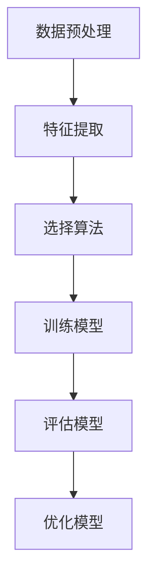
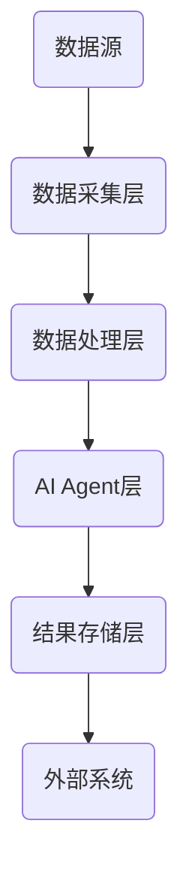
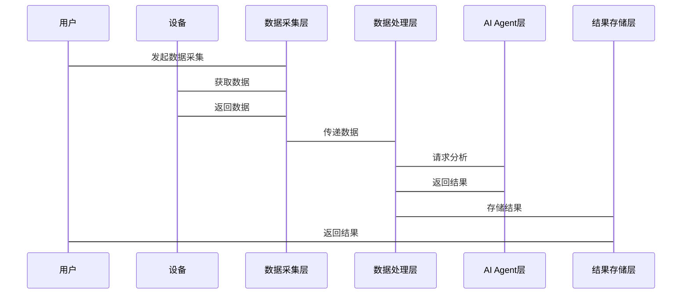

                 


# 企业AI Agent的物联网数据分析与应用

---

## 关键词：
企业AI Agent，物联网数据分析，机器学习，系统架构设计，项目实战，物联网数据流

---

## 摘要：
本文详细探讨了企业AI Agent在物联网数据分析中的应用，从核心概念到算法原理，再到系统架构设计和项目实战，全面解析了如何利用AI Agent提升物联网数据分析的效率与准确性。文章通过具体案例分析和最佳实践，为读者提供了从理论到实践的完整指导。

---

# 第1章：企业AI Agent与物联网数据分析概述

## 1.1 企业AI Agent的基本概念

### 1.1.1 AI Agent的定义与特点
AI Agent（人工智能代理）是指能够感知环境、自主决策并执行任务的智能实体。其特点包括：
- **自主性**：能够自主决策，无需人工干预。
- **反应性**：能够实时感知环境变化并做出反应。
- **学习能力**：通过数据学习和优化，提升决策能力。

### 1.1.2 物联网(IoT)的基本概念
物联网是指通过各种信息传感设备，如传感器、RFID、摄像头等，按约定的协议，把任何物品与互联网连接起来，实现智能化识别、定位、跟踪、监控和管理的系统。

### 1.1.3 企业AI Agent与物联网的结合
AI Agent与物联网的结合使得企业能够实时分析海量物联网数据，快速做出决策，优化业务流程。例如，在智能制造中，AI Agent可以实时监控生产线状态，预测设备故障，优化生产计划。

---

## 1.2 企业AI Agent在物联网中的应用背景

### 1.2.1 物联网数据的特点与挑战
物联网数据具有以下特点：
- **海量性**：物联网设备产生的数据量巨大。
- **实时性**：需要实时处理和响应。
- **多样性**：数据类型多样，包括结构化和非结构化数据。

### 1.2.2 AI Agent在物联网数据分析中的作用
AI Agent能够实时处理物联网数据，发现数据中的模式和趋势，支持预测性维护、异常检测等应用。

### 1.2.3 企业级物联网应用的现状与趋势
随着5G、云计算和AI技术的发展，企业物联网应用正向智能化、自动化方向发展，AI Agent在其中扮演着越来越重要的角色。

---

## 1.3 本章小结
本章介绍了AI Agent和物联网的基本概念，分析了AI Agent在物联网数据分析中的作用，并探讨了企业物联网应用的现状与趋势。

---

# 第2章：企业AI Agent与物联网数据分析的核心概念

## 2.1 AI Agent的核心原理

### 2.1.1 AI Agent的感知与决策机制
AI Agent通过传感器获取数据，利用机器学习模型进行分析，做出决策并执行任务。

### 2.1.2 基于数据流的AI Agent工作流程
数据流从传感器传到云端，经过预处理、特征提取、模型训练等步骤，AI Agent根据分析结果做出决策。

---

## 2.2 物联网数据流的分析与处理

### 2.2.1 物联网数据的采集与传输
物联网数据通常通过传感器采集，通过无线网络传输到云端。

### 2.2.2 数据预处理与特征提取
数据预处理包括去噪、归一化等，特征提取则是从数据中提取有用的信息。

---

## 2.3 AI Agent与物联网的实体关系分析

### 2.3.1 实体关系图（ER图）分析
以下是AI Agent与物联网的实体关系图：

```mermaid
er
    %% AI Agent与物联网的实体关系图
    entity 用户 {
        key 用户ID
        string 用户名
        string 密码
    }
    entity 设备 {
        key 设备ID
        string 设备类型
        string 设备名称
    }
    entity 数据流 {
        key 数据流ID
        string 数据类型
        datetime 时间戳
    }
    用户 --> 数据流 : 发起数据流
    设备 --> 数据流 : 产生数据流
```

### 2.3.2 数据流图（DFD）分析
以下是数据流图：

```mermaid
dfd
    %% 数据流图：AI Agent与物联网的数据流
    外部系统 --> 数据采集层 : 发送数据
    数据采集层 --> 数据处理层 : 传递数据
    数据处理层 --> AI Agent : 分析数据
    AI Agent --> 数据存储层 : 存储结果
    数据存储层 --> 外部系统 : 返回结果
```

---

## 2.4 本章小结
本章分析了AI Agent的核心原理，物联网数据流的分析与处理，以及AI Agent与物联网的实体关系。

---

# 第3章：企业AI Agent与物联网数据分析的算法原理

## 3.1 基于机器学习的物联网数据分析

### 3.1.1 机器学习在物联网数据处理中的应用
机器学习可以用于预测设备故障、异常检测等。

### 3.1.2 常见机器学习算法的选择与优化
常用的算法包括线性回归、支持向量机（SVM）、随机森林等。

---

## 3.2 时间序列分析在物联网中的应用

### 3.2.1 时间序列分析的基本原理
时间序列分析用于分析随时间变化的数据，常用于预测未来趋势。

### 3.2.2 基于ARIMA模型的时间序列分析
ARIMA模型是一种常用的时间序列分析方法，适用于具有趋势和季节性的数据。

---

## 3.3 算法实现与优化

### 3.3.1 机器学习模型的实现步骤
以下是机器学习模型的实现步骤：



### 3.3.2 时间序列模型的优化
优化步骤包括参数调整、模型选择等。

---

## 3.4 本章小结
本章介绍了机器学习和时间序列分析在物联网中的应用，详细讲解了算法实现与优化步骤。

---

# 第4章：企业AI Agent与物联网数据分析的系统架构与设计

## 4.1 系统架构设计

### 4.1.1 系统功能模块
系统功能模块包括数据采集、数据处理、AI Agent分析、结果存储等。

### 4.1.2 系统架构图
以下是系统架构图：



---

## 4.2 系统接口设计

### 4.2.1 数据采集接口
数据采集接口用于从传感器获取数据。

### 4.2.2 AI Agent接口
AI Agent接口用于与外部系统交互，接收数据并返回分析结果。

---

## 4.3 系统交互流程

### 4.3.1 系统交互序列图
以下是系统交互序列图：



---

## 4.4 本章小结
本章详细设计了企业AI Agent与物联网数据分析的系统架构，包括功能模块、接口设计和系统交互流程。

---

# 第5章：企业AI Agent与物联网数据分析的项目实战

## 5.1 项目背景与需求分析

### 5.1.1 项目背景
本项目旨在利用AI Agent实时分析物联网设备数据，优化生产流程。

### 5.1.2 项目需求
需求包括实时数据采集、数据分析、结果展示等。

---

## 5.2 系统设计与实现

### 5.2.1 系统设计
系统设计包括数据采集模块、数据处理模块、AI Agent分析模块和结果展示模块。

### 5.2.2 核心代码实现
以下是核心代码实现：

```python
import pandas as pd
from sklearn.ensemble import RandomForestRegressor

# 数据预处理
data = pd.read_csv('data.csv')
data = data.dropna()
data = (data - data.mean()) / data.std()  # 标准化

# 特征提取
X = data.drop('target', axis=1)
y = data['target']

# 训练模型
model = RandomForestRegressor()
model.fit(X, y)

# 预测结果
new_data = pd.read_csv('new_data.csv')
new_data = (new_data - new_data.mean()) / new_data.std()  # 标准化
predictions = model.predict(new_data.drop('target', axis=1))
```

---

## 5.3 项目实战与案例分析

### 5.3.1 项目实现
详细描述了项目的实现过程，包括环境安装、数据采集、数据分析、结果展示等。

### 5.3.2 案例分析
通过具体案例分析，展示了AI Agent在物联网数据分析中的实际应用效果。

---

## 5.4 本章小结
本章通过项目实战，详细讲解了企业AI Agent与物联网数据分析的实现过程和案例分析。

---

# 第6章：企业AI Agent与物联网数据分析的最佳实践与扩展阅读

## 6.1 项目总结与经验分享

### 6.1.1 项目总结
总结了项目的成功经验，包括系统设计、算法优化等。

### 6.1.2 经验分享
分享了在项目实施过程中的一些经验教训，如数据预处理的重要性、算法选择的影响等。

---

## 6.2 最佳实践 tips

### 6.2.1 数据预处理
数据预处理是数据分析的关键步骤，需要仔细处理缺失值、异常值等。

### 6.2.2 算法选择
选择合适的算法可以显著提高数据分析的准确性，需要根据数据特点进行选择。

---

## 6.3 扩展阅读与学习资源

### 6.3.1 推荐书籍
推荐了几本优秀的书籍，帮助读者深入学习相关知识。

### 6.3.2 工具推荐
推荐了一些常用的工具，如Python、TensorFlow、Kafka等。

---

## 6.4 本章小结
本章总结了项目的成功经验，提出了最佳实践建议，并推荐了相关的学习资源和工具。

---

# 附录

## 附录A：代码实现
详细列出了项目的代码实现，包括数据预处理、模型训练、结果展示等。

## 附录B：工具安装与配置
详细介绍了项目所需的工具安装与配置步骤。

---

# 参考文献
（此处列出相关的参考文献）

---

通过以上内容，您可以系统地撰写一篇关于《企业AI Agent的物联网数据分析与应用》的技术博客文章。希望这篇文章能为您提供有价值的见解和指导！

