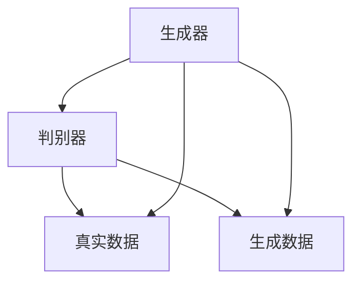
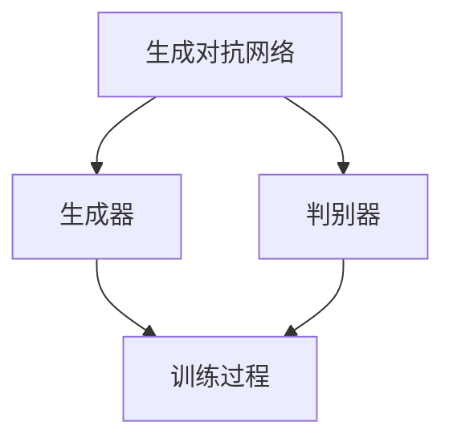

                 

# 企业AI Agent的生成对抗网络在产品设计创新中的前沿应用

关键词：生成对抗网络、企业AI Agent、产品设计创新、前沿应用、系统架构、数学模型

摘要：本文深入探讨了生成对抗网络（GANs）在企业AI Agent中的应用，特别是在产品设计创新中的前沿应用。通过分析生成对抗网络的核心原理、系统架构设计以及实际项目案例，展示了GANs如何助力企业AI Agent实现高效的产品设计与创新。文章结合理论与实践，为企业技术决策者和开发者提供有价值的参考。

---

## 第一章：生成对抗网络（GANs）基础

### 1.1 生成对抗网络的基本概念

#### 1.1.1 生成对抗网络的定义
生成对抗网络（Generative Adversarial Networks，GANs）是一种生成模型，由**生成器（Generator）**和**判别器（Discriminator）**两个神经网络组成。生成器的目标是生成与真实数据分布相似的样本，而判别器的目标是区分真实数据和生成数据。

#### 1.1.2 生成对抗网络的核心要素
- **生成器**：通过学习真实数据的分布，生成新的样本。
- **判别器**：通过判别真实数据与生成数据的差异，提供反馈以优化生成器。
- **对抗训练**：生成器和判别器通过交替训练不断优化，最终达到生成器生成高质量数据的目的。

#### 1.1.3 生成对抗网络的演进历程
- **早期GANs**：2014年的原始GANs模型。
- **改进版本**：如Wasserstein GAN（WGAN）、Conditional GAN（cGAN）、StyleGAN等，逐步提升了生成质量与稳定性。

---

### 1.2 生成对抗网络在企业中的应用价值

#### 1.2.1 生成对抗网络的优势与特点
- **强大的生成能力**：能够生成高质量的图像、文本、音频等数据。
- **灵活性**：适用于多种数据类型和应用场景。
- **创新性**：通过生成对抗，推动模型不断优化，实现创新性的数据生成。

#### 1.2.2 生成对抗网络在企业AI Agent中的应用前景
- **数据生成**：用于生成产品设计灵感、用户画像等。
- **优化设计**：通过生成对抗，优化产品功能、用户体验等。
- **创新推动**：利用GANs的生成能力，推动企业产品创新。

#### 1.2.3 生成对抗网络对企业产品设计创新的推动作用
- **加速设计流程**：通过生成对抗网络快速生成多种设计方案。
- **提升设计质量**：优化设计细节，提升用户体验。
- **降低设计成本**：减少人工设计的重复性工作。

---

### 1.3 生成对抗网络的数学基础

#### 1.3.1 概率分布与生成模型
- **生成器的目标**：学习数据分布P(data)，生成样本x，使得P(x)接近P(data)。
- **判别器的目标**：最大化区分真实数据和生成数据的能力。

#### 1.3.2 最优化方法与梯度下降
- **生成器的损失函数**：$$ L_G = -\log(D(G(x))) $$
- **判别器的损失函数**：$$ L_D = -\log(D(x)) - \log(1-D(G(x))) $$

#### 1.3.3 对抗训练的基本原理
- 生成器和判别器通过交替训练优化目标函数，最终达到纳什均衡。

---

### 1.4 生成对抗网络的训练机制

#### 1.4.1 生成器与判别器的博弈过程
- 生成器通过对抗训练不断改进生成能力。
- 判别器通过反馈不断优化判别能力。

#### 1.4.2 损失函数与优化目标
- 使用交叉熵损失函数，通过梯度下降优化生成器和判别器的参数。

#### 1.4.3 训练中的平衡点与收敛性分析
- GANs的训练过程可能面临模式坍缩等问题，需通过改进算法（如WGAN-GP）解决。

---

## 第二章：生成对抗网络的核心概念与联系

### 2.1 生成对抗网络的核心原理

#### 2.1.1 生成器的结构与功能
- **生成器网络**：通常使用卷积神经网络（CNN）或变分自编码器（VAE）结构。
- **生成器的目标**：生成与真实数据分布一致的样本。

#### 2.1.2 判别器的结构与功能
- **判别器网络**：通常使用卷积神经网络结构。
- **判别器的目标**：判别样本是否为真实数据。

#### 2.1.3 对抗训练的数学模型
- 生成器和判别器的损失函数相互关联，通过交替优化达到平衡。

---

### 2.2 生成对抗网络的属性特征对比

#### 2.2.1 生成器与判别器的对比分析
| 特性       | 生成器                     | 判别器                     |
|------------|---------------------------|---------------------------|
| 目标       | 生成与真实数据相似的样本     | 判别真实与生成数据         |
| 结构       | 多层感知机或CNN             | 多层感知机或CNN             |
| 损失函数   | 最小化判别器输出的损失       | 最大化判别能力的损失       |

---

### 2.3 生成对抗网络的ER实体关系图

---

### 2.4 生成对抗网络的Mermaid流程图

---

## 第三章：生成对抗网络在企业AI Agent中的创新应用

### 3.1 企业AI Agent的基本概念

#### 3.1.1 企业AI Agent的定义与特点
- **定义**：一种能够执行特定任务的智能体，具备自主决策和学习能力。
- **特点**：智能化、自动化、高效性。

#### 3.1.2 企业AI Agent的核心功能与应用场景
- **功能**：数据处理、决策支持、任务执行。
- **应用场景**：产品设计、客户服务、数据分析等。

---

### 3.2 生成对抗网络在企业AI Agent中的应用

#### 3.2.1 生成对抗网络在AI Agent中的创新应用
- **产品设计**：生成产品原型、优化设计元素。
- **用户体验**：生成用户反馈、优化交互设计。
- **数据生成**：生成虚拟用户数据、市场趋势数据。

#### 3.2.2 生成对抗网络在企业AI Agent中的具体实现
- **数据输入**：接收产品设计需求。
- **生成过程**：通过GANs生成多个设计方案。
- **优化过程**：通过对抗训练优化生成方案质量。

---

通过以上内容，我们详细分析了生成对抗网络在企业AI Agent中的应用，从基础概念到实际应用，为企业技术决策者和开发者提供了有价值的参考。接下来，我们将从系统架构设计和项目实战的角度，进一步探讨生成对抗网络在企业AI Agent中的具体实现和应用案例。

