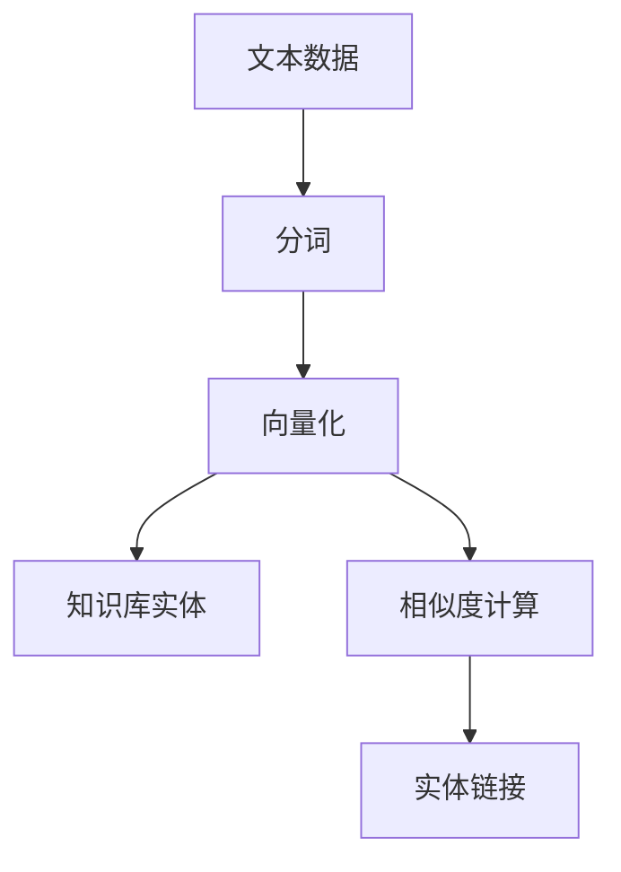
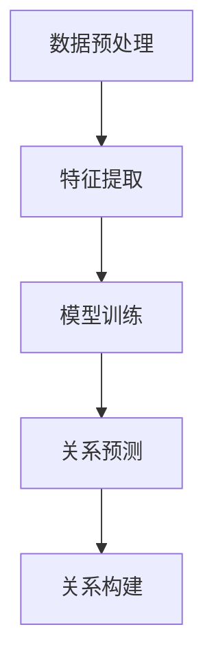

                 


# 企业AI Agent的知识图谱构建与应用

> 关键词：知识图谱、AI Agent、企业应用、构建方法、算法原理、系统架构

> 摘要：本文详细探讨了企业AI Agent的知识图谱构建与应用，从基本概念到构建方法，再到实际应用案例，结合算法原理和系统架构设计，为企业AI Agent的落地提供了全面的指导和实践参考。

---

## 第1章: 知识图谱的基本概念与背景

### 1.1 知识图谱的定义与特点

知识图谱是一种以图结构形式表示知识的语义网络，由实体（node）和关系（edge）组成。其核心特点包括：

- **语义性**：通过明确的关系和属性描述，提供可理解的知识结构。
- **可扩展性**：支持大规模数据的整合与关联。
- **动态性**：能够实时更新以反映数据变化。

与传统数据库相比，知识图谱更注重数据之间的关联关系，而非单一数据存储。

### 1.2 知识图谱在企业中的应用场景

知识图谱在企业中的应用场景广泛，主要包括：

- **知识管理**：整合分散的知识资源，提升企业内部知识共享效率。
- **智能搜索与推荐**：通过语义理解提供更精准的信息检索和个性化推荐。
- **企业AI Agent**：作为AI Agent的知识库，支持智能决策和执行。

### 1.3 企业AI Agent的定义与特点

企业AI Agent是一种具备自主决策能力的智能系统，特点包括：

- **自主性**：能够在预设规则下自主执行任务。
- **响应性**：能够实时感知环境变化并做出反应。
- **知识驱动**：依赖知识图谱进行信息处理和决策支持。

---

## 第2章: 知识图谱的构建原理

### 2.1 知识图谱的结构与组成

知识图谱由以下三个核心部分组成：

- **实体（Entity）**：知识图谱中的基本单元，代表具体的概念或对象。
- **关系（Relation）**：描述实体之间的关联，如“属于”、“构成”等。
- **属性（Attribute）**：描述实体的特性或状态，如“颜色”、“大小”等。

### 2.2 知识图谱的构建方法

知识图谱的构建流程包括数据抽取、实体识别、关系抽取和知识融合四个主要步骤。以下是常用方法的对比表格：

| 构建方法 | 优点 | 缺点 |
|----------|------|------|
| 基于规则的方法 | 实现简单，适用于规则明确的场景 | 需人工编写规则，灵活性差 |
| 基于机器学习的方法 | 适应性强，能够处理复杂数据 | 需大量标注数据，计算资源消耗大 |

### 2.3 知识图谱的表示方法

知识图谱的表示方法主要有三种：

1. **RDF与RDFS**：通过资源描述框架（RDF）和基于RDF的本体表示法（RDFS）定义数据结构。
2. **OWL与本体构建**：使用Web本体语言（OWL）进行语义建模。
3. **图嵌入与向量表示**：将知识图谱中的实体和关系表示为向量，便于计算和分析。

---

## 第3章: 知识图谱构建的算法原理

### 3.1 实体识别与链接算法

实体识别是通过模式匹配或向量相似度计算，将文本中的实体与知识库中的实体进行匹配。以下是基于向量的实体匹配算法流程图：



以下是一个简单的Python代码示例：

```python
import numpy as np

def compute_similarity(text1, text2):
    # 假设text1和text2已经向量化为向量表示
    vec1 = ...  # 向量表示
    vec2 = ...  # 向量表示
    similarity = np.dot(vec1, vec2) / (np.linalg.norm(vec1) * np.linalg.norm(vec2))
    return similarity
```

### 3.2 关系抽取与构建算法

关系抽取可以通过基于规则或机器学习的方法实现。以下是一个基于机器学习的关系抽取流程图：



以下是一个简单的Python代码示例：

```python
from sklearn.feature_extraction.text import TfidfVectorizer
from sklearn.naive_bayes import MultinomialNB

# 数据预处理
texts = [...]  # 文本数据
labels = [...]  # 标签数据

# 特征提取
vectorizer = TfidfVectorizer()
X = vectorizer.fit_transform(texts)

# 模型训练
model = MultinomialNB()
model.fit(X, labels)

# 预测关系
new_text = "..."
new_X = vectorizer.transform([new_text])
predicted_label = model.predict(new_X)
```

---

## 第4章: 企业AI Agent的知识图谱应用

### 4.1 企业知识图谱的构建与管理

企业知识图谱的构建需要结合企业的业务需求，以下是构建流程：

1. **数据收集**：整合企业内部数据源。
2. **数据清洗**：去除重复和噪声数据。
3. **知识抽取**：提取实体、关系和属性。
4. **知识融合**：整合多源数据，消除冲突。
5. **知识存储**：选择合适的知识库进行存储。

### 4.2 企业AI Agent的知识图谱应用案例

以下是一个简单的项目实战示例：

1. **环境安装**：
   ```bash
   pip install networkx
   pip install matplotlib
   ```

2. **核心代码实现**：
   ```python
   import networkx as nx
   import matplotlib.pyplot as plt

   G = nx.Graph()
   G.add_nodes_from(["A", "B", "C"])
   G.add_edges_from([("A", "B"), ("B", "C")])
   nx.draw(G, with_labels=True)
   plt.show()
   ```

3. **案例分析**：通过绘制知识图谱，展示企业内部的知识结构和关联关系。

### 4.3 知识图谱的动态更新与维护

知识图谱需要定期更新以保持准确性。以下是动态更新的步骤：

1. **数据监控**：实时监控数据源的变化。
2. **增量更新**：仅更新发生变化的部分。
3. **冲突检测**：检测新旧数据的冲突并进行处理。
4. **版本控制**：记录每次更新的历史版本，便于回溯和恢复。

---

## 第5章: 知识图谱在企业AI Agent中的最佳实践

### 5.1 数据质量控制

- **数据清洗**：去除噪声和冗余数据。
- **数据标注**：对数据进行标注，确保数据的准确性。

### 5.2 模型选择与优化

- **模型选择**：根据具体场景选择合适的算法。
- **模型优化**：通过调参和优化数据预处理步骤提升模型性能。

### 5.3 系统维护与扩展

- **系统维护**：定期检查系统运行状态，及时修复问题。
- **系统扩展**：根据业务需求扩展系统的功能和性能。

### 5.4 小结与注意事项

- **小结**：知识图谱的构建与应用需要结合企业的具体需求，注重数据质量和模型优化。
- **注意事项**：在实际应用中，需注意数据隐私和安全问题，确保系统的稳定性和可扩展性。

---

## 结语

本文详细探讨了企业AI Agent的知识图谱构建与应用，从基本概念到构建方法，再到实际应用案例，结合算法原理和系统架构设计，为企业AI Agent的落地提供了全面的指导和实践参考。通过本文的学习，读者可以掌握知识图谱的核心技术，并将其应用于实际的企业场景中。

