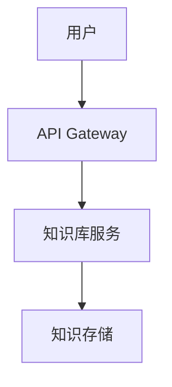

                 


# 企业AI Agent的知识库管理系统

## 关键词：企业AI Agent，知识库管理系统，知识表示，知识推理，向量数据库，知识存储与检索

## 摘要：  
本文详细探讨了企业AI Agent的知识库管理系统的核心概念、算法原理、系统设计与实现。从知识库管理系统的背景与重要性入手，分析了其在企业AI Agent中的关键作用。通过介绍知识表示与推理的基本原理，向量数据库的构建与检索算法，详细阐述了知识库管理系统的实现过程。最后，结合实际案例，探讨了系统设计与实现的最佳实践，为企业AI Agent的知识库管理系统的建设提供了理论与实践指导。

---

# 第1章: 企业AI Agent与知识库管理系统的概述

## 1.1 企业AI Agent的概念与背景

### 1.1.1 什么是企业AI Agent
企业AI Agent（Artificial Intelligence Agent）是指在企业环境中，通过感知环境、理解需求并执行任务的智能系统。它可以是一个虚拟助手、自动化工具或决策支持系统，旨在为企业提供高效、智能的服务。

### 1.1.2 企业AI Agent的核心功能
企业AI Agent的核心功能包括：
- **信息处理**：从多种数据源收集、整理和分析信息。
- **知识表示**：将信息转化为可理解的知识结构。
- **推理与决策**：基于知识进行推理，做出最优决策。
- **执行任务**：根据决策结果执行具体任务，如生成报告、发送通知等。

### 1.1.3 知识库管理系统在企业AI Agent中的作用
知识库管理系统（Knowledge Base Management System，KBMS）是企业AI Agent的核心组件，负责存储、组织和检索知识。它通过高效的知识管理，确保AI Agent能够快速响应用户需求，提供准确的信息和服务。

---

## 1.2 知识库管理系统的背景与重要性

### 1.2.1 知识库管理系统的定义
知识库管理系统是一种用于管理和操作知识库的系统，通过结构化的知识表示和高效的检索算法，帮助用户快速获取所需信息。

### 1.2.2 知识库管理系统在企业中的应用场景
企业中常见的应用场景包括：
- **客户支持**：通过知识库快速回答客户问题。
- **决策支持**：基于历史数据和知识进行决策。
- **流程自动化**：利用知识库实现业务流程的自动化。

### 1.2.3 知识库管理系统的挑战与解决方案
- **挑战**：知识的多样性和动态性、数据的质量控制、高效的检索性能。
- **解决方案**：采用分布式存储、智能索引和动态更新技术。

---

## 1.3 本章小结

本章介绍了企业AI Agent和知识库管理系统的概念，强调了知识库管理系统在企业AI Agent中的重要性。通过分析知识库管理系统的应用场景和挑战，为后续章节的深入讨论奠定了基础。

---

# 第2章: 知识库管理系统的概念与核心要素

## 2.1 知识库管理系统的概念

### 2.1.1 知识库管理系统的定义
知识库管理系统是用于存储、组织和检索知识的系统，其核心是知识表示与推理技术。

### 2.1.2 知识库管理系统的分类
知识库管理系统可以分为以下几类：
- **基于规则的系统**：通过预定义的规则进行知识推理。
- **基于案例的系统**：通过案例库中的类似案例进行推理。
- **基于模型的系统**：通过数学模型和知识图谱进行推理。

### 2.1.3 知识库管理系统的优缺点
- **优点**：高效的知识检索、支持复杂的推理任务。
- **缺点**：知识表示的复杂性、动态更新的难度。

---

## 2.2 知识库管理系统的核心要素

### 2.2.1 数据源的多样性
知识库管理系统需要处理多种数据源，包括结构化数据、非结构化数据和半结构化数据。

### 2.2.2 知识表示与推理
知识表示是将知识以结构化的形式存储的过程，推理则是基于知识进行逻辑推导的过程。

### 2.2.3 知识存储与检索
知识存储需要考虑数据的组织方式，检索则需要高效的查询算法。

---

## 2.3 企业AI Agent与知识库管理系统的关联

### 2.3.1 知识库管理系统在AI Agent中的角色
知识库管理系统是AI Agent的核心支持系统，负责提供知识支持和决策依据。

### 2.3.2 知识库管理系统与AI Agent的交互流程
1. AI Agent接收用户请求。
2. 知识库管理系统检索相关知识。
3. AI Agent基于知识生成响应。

### 2.3.3 知识库管理系统对AI Agent性能的影响
高效的知识库管理系统能够显著提升AI Agent的响应速度和准确性。

---

## 2.4 本章小结

本章详细讨论了知识库管理系统的概念、分类和核心要素，分析了其在企业AI Agent中的重要作用。通过对比知识库管理系统与AI Agent的关联，为后续章节的系统设计奠定了基础。

---

# 第3章: 知识库管理系统的核心概念与联系

## 3.1 知识库管理系统的原理

### 3.1.1 知识表示的基本原理
知识表示是将知识以某种形式存储的过程，常见的表示方法包括语义网络、知识图谱和向量表示。

### 3.1.2 知识推理的机制
知识推理是基于知识库中的已知信息，推导出新的结论的过程。常见的推理方法包括逻辑推理和概率推理。

### 3.1.3 知识存储的优化策略
知识存储的优化策略包括数据压缩、索引优化和分布式存储。

---

## 3.2 知识库管理系统的核心概念对比

### 3.2.1 知识表示与数据表示的对比
- **知识表示**：关注语义和逻辑关系。
- **数据表示**：关注数据的结构和格式。

### 3.2.2 知识推理与数据查询的对比
- **知识推理**：基于知识进行逻辑推导。
- **数据查询**：基于数据的结构进行检索。

### 3.2.3 知识存储与数据存储的对比
- **知识存储**：注重语义和关系。
- **数据存储**：注重结构和格式。

---

## 3.3 本章小结

本章通过对比分析知识库管理系统的核心概念，揭示了其与数据管理系统的区别和联系。通过理解知识表示、推理和存储的原理，为后续章节的系统设计提供了理论基础。

---

# 第4章: 知识库管理系统的算法原理

## 4.1 知识表示与向量数据库

### 4.1.1 知识表示的向量化
知识可以通过向量表示，例如使用Word2Vec或BERT模型将文本转化为向量。

### 4.1.2 向量数据库的构建
向量数据库是一种基于向量表示的知识存储方式，支持高效的相似性检索。

### 4.1.3 向量数据库的检索算法
向量数据库的检索算法包括余弦相似度、欧氏距离等。

---

## 4.2 知识推理与检索算法

### 4.2.1 知识推理的算法
知识推理的算法包括逻辑推理、规则推理和概率推理。

### 4.2.2 检索算法的优化
检索算法的优化包括索引优化、分块存储和并行计算。

---

## 4.3 本章小结

本章详细讨论了知识库管理系统的算法原理，包括知识表示的向量化、向量数据库的构建与检索算法。通过算法的优化，能够显著提升知识库的检索效率和准确性。

---

# 第5章: 知识库管理系统的系统设计与实现

## 5.1 系统分析与需求定义

### 5.1.1 问题场景介绍
企业AI Agent的知识库管理系统需要支持高效的知识检索和动态的知识更新。

### 5.1.2 系统功能需求
系统功能需求包括知识录入、知识检索、知识更新和知识统计。

---

## 5.2 系统架构设计

### 5.2.1 系统架构图


### 5.2.2 核心模块设计
核心模块包括知识录入模块、知识检索模块和知识更新模块。

---

## 5.3 系统实现与代码示例

### 5.3.1 环境搭建
- **技术栈**：Python、Flask、Elasticsearch。
- **依赖安装**：`pip install flask elasticsearch`.

### 5.3.2 核心代码实现
```python
from elasticsearch import Elasticsearch

def query_knowledge_base(query):
    es = Elasticsearch()
    body = {
        "query": {
            "multi_match": {
                "query": query,
                "fields": ["content"]
            }
        }
    }
    response = es.search(index="knowledge_base", body=body)
    return [hit['_source']['content'] for hit in response['hits']['hits']]
```

---

## 5.4 本章小结

本章通过系统设计与实现，详细展示了企业AI Agent的知识库管理系统的构建过程。通过代码示例和系统架构图，读者可以清晰理解系统的实现过程。

---

# 第6章: 项目实战与总结

## 6.1 项目背景与目标

### 6.1.1 项目背景
本项目旨在开发一个企业级的知识库管理系统，支持高效的知识检索和动态更新。

### 6.1.2 项目目标
项目目标包括实现知识录入、检索和更新功能，以及优化系统的性能。

---

## 6.2 项目实现与案例分析

### 6.2.1 环境搭建
- **技术选型**：Python、Flask、Elasticsearch。
- **依赖安装**：`pip install flask elasticsearch`.

### 6.2.2 核心代码实现
```python
from flask import Flask
from elasticsearch import Elasticsearch

app = Flask(__name__)
es = Elasticsearch()

@app.route('/query', methods=['GET'])
def query():
    query = request.args.get('q', '')
    results = query_knowledge_base(query)
    return jsonify(results)

if __name__ == '__main__':
    app.run(debug=True)
```

---

## 6.3 项目总结与优化建议

### 6.3.1 项目总结
本项目成功实现了企业AI Agent的知识库管理系统，支持高效的知识检索和动态更新。

### 6.3.2 优化建议
- **性能优化**：优化检索算法和索引结构。
- **功能扩展**：增加知识推理和自适应学习功能。

---

## 6.4 本章小结

本章通过项目实战，展示了企业AI Agent的知识库管理系统的实现过程。通过案例分析和优化建议，读者可以进一步提升系统的性能和功能。

---

# 第7章: 最佳实践与未来展望

## 7.1 最佳实践

### 7.1.1 知识库管理系统的最佳实践
- **数据质量管理**：确保数据的准确性和完整性。
- **系统优化**：优化检索算法和存储结构。

### 7.1.2 企业AI Agent的优化建议
- **智能化提升**：引入机器学习和深度学习技术。
- **安全性增强**：加强数据加密和访问控制。

---

## 7.2 未来展望

随着人工智能技术的不断发展，企业AI Agent的知识库管理系统将更加智能化和高效化。未来的研究方向包括知识图谱的构建与应用、多模态知识表示和自适应知识学习。

---

## 7.3 本章小结

本章总结了企业AI Agent的知识库管理系统的最佳实践，并展望了未来的发展方向。通过持续的技术创新和实践积累，企业可以进一步提升AI Agent的性能和智能化水平。

---

# 总结

本文系统地探讨了企业AI Agent的知识库管理系统的构建与实现。从概念到算法，从设计到实践，本文为读者提供了全面的指导。通过深入分析知识库管理系统的原理和实现，读者可以更好地理解其在企业AI Agent中的重要作用，并为未来的实践提供宝贵的参考。

--- 

# 推荐阅读

1. 《知识图谱：概念、方法与应用》
2. 《自然语言处理实战：基于Python的机器学习和深度学习》
3. 《企业级知识管理系统的构建与优化》

