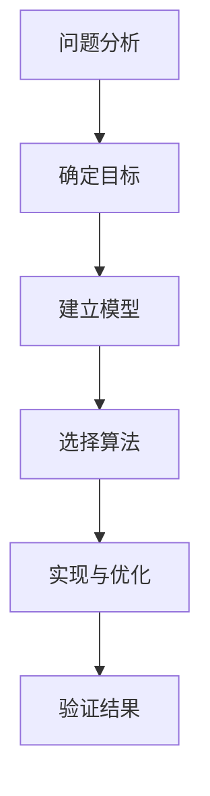
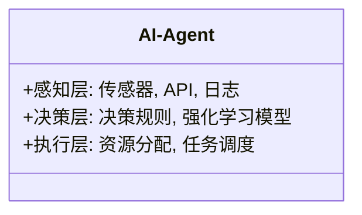

                 


# 企业AI Agent的绿色计算策略

## 关键词：绿色计算、AI Agent、能源效率、资源优化、可持续发展

## 摘要：  
随着人工智能技术的快速发展，企业AI Agent在提高效率的同时，也需要关注绿色计算。绿色计算强调能源效率和资源优化，以减少对环境的影响。本文将探讨如何在AI Agent的设计与应用中融入绿色计算的理念，分析其技术原理、优化算法和实际应用案例，为企业实现可持续发展目标提供策略性指导。

---

# 第二章 绿色计算的数学模型与优化方法

## 2.1 绿色计算的核心数学模型

绿色计算依赖于多种数学模型来优化资源分配、降低能耗和评估环境影响。以下是几个关键模型：

### 2.1.1 能源消耗模型
能源消耗模型用于预测和优化计算资源的能耗。通过分析硬件的功率消耗与工作负载之间的关系，可以制定有效的能源管理策略。

**公式：**
$$ P = a \times \text{负载} + b $$
其中，\( P \) 表示功率，\( a \) 和 \( b \) 是常数。

### 2.1.2 资源分配模型
资源分配模型旨在将计算资源分配到不同的任务中，以最小化总能耗。

**公式：**
$$ \text{min} \sum_{i=1}^{n} P_i \times t_i $$
其中，\( P_i \) 是任务 \( i \) 的功率，\( t_i \) 是任务 \( i \) 的执行时间。

### 2.1.3 环境影响评估模型
环境影响评估模型用于量化计算活动对环境的影响，如碳排放和废弃物产生。

**公式：**
$$ E = \sum_{i=1}^{n} (P_i \times t_i) \times \text{排放因子} $$

## 2.2 绿色计算的优化算法

### 2.2.1 线性规划与动态规划
线性规划用于解决资源分配问题，而动态规划则适用于多阶段优化问题。

**线性规划模型：**
$$ \text{min} \sum_{i=1}^{n} c_i x_i $$
$$ \text{subject to} \sum_{i=1}^{n} a_i x_i \geq b $$
$$ x_i \geq 0 $$

**动态规划模型：**
$$ V(s) = \min_{a} [c(s,a) + V(s') ] $$

### 2.2.2 遗传算法与模拟退火
遗传算法通过模拟自然选择来优化解，而模拟退火则通过逐步降温来找到全局最优解。

### 2.2.3 群集智能算法
蚁群算法、粒子群优化等算法模拟生物群体行为，用于解决复杂的优化问题。

## 2.3 算法原理与实现

### 2.3.1 算法流程图（mermaid）



### 2.3.2 算法实现代码

```python
import numpy as np

# 线性规划实现
def linear_programming(c, A, b):
    from scipy.optimize import linprog
    result = linprog(c, A, b, bounds=(0, None))
    return result.x

# 动态规划实现
def dynamic_programming(n_states, n_actions, transition):
    # 初始化价值函数
    V = np.zeros(n_states)
    for _ in range(100):
        for s in range(n_states):
            for a in range(n_actions):
                s_prime = transition[s][a]
                V[s] = np.min(V[s_prime])
    return V
```

## 2.4 数学公式与模型

### 2.4.1 线性规划模型

$$ \text{min } c^T x $$
$$ \text{subject to } Ax \leq b $$
$$ x \geq 0 $$

### 2.4.2 动态规划模型

$$ V(s) = \min_{a} [c(s,a) + V(s') ] $$

## 2.5 本章小结

本章介绍了绿色计算的核心数学模型和优化算法，包括能源消耗模型、资源分配模型和环境影响评估模型。通过线性规划、动态规划、遗传算法和模拟退火等方法，可以有效优化企业的资源分配和能耗管理。这些模型和算法为企业AI Agent的设计提供了理论基础和实践指导。

---

# 第三章 AI Agent的感知与决策机制

## 3.1 感知层技术

### 3.1.1 数据采集与处理

AI Agent通过传感器、API和日志系统采集环境数据，如CPU负载、温度和能耗。

### 3.1.2 数据融合与分析

使用流数据处理技术和机器学习模型（如LSTM）对数据进行实时分析。

## 3.2 决策层技术

### 3.2.1 决策规则与策略

基于环境感知数据，制定动态资源分配策略，如负载均衡和任务调度。

### 3.2.2 决策优化算法

采用强化学习算法（如Q-learning）优化决策过程，减少能耗和提高效率。

## 3.3 系统架构设计

### 3.3.1 系统功能设计（mermaid类图）



### 3.3.2 系统架构设计（mermaid架构图）

```mermaid
archiecture
    负载均衡 --> AI-Agent
    能源管理 --> AI-Agent
    环境感知 --> AI-Agent
    任务调度 --> AI-Agent
```

## 3.4 本章小结

本章详细介绍了AI Agent的感知与决策机制，包括数据采集、分析和决策优化算法。通过强化学习和动态规划等方法，AI Agent能够实时感知环境并做出最优决策，从而实现绿色计算的目标。

---

# 第四章 AI Agent与绿色计算的结合

## 4.1 绿色AI Agent的设计目标

### 4.1.1 能耗优化

通过动态资源分配和负载均衡减少能耗。

### 4.1.2 环境友好

减少碳排放和电子废弃物。

## 4.2 绿色AI Agent的实现策略

### 4.2.1 系统架构设计

采用分布式架构，结合边缘计算和云计算，优化资源利用。

### 4.2.2 算法优化

使用强化学习和遗传算法优化资源分配和任务调度。

## 4.3 系统实现与优化

### 4.3.1 系统实现代码

```python
def resource_allocation(loads, capacities):
    # 使用强化学习算法进行资源分配
    pass

def task_scheduling(tasks, resources):
    # 使用遗传算法进行任务调度
    pass
```

## 4.4 本章小结

本章探讨了AI Agent与绿色计算的结合策略，提出了系统架构设计和算法优化方法。通过强化学习和遗传算法，可以有效优化资源分配和任务调度，实现绿色计算的目标。

---

# 第五章 企业级AI Agent的绿色计算应用

## 5.1 企业级应用的案例分析

### 5.1.1 金融行业的资源优化

通过AI Agent实现智能交易和风险控制，减少计算资源浪费。

### 5.1.2 制造业的能耗管理

通过AI Agent优化生产线能耗，实现绿色制造。

## 5.2 绿色AI Agent的实际应用

### 5.2.1 云计算平台的资源调度

通过AI Agent实现动态资源分配，降低能耗。

### 5.2.2 大数据分析的能效优化

通过AI Agent优化数据处理流程，减少能源消耗。

## 5.3 本章小结

本章通过实际案例分析了绿色AI Agent在企业级应用中的潜力，展示了其在金融、制造和云计算等领域的广泛应用。

---

# 第六章 绿色AI Agent的挑战与未来趋势

## 6.1 当前的挑战

### 6.1.1 技术挑战

能耗模型的准确性、算法的实时性和系统的可扩展性。

### 6.1.2 企业挑战

成本、技术门槛和员工意识。

## 6.2 未来趋势

### 6.2.1 技术创新

边缘计算、可持续AI和绿色算法的优化。

### 6.2.2 行业融合

AI Agent与绿色能源、绿色制造等领域的深度融合。

## 6.3 本章小结

本章分析了绿色AI Agent当前面临的挑战和未来的发展趋势，强调了技术创新和行业融合的重要性。

---

# 附录

## 附录A 算法代码实现

```python
# 强化学习算法实现
class Agent:
    def __init__(self, state_space, action_space):
        self.state_space = state_space
        self.action_space = action_space
        self.Q = np.zeros((state_space, action_space))
    
    def act(self, state):
        # 使用ε-greedy策略选择动作
        epsilon = 0.1
        if np.random.random() < epsilon:
            return np.random.randint(self.action_space)
        else:
            return np.argmax(self.Q[state])
    
    def update(self, state, action, reward, next_state):
        alpha = 0.1
        gamma = 0.9
        self.Q[state][action] += alpha * (reward + gamma * np.max(self.Q[next_state]) - self.Q[state][action])
```

## 附录B 参考文献

1. 线性规划与优化算法研究
2. 强化学习在资源分配中的应用
3. 绿色计算与可持续发展

## 附录C 工具与资源

- Python优化工具：scipy、numpy
- 可视化工具：Matplotlib、Tableau
- 云平台：AWS、Azure

---

# 结语

企业AI Agent的绿色计算策略不仅是技术发展的必然趋势，也是企业实现可持续发展的关键。通过优化算法和系统设计，AI Agent可以在提高效率的同时减少对环境的影响。未来，随着技术的进步和行业的发展，绿色AI Agent将在更多领域发挥重要作用。

