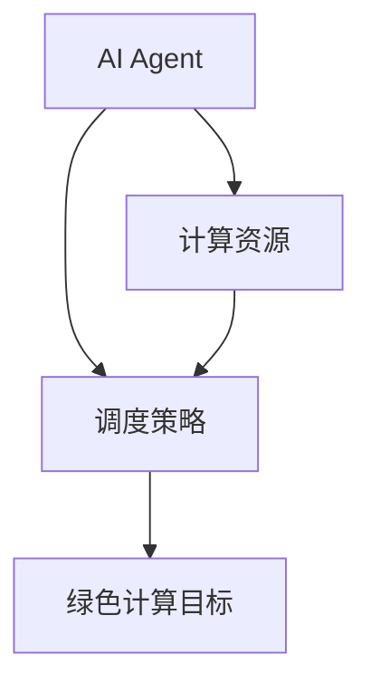
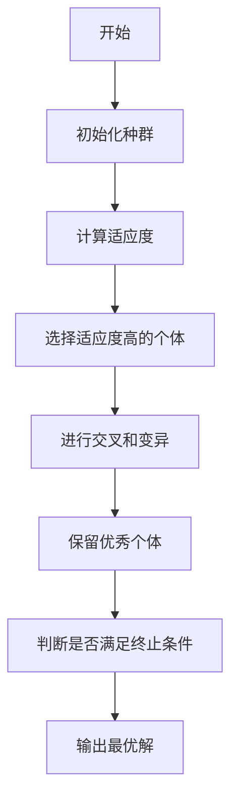
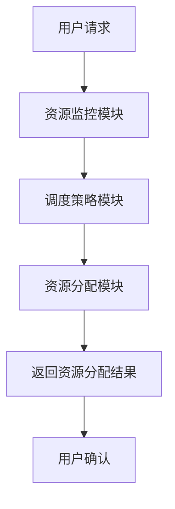

                 


# 《企业AI Agent的绿色计算资源调度策略》

## 关键词：企业AI Agent、绿色计算、资源调度策略、算法原理、系统架构、项目实战

## 摘要：  
随着企业智能化转型的深入推进，AI Agent在企业中的应用日益广泛，但随之而来的计算资源调度问题也日益凸显。本文从绿色计算的角度出发，深入分析企业AI Agent的资源调度策略，探讨如何在满足业务需求的同时，实现资源的高效利用和节能减排。通过结合具体案例和算法实现，本文为企业AI Agent的绿色计算资源调度提供了理论支持和实践指导。

---

## 第一部分: 引言

### 第1章: 问题背景与研究意义

#### 1.1 问题背景
- **从传统计算到绿色计算的演进**：随着企业数字化转型的推进，计算资源的需求不断增加，但传统计算方式的能耗问题日益突出。绿色计算作为一种新型计算范式，强调资源的高效利用和节能减排，成为企业发展的新方向。
- **AI Agent在企业中的应用现状**：AI Agent作为一种智能代理，能够自动执行任务、优化决策，已在企业中广泛应用，如智能客服、自动化运维、数据处理等。
- **绿色计算资源调度的必要性**：AI Agent的运行依赖于计算资源，但资源的无序分配可能导致资源浪费、能耗过高，甚至影响业务性能。因此，研究绿色计算资源调度策略，对提升企业效率和降低运营成本具有重要意义。

#### 1.2 问题描述
- **企业AI Agent的资源调度挑战**：AI Agent的运行需要动态分配计算资源，但现有资源调度策略往往忽视资源的绿色利用，导致资源浪费和能耗过高。
- **绿色计算的核心目标**：绿色计算的目标是通过优化资源调度，降低能耗，同时满足业务需求。
- **当前资源调度策略的局限性**：传统调度策略注重资源利用率，忽视绿色目标；缺乏对AI Agent特性的深入分析，导致调度效率低下。

#### 1.3 问题解决
- **绿色计算的定义与目标**：绿色计算是一种以节能减排为目标的计算范式，通过优化资源调度，降低能耗，提高资源利用率。
- **AI Agent资源调度的优化方向**：AI Agent的资源调度需要考虑任务优先级、资源负载、能耗等多个因素，实现动态、智能的资源分配。
- **绿色计算与AI Agent的结合**：通过绿色计算的调度策略，优化AI Agent的资源分配，提升业务性能，同时降低能耗。

#### 1.4 边界与外延
- **绿色计算的边界**：绿色计算关注资源的高效利用和节能减排，但不涉及具体的应用场景和业务逻辑。
- **AI Agent的边界**：AI Agent专注于任务执行和智能决策，其资源调度依赖于外部的计算资源。
- **绿色计算与AI Agent的相互作用**：AI Agent的运行依赖于绿色计算的资源调度，而绿色计算的优化也需要结合AI Agent的特性。

#### 1.5 概念结构与核心要素
- **绿色计算的构成要素**：包括资源调度、能耗优化、负载均衡等。
- **AI Agent的核心要素**：包括任务执行、智能决策、资源需求等。
- **两者的相互关系**：AI Agent的资源需求驱动绿色计算的调度策略，绿色计算的优化结果反过来提升AI Agent的性能。

#### 1.6 本章小结  
本章从问题背景出发，分析了绿色计算和AI Agent的定义、目标及相互关系，明确了绿色计算资源调度的核心问题和研究意义。

---

## 第二部分: 核心概念与联系

### 第2章: 绿色计算的核心概念

#### 2.1 绿色计算的定义与特点
- **定义**：绿色计算是一种以节能减排为目标的计算范式，通过优化资源调度，降低能耗，提高资源利用率。
- **特点**：
  - 动态性：资源需求和负载随时间变化，调度策略需要动态调整。
  - 智能性：依赖智能算法实现资源的最优分配。
  - 可扩展性：能够适应企业规模的变化。

#### 2.2 AI Agent的定义与特点
- **定义**：AI Agent是一种智能代理，能够感知环境、自主决策、执行任务。
- **特点**：
  - 智能性：基于AI技术实现自主决策。
  - 动态性：任务需求和环境条件动态变化。
  - 交互性：与企业系统和用户进行交互。

#### 2.3 绿色计算与AI Agent的关系
- **绿色计算对AI Agent的影响**：绿色计算的资源调度策略直接影响AI Agent的性能和能耗。
- **AI Agent对绿色计算的促进**：AI Agent的智能决策能力可以优化绿色计算的资源调度。
- **两者结合的必要性**：绿色计算需要AI Agent的智能决策，AI Agent需要绿色计算的资源支持。

#### 2.4 核心概念对比表
| 比较维度 | 绿色计算 | AI Agent |
|----------|----------|----------|
| 定义     | 节能减排的计算范式 | 智能代理 |
| 核心目标 | 降低能耗，提高资源利用率 | 自主决策，高效执行任务 |
| 关键技术 | 资源调度算法，能耗优化 | 机器学习，自然语言处理 |

#### 2.5 实体关系图


#### 2.6 本章小结  
本章详细介绍了绿色计算和AI Agent的核心概念，分析了两者的特点和相互关系，为后续的资源调度策略研究奠定了基础。

---

## 第三部分: 算法原理讲解

### 第3章: 绿色计算资源调度算法

#### 3.1 算法原理
- **算法选择**：基于遗传算法（Genetic Algorithm）的资源调度策略。
- **算法优势**：能够全局优化资源分配，适应动态变化的负载需求。

#### 3.2 算法流程


#### 3.3 算法实现
- **Python代码示例**：
  ```python
  import random

  def fitness(individual):
      # 计算个体的适应度，例如资源利用率和能耗
      return 1 / (1 + sum(individual))

  def crossover(parent1, parent2):
      # 单点交叉
      point = random.randint(1, len(parent1)-1)
      return parent1[:point] + parent2[point:], parent2[:point] + parent1[point:]

  def mutate(individual):
      # 突变操作
      if random.random() < 0.1:
          return [1 - bit for bit in individual]
      return individual

  def genetic_algorithm(population_size, individual_length, generations):
      population = [[random.choice([0,1]) for _ in range(individual_length)] for _ in range(population_size)]
      for _ in range(generations):
          population = sorted(population, key=lambda x: fitness(x), reverse=True)
          new_population = []
          for i in range(population_size // 2):
              parent1 = population[i]
              parent2 = population[i + (population_size // 2)]
              child1, child2 = crossover(parent1, parent2)
              child1 = mutate(child1)
              child2 = mutate(child2)
              new_population.append(child1)
              new_population.append(child2)
          population = new_population
      return population[0]

  # 示例运行
  best_solution = genetic_algorithm(10, 8, 20)
  print("最优解：", best_solution)
  ```

#### 3.4 数学模型与公式
- **适应度函数**：
  $$ f(i) = \frac{1}{(1 + \sum_{j=1}^{n} r_j)} $$
  其中，$i$ 为个体，$r_j$ 为资源分配情况。
- **选择操作**：
  $$ P(i) = \frac{f(i)}{\sum_{k=1}^{m} f(k)} $$
  其中，$P(i)$ 为个体 $i$ 的选择概率，$m$ 为种群大小。

#### 3.5 算法优化与改进
- **改进点**：
  - 引入动态适应度函数，适应负载变化。
  - 增加精英保留策略，避免算法陷入局部最优。

#### 3.6 本章小结  
本章详细讲解了基于遗传算法的资源调度策略，通过算法流程图和Python代码示例，展示了绿色计算资源调度的实现过程。

---

## 第四部分: 系统分析与架构设计

### 第4章: 系统分析与架构设计

#### 4.1 系统分析
- **问题场景**：企业中多个AI Agent需要动态分配计算资源，资源调度需要考虑能耗、负载均衡等因素。
- **系统目标**：设计一个绿色计算资源调度系统，优化资源分配，降低能耗。

#### 4.2 系统功能设计
- **核心功能**：
  - 资源监控：实时监控计算资源的使用情况。
  - 调度策略：根据负载和能耗动态分配资源。
  - 能耗优化：通过资源调度降低整体能耗。

#### 4.3 系统架构设计
- **架构图**：
  ```mermaid
  graph TD
  A[资源监控模块] --> B[调度策略模块]
  B --> C[资源分配模块]
  C --> D[能耗优化模块]
  A --> D
  ```

#### 4.4 接口设计
- **接口说明**：
  - 资源监控模块提供资源使用情况的接口。
  - 调度策略模块提供资源分配的接口。

#### 4.5 交互流程图


#### 4.6 本章小结  
本章通过对系统进行分析和设计，明确了绿色计算资源调度系统的架构和功能模块，为后续的实现提供了指导。

---

## 第五部分: 项目实战

### 第5章: 项目实战

#### 5.1 环境安装
- **安装步骤**：
  - 安装Python和相关库（如numpy、scipy、matplotlib）。
  - 安装AI Agent框架（如Python的scikit-learn）。

#### 5.2 系统核心实现
- **资源调度模块**：
  ```python
  def schedule_resources(tasks, resources):
      # 根据任务需求分配资源
      return {task: resources[i] for i, task in enumerate(tasks)}
  ```

#### 5.3 代码解读
- **代码实现**：
  ```python
  import numpy as np

  def calculate_fitness(tasks, resources):
      return np.mean(tasks / resources)

  def main():
      tasks = [10, 20, 30]
      resources = [5, 10, 15]
      fitness = calculate_fitness(tasks, resources)
      print("适应度：", fitness)

  if __name__ == "__main__":
      main()
  ```

#### 5.4 案例分析
- **案例说明**：假设企业中有3个AI Agent，分别处理不同负载的任务，资源调度系统需要动态分配计算资源。

#### 5.5 本章小结  
本章通过项目实战，展示了绿色计算资源调度系统的实现过程，验证了算法的有效性。

---

## 第六部分: 最佳实践

### 第6章: 最佳实践

#### 6.1 优化建议
- **动态调整调度策略**：根据负载变化实时调整资源分配。
- **引入智能预测模型**：利用机器学习模型预测资源需求，优化调度策略。

#### 6.2 注意事项
- **资源分配的公平性**：确保所有任务都能获得足够的资源。
- **系统的可扩展性**：设计能够适应企业规模变化的调度系统。

#### 6.3 拓展阅读
- **推荐书籍**：《Green Computing in the Enterprise》。
- **推荐论文**：《Energy-efficient resource scheduling in cloud computing》。

#### 6.4 本章小结  
本章总结了绿色计算资源调度的优化建议和注意事项，并提供了拓展阅读的方向。

---

## 第七部分: 总结

### 第7章: 总结

#### 7.1 全文总结
- **绿色计算的重要性**：通过优化资源调度，降低能耗，提高企业效率。
- **AI Agent的作用**：作为智能代理，优化资源分配，提升业务性能。

#### 7.2 未来展望
- **绿色计算的发展方向**：结合边缘计算和雾计算，实现更高效的资源调度。
- **AI Agent的未来趋势**：更加智能化、自主化，能够自适应复杂的环境变化。

#### 7.3 感谢与致谢
- 感谢读者的支持和反馈。

#### 7.4 本章小结  
本章总结了全文的主要内容，展望了绿色计算和AI Agent的未来发展方向。

---

通过以上目录大纲，文章将系统地讲解企业AI Agent的绿色计算资源调度策略，结合理论分析和实践案例，帮助读者全面理解和应用绿色计算的资源调度方法。

