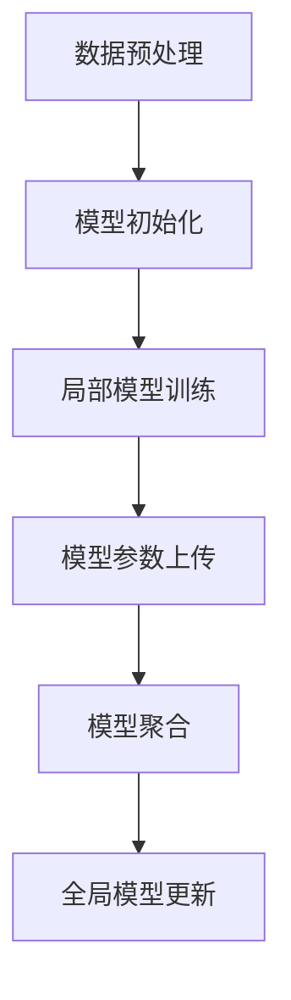
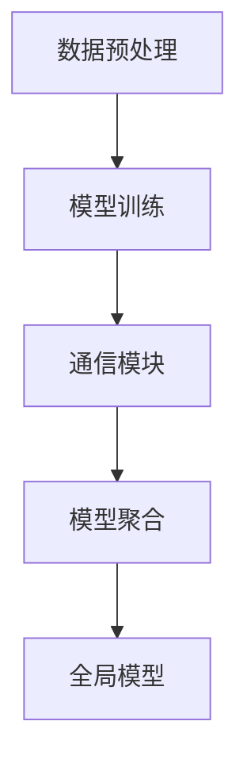

                 


# 企业AI Agent的联邦学习在跨企业数据协作中的安全实践

> 关键词：联邦学习，跨企业数据协作，企业AI Agent，数据隐私，模型安全

> 摘要：本文探讨了联邦学习在跨企业数据协作中的应用，特别是企业AI Agent在其中的作用。通过分析联邦学习的核心原理、系统架构、安全机制以及实际案例，本文详细阐述了如何在保护数据隐私的前提下，实现跨企业的高效协作，同时提供了一系列安全实践建议。

---

# 第1章: 背景与核心概念

## 1.1 联邦学习的基本概念

### 1.1.1 联邦学习的定义

联邦学习（Federated Learning）是一种分布式机器学习技术，允许多个参与方在不共享原始数据的情况下，通过交换模型参数来共同训练一个全局模型。每个参与方仅在本地处理数据，仅分享模型更新的信息，从而保护数据隐私。

### 1.1.2 联邦学习的核心特点

- **数据隐私保护**：数据不出本地，仅分享模型更新，降低数据泄露风险。
- **去中心化协作**：各参与方地位平等，无需依赖中心化机构。
- **高效性**：通过局部模型更新和聚合，快速收敛，节省计算资源。

### 1.1.3 联邦学习与传统数据协作的区别

| 特性                | 联邦学习                 | 传统数据协作             |
|---------------------|--------------------------|--------------------------|
| 数据共享方式        | 分享模型参数             | 分享原始数据             |
| 数据隐私保护        | 高                      | 低                      |
| 中心化程度          | 去中心化                | 中心化                  |
| 通信成本            | 较低（仅分享模型参数）   | 较高（分享完整数据）     |

---

## 1.2 跨企业数据协作的背景与挑战

### 1.2.1 跨企业数据协作的背景

随着数字化转型的推进，企业间需要通过数据协作提升效率和创新能力。然而，数据孤岛问题日益严重，跨企业数据协作的需求迫切。

### 1.2.2 数据孤岛与协作需求

- **数据孤岛**：不同企业、部门或系统之间的数据无法有效共享和利用。
- **协作需求**：企业希望通过数据协作提升业务能力，但数据隐私和安全问题成为主要障碍。

### 1.2.3 跨企业数据协作的挑战

- **数据隐私**：如何在不共享数据的情况下进行协作。
- **模型安全**：防止模型被攻击或恶意篡改。
- **信任机制**：如何建立参与方之间的信任。

---

## 1.3 企业AI Agent的定义与作用

### 1.3.1 企业AI Agent的定义

企业AI Agent是一种智能代理系统，能够理解、分析和处理企业内外部数据，执行任务并提供决策支持。

### 1.3.2 企业AI Agent的核心功能

- **数据处理**：采集、清洗、分析数据。
- **模型训练**：在本地数据上训练模型，并参与联邦学习。
- **决策支持**：基于模型输出提供业务决策建议。

### 1.3.3 企业AI Agent在数据协作中的作用

- **数据代理**：代表企业参与联邦学习，仅分享模型参数。
- **隐私保护**：确保数据不被泄露，仅进行模型更新。
- **协作管理**：协调多方参与方，确保协作流程顺畅。

---

## 1.4 本章小结

本章介绍了联邦学习的基本概念、核心特点以及跨企业数据协作的背景和挑战。同时，阐述了企业AI Agent的定义和作用，为后续章节的深入分析奠定了基础。

---

# 第2章: 联邦学习的核心原理与安全机制

## 2.1 联邦学习的核心原理

### 2.1.1 联邦学习的基本流程

以下是联邦学习的基本流程图：



### 2.1.2 联邦学习的通信机制

- **数据分片**：每个参与方仅处理部分数据，避免数据集中。
- **模型更新**：通过差分更新，仅传输变化的部分，减少数据传输量。
- **通信协议**：使用加密通道，确保传输过程中的安全性。

### 2.1.3 联邦学习的模型更新策略

- **同步更新**：所有参与方同时更新模型。
- **异步更新**：参与方按需更新模型，提高效率。

---

## 2.2 联邦学习的安全机制

### 2.2.1 数据隐私保护

- **加密传输**：使用SSL/TLS加密通信，防止数据被截获。
- **同态加密**：在加密状态下进行模型训练，确保数据隐私。

### 2.2.2 模型安全防护

- **模型加密**：对模型参数进行加密，防止被恶意篡改。
- **成员替换检测**：检测参与方是否被恶意替换。

### 2.2.3 身份认证与权限管理

- **身份认证**：使用数字证书或密钥进行身份验证。
- **权限管理**：根据角色分配不同的访问权限，确保最小权限原则。

---

## 2.3 联邦学习的数学模型与公式

### 2.3.1 损失函数的定义

损失函数用于衡量模型预测值与真实值之间的差距，常用的损失函数包括均方误差（MSE）和交叉熵损失（CE）。

- 均方误差：
  $$L = \frac{1}{n}\sum_{i=1}^{n}(y_i - \hat{y_i})^2$$

- 交叉熵损失：
  $$L = -\frac{1}{n}\sum_{i=1}^{n}y_i \log(\hat{y_i}) + (1 - y_i) \log(1 - \hat{y_i})$$

### 2.3.2 参数更新的数学公式

联邦学习中，模型参数的更新通常采用差分隐私（DP）技术，确保参数更新不泄露本地数据。

- 差分隐私的参数更新公式：
  $$\Delta w = \text{Clip}(w_{\text{new}} - w_{\text{old}}, \epsilon, \delta)$$
  其中，$\epsilon$是隐私预算，$\delta$是置信度。

---

## 2.4 本章小结

本章详细讲解了联邦学习的核心原理，包括基本流程、通信机制和模型更新策略，并提出了多种安全机制，确保跨企业数据协作的安全性。

---

# 第3章: 联邦学习的系统架构与设计

## 3.1 系统架构概述

### 3.1.1 联邦学习系统的组成

联邦学习系统通常由以下几个部分组成：

- **数据预处理模块**：负责数据清洗、归一化等预处理工作。
- **模型训练模块**：在本地数据上训练模型，并生成模型参数。
- **通信模块**：负责模型参数的上传和下载，确保数据安全传输。
- **模型聚合模块**：对各参与方的模型参数进行聚合，生成全局模型。

### 3.1.2 系统的分层架构

以下是系统的分层架构图：



---

## 3.2 系统功能设计

### 3.2.1 数据预处理

- **数据清洗**：去除噪声数据，确保数据质量。
- **数据归一化**：将数据标准化，便于模型训练。
- **数据分割**：将数据划分为训练集和验证集。

### 3.2.2 模型训练

- **局部模型训练**：在本地数据上训练模型，生成模型参数。
- **模型更新**：根据聚合后的全局模型，更新本地模型。

---

## 3.3 通信协议设计

### 3.3.1 模型参数的传输方式

- **差分更新**：仅传输模型参数的变化部分，减少数据传输量。
- **加密传输**：使用加密协议，确保传输过程中的安全性。

### 3.3.2 模型更新的同步机制

- **同步更新**：所有参与方同时更新模型，确保一致性。
- **异步更新**：参与方按需更新模型，提高效率。

---

## 3.4 本章小结

本章详细分析了联邦学习系统的架构设计，包括系统组成、分层架构和功能模块设计，为后续章节的系统实现奠定了基础。

---

# 第4章: 联邦学习的项目实战

## 4.1 项目背景与目标

### 4.1.1 项目背景

随着企业数字化转型的深入，跨企业数据协作的需求日益迫切。然而，数据隐私问题成为协作的主要障碍。

### 4.1.2 项目目标

通过联邦学习技术，实现跨企业的数据协作，同时保护数据隐私。

---

## 4.2 环境安装与配置

### 4.2.1 环境安装

- **安装Python**：建议使用Python 3.6及以上版本。
- **安装依赖库**：`numpy`, `pandas`, `scikit-learn`, `flask`, `cryptography`。

### 4.2.2 系统配置

- **服务器端**：搭建一个中心服务器，用于接收模型参数和进行模型聚合。
- **客户端**：每个参与方搭建一个本地服务器，用于数据处理和模型训练。

---

## 4.3 系统核心实现

### 4.3.1 数据预处理代码

```python
import numpy as np
import pandas as pd

# 数据加载
data = pd.read_csv('local_data.csv')

# 数据清洗
data.dropna(inplace=True)

# 数据归一化
from sklearn.preprocessing import StandardScaler
scaler = StandardScaler()
data_norm = scaler.fit_transform(data)
```

### 4.3.2 模型训练代码

```python
from sklearn.linear_model import LinearRegression

# 初始化模型
model = LinearRegression()

# 局部模型训练
model.fit(data_norm, target)

# 获取模型参数
weights = model.coef_
bias = model.intercept_
```

### 4.3.3 模型聚合代码

```python
import numpy as np

# 接收所有参与方的模型参数
coefficients = [0.2, 0.3, 0.4]
intercepts = [0.1, 0.2, 0.3]

# 模型聚合（简单平均）
avg_coefficients = np.mean(coefficients)
avg_intercepts = np.mean(intercepts)

# 更新全局模型
global_model = LinearRegression()
global_model.coef_ = avg_coefficients
global_model.intercept_ = avg_intercepts
```

---

## 4.4 项目实战案例

### 4.4.1 案例背景

假设我们有三个企业（A、B、C）希望在不共享数据的情况下，共同训练一个预测模型。

### 4.4.2 案例分析

- **数据准备**：每个企业对本地数据进行预处理。
- **模型训练**：每个企业在本地训练模型，生成模型参数。
- **模型聚合**：将所有模型参数上传到中心服务器，进行模型聚合，生成全局模型。
- **模型部署**：将全局模型部署到各企业，进行预测和决策。

---

## 4.5 本章小结

本章通过一个具体的项目实战案例，详细讲解了联邦学习的实现过程，包括环境安装、数据预处理、模型训练和模型聚合等步骤，为读者提供了实际操作的参考。

---

# 第5章: 安全挑战与法律合规

## 5.1 联邦学习的安全挑战

### 5.1.1 数据隐私保护

- **数据泄露风险**：即使不共享数据，模型参数可能泄露数据分布。
- **模型攻击**：攻击者可能通过模型参数推断出部分数据。

### 5.1.2 模型安全防护

- **模型投毒**：恶意参与方上传被篡改的模型参数，影响全局模型。
- **数据完整性**：确保模型参数在传输过程中不被篡改。

---

## 5.2 联邦学习的法律合规

### 5.2.1 数据隐私法律

- **GDPR**：欧盟《通用数据保护条例》要求企业对数据处理负有严格责任。
- **CCPA**：美国《加利福尼亚消费者隐私法案》规定了数据主体的权利。

### 5.2.2 合规要求

- **数据最小化**：仅处理实现目的所必需的数据。
- **数据加密**：确保数据在传输和存储过程中的安全性。

---

## 5.3 本章小结

本章分析了联邦学习在跨企业数据协作中的安全挑战，并提出了相应的法律合规建议，确保联邦学习的应用符合法律法规要求。

---

# 第6章: 最佳实践与小结

## 6.1 最佳实践

### 6.1.1 数据隐私保护

- **使用差分隐私**：对模型参数进行差分加密，防止数据泄露。
- **定期审计**：定期检查模型参数和数据，确保合规性。

### 6.1.2 模型安全防护

- **模型验证**：对模型参数进行验证，防止模型投毒。
- **访问控制**：实施严格的访问控制，确保只有授权方可以参与模型训练。

---

## 6.2 小结

联邦学习作为一种创新的数据协作技术，为跨企业数据协作提供了新的可能性。通过合理设计和实施安全机制，可以有效保护数据隐私和模型安全，实现高效的数据协作。

---

## 6.3 注意事项

- **数据隐私**：始终将数据隐私放在首位，确保数据不被滥用。
- **模型更新**：定期更新模型，防止模型过时。
- **合规性**：确保联邦学习的应用符合相关法律法规。

---

## 6.4 拓展阅读

- **《Federated Learning: Challenges, Methods, and Future Directions》**
- **《Data Privacy and Security in Federated Learning》**

---

# 结语

企业AI Agent的联邦学习在跨企业数据协作中的应用前景广阔，但同时也面临诸多挑战。通过本文的分析，我们希望读者能够全面理解联邦学习的核心原理和安全机制，并能够在实际项目中合理应用，推动跨企业数据协作的发展。

---

**附录**

- **附录A**：常用联邦学习框架（如FederatedAI、TensorFlow Federated）。
- **附录B**：联邦学习相关的开源代码示例。

---

