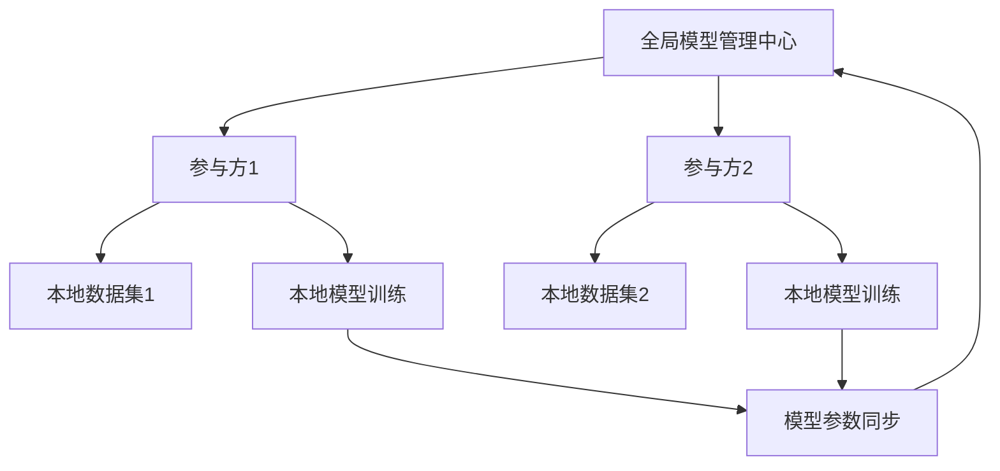
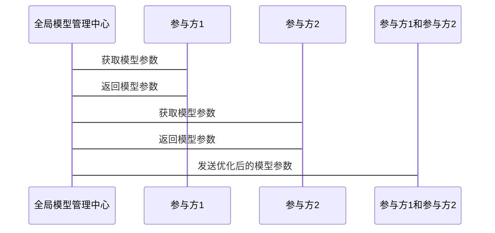

                 


# 企业AI Agent的联邦学习在跨企业数据协作中的实践

> 关键词：联邦学习，AI Agent，跨企业数据协作，数据隐私，模型协作

> 摘要：随着企业间数据协作需求的不断增长，联邦学习作为一种新兴的分布式机器学习技术，逐渐成为解决跨企业数据隐私与安全问题的重要手段。本文将深入探讨企业AI Agent在联邦学习中的应用，分析其在跨企业数据协作中的实践价值，并通过实际案例展示如何通过联邦学习实现高效的数据协作，同时保护数据隐私与安全。

---

## 第1章: 联邦学习与AI Agent概述

### 1.1 联邦学习的起源与发展

#### 1.1.1 联邦学习的定义与背景
联邦学习（Federated Learning，FL）是一种分布式机器学习技术，旨在在不共享原始数据的前提下，通过在多个分布式节点上联合训练模型，实现全局模型的优化。其核心思想是“数据不动，模型动”，即数据保留在本地，仅交换模型参数或中间结果，从而保护数据隐私与安全。

#### 1.1.2 AI Agent的基本概念
AI Agent（人工智能代理）是指能够感知环境、自主决策并执行任务的智能实体。在联邦学习的场景中，AI Agent通常作为各个参与方的代理，负责本地模型的训练、参数同步以及与其他代理的通信。

#### 1.1.3 联邦学习与AI Agent的结合
将AI Agent引入联邦学习，可以实现各参与方的自主协作。AI Agent负责本地模型的训练，并通过通信协议与其他代理共享模型参数或梯度信息，最终实现全局模型的优化。

### 1.2 跨企业数据协作的挑战

#### 1.2.1 数据孤岛问题
由于数据隐私和商业竞争的原因，企业往往将数据孤岛化，导致数据无法有效共享，限制了跨企业协作的效率。

#### 1.2.2 数据隐私与安全
企业在进行数据协作时，最核心的担忧是数据隐私泄露。如何在不共享原始数据的前提下实现模型协作，是联邦学习的核心挑战。

#### 1.2.3 跨企业协作的复杂性
跨企业协作涉及多个组织的参与，各方之间的通信协议、数据格式、模型同步等问题都需要精心设计和协调。

### 1.3 联邦学习在跨企业协作中的价值

#### 1.3.1 数据共享的效率提升
联邦学习通过模型协作的方式，避免了原始数据的共享，提高了数据协作的效率。

#### 1.3.2 模型协作的优势
联邦学习可以在不共享数据的前提下，联合多个参与方的模型参数，实现全局模型的优化，从而提升模型的泛化能力和性能。

#### 1.3.3 联邦学习的实际应用场景
联邦学习已经在医疗、金融、推荐系统等领域得到了广泛应用。例如，在医疗领域，联邦学习可以在不共享患者数据的前提下，联合多家医院的数据训练疾病预测模型。

---

## 第2章: 联邦学习的核心概念与原理

### 2.1 联邦学习的核心概念

#### 2.1.1 联邦学习的数学模型
联邦学习的数学模型可以表示为：
$$ \text{目标函数} = \sum_{i=1}^{n} f_i(\theta) $$
其中，$f_i$表示第$i$个参与方的损失函数，$\theta$是模型参数。

#### 2.1.2 联邦学习的分类与特点
联邦学习可以分为同步和异步两种模式。同步模式下，所有参与方同时更新模型参数；异步模式下，参与方可以按需更新模型参数，通信开销较低。

#### 2.1.3 联邦学习的通信协议
联邦学习的通信协议需要确保数据的安全性与隐私性。常用的通信协议包括安全多方计算（Secure Multi-Party Computation，SMC）和同态加密（Homomorphic Encryption，HE）。

### 2.2 AI Agent的协作机制

#### 2.2.1 AI Agent的角色与职责
AI Agent在联邦学习中主要负责本地模型的训练、参数同步以及与其他代理的通信。

#### 2.2.2 联邦学习中的通信协议
通过通信协议，AI Agent可以实现模型参数的同步与共享。常见的通信协议包括gRPC、HTTP/HTTPS等。

#### 2.2.3 联邦学习的同步与异步模式
在同步模式下，所有参与方同时更新模型参数；在异步模式下，参与方可以按需更新模型参数，通信开销较低。

---

## 第3章: 联邦学习的算法原理

### 3.1 联邦平均算法（FedAvg）

#### 3.1.1 算法的基本原理
联邦平均算法是一种经典的联邦学习算法，其核心思想是通过迭代的方式，将各个参与方的模型参数平均化，从而得到全局模型。

#### 3.1.2 算法的数学模型
联邦平均算法的数学模型可以表示为：
$$ \theta_{t+1} = \frac{1}{n} \sum_{i=1}^{n} \theta_{i,t} $$
其中，$\theta_{i,t}$表示第$i$个参与方在第$t$次迭代的模型参数，$n$是参与方的数量。

#### 3.1.3 算法的优缺点
优点：计算简单，易于实现；缺点：可能无法处理异构数据和模型。

### 3.2 联邦学习的通信机制

#### 3.2.1 通信协议的选择
选择通信协议时需要考虑数据隐私、通信效率和实现复杂度。

#### 3.2.2 通信的效率优化
通过优化通信频率和数据压缩技术，可以降低通信开销。

#### 3.2.3 通信的安全性保障
通过加密技术和安全协议，可以保障通信过程中的数据安全。

---

## 第4章: 联邦学习的系统架构设计

### 4.1 系统功能设计

#### 4.1.1 数据预处理模块
数据预处理模块负责对原始数据进行清洗、归一化等预处理操作。

#### 4.1.2 模型训练模块
模型训练模块负责本地模型的训练和参数更新。

#### 4.1.3 模型评估模块
模型评估模块负责对全局模型的性能进行评估和优化。

### 4.2 系统架构图



### 4.3 接口设计与交互流程图



---

## 第5章: 联邦学习的项目实战

### 5.1 环境搭建

#### 5.1.1 安装必要的依赖
```bash
pip install numpy matplotlib tensorflow federated-learn
```

#### 5.1.2 配置开发环境
安装Python 3.8及以上版本，配置Jupyter Notebook环境。

#### 5.1.3 初始化项目结构
```bash
mkdir fedlearn
cd fedlearn
touch fed_avg.py dataset.py
```

### 5.2 核心代码实现

#### 5.2.1 数据预处理代码
```python
import numpy as np

def preprocess_data(data):
    # 数据归一化
    mean = np.mean(data, axis=0)
    std = np.std(data, axis=0)
    normalized_data = (data - mean) / std
    return normalized_data
```

#### 5.2.2 模型训练代码
```python
import tensorflow as tf
from tensorflow.keras import layers

def create_model(input_dim):
    model = tf.keras.Sequential()
    model.add(layers.Dense(64, activation='relu', input_dim=input_dim))
    model.add(layers.Dense(1, activation='sigmoid'))
    model.compile(optimizer='adam', loss='binary_crossentropy', metrics=['accuracy'])
    return model
```

#### 5.2.3 模型评估代码
```python
def evaluate_model(model, test_data):
    loss, accuracy = model.evaluate(test_data, verbose=0)
    print(f"Test loss: {loss}, Test accuracy: {accuracy}")
```

### 5.3 实际案例分析

#### 5.3.1 案例背景介绍
假设我们有两家公司，公司A和公司B，分别拥有客户购买行为数据，希望联合训练一个客户 churn 预测模型。

#### 5.3.2 数据集的准备
公司A和公司B分别提供客户数据，数据格式一致，但不共享原始数据。

#### 5.3.3 模型训练与评估
通过联邦平均算法，公司A和公司B联合训练模型，最终得到全局模型，并在各自的数据集上进行评估。

---

## 第6章: 最佳实践与总结

### 6.1 实践中的注意事项

#### 6.1.1 数据隐私的保护
在实际应用中，需要通过加密技术和安全协议来保护数据隐私。

#### 6.1.2 模型的可解释性
联邦学习模型需要具备可解释性，以便用户理解和信任模型的输出。

#### 6.1.3 系统的可扩展性
系统设计时需要考虑可扩展性，以便未来接入更多的参与方。

### 6.2 联邦学习的未来

随着数据隐私保护需求的增加，联邦学习将在跨企业数据协作中发挥越来越重要的作用。未来，联邦学习将结合更多的AI技术，如大语言模型（LLM），在更复杂的场景中实现高效的数据协作。

---

## 小结

通过本文的探讨，我们深入分析了企业AI Agent在联邦学习中的应用，详细讲解了联邦学习的核心概念、算法原理和系统架构设计，并通过实际案例展示了联邦学习在跨企业数据协作中的实践价值。未来，随着技术的不断进步，联邦学习将在更多领域得到广泛应用，为跨企业协作提供更高效、更安全的解决方案。

