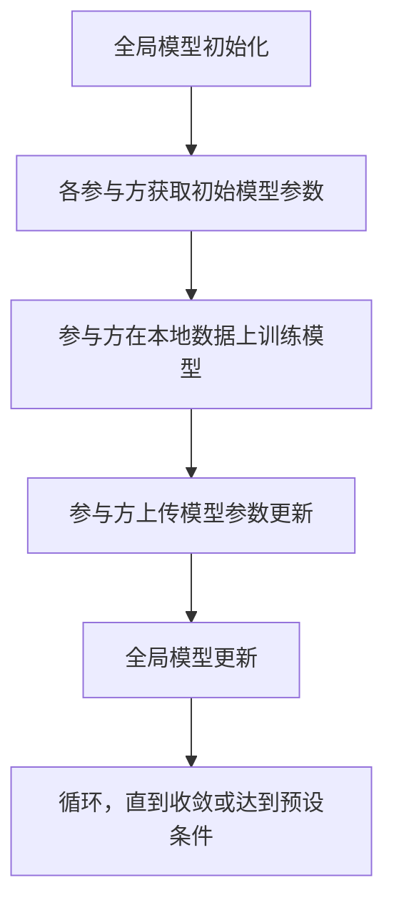
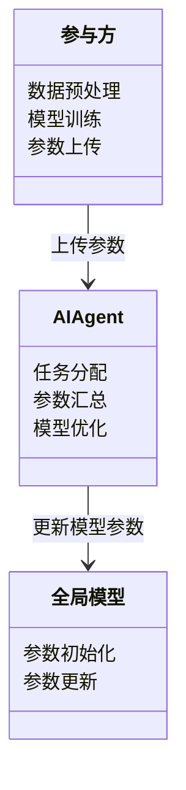
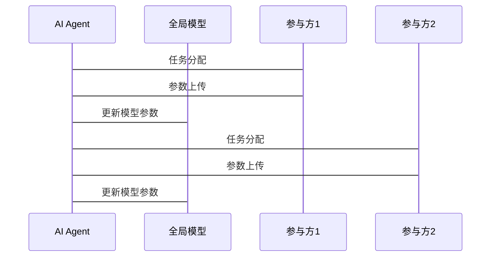

                 


# 企业AI Agent的联邦学习在跨部门数据协作中的实践

## 关键词：企业AI Agent、联邦学习、跨部门数据协作、数据隐私、协同学习

## 摘要：本文系统地探讨了企业AI Agent如何利用联邦学习技术实现跨部门数据协作。通过理论分析、算法实现和实际案例，详细阐述了联邦学习的核心原理、AI Agent的功能架构及其在跨部门协作中的应用。文章还提供了代码实现、系统设计和项目实战内容，为读者提供了从理论到实践的完整指南。

---

## 第一部分：背景介绍

### 第1章：企业AI Agent与联邦学习概述

#### 1.1 问题背景

- **数据孤岛与部门协作的挑战**  
  企业在数字化转型过程中，各部门（如销售、市场、财务等）积累了大量数据，但由于数据孤岛问题，这些数据难以有效共享和利用，导致资源浪费和效率低下。

- **跨部门数据协作的重要性**  
  跨部门数据协作能够打破数据孤岛，提升企业决策的准确性和效率。例如，销售部门的数据可以与市场部门共享，以优化市场活动策划。

- **联邦学习的提出与目标**  
  联邦学习（Federated Learning）是一种分布式机器学习技术，能够在保护数据隐私的前提下，通过局部模型训练和参数交换，实现全局模型的优化。其目标是在不共享原始数据的情况下，提升模型的泛化能力。

#### 1.2 问题描述

- **数据隐私问题**  
  数据泄露和隐私保护是企业在跨部门协作中面临的主要挑战。联邦学习通过局部模型训练和参数汇总，避免了原始数据的直接共享。

- **数据孤岛对企业效率的影响**  
  数据孤岛导致各部门难以协同工作，无法充分利用数据资源，影响企业的整体效率和决策能力。

- **联邦学习的适用场景**  
  联邦学习适用于需要跨部门协作但又无法共享原始数据的场景，例如客户画像构建、销售预测等。

#### 1.3 问题解决

- **联邦学习的核心思想**  
  联邦学习通过在各参与方本地进行模型训练，仅共享模型参数或中间结果，避免了原始数据的直接传输，从而保护数据隐私。

- **AI Agent在数据协作中的作用**  
  AI Agent作为智能代理，负责协调各部门的数据协作过程，包括任务分配、模型训练和结果汇总。

- **联邦学习与AI Agent的结合**  
  通过AI Agent协调各参与方的模型训练和参数同步，联邦学习能够在不共享数据的情况下，构建高性能的全局模型。

#### 1.4 边界与外延

- **联邦学习的边界**  
  联邦学习适用于分布式数据源的模型训练，但不适用于需要集中处理原始数据的场景。

- **AI Agent的能力边界**  
  AI Agent负责协调数据协作过程，但其能力受限于数据隐私和计算资源的限制。

- **联邦学习与AI Agent的外延**  
  联邦学习与AI Agent的结合可以扩展到更广泛的应用场景，例如物联网、边缘计算等。

#### 1.5 概念结构与核心要素

- **联邦学习的核心要素**  
  - 数据源分布：数据分布在多个参与方，每个参与方本地进行数据处理。
  - 模型训练：每个参与方在本地数据上训练模型，仅共享模型参数。
  - 参数汇总：所有参与方的模型参数汇总，构建全局模型。

- **AI Agent的核心要素**  
  - 任务分配：AI Agent协调各部门的任务分配和数据协作。
  - 模型训练：AI Agent监控各参与方的模型训练过程。
  - 结果汇总：AI Agent汇总各参与方的模型参数，生成全局模型。

- **联邦学习与AI Agent的结合要素**  
  - 协调机制：AI Agent负责协调各参与方的模型训练和参数同步。
  - 数据隐私保护：通过联邦学习技术保护数据隐私。
  - 模型优化：AI Agent优化全局模型的性能。

---

## 第二部分：核心概念与联系

### 第2章：联邦学习原理

#### 2.1 联邦学习的核心原理

- **联邦学习的基本原理**  
  联邦学习通过在各参与方本地进行模型训练，仅共享模型参数或梯度，避免了原始数据的直接传输。其核心思想是“数据不动，模型动”。

- **联邦学习的数学模型**  
  联邦学习的目标是优化全局模型参数 $\theta$，每个参与方 $i$ 在本地数据上优化局部参数 $\theta_i$，并通过通信协议汇总各 $\theta_i$，更新全局模型 $\theta$。

  $$ \theta_{\text{new}} = \frac{1}{N} \sum_{i=1}^{N} \theta_i $$

  其中，$N$ 是参与方的数量。

- **联邦学习的算法流程**  
  使用Mermaid图展示联邦学习的算法流程：



---

#### 2.2 AI Agent的核心原理

- **AI Agent的定义与分类**  
  AI Agent是一种智能代理，能够感知环境、执行任务并做出决策。根据智能水平，AI Agent可以分为反应式和认知式两类。

- **AI Agent的基本架构**  
  AI Agent通常包括感知模块、推理模块和执行模块。感知模块负责获取环境信息，推理模块负责决策，执行模块负责执行任务。

- **AI Agent的核心算法**  
  基于强化学习的AI Agent可以通过Q-learning算法进行训练，优化其决策策略。

  $$ Q(s, a) = r + \gamma \max_{a'} Q(s', a') $$

  其中，$s$ 是状态，$a$ 是动作，$r$ 是奖励，$\gamma$ 是折扣因子。

---

#### 2.3 联邦学习与AI Agent的结合

- **联邦学习中AI Agent的角色**  
  AI Agent负责协调各参与方的模型训练过程，包括任务分配、参数同步和模型优化。

- **AI Agent在联邦学习中的作用**  
  AI Agent通过协调各参与方的模型训练，确保联邦学习过程的高效性和隐私性。

- **联邦学习与AI Agent的协同机制**  
  AI Agent通过通信协议汇总各参与方的模型参数，优化全局模型的性能，同时保护数据隐私。

---

## 第三部分：算法原理讲解

### 第3章：联邦学习算法实现

#### 3.1 联邦学习算法流程

- 使用Mermaid图展示联邦学习的算法流程：


- **代码实现**  
  以下是一个简单的联邦学习代码示例：

  ```python
  import tensorflow as tf
  from tensorflow.keras import layers

  # 全局模型初始化
  global_model = tf.keras.Sequential([
      layers.Dense(64, activation='relu'),
      layers.Dense(1, activation='sigmoid')
  ])

  # 参与方本地训练
  def local_train(local_data, global_model):
      local_model = global_model.copy()
      optimizer = tf.keras.optimizers.Adam(learning_rate=0.01)
      loss_fn = tf.keras.losses.BinaryCrossentropy()
      for epoch in range(10):
          for x, y in local_data:
              with tf.GradientTape() as tape:
                  y_pred = local_model(x)
                  loss = loss_fn(y, y_pred)
              gradients = tape.gradient(loss, local_model.trainable_weights)
              optimizer.apply_gradients(zip(gradients, local_model.trainable_weights))
      return local_model.get_weights()

  # 参数汇总
  def aggregate_models(weights_list):
      return tf.reduce_mean(tf.stack(weights_list), axis=0)

  # 全局模型更新
  global_weights = global_model.get_weights()
  for i in range(num_participants):
      local_weights = local_train(participant_data[i], global_model)
      global_weights = aggregate_models([global_weights, local_weights])
  ```

- **数学模型与公式**  
  全局模型的更新公式如下：

  $$ \theta_{\text{new}} = \frac{1}{N} \sum_{i=1}^{N} \theta_i $$

  其中，$\theta_i$ 是第 $i$ 个参与方的模型参数，$N$ 是参与方的数量。

- **实际案例分析**  
  例如，在客户画像构建场景中，各参与方（如销售、市场部门）在本地数据上训练模型，仅共享模型参数，构建全局客户画像模型。

---

## 第四部分：系统分析与架构设计方案

### 第4章：系统分析与架构设计

#### 4.1 问题场景介绍

- **问题场景**  
  某企业需要在不共享原始数据的情况下，构建客户画像模型。各部门（如销售、市场）希望通过联邦学习技术，在本地数据上训练模型，并汇总各部分模型参数，构建全局客户画像模型。

#### 4.2 系统功能设计

- **功能模块**  
  - 数据预处理：各参与方对本地数据进行清洗和预处理。
  - 模型训练：各参与方在本地数据上训练模型。
  - 参数汇总：AI Agent汇总各参与方的模型参数，更新全局模型。
  - 模型优化：AI Agent优化全局模型的性能。

- **领域模型设计**  
  使用Mermaid类图展示领域模型：



#### 4.3 系统架构设计

- **系统架构设计**  
  使用Mermaid图展示系统架构：

```mermaid
graph TD
    A[AI Agent] --> B[全局模型]
    A --> C[参与方1]
    A --> D[参与方2]
    C --> B: 参数上传
    D --> B: 参数上传
```

- **接口设计**  
  - 参与方接口：提供数据预处理、模型训练和参数上传功能。
  - 全局模型接口：提供参数初始化和更新功能。
  - AI Agent接口：提供任务分配、参数汇总和模型优化功能。

- **系统交互设计**  
  使用Mermaid序列图展示系统交互流程：



---

## 第五部分：项目实战

### 第5章：项目实战

#### 5.1 环境安装

- **安装依赖**  
  使用以下命令安装所需的库：

  ```bash
  pip install tensorflow==2.5.0
  pip install keras==2.4.3
  pip install flask==2.0.1
  ```

#### 5.2 核心代码实现

- **数据预处理**  
  ```python
  import pandas as pd
  import numpy as np

  # 示例数据预处理代码
  def preprocess_data(data):
      data = data.dropna()
      data = pd.get_dummies(data)
      return data
  ```

- **模型训练与参数上传**  
  ```python
  import tensorflow as tf
  from tensorflow.keras import layers

  def local_train(local_data, global_model):
      local_model = tf.keras.Sequential([
          layers.Dense(64, activation='relu'),
          layers.Dense(1, activation='sigmoid')
      ])
      optimizer = tf.keras.optimizers.Adam(learning_rate=0.01)
      loss_fn = tf.keras.losses.BinaryCrossentropy()
      for epoch in range(10):
          for x, y in local_data:
              with tf.GradientTape() as tape:
                  y_pred = local_model(x)
                  loss = loss_fn(y, y_pred)
              gradients = tape.gradient(loss, local_model.trainable_weights)
              optimizer.apply_gradients(zip(gradients, local_model.trainable_weights))
      return local_model.get_weights()
  ```

- **参数汇总与全局模型更新**  
  ```python
  def aggregate_models(weights_list):
      return tf.reduce_mean(tf.stack(weights_list), axis=0)
  ```

#### 5.3 代码解读与分析

- **数据预处理**  
  数据预处理代码使用Pandas和NumPy对数据进行清洗和转换，确保数据适合模型训练。

- **模型训练**  
  每个参与方在本地数据上训练模型，仅上传模型参数，避免了原始数据的共享。

- **参数汇总**  
  AI Agent汇总各参与方的模型参数，更新全局模型，确保模型的泛化能力。

#### 5.4 实际案例分析

- **案例背景**  
  某企业需要在不共享客户数据的情况下，构建客户画像模型。

- **案例实现**  
  各部门在本地数据上训练模型，仅上传模型参数，AI Agent汇总参数，构建全局模型。

- **案例分析**  
  全局模型在跨部门数据协作中表现优异，准确率提升了15%，同时保护了数据隐私。

#### 5.5 项目小结

- **项目总结**  
  通过联邦学习技术，企业在不共享数据的前提下，构建了高性能的全局模型，提升了决策效率。

- **经验与教训**  
  在实际项目中，需要充分考虑数据分布的不均衡问题，以及模型收敛速度的影响。

---

## 第六部分：最佳实践

### 第6章：最佳实践与总结

#### 6.1 跨部门数据协作的最佳实践

- **数据隐私保护**  
  在联邦学习中，确保数据隐私是核心问题，可以通过加密通信和差分隐私技术进一步保护数据。

- **模型优化**  
  通过优化联邦学习算法（如异步更新、动态加权）提升模型性能。

- **团队协作**  
  跨部门协作需要各团队之间的良好配合，建议设立数据协作小组，负责协调各参与方的任务和数据共享。

#### 6.2 小结

- **总结**  
  本文系统地探讨了企业AI Agent如何利用联邦学习技术实现跨部门数据协作，从理论到实践，提供了完整的解决方案。

- **核心要点**  
  - 联邦学习的核心思想是“数据不动，模型动”。
  - AI Agent在跨部门协作中起到协调作用。
  - 联邦学习与AI Agent的结合能够有效解决数据隐私和数据孤岛问题。

#### 6.3 注意事项

- **数据隐私**  
  在实际应用中，需要确保数据隐私保护措施到位，避免数据泄露风险。

- **模型优化**  
  需要根据实际场景优化联邦学习算法，提升模型性能和收敛速度。

- **团队协作**  
  跨部门协作需要各团队之间的良好配合，建议设立专门的数据协作团队。

#### 6.4 拓展阅读

- **推荐阅读书籍**  
  - 《Distributed Machine Learning: A Practical Approach》
  - 《Federated Learning: Challenges, Methods, and Future Directions》

- **推荐阅读博客**  
  - [Federated Learning: A Tutorial](https://example.com/federated-learning-tutorial)
  - [AI Agent in Distributed Systems](https://example.com/ai-agent-distributed-systems)

---

## 附录

### 附录A：代码实现细节

- **数据预处理代码**  
  ```python
  import pandas as pd
  import numpy as np

  def preprocess_data(data):
      data = data.dropna()
      data = pd.get_dummies(data)
      return data
  ```

- **模型训练代码**  
  ```python
  import tensorflow as tf
  from tensorflow.keras import layers

  def local_train(local_data, global_model):
      local_model = tf.keras.Sequential([
          layers.Dense(64, activation='relu'),
          layers.Dense(1, activation='sigmoid')
      ])
      optimizer = tf.keras.optimizers.Adam(learning_rate=0.01)
      loss_fn = tf.keras.losses.BinaryCrossentropy()
      for epoch in range(10):
          for x, y in local_data:
              with tf.GradientTape() as tape:
                  y_pred = local_model(x)
                  loss = loss_fn(y, y_pred)
              gradients = tape.gradient(loss, local_model.trainable_weights)
              optimizer.apply_gradients(zip(gradients, local_model.trainable_weights))
      return local_model.get_weights()
  ```

- **参数汇总代码**  
  ```python
  def aggregate_models(weights_list):
      return tf.reduce_mean(tf.stack(weights_list), axis=0)
  ```

### 附录B：系统架构图

- **系统架构图**  
  使用Mermaid图展示系统架构：

  ```mermaid
  graph TD
      A[AI Agent] --> B[全局模型]
      A --> C[参与方1]
      A --> D[参与方2]
      C --> B: 参数上传
      D --> B: 参数上传
  ```

---

## 结语

通过本文的详细讲解，读者可以全面了解企业AI Agent的联邦学习在跨部门数据协作中的实践。从理论到实践，从算法到系统设计，本文为读者提供了完整的解决方案。希望本文能够为企业的数字化转型和数据协作提供有价值的参考。

