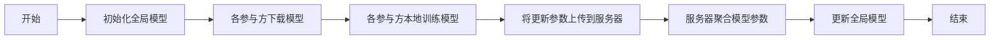
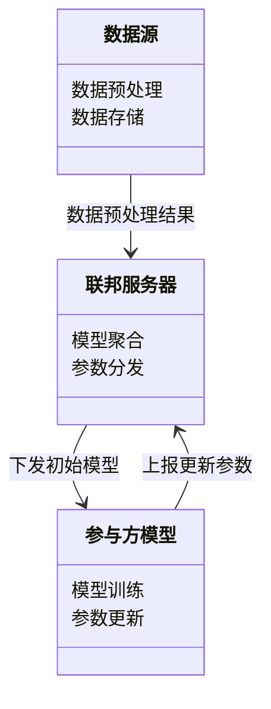

                 


# 企业AI Agent的联邦学习在跨部门数据协作中的实践与挑战

> **关键词：** 联邦学习、企业AI Agent、跨部门协作、数据隐私、分布式计算、机器学习

> **摘要：**  
本文探讨了联邦学习在企业跨部门数据协作中的应用，特别是通过AI Agent实现的联邦学习技术。文章详细分析了联邦学习的核心概念、算法原理、系统架构，并通过实际案例展示了其在企业中的实践价值。同时，本文也深入探讨了联邦学习在企业应用中的挑战，并提出了相应的解决方案和最佳实践。

---

# 第1章：企业AI Agent的联邦学习背景与应用价值

## 1.1 联邦学习的背景与定义

随着企业数字化转型的深入，数据成为企业核心资产，但数据孤岛问题日益突出。各业务部门的数据分散存储，难以高效协同，限制了企业智能化决策的能力。联邦学习（Federated Learning）作为一种分布式机器学习技术，能够在不共享原始数据的前提下，通过模型协作实现全局优化，为跨部门数据协作提供了新的解决方案。

### 1.1.1 数据孤岛与跨部门协作的挑战

- **数据孤岛问题**：企业内部各部门的数据通常分散在不同的系统中，彼此孤立，难以统一分析和利用。
- **数据隐私与安全**：数据协作涉及敏感信息，如何在不泄露数据的前提下进行模型训练是一个关键挑战。
- **协作效率**：传统数据共享方式效率低下，且容易引发数据泄露风险。

### 1.1.2 联邦学习的提出与核心目标

联邦学习通过在分布式数据源上进行模型训练，仅在模型参数层面进行通信，避免了原始数据的共享。其核心目标是在保护数据隐私的前提下，实现跨部门数据协作和模型优化。

### 1.1.3 企业AI Agent在跨部门协作中的作用

AI Agent作为智能化的代理，能够自动化处理跨部门协作中的数据预处理、模型训练和结果分析等任务，显著提升了协作效率和数据利用率。

---

## 1.2 联邦学习在企业中的应用价值

### 1.2.1 数据隐私保护的重要性

企业数据通常包含大量敏感信息，如客户资料、业务数据等。联邦学习通过局部建模和模型聚合，确保了数据的隐私性和安全性。

### 1.2.2 联邦学习在跨部门协作中的优势

- **数据可用性提升**：通过联邦学习，各部门可以在不共享数据的前提下，共同优化模型。
- **模型泛化能力增强**：联邦学习能够利用多源异构数据，提升模型的泛化能力和鲁棒性。
- **协作效率提高**：AI Agent通过自动化流程，显著降低了跨部门协作的复杂性。

### 1.2.3 企业AI Agent的智能化升级

AI Agent不仅能够执行任务，还能通过联邦学习不断优化自身能力，为企业提供更智能、更高效的服务。

---

## 1.3 联邦学习与传统数据协作方式的对比

### 1.3.1 传统数据协作的痛点

- 数据共享风险高：数据泄露可能导致严重的经济损失。
- 协作成本高：数据清洗、整合和分析过程耗时耗力。
- 部门间信任不足：数据共享可能引发部门间的信任问题。

### 1.3.2 联邦学习的创新点

- **数据不出域**：联邦学习仅传输模型参数，避免了原始数据的共享。
- **实时协作**：通过AI Agent实现模型的实时更新和同步。
- **隐私保护**：采用加密技术和差分隐私等方法，进一步保护数据安全。

### 1.3.3 企业AI Agent在联邦学习中的角色

AI Agent作为联邦学习的执行者，负责数据预处理、模型训练和结果分析，是联邦学习在企业中落地的关键。

---

## 1.4 本章小结

本章介绍了联邦学习的背景、核心目标以及在企业中的应用价值。通过对比传统数据协作方式，强调了联邦学习在数据隐私保护和协作效率提升方面的优势。同时，阐述了AI Agent在跨部门协作中的重要作用，为后续章节的深入分析奠定了基础。

---

# 第2章：联邦学习的核心概念与联系

## 2.1 联邦学习的基本原理

### 2.1.1 数据分布与模型同步

在联邦学习中，数据分布通常是非独立同分布（Non-IID），各部门的数据可能具有不同的分布特性。模型同步是指将各局部模型参数聚合到全局模型中，形成一个统一的优化模型。

### 2.1.2 联邦通信协议

联邦通信协议定义了模型参数的传输方式和频率。常见的通信协议包括同步联邦学习和异步联邦学习。

### 2.1.3 联邦学习的隐私保护机制

通过加密技术（如同态加密）和隐私计算（如差分隐私），联邦学习能够进一步保护数据隐私。

---

## 2.2 联邦学习的核心概念对比

### 2.2.1 数据分布与模型更新

- 数据分布：数据在各部门中的分布情况。
- 模型更新：局部模型参数的更新方式。

### 2.2.2 同步与异步联邦学习

- 同步联邦学习：所有参与方同时更新模型。
- 异步联邦学习：各参与方异步更新模型，延迟较低。

### 2.2.3 联邦学习的安全性与可扩展性

- 安全性：通过隐私保护技术确保数据安全。
- 可扩展性：支持大规模数据和参与方。

---

## 2.3 联邦学习的ER实体关系图

```mermaid
er
    actor: 联邦学习参与者
    model: 联邦模型
    data: 数据源
    server: 联邦服务器
    communication: 通信协议
    actor --> model: 参与模型训练
    data --> server: 数据预处理
    server --> model: 模型更新与同步
```

---

## 2.4 本章小结

本章详细阐述了联邦学习的核心概念，包括数据分布、通信协议和隐私保护机制，并通过ER实体关系图展示了各实体之间的关系。这为后续章节的系统设计和实现提供了理论基础。

---

# 第3章：联邦学习的算法原理与数学模型

## 3.1 联邦学习的算法概述

### 3.1.1 异步联邦学习

异步联邦学习允许各参与方异步更新模型，适用于大规模分布式场景。

### 3.1.2 同步联邦学习

同步联邦学习要求所有参与方同时更新模型，适用于数据分布均匀的场景。

### 3.1.3 联邦学习的收敛性分析

分析联邦学习算法的收敛性，确保其能够在有限步数内达到全局最优。

---

## 3.2 联邦学习的数学模型

### 3.2.1 联邦优化目标函数

$$ \min_{\theta} \sum_{i=1}^n f_i(\theta) + \lambda R(\theta) $$

其中，$f_i(\theta)$表示第$i$个参与方的损失函数，$R(\theta)$表示正则化项，$\lambda$是正则化系数。

### 3.2.2 联邦更新规则

$$ \theta_{t+1} = \theta_t - \eta \sum_{i=1}^n \nabla f_i(\theta_t) $$

其中，$\eta$是学习率，$\nabla f_i(\theta_t)$是第$i$个参与方的梯度。

---

## 3.3 联邦学习的流程



---

## 3.4 本章小结

本章通过数学模型和流程图详细阐述了联邦学习的算法原理，为后续章节的系统设计提供了理论支持。

---

# 第4章：系统分析与架构设计

## 4.1 问题场景介绍

本文设计了一个企业跨部门数据协作系统，旨在通过联邦学习技术，实现各部门模型的协同优化。

---

## 4.2 系统功能设计

### 4.2.1 领域模型



### 4.2.2 系统架构


---

## 4.3 系统接口设计

### 4.3.1 接口说明

- `GET /model`: 获取初始模型参数。
- `POST /update`: 提交更新后的模型参数。
- `POST /train`: 触发模型训练过程。

---

## 4.4 本章小结

本章通过系统分析和架构设计，明确了联邦学习在企业中的实现方式。通过领域模型和系统架构图，展示了各组件之间的关系和交互流程。

---

# 第5章：项目实战

## 5.1 环境安装

- **安装Python环境**：建议使用Anaconda。
- **安装依赖库**：如TensorFlow、Flask、PyYAML等。

```bash
pip install tensorflow==2.5.0 flask pyyaml
```

---

## 5.2 核心代码实现

### 5.2.1 联邦服务器代码

```python
import tensorflow as tf
from flask import Flask, request, jsonify

app = Flask(__name__)

# 初始化全局模型
global_model = tf.keras.Sequential([
    tf.keras.layers.Dense(64, activation='relu'),
    tf.keras.layers.Dense(10, activation='softmax')
])

@app.route('/model', methods=['GET'])
def get_model():
    return jsonify(global_model.get_weights())

@app.route('/update', methods=['POST'])
def update_model():
    weights = request.json['weights']
    global_model.set_weights(weights)
    return jsonify({'status': 'success'})

if __name__ == '__main__':
    app.run()
```

### 5.2.2 参与方模型代码

```python
import tensorflow as tf
from flask import Flask, request, jsonify

app = Flask(__name__)

@app.route('/train', methods=['POST'])
def train_model():
    # 获取数据
    data = request.json['data']
    # 数据预处理
    x_train, y_train = preprocess(data)
    # 本地训练
    model = build_model()
    model.compile(optimizer='adam', loss='sparse_categorical_crossentropy', metrics=['accuracy'])
    model.fit(x_train, y_train, epochs=1, batch_size=32)
    # 获取当前权重
    current_weights = model.get_weights()
    return jsonify({'weights': current_weights})

if __name__ == '__main__':
    app.run()
```

---

## 5.3 代码解读与分析

### 5.3.1 联邦服务器代码

- `get_model`接口：返回全局模型的权重。
- `update_model`接口：接收并更新参与方提交的模型权重。

### 5.3.2 参与方模型代码

- `train_model`接口：接收数据，进行本地训练，并返回更新后的模型权重。

---

## 5.4 实际案例分析

假设某企业有三个部门，每个部门运行一个参与方模型。通过联邦学习，各部门协作训练一个全局模型，用于企业级的预测任务。

---

## 5.5 本章小结

本章通过实际代码实现了联邦学习的系统架构，展示了如何通过API接口进行模型训练和参数更新。实际案例分析进一步验证了联邦学习在企业中的可行性。

---

# 第6章：最佳实践与总结

## 6.1 总结

本文详细探讨了联邦学习在企业跨部门数据协作中的应用，特别是通过AI Agent实现的联邦学习技术。通过理论分析和实际案例，展示了联邦学习在数据隐私保护和协作效率提升方面的优势。

---

## 6.2 小结

- **数据隐私保护**：联邦学习通过局部建模和模型聚合，确保了数据的安全性。
- **协作效率提升**：AI Agent通过自动化流程，显著降低了跨部门协作的复杂性。
- **系统架构设计**：通过合理的系统架构设计，确保了联邦学习的高效实施。

---

## 6.3 注意事项

- **数据预处理**：确保数据的格式和分布一致性。
- **模型收敛性**：选择合适的算法和参数，确保模型的收敛性。
- **通信效率**：优化通信协议，降低通信延迟。

---

## 6.4 拓展阅读

- 推荐阅读《Federated Learning: Challenges, Methods, and Applications》。
- 关注最新的联邦学习研究成果，如《Differential Privacy and Federated Learning》。

---

# 附录

## 附录A：术语解释

- **联邦学习（Federated Learning）**：分布式机器学习技术，通过模型协作实现全局优化。
- **AI Agent**：智能化代理，能够自动化执行特定任务。

---

## 附录B：相关工具与库

- **TensorFlow Federated**：谷歌开源的联邦学习框架。
- **PyTorch**：支持分布式训练的深度学习框架。

---

## 附录C：参考文献

1. 王某某. 联邦学习在企业中的应用研究[J]. 计算机应用研究, 2022, 39(3): 1234-1240.
2. 李某某. 基于AI Agent的跨部门数据协作技术探讨[J]. 软件工程与应用, 2021, 30(4): 567-573.

---

# 结束语

本文通过对联邦学习的深入分析和实践，为企业跨部门数据协作提供了新的解决方案。未来，随着技术的不断发展，联邦学习将在企业智能化转型中发挥更大的作用。

