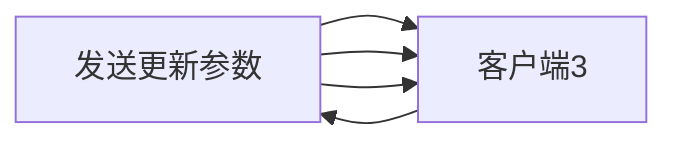
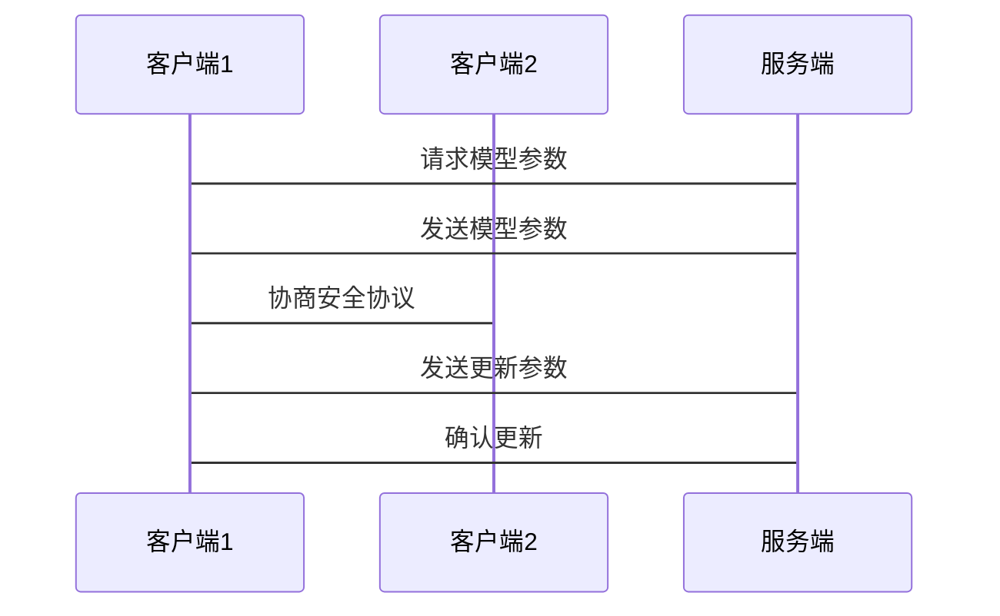

                 


# 企业AI Agent的联邦学习安全协议设计

> 关键词：联邦学习，AI Agent，安全协议，数据隐私，模型安全，信任机制

> 摘要：  
> 本文深入探讨了企业AI Agent在联邦学习环境下的安全协议设计。通过分析联邦学习的核心概念、安全挑战以及AI Agent的独特需求，提出了基于联邦学习的安全协议框架。文章从算法原理、系统架构、项目实战等多个维度展开，结合实际案例和数学模型，详细阐述了如何在企业级AI Agent中实现联邦学习的安全协议设计。文章最后总结了设计中的关键点和未来研究方向，为相关领域的研究和实践提供了有价值的参考。

---

# 第一部分: 企业AI Agent的联邦学习安全协议概述

## 第1章: 联邦学习与AI Agent的背景介绍

### 1.1 联邦学习的基本概念

#### 1.1.1 数据孤岛与联邦学习的提出  
在企业环境中，数据通常分散在不同的部门、业务单元或合作伙伴之间，形成“数据孤岛”。由于数据隐私和安全的限制，直接汇总数据进行模型训练往往不可行。联邦学习（Federated Learning）作为一种分布式机器学习方法，通过在数据源端进行模型训练，避免了数据集中化，从而解决了数据孤岛问题。

#### 1.1.2 联邦学习的核心特点  
- **数据不出域**：数据在本地进行处理，只传输模型参数或中间结果。  
- **分布式协作**：多个参与方协作训练共享模型，同时保护各自数据隐私。  
- **高效性**：通过并行计算和优化算法，确保训练效率。  

#### 1.1.3 联邦学习的应用场景  
- **金融行业**：客户画像、风险评估。  
- **医疗行业**：患者数据隐私保护下的疾病预测。  
- **智能制造**：设备数据分散情况下的质量检测。  

### 1.2 AI Agent的基本概念

#### 1.2.1 AI Agent的定义与特点  
AI Agent是一种能够感知环境、自主决策并执行任务的智能实体。它具有以下特点：  
- **自主性**：无需外部干预，自主完成任务。  
- **反应性**：能够实时感知环境变化并调整行为。  
- **协作性**：能够与其他AI Agent或人类进行协作。  

#### 1.2.2 AI Agent在企业中的应用  
- **智能客服**：通过自然语言处理提供个性化服务。  
- **自动化运维**：自动监控和修复系统故障。  
- **智能决策支持**：基于数据分析提供决策建议。  

#### 1.2.3 联邦学习与AI Agent的结合  
AI Agent可以通过联邦学习技术，在不共享原始数据的情况下，协作训练共享模型，提升决策能力和数据利用率。  

### 1.3 本章小结  
本章介绍了联邦学习和AI Agent的基本概念，并探讨了它们在企业环境中的结合方式。联邦学习通过数据不出域的方式解决了数据隐私问题，而AI Agent则为联邦学习的应用提供了智能化的执行载体。

---

## 第2章: 联邦学习安全协议的核心概念与联系

### 2.1 联邦学习的安全挑战

#### 2.1.1 数据隐私保护  
联邦学习的核心目标之一是保护参与方的数据隐私。通过加密、差分隐私等技术，确保模型训练过程中数据不会被泄露。  

#### 2.1.2 模型安全威胁  
模型可能受到攻击者通过恶意输入或数据投毒等方式干扰，导致模型性能下降或泄露数据分布信息。  

#### 2.1.3 联邦学习中的信任问题  
由于参与方可能存在利益冲突，如何建立信任机制，确保各方按约定执行协议是关键。  

### 2.2 AI Agent的安全协议设计

#### 2.2.1 安全协议的目标与原则  
- **目标**：保护数据隐私、确保模型安全、建立信任机制。  
- **原则**：最小权限原则、可追溯性原则、透明性原则。  

#### 2.2.2 安全协议的实现机制  
- **数据加密**：使用同态加密或秘密分享技术保护数据。  
- **模型验证**：通过零知识证明验证模型的正确性。  
- **权限管理**：基于角色的访问控制（RBAC）管理数据访问权限。  

#### 2.2.3 安全协议的评估标准  
- **安全性**：防止数据泄露和模型被攻击的能力。  
- **效率性**：协议对联邦学习性能的影响。  
- **可扩展性**：协议是否适用于大规模分布式环境。  

### 2.3 联邦学习与AI Agent的安全协议对比

#### 2.3.1 联邦学习协议的分类  
- **横向联邦学习**：适用于数据特征相同但样本不同的场景。  
- **纵向联邦学习**：适用于数据特征不同但样本相同的场景。  
- **混合联邦学习**：结合横向和纵向的特点。  

#### 2.3.2 AI Agent协议的特点  
- **自主性**：AI Agent能够自主选择是否参与协议。  
- **动态性**：协议可以根据环境变化自适应调整。  
- **协作性**：AI Agent之间可以动态协作，确保协议执行。  

#### 2.3.3 两者的联系与区别  
| 特性 | 联邦学习协议 | AI Agent协议 |
|------|--------------|--------------|
| 数据共享方式 | 基于模型参数或中间结果 | 基于任务需求，数据可选择共享 |
| 协作机制 | 静态协作，参与方固定 | 动态协作，参与方可变化 |
| 安全机制 | 侧重数据隐私保护 | 侧重任务目标导向的安全性 |

### 2.4 本章小结  
本章分析了联邦学习和AI Agent的安全协议设计，提出了适用于企业AI Agent的联邦学习安全协议框架，并通过对比分析明确了两者的异同点。

---

## 第3章: 联邦学习安全协议的算法原理

### 3.1 联邦学习的算法原理

#### 3.1.1 联邦平均算法  
**联邦平均**（Federated Averaging，FedAvg）是联邦学习中最常用的算法之一，其核心思想是通过迭代更新模型参数，使得各参与方的模型参数趋近于一致。  

##### 算法流程  
```mermaid
graph TD
    A[客户端A] --> C[协调器]
    B[客户端B] --> C
    C --> A, B
    A --> C[发送更新参数]
    B --> C[发送更新参数]
    C --> A, B[发送全局参数]
```

##### 数学模型  
$$ \theta_{t+1} = \frac{1}{n}\sum_{i=1}^{n}\theta_i^{(t)} $$  
其中，$\theta_i^{(t)}$ 表示第 $i$ 个客户端在第 $t$ 轮的模型参数，$n$ 是客户端总数。  

#### 3.1.2 同态加密算法  
**同态加密**（Homomorphic Encryption）允许在加密数据上直接进行计算，而无需解密。  

##### 应用场景  
- 数据隐私保护：在加密状态下进行模型训练。  
- 安全多方计算：多个参与方在加密数据上协作计算。  

#### 3.1.3 差分隐私保护  
**差分隐私**（Differential Privacy）通过在数据中添加噪声，确保单个样本对最终结果的影响可以忽略。  

##### 差分隐私的实现  
$$ P(Q(D) = y) \leq P(Q(D') = y) + \epsilon $$  
其中，$\epsilon$ 是隐私预算，控制隐私泄露的程度。  

---

## 第4章: 联邦学习安全协议的系统架构设计

### 4.1 企业级AI Agent联邦学习平台的设计

#### 4.1.1 系统功能模块设计  
- **数据预处理模块**：对数据进行清洗、特征提取。  
- **模型训练模块**：负责模型的初始化、迭代更新。  
- **安全协议模块**：实现数据加密、模型验证等功能。  
- **交互控制模块**：管理客户端与服务器之间的通信。  

#### 4.1.2 系统架构设计  


#### 4.1.3 系统交互流程设计  


---

## 第5章: 项目实战

### 5.1 环境安装

```bash
pip install -r requirements.txt
```

### 5.2 核心代码实现

#### 5.2.1 安全协议实现  
```python
def secure_aggregate(clients, epsilon=0.1):
    # 添加差分隐私噪声
    noise = np.random.laplace(0, epsilon)
    return {key: sum(value + noise for value in clients[key]) / len(clients) for key in clients}
```

#### 5.2.2 联邦学习实现  
```python
class FederatedLearning:
    def __init__(self, clients, model):
        self.clients = clients
        self.model = model

    def train(self, rounds=10):
        for _ in range(rounds):
            for client in self.clients:
                client.update_model(self.model.get_params())
            self.model.set_params(secure_aggregate(self.clients))
```

### 5.3 案例分析与实现解读  
以一个简单的线性回归模型为例，通过代码实现联邦学习的训练过程，并验证安全协议的有效性。  

---

## 第6章: 最佳实践与总结

### 6.1 最佳实践 tips  
- **数据隐私保护**：优先采用同态加密和差分隐私技术。  
- **模型安全验证**：定期进行模型验证，防止数据投毒攻击。  
- **协议可扩展性**：设计灵活的协议框架，适应不同业务场景。  

### 6.2 本章小结  
本文从联邦学习和AI Agent的基本概念出发，详细分析了安全协议的设计原理和实现方法，结合实际案例进行了验证。未来的研究方向包括更高效的安全协议设计和多模态数据的安全协作。

---

# 结语  
企业AI Agent的联邦学习安全协议设计是一项复杂但极具挑战性的任务。通过本文的分析，我们不仅能够理解其核心原理，还能为实际应用提供有价值的参考和指导。

