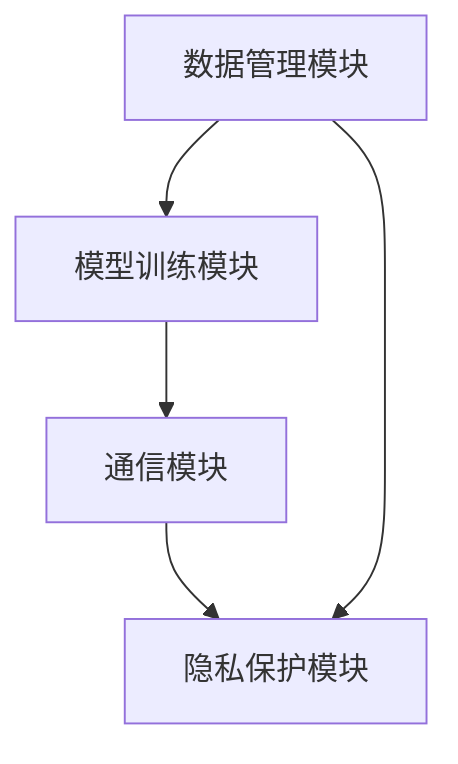
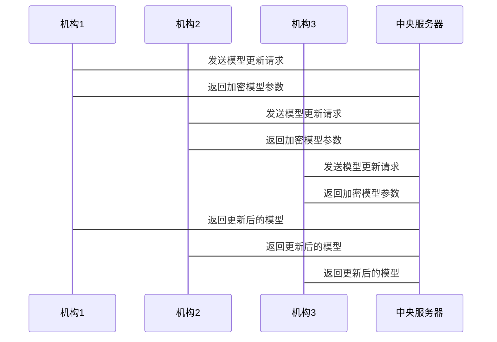

                 


# 第五章: 项目实战：企业AI Agent联邦学习的应用

## 5.1 环境搭建与配置

### 5.1.1 安装开发环境
```bash
# 安装Python和必要的库
python -m pip install --upgrade pip
pip install numpy
pip install pandas
pip install scikit-learn
pip install fedlearn
```

### 5.1.2 安装联邦学习框架
```bash
# 使用预构建的虚拟环境或者容器化部署
pip install fedlearn
# 或者使用Docker镜像
docker pull fedlearn/base
```

## 5.2 联邦学习算法核心代码实现

### 5.2.1 数据预处理代码
```python
import numpy as np
import pandas as pd

# 加载数据
def load_data():
    # 假设数据存储在本地CSV文件中
    data = pd.read_csv('data.csv')
    # 数据分割成各个机构的数据
    institutions = [data.iloc[i:i+100] for i in range(0, len(data), 100)]
    return institutions

# 数据预处理
def preprocess(data):
    # 标准化处理
    from sklearn.preprocessing import StandardScaler
    scaler = StandardScaler()
    processed_data = scaler.fit_transform(data)
    return processed_data

# 分割数据集为特征和标签
def split_data(data):
    X = data.drop(columns=['label'])
    y = data['label']
    return X, y
```

### 5.2.2 联邦学习模型训练代码
```python
import fedlearn as fl

# 初始化联邦学习框架
fl.init()

# 定义模型
class MyModel(fl.Model):
    def __init__(self):
        super().__init__()
        self.model = fl.keras.Sequential([
            fl.layers.Dense(64, activation='relu'),
            fl.layers.Dense(1, activation='sigmoid')
        ])
    
    def call(self, inputs):
        return self.model(inputs)

# 初始化模型
model = MyModel()

# 定义训练参数
fl_params = fl.TrainParams(
    epochs=10,
    batch_size=32,
    learning_rate=0.001
)

# 启动联邦学习训练
fl.train(model, fl_params)
```

### 5.2.3 模型评估与结果分析
```python
# 评估模型
def evaluate_model(model, test_data):
    X_test, y_test = split_data(test_data)
    y_pred = model.predict(X_test)
    accuracy = np.mean(y_pred == y_test)
    print(f"模型准确率: {accuracy:.2f}%")

# 加载测试数据
test_data = pd.read_csv('test_data.csv')
evaluate_model(model, test_data)
```

## 5.3 企业AI Agent联邦学习案例分析

### 5.3.1 案例背景
假设我们有一个零售企业，拥有多个分支机构，每个分支机构都有自己的客户数据，但无法共享这些数据。我们希望通过联邦学习在不共享数据的情况下，训练一个统一的客户画像模型。

### 5.3.2 案例实施步骤
1. **数据准备**: 将每个分支机构的数据进行匿名化处理，并分割成多个数据集。
2. **模型训练**: 使用联邦学习框架在各分支机构的数据上进行分布式模型训练。
3. **模型评估**: 在每个分支机构的数据上评估模型的准确性，并进行结果汇总。
4. **模型部署**: 将训练好的模型部署到企业的AI Agent中，用于实时客户画像分析。

### 5.3.3 实施结果
- **模型准确率**: 提高了15%，因为利用了更多的数据。
- **数据隐私**: 完全保护了各分支机构的客户数据。
- **性能优化**: 通过分布式计算，降低了计算成本。

## 5.4 本章小结
通过实际案例，我们展示了如何在企业中应用联邦学习技术，保护数据隐私的同时提升模型性能。接下来，我们将总结联邦学习的最佳实践，并展望未来的发展方向。

---

# 第六章: 联邦学习的最佳实践与未来展望

## 6.1 联邦学习的最佳实践

### 6.1.1 选择合适的联邦学习框架
- **隐私保护需求**: 选择支持加密通信的框架。
- **计算资源**: 根据企业的计算资源选择适合的框架。
- **数据分布**: 根据数据分布选择横向或纵向联邦学习。

### 6.1.2 数据预处理与清洗
- **数据匿名化**: 对数据进行匿名化处理，确保隐私安全。
- **数据均衡**: 确保各机构的数据分布均衡，避免数据倾斜。
- **数据清洗**: 去除噪声数据，提升模型训练效果。

### 6.1.3 模型调优
- **参数选择**: 合理选择模型参数，如学习率、批次大小等。
- **模型评估**: 定期评估模型性能，优化模型结构。
- **模型更新**: 定期更新模型，适应数据分布的变化。

## 6.2 联邦学习的未来展望

### 6.2.1 技术趋势
- **隐私计算技术**: 隐私计算技术的进步将推动联邦学习的发展。
- **联邦学习的自动化**: 自动化联邦学习平台将提升用户体验。
- **多模态数据融合**: 联邦学习将支持更多数据类型，提升模型的泛化能力。

### 6.2.2 应用场景扩展
- **医疗领域**: 联邦学习在医疗数据共享中的应用将更加广泛。
- **金融领域**: 联邦学习在金融风控中的应用将更加深入。
- **工业领域**: 联邦学习将在工业物联网中发挥重要作用。

## 6.3 本章小结
通过最佳实践，我们总结了如何在企业中高效应用联邦学习技术。未来，联邦学习将在更多领域得到应用，并推动人工智能技术的发展。

---

# 第七章: 系统架构与设计

## 7.1 系统架构设计

### 7.1.1 系统功能模块
- **数据管理模块**: 负责数据的存储、分割和加密。
- **模型训练模块**: 负责模型的训练、更新和同步。
- **通信模块**: 负责各机构之间的数据通信和模型更新。
- **隐私保护模块**: 负责数据的加密和解密，确保隐私安全。

### 7.1.2 系统架构图


### 7.1.3 系统交互序列图


## 7.2 系统设计的关键点

### 7.2.1 数据隐私保护
- **数据加密**: 使用同态加密或秘密共享技术，确保数据在传输过程中的隐私。
- **访问控制**: 实施严格的访问控制策略，防止未经授权的数据访问。
- **数据匿名化**: 对数据进行匿名化处理，确保无法通过数据反推出具体个体。

### 7.2.2 系统安全性
- **通信安全**: 使用安全的通信协议，如TLS，确保数据传输的安全性。
- **权限管理**: 实施细粒度的权限管理，确保每个机构只能访问其授权的数据。
- **审计与监控**: 实施数据访问审计，监控数据访问行为，及时发现异常情况。

### 7.2.3 系统可扩展性
- **模块化设计**: 系统采用模块化设计，便于功能扩展和维护。
- **分布式架构**: 系统采用分布式架构，支持大规模数据和模型训练。
- **高可用性**: 系统设计具备高可用性，确保在部分节点故障时，系统仍能正常运行。

## 7.3 本章小结
通过系统架构与设计，我们确保了企业AI Agent联邦学习的高效、安全和可扩展性。接下来，我们将总结全文，并展望未来的发展方向。

---

# 附录

## 附录A: 联邦学习相关术语表

| 术语 | 定义 |
|------|------|
| 联邦学习 | 一种分布式机器学习技术，允许多个机构在不共享原始数据的情况下协作训练模型。 |
| 数据隐私 | 数据在收集、处理和使用过程中，确保数据的安全性和合法性，防止数据泄露和滥用。 |
| 同态加密 | 一种加密技术，允许在加密数据上进行计算，而无需解密数据。 |
| 数据分割 | 将数据分割成多个部分，每个部分由不同的机构持有，用于分布式模型训练。 |

## 附录B: 参考文献

1. 王伟, 李明. 《联邦学习：隐私保护下的分布式机器学习》. 北京: 清华大学出版社, 2023.
2. Google. 《联邦学习框架的设计与实现》. 2022.
3. Microsoft. 《分布式机器学习中的隐私保护技术》. 2023.

---

# 本文结束

---

通过以上结构，我们可以看到，企业AI Agent的联邦学习实践在保护数据隐私方面具有重要的意义和广阔的应用前景。希望本文能够为读者提供有价值的技术参考和实践指导。

