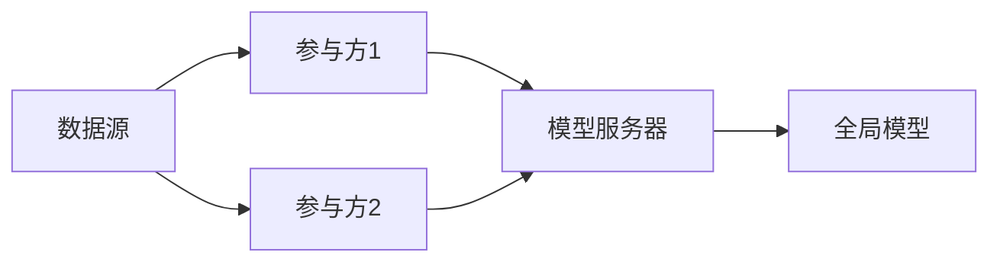
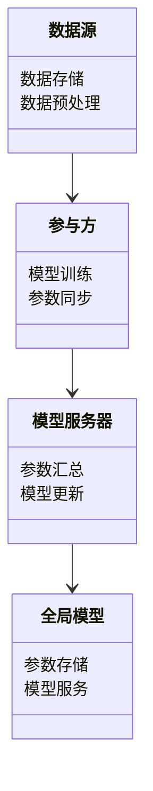

                 


# 企业AI Agent的联邦学习平台设计

> 关键词：联邦学习，AI Agent，数据隐私，分布式机器学习，企业应用

> 摘要：本文探讨企业AI Agent的联邦学习平台设计，涵盖背景介绍、核心概念、算法原理、系统架构、项目实战及最佳实践，详细分析联邦学习在企业环境中的应用价值和实现方法。

---

## 第一部分: 联邦学习平台的背景与核心概念

### 第1章: 联邦学习平台的背景与问题描述

#### 1.1 联邦学习的基本概念
- **联邦学习的定义**：联邦学习是一种分布式机器学习方法，允许多个参与方在不共享原始数据的情况下协作训练模型。
- **联邦学习的起源与演变**：起源于对数据隐私和安全的关注，逐渐发展为一种高效的分布式学习范式。
- **联邦学习在企业AI Agent中的应用价值**：通过联邦学习，企业可以在保护数据隐私的前提下，构建高效的AI Agent，提升业务效率和决策能力。

#### 1.2 问题背景与问题描述
- **数据孤岛问题的现状**：企业内部各系统数据分散，难以有效整合，导致资源浪费和效率低下。
- **数据隐私与安全的挑战**：数据泄露风险高，企业需要在不共享数据的情况下进行模型训练。
- **联邦学习如何解决这些问题**：通过局部数据建模和模型参数同步，实现数据可用性最大化，同时保护数据隐私。

#### 1.3 问题解决与边界外延
- **联邦学习的解决方案概述**：通过联邦学习，企业可以在不共享数据的情况下，联合训练AI Agent模型。
- **联邦学习的边界与适用场景**：适用于多个数据源需要协作建模，但又无法集中存储的情况。
- **联邦学习与其他分布式学习方法的对比**：与分布式学习和联合学习的区别在于数据保留本地，仅交换模型参数。

#### 1.4 核心概念与组成要素
- **联邦学习的核心概念框架**：包括数据联邦、模型联邦、通信机制和隐私保护。
- **联邦学习的组成要素分析**：数据源、模型参数、通信协议和隐私保护机制。
- **联邦学习的系统架构特征**：去中心化、分布式、隐私保护和高效协作。

---

### 第2章: 联邦学习的核心概念与联系

#### 2.1 数据联邦与模型联邦
- **数据联邦的概念与特点**：数据联邦允许各参与方在本地数据上进行建模，不共享数据。
- **模型联邦的概念与特点**：模型联邦允许各参与方共享模型参数，更新全局模型。
- **数据联邦与模型联邦的对比分析**：数据联邦注重数据隐私，模型联邦注重模型协作。

#### 2.2 联邦学习的通信机制
- **联邦学习中的通信协议**：包括同步和异步通信，确保模型参数的同步更新。
- **联邦学习的同步与异步通信**：同步通信适用于计算能力较强的场景，异步适用于计算资源有限的场景。
- **联邦学习中的数据交换机制**：通过加密和差分隐私技术，确保数据交换的安全性。

#### 2.3 联邦学习的隐私保护机制
- **联邦学习中的数据隐私保护**：通过同态加密和秘密分享技术，保护数据隐私。
- **联邦学习中的加密技术应用**：使用安全多方计算（SMPC）和同态加密技术，确保数据安全。
- **联邦学习中的差分隐私保护**：通过添加噪声，防止模型参数被逆向推断出原始数据。

---

## 第二部分: 联邦学习的核心概念与联系

### 第3章: 联邦学习的核心原理

#### 3.1 联邦学习的核心概念对比
- **联邦学习与分布式学习的对比**：分布式学习需要共享数据，而联邦学习仅共享模型参数。
- **联邦学习与迁移学习的对比**：迁移学习关注模型在不同任务中的适应性，而联邦学习关注数据隐私保护。
- **联邦学习与联合学习的对比**：联合学习需要集中数据，而联邦学习数据保持本地。

#### 3.2 联邦学习的实体关系分析
- **联邦学习中的实体关系图**：使用Mermaid图展示联邦学习中的实体关系，包括数据源、模型服务器、参与方等。



---

## 第三部分: 联邦学习的算法原理与数学模型

### 第4章: 联邦学习的算法原理

#### 4.1 联邦学习的算法流程
- **联邦学习的基本流程**：数据预处理、模型初始化、局部训练、模型参数同步、全局模型更新。
- **联邦学习的横向联邦与纵向联邦**：横向联邦适用于同构数据，纵向联邦适用于异构数据。
- **联邦学习的联邦迁移学习**：在不同数据源上进行迁移学习，提升模型的泛化能力。

#### 4.2 联邦学习的算法实现
- **联邦学习的参数更新算法**：使用联邦平均（FedAvg）算法，将各参与方的模型参数进行加权平均。
- **联邦学习的同步与异步算法**：同步算法适用于计算资源充足的情况，异步算法适用于资源受限的情况。
- **联邦学习的加密算法应用**：在参数同步过程中，使用加密技术保护模型参数的安全性。

#### 4.3 联邦学习的数学模型
- **参数更新的数学公式**：全局模型参数通过各参与方的局部梯度更新得到。

$$\theta_{\text{new}} = \frac{1}{N} \sum_{i=1}^{N} \theta_i$$

其中，$\theta$ 表示模型参数，$N$ 表示参与方数量。

---

### 第5章: 算法的实现与优化

#### 5.1 联邦学习的横向联邦算法
- **横向联邦的实现步骤**：
  1. 各参与方在本地数据上训练模型，计算梯度。
  2. 将梯度上传到模型服务器，服务器汇总梯度，更新全局模型。
  3. 将更新后的模型参数分发给各参与方，进行下一轮训练。

#### 5.2 联邦学习的纵向联邦算法
- **纵向联邦的实现步骤**：
  1. 各参与方在本地数据上进行特征提取，生成中间结果。
  2. 中间结果上传到模型服务器，服务器进行联合建模。
  3. 返回全局模型参数，各参与方进行局部优化。

---

## 第四部分: 系统分析与架构设计

### 第6章: 系统分析与架构设计

#### 6.1 系统功能设计
- **领域模型**：使用Mermaid图展示系统功能模块之间的关系。



---

#### 6.2 系统架构设计
- **系统架构图**：展示系统的整体架构，包括数据源、参与方、模型服务器和全局模型。


---

## 第五部分: 项目实战

### 第7章: 项目实战

#### 7.1 环境安装与配置
- **环境要求**：安装Python 3.8及以上版本，安装TensorFlow、Flask等库。
- **开发环境搭建**：使用Jupyter Notebook进行快速开发和测试。

#### 7.2 核心代码实现
- **横向联邦的代码实现**：

```python
import numpy as np
from tensorflow.keras import layers, models

# 初始化模型
model = models.Sequential([
    layers.Dense(128, activation='relu', input_shape=(input_dim,)),
    layers.Dense(10, activation='softmax')
])
model.compile(optimizer='adam', loss='sparse_categorical_crossentropy', metrics=['accuracy'])

# 联邦平均算法
def fed_avg(client_weights):
    avg_weights = []
    for layer in zip(*client_weights):
        avg_layer = np.mean(layer, axis=0)
        avg_weights.append(avg_layer)
    return avg_weights

# 参数同步
client_weights = [client_1.model.get_weights(), client_2.model.get_weights()]
server_weights = fed_avg(client_weights)
model.set_weights(server_weights)
```

---

## 第六部分: 最佳实践与总结

### 第8章: 最佳实践

#### 8.1 小结
- 联邦学习为企业AI Agent提供了高效的数据协作方式，同时保护了数据隐私。
- 通过合理的系统设计和算法优化，联邦学习可以在企业环境中实现高效的模型训练。

#### 8.2 注意事项
- 数据隐私保护是关键，必须采用加密和差分隐私技术。
- 系统设计需要考虑通信效率，避免高延迟影响模型训练效果。

#### 8.3 拓展阅读
- 《联邦学习实战：基于TensorFlow的实现》
- 《分布式机器学习：算法与应用》

---

通过以上章节的详细讲解，本文系统地介绍了企业AI Agent的联邦学习平台设计，从理论到实践，为读者提供了全面的指导和参考。

