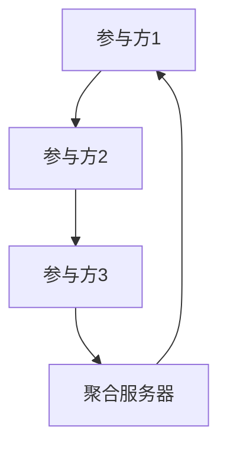
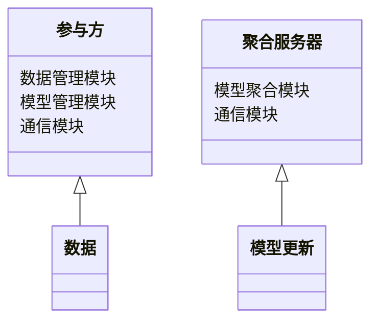
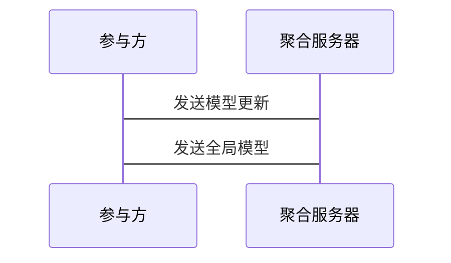
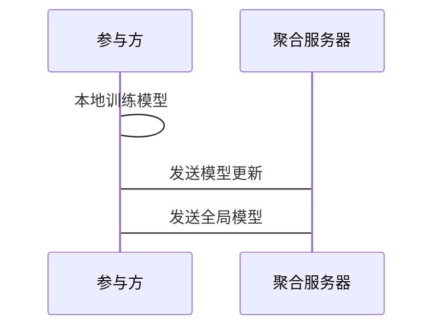

                 


# 企业AI Agent的联邦学习应用：数据隐私保护

> 关键词：联邦学习，数据隐私保护，企业AI Agent，分布式机器学习，隐私计算

> 摘要：本文深入探讨了企业AI Agent在联邦学习中的应用，重点分析了数据隐私保护的技术原理和实现方法。通过结合联邦学习的核心概念、算法原理和系统设计，本文详细阐述了如何在企业环境中实现数据隐私保护，同时保持AI Agent的高效协作和模型性能。

---

# 1. 企业AI Agent的联邦学习概述

## 1.1 联邦学习的基本概念

### 1.1.1 联邦学习的定义

联邦学习（Federated Learning，FL）是一种分布式机器学习技术，允许多个参与方在不共享原始数据的情况下，协作训练一个全局模型。其核心思想是“数据不动，模型动”，即数据保留在本地，仅交换模型更新信息。

### 1.1.2 联邦学习的核心特点

- **数据本地性**：数据无需集中到中央服务器，仅在本地进行处理。
- **隐私保护**：通过模型更新信息的交换，避免直接传输原始数据。
- **分布式协作**：多个参与方协作训练，形成一个全局模型。

### 1.1.3 数据隐私保护的重要性

在企业环境中，数据往往涉及商业机密、用户隐私等敏感信息。通过联邦学习，可以在不泄露原始数据的情况下，共同提升AI模型的性能。

---

## 1.2 企业AI Agent的背景与需求

### 1.2.1 企业AI Agent的定义

企业AI Agent是一种智能代理，能够自主感知环境、执行任务并优化决策。它通常部署在企业内部，用于数据分析、流程自动化、客户交互等场景。

### 1.2.2 企业AI Agent的应用场景

- **客户行为分析**：通过联邦学习，多个部门可以协作分析客户行为数据，提升预测准确性。
- **供应链优化**：各供应商协同训练模型，优化供应链效率。
- **欺诈 detection**：多个金融机构协作训练模型，提升反欺诈能力。

### 1.2.3 数据隐私保护的挑战与需求

企业AI Agent的广泛应用带来了数据隐私保护的挑战，特别是在跨机构协作时。联邦学习为企业提供了一种解决方案，可以在保护数据隐私的前提下，实现模型的联合训练。

---

## 1.3 联邦学习在企业AI Agent中的作用

### 1.3.1 联邦学习与企业AI Agent的结合

通过联邦学习，企业AI Agent可以在不共享原始数据的情况下，与其他机构协作训练模型。这种协作模式既保护了数据隐私，又提升了模型性能。

### 1.3.2 联邦学习如何解决数据隐私问题

- **数据加密传输**：通过加密技术确保模型更新信息在传输过程中的安全性。
- **差分隐私**：在模型更新过程中加入噪声，防止敏感信息泄露。
- **同态加密**：支持对加密数据进行计算，确保数据隐私。

### 1.3.3 联邦学习的优势与局限性

**优势**：
- 保护数据隐私。
- 支持多方协作。
- 提高模型泛化能力。

**局限性**：
- 通信成本较高。
- 模型收敛速度可能较慢。
- 需要复杂的协议设计。

---

## 1.4 本章小结

本章介绍了联邦学习的基本概念、核心特点以及在企业AI Agent中的作用。通过对比传统机器学习和联邦学习，我们明确了联邦学习在数据隐私保护方面的优势，同时也指出了其局限性。

---

# 2. 联邦学习的核心概念与原理

## 2.1 联邦学习的通信机制

### 2.1.1 数据交换与模型更新

在联邦学习中，参与方通过交换模型更新信息来协作训练。具体流程如下：

1. **初始化**：所有参与方初始化本地模型。
2. **本地训练**：各参与方在本地数据上训练模型，生成梯度或模型更新。
3. **模型聚合**：将各参与方的模型更新聚合，生成新的全局模型。
4. **模型分发**：将更新后的全局模型分发给各参与方。

### 2.1.2 联邦学习的同步与异步模式

- **同步模式**：所有参与方同时进行训练和模型更新。
- **异步模式**：参与方可以异步更新模型，减少通信开销。

### 2.1.3 通信协议的选择与设计

通信协议设计需要考虑以下因素：
- 数据传输的加密方式。
- 模型更新的同步机制。
- 通信效率的优化策略。

---

## 2.2 联邦学习的隐私保护技术

### 2.2.1 数据加密与匿名化

- **数据加密**：通过加密技术保护数据在传输过程中的安全性。
- **数据匿名化**：通过脱敏处理，去除敏感信息。

### 2.2.2 差分隐私与同态加密

- **差分隐私**：在模型更新过程中加入噪声，防止敏感信息泄露。
- **同态加密**：支持对加密数据进行计算，确保数据隐私。

### 2.2.3 联邦学习中的隐私保护策略

- **角色分离**：明确参与方的角色，限制数据访问权限。
- **访问控制**：通过访问控制策略，确保只有授权参与方能够访问模型更新信息。

---

## 2.3 联邦学习与传统机器学习的对比

### 2.3.1 数据使用方式的对比

- **传统机器学习**：需要集中所有数据进行训练。
- **联邦学习**：仅交换模型更新信息，不共享原始数据。

### 2.3.2 模型训练过程的对比

- **传统机器学习**：模型训练过程集中在一个服务器上。
- **联邦学习**：模型训练过程分布在整个网络中。

### 2.3.3 隐私保护效果的对比

- **传统机器学习**：数据集中化，隐私风险高。
- **联邦学习**：数据分散，隐私保护效果更好。

---

## 2.4 本章小结

本章详细介绍了联邦学习的核心概念与原理，包括通信机制、隐私保护技术以及与传统机器学习的对比。通过对比分析，我们明确了联邦学习在数据隐私保护方面的优势。

---

# 3. 联邦学习的算法原理

## 3.1 联邦学习的数学模型与算法

### 3.1.1 分布式优化的数学表达

假设我们有 $N$ 个参与方，每个参与方的数据集为 $D_i$，其中 $i \in [1, N]$。全局模型参数为 $\theta$，目标是最小化如下损失函数：

$$ L(\theta) = \sum_{i=1}^N \frac{1}{N} L_i(\theta) $$

其中 $L_i(\theta)$ 是第 $i$ 个参与方的损失函数。

### 3.1.2 联邦学习的损失函数

全局损失函数可以表示为：

$$ L(\theta) = \frac{1}{N} \sum_{i=1}^N L_i(\theta) $$

每个参与方在本地计算梯度：

$$ g_i = \nabla_{\theta} L_i(\theta) $$

全局梯度为各参与方梯度的平均值：

$$ g = \frac{1}{N} \sum_{i=1}^N g_i $$

模型更新为：

$$ \theta = \theta - \eta g $$

其中 $\eta$ 是学习率。

### 3.1.3 联邦学习的聚合函数

常见的聚合函数包括：

- **平均法**：取所有参与方梯度的平均值。
- **加权法**：根据参与方的数据量或贡献度赋予不同的权重。

---

## 3.2 联邦学习的算法流程

### 3.2.1 数据预处理与分割

将数据划分为多个本地数据集，每个参与方负责一个数据集。

### 3.2.2 模型初始化与训练

1. 初始化模型参数 $\theta$。
2. 每个参与方在本地数据上训练模型，生成梯度 $g_i$。
3. 将梯度 $g_i$ 发送给聚合服务器。
4. 聚合服务器计算全局梯度 $g$，并更新模型参数 $\theta$。
5. 将更新后的 $\theta$ 分发给所有参与方。

### 3.2.3 模型更新与同步

模型更新过程需要考虑以下几点：
- 梯度传输的加密方式。
- 模型更新的同步机制。
- 通信效率的优化策略。

---

## 3.3 联邦学习的通信协议设计

### 3.3.1 数据传输的加密方式

常用的加密方式包括：
- **AES加密**：用于数据块加密。
- **RSA加密**：用于密钥交换。

### 3.3.2 模型更新的同步机制

- **同步模式**：所有参与方同时进行训练和更新。
- **异步模式**：参与方可以异步更新模型，减少通信开销。

### 3.3.3 通信效率的优化策略

- **局部聚合**：多个参与方先在本地进行小规模的模型聚合，再将结果发送给全局聚合服务器。
- **分层架构**：通过分层架构减少通信次数。

---

## 3.4 本章小结

本章详细讲解了联邦学习的数学模型与算法流程，包括分布式优化的数学表达、损失函数的计算以及聚合函数的设计。同时，我们还讨论了通信协议的设计，确保模型更新过程的安全性和高效性。

---

# 4. 企业AI Agent的联邦学习系统设计

## 4.1 系统功能模块设计

### 4.1.1 数据管理模块

- **数据预处理**：对数据进行清洗、归一化等处理。
- **数据加密**：对敏感数据进行加密处理。
- **数据匿名化**：对数据进行脱敏处理，去除敏感信息。

### 4.1.2 模型管理模块

- **模型训练**：在本地数据上训练模型，生成梯度或模型更新。
- **模型聚合**：将多个参与方的模型更新聚合，生成全局模型。
- **模型分发**：将更新后的全局模型分发给所有参与方。

### 4.1.3 通信模块

- **数据传输**：通过加密通道传输模型更新信息。
- **协议处理**：实现联邦学习的通信协议。
- **性能优化**：通过优化通信协议，提升通信效率。

---

## 4.2 系统架构设计

### 4.2.1 系统架构图



### 4.2.2 功能模块设计



---

## 4.3 系统接口设计

### 4.3.1 参与方与聚合服务器的交互



### 4.3.2 模型更新流程



---

## 4.4 本章小结

本章详细设计了企业AI Agent的联邦学习系统架构，包括功能模块设计、系统架构图以及系统接口设计。通过合理的架构设计，我们可以实现高效、安全的模型训练过程。

---

# 5. 企业AI Agent的联邦学习应用实战

## 5.1 项目实战：医疗领域联邦学习应用

### 5.1.1 项目背景

假设我们有多个医疗机构，每个机构都有自己的患者数据，但无法共享原始数据。我们希望通过联邦学习技术，训练一个全局模型，用于疾病预测。

### 5.1.2 环境安装

```bash
pip install fedlearn
```

### 5.1.3 数据准备

各医疗机构分别准备本地数据集，数据格式如下：

```csv
age,gender,bmi,diabetes
```

### 5.1.4 模型实现

```python
import fedlearn

# 初始化模型
model = fedlearn.Model(input_dim=4, output_dim=1)
optimizer = fedlearn.optim.SGD(lr=0.1)

# 训练模型
for epoch in range(10):
    for party in parties:
        # 本地训练
        loss = model.train_local(data=party.data, optimizer=optimizer)
        # 发送模型更新
        model.send_update()
    # 聚合模型
    model.aggregate()

# 评估模型
accuracy = model.evaluate(data=test_data)
print(f"模型准确率：{accuracy}")
```

### 5.1.5 案例分析与总结

通过上述代码，我们实现了医疗领域的联邦学习应用。各医疗机构在本地训练模型，仅交换模型更新信息，确保数据隐私。最终，我们得到了一个全局模型，用于疾病预测。

---

## 5.2 本章小结

本章通过一个具体案例，详细讲解了企业AI Agent的联邦学习应用实战。从环境安装到数据准备、模型实现，再到案例分析，我们展示了如何在实际场景中应用联邦学习技术。

---

# 6. 联邦学习在企业AI Agent中的最佳实践

## 6.1 数据隐私保护的注意事项

### 6.1.1 数据加密

- 使用AES加密算法对数据进行加密传输。
- 在模型更新过程中加入噪声，防止敏感信息泄露。

### 6.1.2 模型评估

- 定期对模型进行评估，确保模型性能。
- 对比不同隐私保护技术的效果，选择最优方案。

### 6.1.3 性能优化

- 优化通信协议，减少通信开销。
- 使用分布式计算技术，提高计算效率。

---

## 6.2 小结与展望

通过本文的探讨，我们明确了联邦学习在企业AI Agent中的重要性，特别是在数据隐私保护方面的优势。未来，随着技术的不断发展，联邦学习将在更多领域得到广泛应用。

---

## 6.3 注意事项

- 在实际应用中，需要根据具体场景选择合适的隐私保护技术。
- 定期对系统进行安全审计，确保数据隐私。
- 建立完善的应急响应机制，应对潜在的安全威胁。

---

## 6.4 拓展阅读

- [《Differential Privacy》](#)
- [《Federated Learning: Challenges, Methods, and Future Directions》](#)

---

# 7. 本章总结

本文深入探讨了企业AI Agent的联邦学习应用，重点分析了数据隐私保护的技术原理和实现方法。通过结合联邦学习的核心概念、算法原理和系统设计，本文详细阐述了如何在企业环境中实现数据隐私保护，同时保持AI Agent的高效协作和模型性能。未来，随着联邦学习技术的不断发展，其在企业中的应用将更加广泛和深入。

---

通过以上思考过程，我们可以清晰地看到，企业AI Agent的联邦学习应用不仅能够有效保护数据隐私，还能在不共享原始数据的前提下，实现高效的模型训练和协作。这为企业在数据隐私保护和模型优化方面提供了重要的技术支撑。

