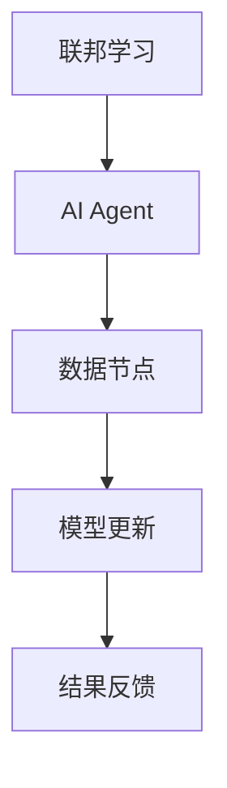

                 

---

# 企业AI Agent的联邦学习性能优化策略

> 关键词：联邦学习, AI Agent, 性能优化, 分布式机器学习, 数据隐私

> 摘要：本文详细探讨了企业AI Agent在联邦学习环境下的性能优化策略。通过分析联邦学习的核心原理和AI Agent的特点，提出了结合两者优势的优化方法。从算法原理、系统架构到实际应用，本文为企业如何在保护数据隐私的同时提升AI Agent性能提供了全面的指导。

---

## 目录

### 第一部分: 背景介绍与核心概念

#### 第1章: 联邦学习与AI Agent的概述

##### 1.1 联邦学习的定义与背景
- 1.1.1 联邦学习的定义
- 1.1.2 联邦学习的核心特点
- 1.1.3 联邦学习与传统数据共享的区别

##### 1.2 AI Agent的概念与特点
- 1.2.1 AI Agent的定义
- 1.2.2 AI Agent的核心特点
- 1.2.3 AI Agent与传统AI的区别

##### 1.3 企业AI Agent的应用场景
- 1.3.1 企业内部数据共享的挑战
- 1.3.2 联邦学习在企业AI Agent中的应用
- 1.3.3 企业AI Agent的潜在价值

#### 第2章: 联邦学习与AI Agent的核心概念对比

##### 2.1 联邦学习与AI Agent的属性对比
- 表格对比：数据隐私性、计算资源需求、通信效率

##### 2.2 联邦学习与AI Agent的实体关系图

### 第二部分: 算法原理与系统架构

#### 第3章: 联邦学习的算法原理

##### 3.1 联邦学习的基本算法
- 3.1.1 联邦平均算法（FedAvg）
- 3.1.2 联邦直推算法（FedProx）
- 3.1.3 联邦梯度下降算法（FedGD）

##### 3.2 AI Agent的算法原理
- 3.2.1 基于强化学习的AI Agent算法
- 3.2.2 基于监督学习的AI Agent算法
- 3.2.3 基于无监督学习的AI Agent算法

##### 3.3 联邦学习与AI Agent的协同优化
- 联邦学习如何提升AI Agent的性能
- AI Agent在联邦学习中的角色
- 联邦学习与AI Agent的协同优化策略

#### 第4章: 系统架构与接口设计

##### 4.1 系统架构设计
- AI Agent在联邦学习中的系统架构图
- 模块划分与功能设计
- 系统功能设计的领域模型Mermaid类图

##### 4.2 系统接口设计
- 联邦学习与AI Agent之间的接口定义
- 数据通信接口
- 模型更新接口

##### 4.3 系统交互流程
- 联邦学习与AI Agent的交互流程图
- 数据同步流程
- 模型更新流程

### 第三部分: 项目实战与最佳实践

#### 第5章: 项目实战

##### 5.1 环境安装与配置
- 安装Python环境
- 安装必要的库（如TensorFlow、Flask等）
- 环境配置说明

##### 5.2 核心代码实现
- AI Agent的实现代码
- 联邦学习算法的实现
- 模型训练与更新的代码

##### 5.3 案例分析
- 电商推荐系统的应用案例
- 系统性能对比分析
- 实验结果与优化策略

#### 第6章: 最佳实践与总结

##### 6.1 最佳实践
- 数据预处理的优化建议
- 模型选择的优化建议
- 通信机制的优化建议

##### 6.2 小结
- 本文的主要内容回顾
- 联邦学习与AI Agent结合的优势
- 未来的研究方向

##### 6.3 注意事项
- 数据隐私保护的重要性
- 模型收敛速度的注意事项
- 系统扩展性设计的注意事项

##### 6.4 拓展阅读
- 推荐的相关书籍与论文
- 技术博客与社区资源
- 专业会议与研讨会

---

## 总结

通过以上目录结构，我们可以系统地了解企业AI Agent在联邦学习环境下的性能优化策略。从背景介绍到算法实现，再到实际应用，每一章都详细展开，确保读者能够全面掌握相关知识，并能够在实际项目中应用这些优化策略。

