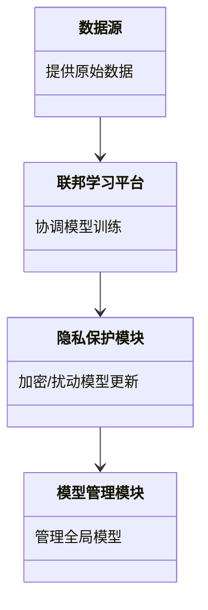
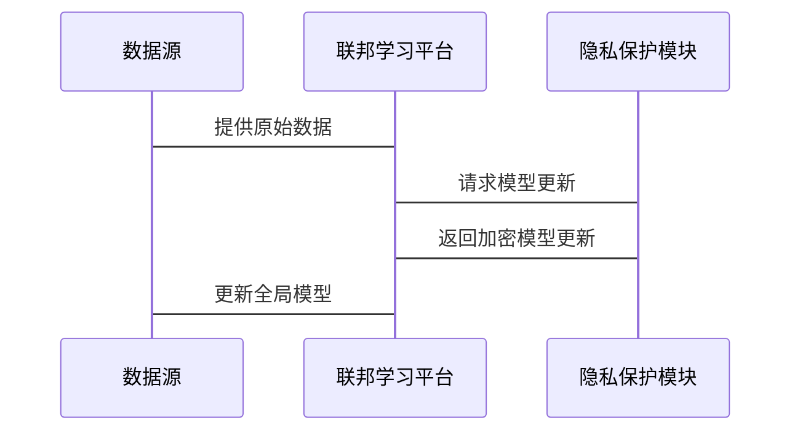

                 


# 企业AI Agent的联邦学习隐私保护机制

> 关键词：联邦学习，隐私保护，企业AI Agent，数据安全，机器学习，隐私计算，联邦学习算法

> 摘要：随着人工智能技术的快速发展，企业AI Agent在各个行业的应用日益广泛。然而，数据隐私和安全问题也随之而来。联邦学习作为一种分布式机器学习技术，能够在保护数据隐私的前提下，实现跨机构的数据协作。本文深入探讨了企业AI Agent在联邦学习中的隐私保护机制，从核心概念、算法原理到系统架构设计，再到实际项目案例，全面解析如何在企业AI Agent中实现高效且安全的联邦学习。

---

## 1. 联邦学习与隐私保护概述

### 1.1 联邦学习的基本概念
联邦学习（Federated Learning）是一种分布式机器学习技术，允许多个参与方在不共享原始数据的情况下，共同训练一个全局模型。它通过在各个参与方之间共享模型参数，而不是数据本身，从而实现数据隐私保护。

### 1.2 隐私保护的重要性
在企业AI Agent的应用中，数据通常涉及敏感信息，如用户行为数据、交易记录等。如果不加以保护，这些数据可能被滥用，导致隐私泄露或商业机密泄露。因此，隐私保护是企业AI Agent设计中的核心问题。

### 1.3 企业AI Agent的应用场景
企业AI Agent可以在多个场景中应用联邦学习，例如：
- **跨机构协作**：多个企业之间共享模型，同时保护各自的私有数据。
- **物联网设备**：通过联邦学习，多个物联网设备可以在不共享数据的情况下，共同训练一个全局模型。
- **医疗领域**：多个医院可以协作训练医疗模型，同时保护患者的隐私数据。

---

## 2. 联邦学习的原理与隐私保护机制

### 2.1 联邦学习的基本原理
联邦学习的核心思想是将模型的训练过程分散到各个参与方，每个参与方仅上传模型更新，而不是数据本身。通过这种方式，全局模型可以在不接触原始数据的情况下完成训练。

### 2.2 数据隐私保护机制
为了进一步保护隐私，联邦学习可以结合多种隐私保护技术，如同态加密、差分隐私等。这些技术可以在模型更新的过程中，对数据进行加密或扰动处理，确保数据的隐私性。

### 2.3 隐私保护的挑战与解决方案
在联邦学习中，隐私保护面临以下挑战：
- **模型反推攻击**：攻击者可以通过模型参数推断出原始数据。
- **数据泄露风险**：在模型更新过程中，某些中间数据可能被泄露。

解决方案包括：
- 使用同态加密或差分隐私技术，对模型更新进行加密或扰动处理。
- 定期对模型进行隐私风险评估，确保模型参数不会泄露敏感信息。

---

## 3. 隐私保护技术

### 3.1 同态加密
同态加密是一种允许在加密数据上进行计算的技术。在联邦学习中，可以通过同态加密对模型更新进行加密，确保数据在传输过程中不被泄露。

#### 同态加密的数学模型
同态加密的数学模型可以用以下公式表示：
$$ \text{Enc}(x) \rightarrow \text{Enc}(x + k) $$
其中，$\text{Enc}(x)$ 表示对数据 $x$ 进行加密，$k$ 表示一个密钥。

### 3.2 差分隐私
差分隐私是一种通过在数据中添加噪声来保护隐私的技术。在联邦学习中，可以通过在模型更新中添加噪声，使得攻击者无法通过模型参数推断出原始数据。

#### 差分隐私的数学模型
差分隐私的数学模型可以用以下公式表示：
$$ y = f(x) + \epsilon $$
其中，$f(x)$ 表示原始数据，$\epsilon$ 表示添加的噪声。

### 3.3 其他隐私保护技术
除了同态加密和差分隐私，还可以使用其他隐私保护技术，如安全多方计算（SMPC）和零知识证明（ZKP）。这些技术可以在不同的场景下，提供不同的隐私保护方案。

---

## 4. 企业AI Agent的系统架构

### 4.1 系统组件与功能模块
企业AI Agent的系统架构通常包括以下几个组件：
- **数据源**：负责生成和提供原始数据。
- **联邦学习平台**：负责协调各个参与方的模型训练过程。
- **隐私保护模块**：负责对模型更新进行加密或扰动处理，确保数据隐私。
- **模型管理模块**：负责管理和存储全局模型。

### 4.2 通信协议设计
在企业AI Agent中，通信协议的设计至关重要。通常，通信协议需要满足以下要求：
- **安全性**：确保数据在传输过程中不被泄露。
- **高效性**：确保数据传输的效率，减少通信开销。
- **容错性**：能够容忍网络故障或节点离线的情况。

### 4.3 数据共享机制
数据共享机制是企业AI Agent中的关键部分。通过数据共享机制，各个参与方可以在不共享原始数据的情况下，完成模型的训练和更新。

---

## 5. 算法原理与数学模型

### 5.1 联邦学习算法概述
联邦学习算法的核心思想是将模型的训练过程分散到各个参与方，每个参与方仅上传模型更新，而不是数据本身。通过这种方式，全局模型可以在不接触原始数据的情况下完成训练。

### 5.2 同态加密算法
同态加密算法的具体实现可以通过以下步骤：
1. 对原始数据进行加密。
2. 在加密数据上进行计算，得到加密结果。
3. 解密加密结果，得到最终结果。

### 5.3 差分隐私算法
差分隐私算法的具体实现可以通过以下步骤：
1. 对原始数据进行处理，添加噪声。
2. 对处理后的数据进行计算，得到结果。
3. 输出最终结果。

---

## 6. 系统架构设计

### 6.1 领域模型设计
领域模型是系统架构设计的基础。通过领域模型，可以明确系统中的各个组件及其之间的关系。

#### 领域模型Mermaid图


### 6.2 系统架构图
系统架构图展示了系统中各个组件之间的关系。

#### 系统架构Mermaid图
```mermaid
container 联邦学习平台 {
    component 数据源
    component 模型训练模块
    component 模型更新模块
}
container 隐私保护模块 {
    component 加密模块
    component 解密模块
}
```

### 6.3 系统接口与交互设计
系统接口与交互设计通过Mermaid序列图展示。

#### 系统交互Mermaid图


---

## 7. 项目实战

### 7.1 环境搭建
为了实现企业AI Agent的联邦学习隐私保护机制，首先需要搭建以下环境：
- **开发工具**：Python、Jupyter Notebook
- **库和框架**：TensorFlow、Keras、加密库（如Paillier）

### 7.2 核心代码实现
以下是一个简单的联邦学习实现示例，使用Python和TensorFlow：

#### 代码实现
```python
import numpy as np
import tensorflow as tf
from tensorflow.keras import layers

# 定义模型
model = tf.keras.Sequential([
    layers.Dense(128, activation='relu'),
    layers.Dense(10, activation='softmax')
])

# 定义损失函数和优化器
loss_fn = tf.keras.losses.SparseCategoricalCrossentropy(from_logits=False)
optimizer = tf.keras.optimizers.Adam()

# 定义模型训练步骤
@tf.function
def train_step(x, y):
    with tf.GradientTape() as tape:
        predictions = model(x)
        loss = loss_fn(y, predictions)
    gradients = tape.gradient(loss, model.trainable_weights)
    optimizer.apply_gradients(zip(gradients, model.trainable_weights))
    return loss

# 模型训练
for epoch in range(num_epochs):
    for x, y in dataset:
        loss = train_step(x, y)
        print(f'Epoch {epoch}, Loss: {loss}')
```

### 7.3 案例分析与解读
通过上述代码实现，可以在企业AI Agent中实现一个简单的联邦学习模型。该模型可以在不共享原始数据的情况下，完成模型的训练和更新。

---

## 8. 最佳实践与未来展望

### 8.1 实践总结
在实现企业AI Agent的联邦学习隐私保护机制时，需要注意以下几点：
- **数据隐私保护**：确保数据在传输和存储过程中不被泄露。
- **模型更新效率**：优化模型更新的算法，减少通信开销。
- **安全性评估**：定期对模型进行隐私风险评估，确保模型的安全性。

### 8.2 未来展望
未来，随着人工智能技术的不断发展，联邦学习将在更多领域得到应用。同时，隐私保护技术也将不断进步，为企业AI Agent的隐私保护提供更强大的支持。

---

## 9. 总结

企业AI Agent的联邦学习隐私保护机制是一个复杂的系统工程，需要从算法设计、系统架构到实际应用等多个方面进行综合考虑。通过本文的分析和探讨，希望能够为企业AI Agent的设计和实现提供一些参考和借鉴。

