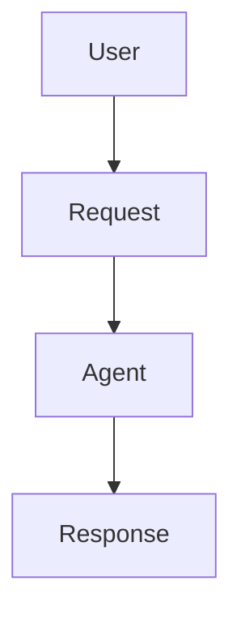
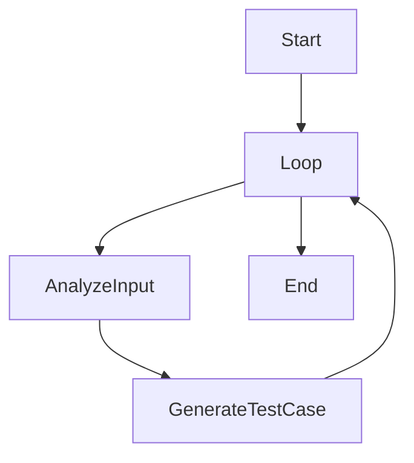
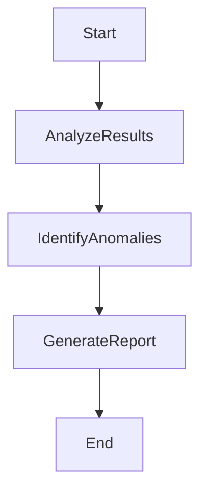
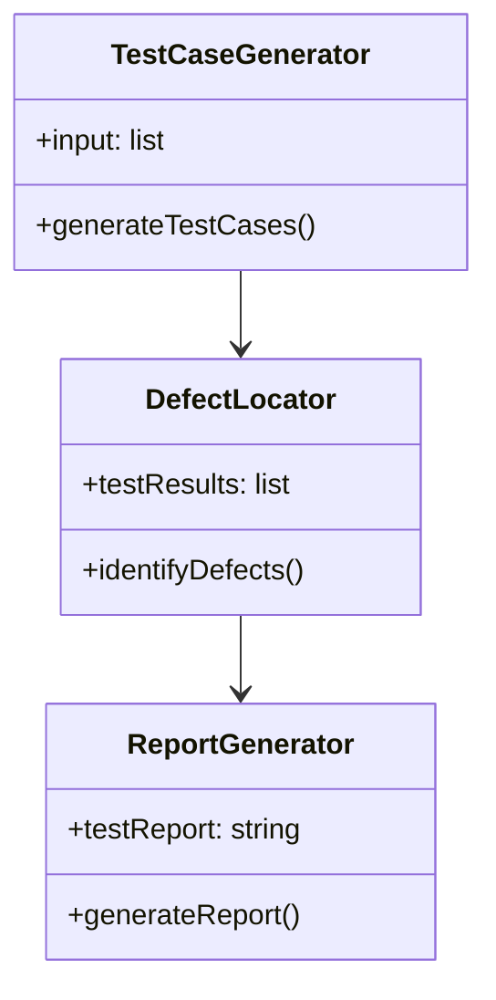

                 


# 《企业AI Agent的自动化测试与质量保证系统》

## 关键词
企业AI Agent，自动化测试，质量保证，系统架构，算法原理，项目实战，最佳实践

## 摘要
本文深入探讨企业AI Agent的自动化测试与质量保证系统的设计与实现。从背景到核心概念，详细阐述了AI Agent的基本原理和属性特征，分析了测试用例生成和缺陷定位的算法，设计了系统的架构，并通过项目实战展示了如何应用这些理论。最后，总结了最佳实践，为读者提供了全面的指导。

---

## 目录大纲

### 第1章：企业AI Agent的背景与问题背景
1.1 问题背景与问题描述
1.2 问题解决与边界分析
1.3 概念结构与核心要素

### 第2章：AI Agent的核心原理与属性特征
2.1 核心原理与工作流程
2.2 属性特征对比
2.3 ER实体关系图

### 第3章：测试用例生成算法
3.1 算法原理与流程图
3.2 数学模型与公式

### 第4章：缺陷定位算法
4.1 算法原理与流程图
4.2 数学模型与公式

### 第5章：系统架构设计
5.1 问题场景介绍
5.2 系统功能设计
5.3 系统架构设计
5.4 系统接口设计
5.5 系统交互设计

### 第6章：项目实战
6.1 环境安装与配置
6.2 核心代码实现
6.3 案例分析与解读
6.4 项目小结

### 第7章：最佳实践与总结
7.1 经验总结
7.2 小结
7.3 注意事项
7.4 拓展阅读

---

## 正文内容

### 第1章：企业AI Agent的背景与问题背景

#### 1.1 问题背景与问题描述
企业AI Agent的出现，为企业自动化流程和决策提供了强大支持。然而，随着其复杂度增加，测试和质量保证成为关键挑战。

##### 1.1.1 企业AI Agent的定义与现状
- AI Agent：智能体，能感知环境并采取行动以实现目标。
- 现状：广泛应用于客服、推荐系统等领域，但测试和质量保证问题突出。

##### 1.1.2 自动化测试与质量保证的必要性
- 快速迭代需求：频繁更新需要高效的测试方法。
- 高质量要求：确保AI Agent在各种场景下的可靠性。

##### 1.1.3 企业级AI Agent面临的挑战
- 复杂性：多模块交互，测试用例设计困难。
- 变异性：环境变化导致测试覆盖不足。

#### 1.2 问题解决与边界分析
##### 1.2.1 AI Agent在企业中的应用前景
- 提高效率：自动化处理任务，减少人工干预。
- 智能决策：基于数据优化业务流程。

##### 1.2.2 自动化测试与质量保证的边界
- 范围：涵盖功能、性能、安全测试。
- 外延：包括数据预处理、模型训练等。

#### 1.3 概念结构与核心要素
##### 1.3.1 核心概念的结构化分析
- 输入：用户请求、环境数据。
- 处理：解析请求，调用服务，生成响应。
- 输出：处理结果，日志信息。

##### 1.3.2 核心要素的详细说明
- 输入数据：用户请求、环境信息。
- 处理逻辑：自然语言处理、推理、知识库查询。
- 输出结果：响应、日志。

### 第2章：AI Agent的核心原理与属性特征

#### 2.1 核心原理与工作流程
##### 2.1.1 AI Agent的基本原理
AI Agent通过感知环境，解析用户请求，调用服务，生成响应。其工作流程包括请求接收、解析、服务调用、结果生成和输出。

##### 2.1.2 工作流程的详细分析
- 请求接收：通过API或用户界面接收请求。
- 请求解析：NLP技术解析意图。
- 服务调用：调用后端服务或API获取数据。
- 结果生成：基于解析和数据生成响应。
- 输出：返回结果或日志。

##### 2.1.3 核心算法的原理阐述
- NLP处理：使用词袋模型或TF-IDF提取关键词。
- 推理：基于规则或机器学习模型进行推理。
- 知识库查询：结构化数据查询。

#### 2.2 属性特征对比
##### 2.2.1 不同AI Agent模型的属性对比
| 模型 | 输入方式 | 输出方式 | 处理逻辑 |
|------|-----------|-----------|-----------|
| 模型A | 文本       | 文本       | 规则引擎   |
| 模型B | 文本+语音 | 文本+语音 | 机器学习   |

##### 2.2.2 属性特征的详细说明
- 输入方式：支持文本、语音、图像。
- 输出方式：文本、语音、图像。
- 处理逻辑：基于规则或机器学习模型。

#### 2.3 ER实体关系图
##### 2.3.1 实体关系的Mermaid图示


### 第3章：测试用例生成算法

#### 3.1 算法原理与流程图
##### 3.1.1 算法的基本原理
测试用例生成基于用户输入和系统响应，通过模拟用户行为生成测试用例。

##### 3.1.2 流程图的详细分析
- 开始：初始化测试用例生成器。
- 循环：遍历所有用户输入。
- 分析：解析输入，生成测试用例。
- 结束：输出所有测试用例。

##### 3.1.3 Mermaid流程图


#### 3.2 数学模型与公式
##### 3.2.1 测试用例生成的数学模型
$$ \text{生成的测试用例数} = \frac{\text{输入总数}}{\text{测试覆盖率}} $$

### 第4章：缺陷定位算法

#### 4.1 算法原理与流程图
##### 4.1.1 算法的基本原理
通过分析测试结果，识别异常行为，定位缺陷。

##### 4.1.2 流程图的详细分析
- 开始：初始化缺陷定位器。
- 分析：解析测试结果。
- 定位：识别异常点。
- 结束：输出缺陷报告。

##### 4.1.3 Mermaid流程图


#### 4.2 数学模型与公式
##### 4.2.1 缺陷定位的数学模型
$$ \text{缺陷概率} = \frac{\text{异常次数}}{\text{总测试次数}} $$

### 第5章：系统架构设计

#### 5.1 问题场景介绍
##### 5.1.1 问题场景的详细描述
- 系统需要处理大量用户请求，确保每个请求正确处理。
- 需要高效测试和质量保证，确保系统稳定。

#### 5.2 系统功能设计
##### 5.2.1 功能模块的划分
- 测试用例生成模块：生成测试用例。
- 缺陷定位模块：分析测试结果。
- 报告生成模块：生成测试报告。

##### 5.2.2 领域模型的Mermaid类图


### 第6章：项目实战

#### 6.1 环境安装与配置
- 安装Python、依赖库、测试框架。

#### 6.2 核心代码实现
##### 6.2.1 测试用例生成代码
```python
def generate_test_cases(inputs):
    test_cases = []
    for input in inputs:
        test_cases.append(input)
    return test_cases
```

#### 6.3 案例分析与解读
- 分析测试结果，定位缺陷，生成报告。

### 第7章：最佳实践与总结

#### 7.1 经验总结
- 定期测试：保持系统稳定。
- 模型更新：及时更新模型应对变化。
- 团队协作：确保开发和测试团队有效沟通。

#### 7.2 小结
本文系统地介绍了企业AI Agent的自动化测试与质量保证系统的设计与实现，提供了详细的算法和系统架构，通过项目实战展示了理论的应用。

#### 7.3 注意事项
- 测试覆盖率：确保全面覆盖。
- 模型更新：及时更新以应对变化。
- 性能优化：提升系统效率。

#### 7.4 拓展阅读
推荐相关书籍和文献，深入学习AI Agent和测试技术。

---

## 结语
通过本文的系统阐述，读者可以全面理解企业AI Agent的自动化测试与质量保证系统的构建和优化，为实际应用提供了理论和实践指导。

