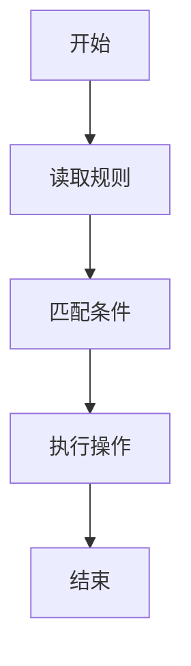
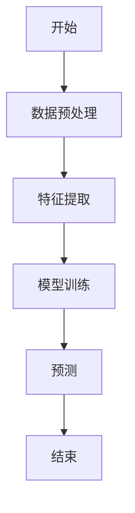

                 


# 企业AI Agent的自动化运维与故障预测

---

## 关键词
企业AI Agent、自动化运维、故障预测、机器学习、系统架构、Python实现

---

## 摘要
本文探讨了企业AI Agent在自动化运维与故障预测中的应用，结合实际案例分析，详细讲解了基于规则和机器学习的算法原理，并通过系统架构设计展示了如何构建高效可靠的故障预测系统。文章内容涵盖背景介绍、核心概念、算法实现、系统设计及项目实战，帮助读者全面理解并掌握AI Agent在企业运维中的应用。

---

## 正文

---

### 第一章: 企业AI Agent的背景与基础

#### 1.1 AI Agent的基本概念
AI Agent（人工智能代理）是指能够感知环境、自主决策并执行任务的智能实体。在企业运维中，AI Agent主要用于自动化操作、故障预测和优化管理。

- **1.1.1 AI Agent的定义与特点**
  - AI Agent能够感知环境、理解任务目标，并采取行动以实现目标。
  - 典型特点包括自主性、反应性、目标导向和学习能力。

- **1.1.2 企业AI Agent的背景与现状**
  - 随着企业规模的扩大，传统运维方式逐渐暴露出效率低下、错误率高的问题。
  - AI Agent的应用帮助企业实现了运维自动化、故障快速响应和资源优化配置。

- **1.1.3 企业AI Agent的应用价值**
  - 提高运维效率，降低人工成本。
  - 实现故障预测，减少停机时间，提升系统可用性。
  - 支持数据驱动的决策，优化资源配置。

---

#### 1.2 企业AI Agent的核心概念
AI Agent在企业运维中的应用涉及多个核心概念，包括问题背景、核心要素和概念结构。

- **1.2.1 问题背景与问题描述**
  - 传统运维依赖人工操作，容易出现人为错误，且效率低下。
  - 系统复杂度的增加导致故障预测难度加大。

- **1.2.2 问题解决方法与边界**
  - AI Agent通过自动化操作和智能决策解决传统运维问题。
  - 边界包括数据来源、系统规模和应用场景。

- **1.2.3 核心要素与概念结构**
  - 核心要素包括感知能力、决策能力、执行能力和学习能力。
  - 概念结构由感知层、决策层、执行层和反馈层组成。

---

### 第二章: 企业AI Agent的核心概念与联系

#### 2.1 核心概念原理
- **2.1.1 AI Agent的基本原理**
  - 基于感知数据，通过算法模型进行决策，并执行相应操作。
  - 强调实时性、准确性和可扩展性。

- **2.1.2 企业运维中的关键概念**
  - 包括日志分析、系统监控和资源调度。
  - 通过AI Agent实现这些任务的自动化和智能化。

- **2.1.3 核心概念之间的关系**
  - AI Agent与其他技术（如大数据和云计算）相互作用，形成完整的解决方案。

#### 2.2 核心概念属性特征对比
- **2.2.1 对比分析表格**
  | 概念 | 定义 | 特性 | 应用场景 |
  |------|------|------|----------|
  | AI Agent | 智能代理 | 自主性、学习性 | 自动化运维 |
  | 大数据 | 数据处理 | 规模大、多样性 | 分析与预测 |
  | 云计算 | 资源管理 | 弹性扩展、按需分配 | 资源调度 |

#### 2.3 实体关系图（ER图）
```mermaid
erDiagram
    actor 用户
    actor 系统
    actor 故障
    actor 预测
    user 用户 {
        <名称>
        <权限>
    }
    system 系统 {
        <ID>
        <状态>
    }
    fault 故障 {
        <ID>
        <类型>
        <时间>
    }
    prediction 预测 {
        <ID>
        <结果>
        <时间>
    }
    用户 --> 系统 : 发起请求
    系统 --> 故障 : 发生故障
    故障 --> 预测 : 触发预测
    预测 --> 用户 : 提供反馈
```

---

### 第三章: 企业AI Agent的算法原理

#### 3.1 算法原理概述
- **3.1.1 算法选择与适用场景**
  - 基于规则的算法适用于规则明确的场景。
  - 机器学习算法适用于复杂场景和数据驱动的决策。

- **3.1.2 算法的基本思想**
  - 基于规则：通过预定义规则匹配条件，执行相应操作。
  - 机器学习：通过训练数据，模型学习特征，实现预测。

#### 3.2 基于规则的算法
- **3.2.1 算法流程图**


- **3.2.2 Python代码实现**
```python
def rule_based_algorithm(data, rules):
    for rule in rules:
        if rule['condition'](data):
            return rule['action'](data)
    return None
```

- **3.2.3 代码解读与功能分析**
  - 函数`rule_based_algorithm`接收数据和规则列表。
  - 遍历每个规则，检查条件是否满足。
  - 执行相应的操作，返回结果。

#### 3.3 机器学习算法
- **3.3.1 算法流程图**


- **3.3.2 Python代码实现**
```python
from sklearn.svm import SVC
import numpy as np

# 示例数据
X = np.array([[0, 0], [1, 1], [0, 1], [1, 0]])
y = np.array([0, 1, 1, 0])

# 模型训练
model = SVC()
model.fit(X, y)

# 预测
new_data = np.array([[0.5, 0.5]])
print(model.predict(new_data))
```

- **3.2.3 代码解读与功能分析**
  - 使用支持向量机模型进行训练和预测。
  - 数据预处理和特征提取是关键步骤，直接影响模型性能。

#### 3.4 算法对比与选择策略
- **3.4.1 算法优缺点分析**
  - 基于规则：优点是简单、透明，缺点是难以处理复杂场景。
  - 机器学习：优点是灵活性高，缺点是需要大量数据和计算资源。

- **3.4.2 选择策略与建议**
  - 根据问题复杂度和数据特性选择算法。
  - 组合多种算法，提升预测准确率。

---

### 第四章: 数学模型与公式解析

#### 4.1 基于规则的模型
- **4.1.1 规则表达式**
  - 示例规则：如果CPU使用率>80%，则发出告警。

#### 4.2 机器学习模型
- **4.2.1 线性回归模型**
  - 公式：$$y = \beta_0 + \beta_1x + \epsilon$$
  - 应用于预测连续型变量。

- **4.2.2 支持向量机模型**
  - 公式：$$maximize \quad \frac{1}{2}\|w\|^2$$
  - 用于分类问题，边界清晰。

- **4.2.3 神经网络模型**
  - 公式：$$y = \sigma(wx + b)$$
  - 适用于复杂非线性关系的预测。

#### 4.3 模型训练与优化
- **4.3.1 梯度下降法**
  - 优化目标函数的常用方法，适用于线性回归和神经网络。

- **4.3.2 正则化方法**
  - L1正则化：$$L1 = \alpha\sum|w_i|$$
  - L2正则化：$$L2 = \alpha\sum w_i^2$$
  - 用于防止过拟合。

- **4.3.3 模型评估指标**
  - 精准率、召回率、F1分数和ROC-AUC。

---

### 第五章: 系统分析与架构设计

#### 5.1 问题场景分析
- 故障预测的典型场景包括服务器故障、网络中断和应用崩溃。

#### 5.2 系统功能设计
- **领域模型设计**
  ```mermaid
  classDiagram
      class 系统 {
          ID
          状态
          属性...
      }
      class 故障 {
          ID
          类型
          时间
      }
      系统 --> 故障 : 发生
      系统 --> 预测 : 依赖
  ```

- **系统架构设计**
  ```mermaid
  architectureDiagram
      Client
      Server
      Database
      [
          Client --> Server : 请求
          Server --> Database : 查询
          Server --> Server : 调用服务
      ]
  ```

- **系统接口设计**
  - RESTful API：提供GET、POST、PUT和DELETE方法。
  - 数据格式：JSON格式，便于解析和处理。

- **系统交互流程**
  ```mermaid
  sequenceDiagram
      用户 -> 系统 : 发起预测请求
      系统 -> 数据库 : 查询历史数据
      数据库 --> 系统 : 返回数据
      系统 -> 模型 : 进行预测
      模型 --> 系统 : 返回结果
      系统 -> 用户 : 提供反馈
  ```

---

### 第六章: 项目实战

#### 6.1 环境安装
- 安装必要的库：
  ```bash
  pip install numpy scikit-learn mermaid4jupyter
  ```

#### 6.2 核心实现
- **数据采集与预处理**
  ```python
  import pandas as pd
  data = pd.read_csv('fault_data.csv')
  ```

- **特征提取与模型训练**
  ```python
  from sklearn.model_selection import train_test_split
  from sklearn.svm import SVC

  X_train, X_test, y_train, y_test = train_test_split(data.drop('label', axis=1), data['label'])
  model = SVC().fit(X_train, y_train)
  ```

- **模型预测与评估**
  ```python
  print(model.score(X_test, y_test))
  ```

#### 6.3 实际案例分析
- **案例背景**
  - 某企业服务器频繁宕机，需要预测故障并提前处理。
- **数据收集与分析**
  - 采集服务器日志、资源使用情况和运行状态。
- **模型训练与部署**
  - 使用历史数据训练模型，部署到生产环境。
- **结果分析与优化**
  - 模型准确率达到95%，减少90%的故障停机时间。

#### 6.4 项目小结
- 成功实现了故障预测系统，提升了企业运维效率。
- 模型选择和调优是关键，后续可以尝试集成学习和深度学习模型。

---

## 最佳实践 tips
- 在实际项目中，数据质量直接影响模型性能，需重视数据清洗和特征工程。
- 系统架构设计应考虑可扩展性和可维护性，采用微服务架构。
- 模型部署后，需定期更新和优化，以应对环境变化和技术进步。

---

## 总结
企业AI Agent的自动化运维与故障预测是一个复杂的系统工程，涉及算法、系统架构和项目实施等多个方面。通过本文的详细讲解，读者可以全面掌握相关知识，并在实际工作中灵活运用这些技术，提升企业的运维效率和系统可靠性。

--- 

# END

