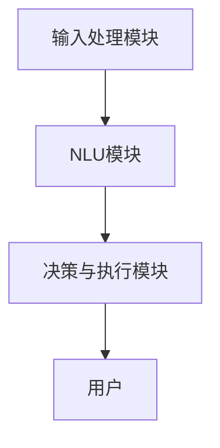
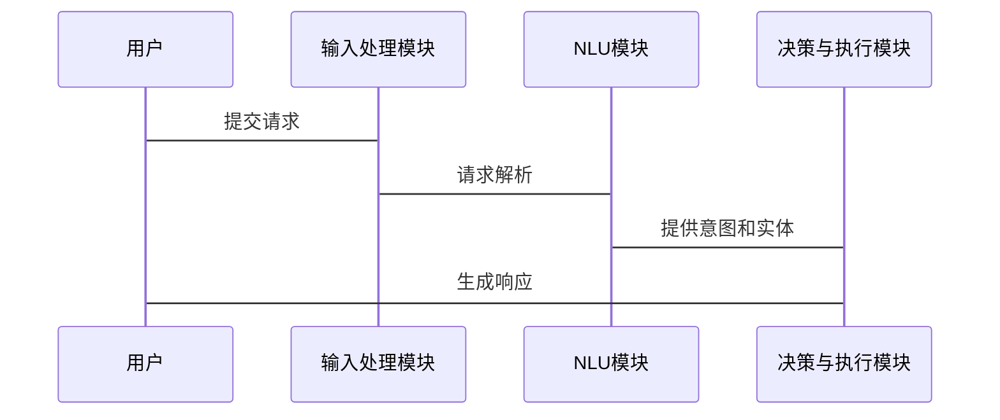

                 


# 企业AI Agent的自然语言理解(NLU)技术深化

## 关键词：
- 企业AI Agent
- 自然语言理解(NLU)
- 深度学习
- 多轮对话
- 系统架构设计

## 摘要：
本文深入探讨了企业AI Agent中的自然语言理解（NLU）技术，分析了其核心概念、技术原理、系统架构设计及实际应用场景。文章从NLU的基本概念入手，详细讲解了NLU的关键算法与模型，如词嵌入、序列模型和预训练语言模型，并结合企业AI Agent的实际需求，探讨了NLU的深化应用，包括多轮对话处理、领域特定优化和实时语义理解。此外，本文还通过系统架构设计、项目实战和最佳实践，为读者提供了全面的技术指导和实践参考。

---

# 第一部分: 企业AI Agent的自然语言理解(NLU)技术背景

## 第1章: 自然语言理解(NLU)概述

### 1.1 NLU的核心概念

#### 1.1.1 自然语言理解的定义
自然语言理解（NLU）是自然语言处理（NLP）的一个重要分支，专注于使计算机能够理解和解析人类的自然语言输入。NLU的目标是将人类语言转换为可被计算机处理的结构化信息，从而实现人机交互。

#### 1.1.2 NLU的主要任务与目标
NLU的主要任务包括：
- **分词**：将连续的文本分割成有意义的词语。
- **词性标注**：识别每个词的语法类别（如名词、动词、形容词等）。
- **句法分析**：分析句子的语法结构。
- **语义理解**：理解文本的语义含义，提取关键信息（如实体、意图等）。

NLU的目标是提高计算机对人类语言的理解能力，从而实现更自然、更高效的交互。

#### 1.1.3 NLU在企业AI Agent中的作用
在企业AI Agent中，NLU技术主要用于解析用户的输入，提取意图和实体信息，从而为后续的决策和执行提供支持。例如，在企业客服系统中，NLU可以帮助自动理解用户的问题并提供相应的解决方案。

### 1.2 技术背景与发展趋势

#### 1.2.1 NLU技术的历史发展
NLU技术的发展经历了以下几个阶段：
1. **基于规则的方法**：早期的NLU系统主要依赖于预定义的规则和模板，适用于特定场景。
2. **统计学习方法**：随着统计学习技术的发展，NLU开始采用基于概率模型的方法。
3. **深度学习方法**：近年来，深度学习技术（如LSTM、Transformer）的引入极大地提升了NLU的性能。

#### 1.2.2 当前NLU技术的主要特点
当前的NLU技术具有以下特点：
- **数据驱动**：深度学习模型需要大量标注数据进行训练。
- **端到端学习**：现代NLU系统通常采用端到端的深度学习模型，直接从输入文本映射到输出结果。
- **预训练模型**：基于预训练语言模型（如BERT、GPT）的微调技术在NLU任务中表现出色。

#### 1.2.3 企业AI Agent对NLU技术的需求
企业AI Agent对NLU技术的需求主要体现在以下几个方面：
- **高精度**：在企业场景中，NLU需要准确理解用户的意图和实体信息。
- **实时性**：企业AI Agent需要快速响应用户输入，对NLU的处理速度提出较高要求。
- **领域适应性**：企业场景通常具有领域 specificity，NLU系统需要针对特定领域进行优化。

### 1.3 企业应用场景分析

#### 1.3.1 客户服务与支持
在企业客服系统中，NLU技术可以用于自动解析客户的咨询内容，提取问题的关键信息，并匹配相应的解决方案。

#### 1.3.2 企业内部信息处理
NLU技术可以用于企业内部信息的自动化处理，例如从邮件中提取关键信息并自动生成任务工单。

#### 1.3.3 业务流程自动化
通过NLU技术，企业可以实现业务流程的自动化，例如自动理解用户的请求并触发相应的系统操作。

### 1.4 相关技术对比与联系

#### 1.4.1 与NLP的对比
NLP（自然语言处理）是一个更广泛的领域，涵盖了NLU、自然语言生成（NLG）等多个子任务。NLU专注于理解人类语言，而NLP还包括语言生成和处理。

#### 1.4.2 与机器学习的联系
NLU技术 heavily relies on machine learning，尤其是深度学习技术。NLU中的很多任务（如意图识别、实体抽取）都可以看作是 supervised learning问题。

#### 1.4.3 与深度学习的关系
深度学习技术（如LSTM、Transformer）为NLU的性能提升提供了重要支持。尤其是预训练语言模型的引入，极大地提升了NLU系统的语义理解能力。

---

## 第2章: NLU的核心概念与技术原理

### 2.1 NLU的核心概念

#### 2.1.1 语言单元分析
语言单元分析是NLU的基础任务，包括分词和词性标注。例如，将句子“我需要一份年度报告”分割成“我”、“需要”、“一份”、“年度”、“报告”，并标注每个词的词性（如名词、动词等）。

#### 2.1.2 语义理解模型
语义理解模型是NLU的核心，负责将语言单元转换为结构化的语义表示。例如，将输入句子“我需要一份年度报告”转换为意图“请求报告”和实体“年度报告”。

#### 2.1.3 上下文感知
上下文感知是NLU的高级功能，能够理解对话的上下文信息。例如，在多轮对话中，NLU系统能够结合之前的对话内容，准确理解当前用户的意图。

### 2.2 NLU的主要技术原理

#### 2.2.1 词嵌入技术
词嵌入技术（如Word2Vec、GloVe）通过将词语映射到高维向量空间，捕捉词语的语义信息。例如，词语“king”和“queen”在向量空间中会相对接近。

#### 2.2.2 语法分析与语义解析
语法分析（如分块、句法树构建）帮助NLU系统理解句子的结构，而语义解析则基于语法分析结果，提取句子的语义信息。

#### 2.2.3 基于深度学习的NLU模型
基于深度学习的NLU模型（如LSTM、Transformer）能够自动学习输入文本的特征，无需手动设计特征。

### 2.3 NLU的关键算法与模型

#### 2.3.1 传统NLP算法
传统的NLP算法包括基于规则的分词、基于统计的词性标注等。例如，使用隐马尔可夫模型（HMM）进行词性标注。

#### 2.3.2 基于深度学习的模型（如LSTM、Transformer）
- **LSTM**：长短时记忆网络（LSTM）通过引入记忆单元，能够捕捉长距离依赖关系。
- **Transformer**：Transformer模型通过自注意力机制，能够并行处理整个序列，提升语义理解能力。

#### 2.3.3 预训练语言模型（如BERT）
预训练语言模型（如BERT）通过在大规模通用文本上进行预训练，捕捉语言的语义信息。在NLU任务中，通常需要对预训练模型进行领域微调。

---

## 第3章: NLU技术在企业AI Agent中的深化应用

### 3.1 企业AI Agent的基本结构

#### 3.1.1 输入处理模块
输入处理模块负责接收用户的输入（如文本、语音）并进行预处理（如分词、去停用词）。

#### 3.1.2 NLU模块
NLU模块负责解析输入文本的语义信息，提取意图和实体。

#### 3.1.3 决策与执行模块
决策与执行模块基于NLU模块提取的信息，生成相应的响应或触发相应的系统操作。

### 3.2 NLU在企业AI Agent中的深化

#### 3.2.1 多轮对话处理
多轮对话处理是企业AI Agent中的重要功能，NLU系统需要能够理解上下文信息，保持对话的连贯性。例如，在客服系统中，用户可能需要多轮对话才能完成问题的描述。

#### 3.2.2 领域特定优化
企业AI Agent通常针对特定领域（如金融、医疗）进行优化，NLU系统需要针对领域特定的术语和表达方式进行优化。例如，在金融领域，NLU系统需要准确理解“股票”、“基金”等术语。

#### 3.2.3 实时语义理解
企业AI Agent需要实时处理用户的输入，NLU系统需要具备快速解析语义的能力，以满足实时响应的需求。

### 3.3 企业AI Agent的NLU挑战

#### 3.3.1 领域适应性
不同领域的语言表达方式和术语存在差异，NLU系统需要针对特定领域进行优化。

#### 3.3.2 实时性要求
企业AI Agent需要快速响应用户的输入，这对NLU系统的处理速度提出了较高要求。

#### 3.3.3 数据稀疏性
在某些领域，标注数据可能较为稀少，如何在数据稀缺的情况下提升NLU系统的性能是一个挑战。

---

## 第4章: 系统分析与架构设计

### 4.1 项目介绍与系统功能设计

#### 4.1.1 项目介绍
假设我们正在开发一个企业AI Agent系统，主要用于企业内部的信息处理和客户服务。

#### 4.1.2 系统功能设计
- **输入处理模块**：接收用户的输入并进行预处理。
- **NLU模块**：解析输入文本，提取意图和实体。
- **决策与执行模块**：根据提取的信息生成响应或触发系统操作。

### 4.2 系统架构设计

#### 4.2.1 系统架构图


#### 4.2.2 系统交互流程


### 4.3 接口设计

#### 4.3.1 NLU模块接口
NLU模块提供以下接口：
- `parse(input: str) -> dict`: 解析输入文本，返回意图和实体信息。
- `train(train_data: list) -> None`: 对NLU模型进行训练。

#### 4.3.2 决策与执行模块接口
决策与执行模块提供以下接口：
- `generate_response(intent: str, entities: dict) -> str`: 根据意图和实体生成响应。
- `execute_action(action: str, params: dict) -> None`: 根据意图和实体触发相应的系统操作。

---

## 第5章: 项目实战与最佳实践

### 5.1 项目实战

#### 5.1.1 环境安装
安装必要的Python包：
```bash
pip install numpy
pip install scikit-learn
pip install transformers
```

#### 5.1.2 系统核心实现源代码

##### 5.1.2.1 分词与词性标注
```python
import nltk
from sklearn.feature_extraction.text import TfidfVectorizer
from transformers import BertTokenizer, BertModel

# 示例文本
text = "我需要一份年度报告"

# 使用nltk进行分词和词性标注
tokens = nltk.word_tokenize(text)
tags = nltk.pos_tag(tokens)
print(tags)  # 输出：[('我', 'PRON'), ('需要', 'VERB'), ('一份', 'DET'), ('年度', 'NOUN'), ('报告', 'NOUN')]
```

##### 5.1.2.2 意图识别
```python
# 使用BERT进行意图识别
tokenizer = BertTokenizer.from_pretrained('bert-base-chinese')
model = BertModel.from_pretrained('bert-base-chinese')

def get_intent(input_text):
    inputs = tokenizer(input_text, return_tensors='np', padding=True, truncation=True)
    outputs = model(**inputs)
    # 示例意图识别逻辑
    return "请求报告"

intent = get_intent("我需要一份年度报告")
print(intent)  # 输出：请求报告
```

##### 5.1.2.3 实体抽取
```python
# 使用spaCy进行实体抽取
import spacy

nlp = spacy.load("zh_core_web_sm")
doc = nlp("我需要一份年度报告")
for ent in doc.ents:
    print(ent.text, ent.label_)
# 输出：年度 REPORT
```

#### 5.1.3 案例分析与详细解读
以客服系统为例，用户输入“我需要帮助处理订单问题”，NLU系统需要准确识别出意图“处理订单问题”和实体“订单”。

### 5.2 最佳实践与注意事项

#### 5.2.1 数据质量
确保训练数据的多样性和代表性，避免数据偏差。

#### 5.2.2 模型选择
根据具体任务选择合适的模型，例如在需要处理长距离依赖时选择Transformer模型。

#### 5.2.3 实时性优化
通过优化模型推理速度和使用缓存技术提升实时响应能力。

#### 5.2.4 领域优化
针对特定领域进行模型微调和优化，提升在该领域的性能。

#### 5.2.5 可解释性
在需要解释性的情况下，选择能够提供可解释性的模型（如基于规则的模型）。

### 5.3 项目小结

通过本次项目实战，我们深入理解了NLU技术在企业AI Agent中的应用。从环境安装、代码实现到案例分析，我们逐步掌握了NLU系统的核心实现方法。同时，我们也认识到在实际应用中需要关注数据质量、模型选择和实时性优化等关键问题。

---

## 第6章: 总结与展望

### 6.1 总结
本文系统地探讨了企业AI Agent中的自然语言理解技术，分析了其核心概念、技术原理和实际应用场景。我们通过理论分析和项目实战，深入理解了NLU技术在企业AI Agent中的重要作用，并掌握了NLU系统的实现方法。

### 6.2 展望
未来，随着深度学习技术的不断发展，NLU技术将在企业AI Agent中发挥更大的作用。我们可以期待以下趋势：
- **更强大的预训练模型**：如GPT-3、PaLM等更大参数的模型将推动NLU技术的进步。
- **多模态NLU**：结合视觉、听觉等多种模态信息，提升NLU系统的理解能力。
- **可解释性增强**：在需要解释性的情况下，NLU系统需要提供更清晰的解释。

通过不断的技术创新和实践积累，企业AI Agent的自然语言理解技术将进一步深化，为企业智能化转型提供强有力的支持。

