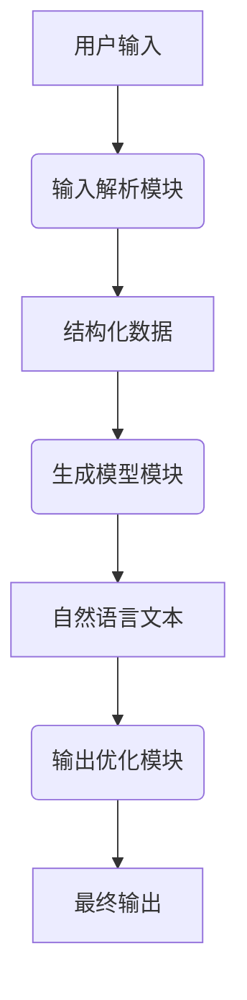

                 


# 企业AI Agent的自然语言生成(NLG)技术应用

---

## 关键词  
自然语言生成，企业AI Agent，NLG技术，人工智能，深度学习，语言模型

---

## 摘要  
随着人工智能技术的快速发展，自然语言生成（Natural Language Generation, NLG）技术在企业AI Agent中的应用日益广泛。本文从NLG技术的核心概念、算法原理、系统架构到项目实战，全面解析企业AI Agent中NLG技术的应用场景、实现方法及优化策略。通过本文，读者可以深入了解NLG技术在企业中的实际应用，并掌握如何在企业AI Agent中高效部署和优化NLG模型。

---

## 第1章: 企业AI Agent与自然语言生成技术的背景

### 1.1 自然语言生成技术的定义与背景  
自然语言生成（NLG）是指将结构化的数据（如数据库信息、知识图谱等）转化为自然流畅的自然语言文本的技术。NLG技术的核心在于理解数据的语义，并将其转化为符合人类语言习惯的表达方式。

随着人工智能技术的快速发展，NLG技术在企业中的应用越来越广泛。企业AI Agent作为一种能够自主执行任务、提供智能服务的系统，其核心功能之一就是通过自然语言与用户交互。NLG技术在其中扮演着至关重要的角色，它使得AI Agent能够生成符合用户需求的自然语言回复，提升用户体验。

### 1.2 企业AI Agent的核心功能与应用场景  
企业AI Agent是一种智能化的助手系统，它能够通过自然语言处理技术与用户进行交互，并根据用户的需求执行相应的任务。以下是企业AI Agent的主要核心功能：  
1. **信息检索**：从企业知识库中检索相关信息并以自然语言形式呈现。  
2. **任务执行**：根据用户指令执行具体任务（如创建日程安排、发送邮件等）。  
3. **对话交互**：通过对话形式为用户提供信息或服务。  
4. **数据生成**：根据输入数据生成符合语法规则的自然语言文本。  

企业AI Agent的应用场景包括企业客服、智能助手、智能推荐系统等。在这些场景中，NLG技术是实现AI Agent智能化的关键技术之一。

---

## 第2章: 自然语言生成技术的核心概念与原理

### 2.1 自然语言生成技术的核心概念  
自然语言生成技术的核心目标是将结构化的数据转化为自然语言文本。以下是NLG技术的几个关键概念：  
1. **生成模型**：用于生成自然语言文本的模型，包括基于规则的生成模型和基于深度学习的生成模型。  
2. **解码过程**：将输入的结构化数据解码为自然语言文本的过程。  
3. **语言模型**：用于评估生成文本的概率模型，确保生成文本的语义连贯性和语法正确性。  

### 2.2 自然语言生成技术的主流模型  
目前，主流的自然语言生成模型主要包括以下几类：  
1. **基于规则的生成模型**：通过预定义的语法规则生成文本。  
2. **基于统计的生成模型**：基于统计语言模型生成文本，常用在传统NLP任务中。  
3. **基于深度学习的生成模型**：如Transformer架构、GPT等模型，通过神经网络生成自然语言文本。  

在企业AI Agent中，基于深度学习的生成模型（如GPT、BERT等）因其生成文本的质量和灵活性而被广泛采用。

---

## 第3章: 自然语言生成技术的算法原理

### 3.1 自然语言生成的解码过程  
自然语言生成的解码过程可以分为以下几个步骤：  
1. **输入处理**：将输入的结构化数据（如关键词、数据库查询结果等）转化为模型可以处理的格式。  
2. **编码**：将输入数据编码为模型可以理解的向量表示。  
3. **解码**：通过解码器生成自然语言文本。  
4. **输出优化**：对生成的文本进行优化，确保其语义连贯性和语法正确性。  

解码过程的优化是NLG技术的关键，常用的优化方法包括：  
- **beam search**：通过生成多个候选文本并选择最优解。  
- **温度采样**：通过调整生成过程的随机性来控制生成文本的多样性和创造性。  

### 3.2 注意力机制的原理  
注意力机制是自然语言生成模型中的核心组件之一。其基本原理是通过计算输入序列中每个位置的重要性权重，生成与当前生成位置相关的注意力权重分布。注意力机制的公式如下：  

$$
\text{Attention}(Q, K, V) = \text{softmax}\left(\frac{QK^T}{\sqrt{d_k}}\right)V
$$  

其中，$Q$、$K$、$V$分别为查询、键和值的向量，$d_k$为键向量的维度。

---

## 第4章: 企业AI Agent的系统架构与设计

### 4.1 系统功能模块划分  
企业AI Agent的系统架构主要包括以下几个功能模块：  
1. **输入解析模块**：解析用户的输入并生成结构化的数据表示。  
2. **知识库模块**：存储企业相关的知识和数据，供生成模型使用。  
3. **生成模型模块**：基于输入数据生成自然语言文本。  
4. **输出优化模块**：对生成的文本进行语义和语法优化。  
5. **用户反馈模块**：收集用户反馈并优化生成模型。  

### 4.2 系统架构设计图  
以下是企业AI Agent系统的架构设计图：



### 4.3 系统接口设计  
系统接口设计包括以下几部分：  
- **输入接口**：接收用户的自然语言输入或结构化数据输入。  
- **输出接口**：将生成的自然语言文本返回给用户。  
- **知识库接口**：与企业知识库进行数据交互。  

---

## 第5章: 项目实战与代码实现

### 5.1 环境搭建与依赖安装  
以下是项目环境搭建的步骤：  
1. 安装Python和必要的依赖库：  
   ```bash
   pip install numpy torch transformers
   ```  
2. 下载预训练的GPT模型：  
   ```bash
   transformers download gpt2
   ```

### 5.2 核心代码实现  
以下是基于GPT模型的自然语言生成代码示例：

```python
from transformers import GPT2LMHeadModel, GPT2Tokenizer

# 初始化模型和tokenizer
model_name = "gpt2"
tokenizer = GPT2Tokenizer.from_pretrained(model_name)
model = GPT2LMHeadModel.from_pretrained(model_name)

# 输入文本
input_text = "今天天气很好，"

# 解码生成自然语言文本
inputs = tokenizer(input_text, return_tensors="pt")
outputs = model.generate(
    inputs.input_ids,
    max_length=50,
    temperature=0.7,
    top_p=0.9,
)
generated_text = tokenizer.decode(outputs[0], skip_special_tokens=True)

print(generated_text)
```

### 5.3 代码解读与分析  
上述代码实现了基于GPT模型的自然语言生成功能。通过调整`temperature`和`top_p`参数，可以控制生成文本的多样性和创造性。生成的文本将基于输入文本进行扩展和优化，确保其语义连贯性和自然流畅性。

---

## 第6章: 最佳实践与小结

### 6.1 最佳实践  
1. **模型优化**：通过调整模型的超参数（如`temperature`、`top_p`）优化生成文本的质量。  
2. **知识库集成**：将企业知识库与生成模型深度结合，提升生成文本的准确性。  
3. **用户反馈**：通过收集用户反馈不断优化生成模型，提升用户体验。  

### 6.2 项目总结  
本文详细介绍了企业AI Agent中自然语言生成技术的应用场景、实现方法及优化策略。通过理论分析和代码实现，读者可以深入了解NLG技术的核心原理和实际应用。  

### 6.3 未来改进方向  
1. **多模态生成**：探索将NLG技术与图像、视频等多模态数据结合，实现更丰富的生成形式。  
2. **实时生成优化**：研究实时生成过程中的优化方法，提升生成效率和质量。  
3. **跨语言生成**：开发支持多语言的生成模型，拓展NLG技术的应用范围。  

### 6.4 拓展阅读  
1. **《生成式AI: 原理与应用》**：深入讲解生成式AI的原理和实际应用。  
2. **《自然语言处理实战：基于Python的深度学习方法》**：系统介绍自然语言处理技术的实现方法。  
3. **《企业级AI系统设计》**：探讨如何在企业环境中设计和部署AI系统。  

---

## 结语  
通过本文的详细讲解，读者可以全面掌握企业AI Agent中自然语言生成技术的应用方法和技术细节。无论是理论分析还是代码实现，本文都提供了丰富的内容和实用的建议，帮助读者在实际项目中高效应用NLG技术。

