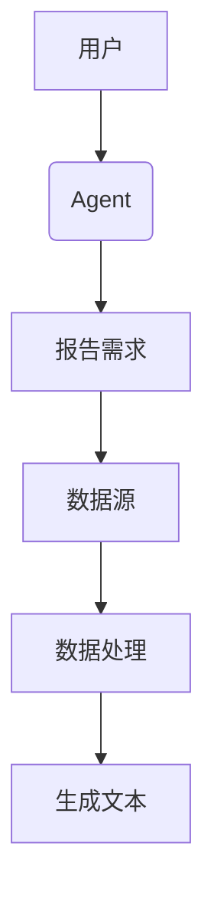
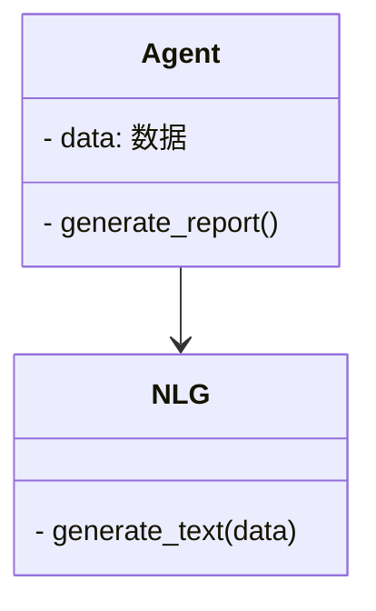
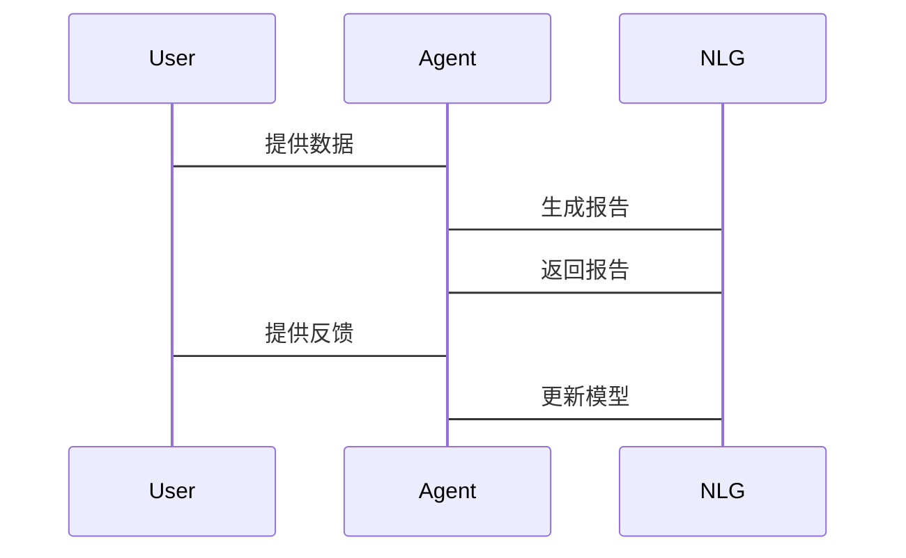

                 


# 企业AI Agent的自然语言生成(NLG)报告系统

## 关键词：企业AI Agent、自然语言生成、报告系统、算法原理、系统架构、项目实战

## 摘要：本文深入探讨了企业AI Agent与自然语言生成技术的结合，详细分析了NLG报告系统的背景、核心概念、算法原理、系统架构设计、项目实战及最佳实践。通过案例分析和代码实现，展示了如何利用AI Agent提升企业的报告生成效率和智能化水平。

---

# 第1章: 企业AI Agent与自然语言生成(NLG)概述

## 1.1 企业AI Agent的背景与概念

### 1.1.1 AI Agent的基本概念
AI Agent（人工智能代理）是能够感知环境并采取行动以实现目标的智能实体。在企业环境中，AI Agent通常用于自动化决策、数据处理和任务执行。

### 1.1.2 企业AI Agent的核心特征
- **自主性**：能够独立决策和执行任务。
- **反应性**：实时感知环境变化并做出响应。
- **学习能力**：通过数据和经验不断优化性能。

### 1.1.3 企业AI Agent的应用场景
- 数据分析与报告生成。
- 自动化任务处理。
- 客户服务与支持。

## 1.2 自然语言生成(NLG)的定义与特点

### 1.2.1 自然语言生成的基本概念
NLG是指将结构化数据转化为自然语言文本的技术，常见于报告、摘要和对话生成。

### 1.2.2 NLG的核心技术与方法
- **基于规则的生成**：通过预定义的规则生成文本。
- **统计模型**：利用概率模型预测文本。
- **生成式模型**：使用深度学习生成多样化文本。

### 1.2.3 NLG在企业中的应用价值
- 提高报告生成效率。
- 优化数据可视化。
- 支持决策制定。

## 1.3 企业AI Agent与NLG的结合

### 1.3.1 AI Agent与NLG的协同工作原理
AI Agent通过分析数据并生成自然语言报告，NLG作为其核心模块之一。

### 1.3.2 企业AI Agent中NLG的应用模式
- 数据驱动报告生成。
- 交互式报告定制。
- 实时数据监控与反馈。

### 1.3.3 企业AI Agent NLG系统的整体架构
- **数据输入**：接收结构化数据。
- **数据处理**：分析和理解数据。
- **文本生成**：生成自然语言报告。
- **输出与反馈**：提供报告并收集用户反馈。

## 1.4 本章小结
本章介绍了企业AI Agent和NLG的基本概念、特点及其在企业中的应用，为后续章节奠定了基础。

---

# 第2章: 企业AI Agent NLG系统的背景与问题分析

## 2.1 问题背景与目标

### 2.1.1 企业报告生成的痛点
- 手动报告生成耗时且效率低。
- 数据分析复杂，难以快速生成报告。
- 报告内容缺乏个性化和动态调整。

### 2.1.2 AI Agent NLG系统的提出
- 提供自动化报告生成解决方案。
- 优化企业数据处理流程。
- 提高决策效率。

## 2.2 问题描述与解决方案

### 2.2.1 传统报告生成的局限性
- 依赖人工操作，效率低下。
- 数据分析深度不足，报告内容单一。
- 缺乏灵活性，难以满足个性化需求。

### 2.2.2 AI Agent NLG系统的解决方案
- 自动化数据处理与报告生成。
- 利用AI技术提升报告质量。
- 提供个性化和动态调整功能。

## 2.3 边界与外延

### 2.3.1 系统的边界定义
- 输入：结构化数据和用户需求。
- 输出：自然语言报告。

### 2.3.2 系统的外延与扩展性
- 支持多种数据源和格式。
- 提供多语言生成能力。
- 集成第三方API扩展功能。

## 2.4 核心概念与组成要素

### 2.4.1 核心概念的定义与属性
- **数据源**：结构化数据输入。
- **NLG引擎**：文本生成模块。
- **用户反馈**：用于优化生成结果。

### 2.4.2 核心要素的组成与关系
- 数据源提供输入，NLG引擎生成文本，用户反馈用于优化系统。

## 2.5 本章小结
本章分析了企业AI Agent NLG系统的背景和问题，明确了系统的边界与核心要素。

---

# 第3章: 企业AI Agent NLG系统的核心概念与联系

## 3.1 核心概念的原理

### 3.1.1 AI Agent的智能决策机制
AI Agent通过分析数据并生成自然语言报告，结合用户反馈不断优化生成结果。

### 3.1.2 NLG的文本生成原理
NLG通过分析数据结构，选择合适的词汇和句式生成自然语言文本。

### 3.1.3 两者的协同工作流程
1. 数据输入：AI Agent接收结构化数据。
2. 数据处理：AI Agent分析数据并生成报告需求。
3. 文本生成：NLG引擎生成自然语言报告。
4. 输出与反馈：用户接收报告并提供反馈。

## 3.2 核心概念的属性特征对比

| 特性 | AI Agent | NLG |
|------|----------|-----|
| 输入 | 结构化数据 | 数据结构 |
| 输出 | 自然语言报告 | 文本 |
| 功能 | 数据分析与决策 | 文本生成 |
| 学习能力 | 有 | 有 |

### 3.2.3 ER实体关系图


## 3.3 本章小结
本章详细分析了企业AI Agent和NLG的核心概念及其协同工作原理，并展示了实体关系图。

---

# 第4章: 企业AI Agent NLG系统的算法原理

## 4.1 算法原理概述

### 4.1.1 生成式模型
生成式模型（如GPT）通过概率分布生成文本。

### 4.1.2 序列到序列模型
序列到序列模型（如Transformer）将输入序列映射到输出序列。

## 4.2 算法原理的数学模型

### 4.2.1 生成式模型的数学表达
$$ P(y|x) = \text{模型}(x) $$

### 4.2.2 序列到序列模型的数学表达
$$ P(y_1, y_2, ..., y_n | x_1, x_2, ..., x_m) $$

## 4.3 算法实现

### 4.3.1 环境安装
```bash
pip install transformers
```

### 4.3.2 核心代码实现
```python
from transformers import pipeline

# 初始化模型
generator = pipeline('text-generation', model='gpt2')

# 生成文本
def generate_report(data):
    prompt = f"Generate a report based on {data}"
    return generator(prompt, max_length=500)[0]['generated_text']
```

## 4.4 算法优化与改进

### 4.4.1 参数调整
调整模型超参数以提高生成质量。

### 4.4.2 多样性优化
使用beam search生成多样化结果。

## 4.5 本章小结
本章详细讲解了企业AI Agent NLG系统的算法原理，并通过代码示例展示了实现过程。

---

# 第5章: 企业AI Agent NLG系统的系统架构设计

## 5.1 系统架构概述

### 5.1.1 系统模块划分
- 数据处理模块
- 自然语言生成模块
- 用户交互模块

### 5.1.2 系统架构图


## 5.2 系统功能设计

### 5.2.1 系统功能模块
- 数据输入模块
- 数据处理模块
- 文本生成模块
- 输出模块

### 5.2.2 系统功能流程
1. 数据输入：接收结构化数据。
2. 数据处理：解析并分析数据。
3. 文本生成：生成自然语言报告。
4. 输出：展示报告并收集反馈。

## 5.3 系统接口设计

### 5.3.1 系统接口描述
- 输入接口：接收结构化数据。
- 输出接口：展示生成文本。
- 反馈接口：收集用户反馈。

### 5.3.2 系统交互流程图


## 5.4 本章小结
本章详细设计了企业AI Agent NLG系统的架构，并展示了模块划分和交互流程。

---

# 第6章: 企业AI Agent NLG系统的项目实战

## 6.1 项目介绍

### 6.1.1 项目背景
以销售数据分析与报告生成为例。

## 6.2 系统核心实现

### 6.2.1 环境配置
```bash
pip install transformers pandas
```

### 6.2.2 核心代码实现
```python
import pandas as pd
from transformers import pipeline

# 数据加载
data = pd.read_csv('sales_data.csv')

# 初始化模型
generator = pipeline('text-generation', model='gpt2')

# 生成报告
def generate_sales_report(data):
    prompt = f"Generate a sales report based on the following data: {data.head()}"
    return generator(prompt, max_length=500)[0]['generated_text']

# 执行生成
report = generate_sales_report(data)
print(report)
```

## 6.3 项目案例分析

### 6.3.1 案例分析
生成销售报告并分析其准确性和可读性。

### 6.3.2 代码应用解读
解读代码实现的关键部分，分析模型选择和数据处理逻辑。

## 6.4 本章小结
本章通过具体案例展示了企业AI Agent NLG系统的实现过程，提供了代码和案例分析。

---

# 第7章: 企业AI Agent NLG系统的最佳实践与注意事项

## 7.1 最佳实践

### 7.1.1 数据质量管理
确保数据准确性和完整性。

### 7.1.2 模型优化
定期更新模型以保持生成质量。

## 7.2 注意事项

### 7.2.1 数据隐私
确保数据处理符合隐私保护要求。

### 7.2.2 系统稳定性
保证系统在高负载下的稳定运行。

## 7.3 小结
本章总结了企业AI Agent NLG系统的最佳实践和注意事项，帮助读者优化系统性能。

---

# 第8章: 企业AI Agent NLG系统的未来趋势与挑战

## 8.1 未来趋势

### 8.1.1 多模态生成
结合视觉和语言生成多模态内容。

### 8.1.2 可解释性增强
提高生成过程的透明度和可解释性。

## 8.2 挑战

### 8.2.1 数据多样性
处理多样化数据源的挑战。

### 8.2.2 模型实时性
提高生成速度以满足实时需求。

## 8.3 小结
本章探讨了企业AI Agent NLG系统的未来发展方向和可能面临的挑战。

---

# 附录

## 附录A: 常见问题解答

## 附录B: 进一步阅读资料

## 附录C: 参考文献

---

# 结语

企业AI Agent NLG系统的应用前景广阔，通过不断优化算法和系统架构，将进一步推动企业智能化发展。

