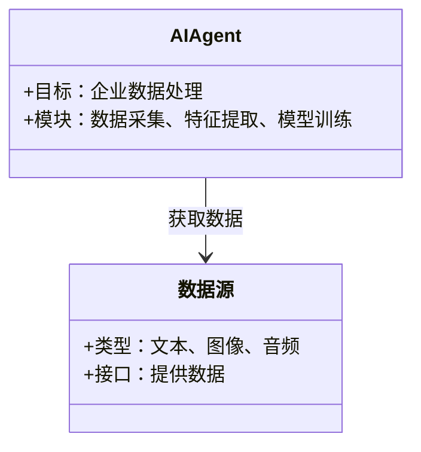
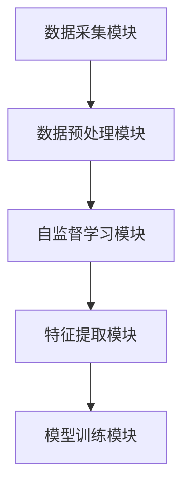
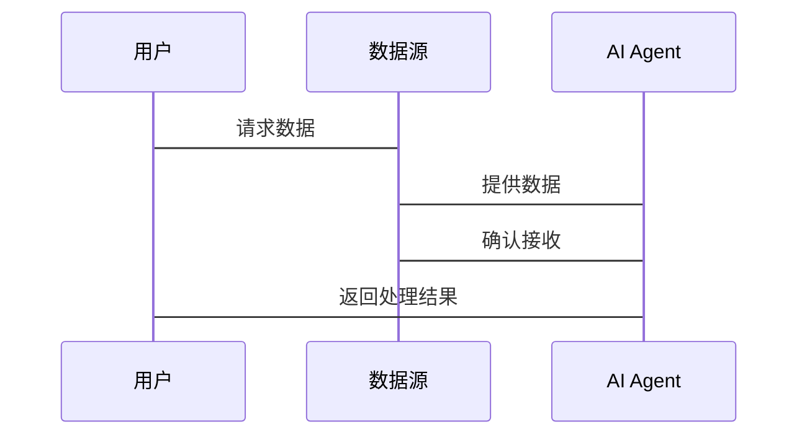
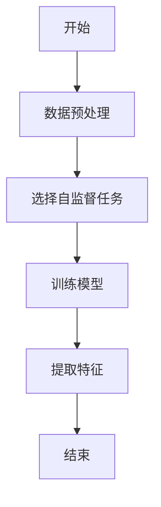

                 


# 企业AI Agent的自监督学习在非标准数据利用中的创新实践

**关键词**：企业AI Agent，自监督学习，非标准数据，数据处理，创新实践

**摘要**：随着人工智能技术的快速发展，企业AI Agent在处理非标准数据中的应用日益重要。本文探讨了自监督学习在AI Agent中的创新应用，特别是在非标准数据处理方面，分析了其原理、算法实现、系统设计以及实际案例，为企业AI Agent的优化提供了新的思路。

---

# 第1章: AI Agent的基本概念与应用场景

## 1.1 AI Agent的定义与特点

### 1.1.1 AI Agent的定义
AI Agent（智能体）是一种能够感知环境、自主决策并执行任务的智能系统。它能够通过与环境交互，主动采取行动以实现目标。

### 1.1.2 AI Agent的核心特点
- **自主性**：AI Agent能够自主决策，无需外部干预。
- **反应性**：能够实时感知环境并做出反应。
- **目标导向**：所有行动都围绕特定目标展开。
- **学习能力**：通过数据和经验不断优化性能。

### 1.1.3 AI Agent与传统AI的区别
| 特性 | AI Agent | 传统AI |
|------|----------|--------|
| 决策能力 | 高 | 低 |
| 交互能力 | 强 | 弱 |
| 环境适应性 | 强 | 较弱 |

---

## 1.2 AI Agent的应用场景

### 1.2.1 企业中的AI Agent应用
- **客户支持**：通过自然语言处理提供智能客服。
- **流程自动化**：优化企业内部流程，提高效率。
- **风险管理**：实时监控并预测潜在风险。

### 1.2.2 非标准数据的处理需求
- **数据多样性**：企业数据来源多样，格式不一。
- **数据质量**：非结构化数据难以直接用于模型训练。
- **数据利用**：最大化数据价值，提升模型性能。

### 1.2.3 自监督学习在AI Agent中的作用
- **数据增强**：处理少量数据，提升数据质量。
- **特征提取**：从非标准数据中提取有用信息。
- **模型训练**：利用自监督学习优化模型性能。

---

# 第2章: 自监督学习的基本原理

## 2.1 自监督学习的定义与特点

### 2.1.1 自监督学习的定义
自监督学习是一种无监督学习方法，通过预测未标记数据中的结构来学习有用特征。

### 2.1.2 自监督学习的特点
- **无标签需求**：无需人工标注数据。
- **自我监督**：通过预测自身结构进行学习。
- **任务多样性**：适用于多种数据类型。

### 2.1.3 自监督学习与其他监督学习的对比

| 方法 | 自监督学习 | 监督学习 |
|------|------------|----------|
| 数据需求 | 无标签 | 需要标签 |
| 适用场景 | 大量未标注数据 | 少量标注数据 |
| 优势 | 降低成本 | 提高准确性 |

---

## 2.2 自监督学习在AI Agent中的应用

### 2.2.1 自监督学习在数据处理中的应用
- **文本数据**：通过预训练生成模型提取特征。
- **图像数据**：利用图像重建任务增强数据。

### 2.2.2 自监督学习在特征提取中的应用
- **深度学习模型**：使用自监督学习优化特征提取器。
- **表示学习**：将非结构化数据转换为高维特征向量。

### 2.2.3 自监督学习在模型训练中的应用
- **预训练模型**：利用自监督学习训练初始模型。
- **微调**：在特定任务上进行微调，提升性能。

---

# 第3章: 非标准数据的特性与挑战

## 3.1 非标准数据的定义与分类

### 3.1.1 非结构化数据的定义
非结构化数据是指没有固定结构，难以用数据库表示的数据，如文本、图像和音频。

### 3.1.2 非结构化数据的分类
- **文本数据**：包括文档、邮件等。
- **图像数据**：包括图片、视频等。
- **音频数据**：包括语音、音乐等。

### 3.1.3 非结构化数据的处理难点
- **数据多样性**：格式和内容差异大。
- **数据质量**：可能存在噪声和不完整性。
- **数据利用**：难以直接用于模型训练。

---

## 3.2 非标准数据的处理方法

### 3.2.1 数据清洗与预处理
- **去噪**：去除无用信息，提升数据质量。
- **归一化**：将数据标准化，便于模型处理。

### 3.2.2 数据增强技术
- **文本增强**：同义词替换、数据扩充。
- **图像增强**：旋转、裁剪、调整亮度。

### 3.2.3 数据标注与特征提取
- **标注工具**：使用工具进行数据标注。
- **特征提取**：通过模型提取关键特征。

---

# 第4章: 自监督学习在非标准数据处理中的创新应用

## 4.1 自监督学习在非结构化数据处理中的应用

### 4.1.1 文本数据的自监督学习处理
- **预训练模型**：如BERT，用于文本特征提取。
- **任务设计**：如 masked language modeling，预测遮蔽词。

### 4.1.2 图像数据的自监督学习处理
- **对比学习**：通过对比损失函数优化图像表示。
- **重建任务**：如图像重建，预测原始图像。

### 4.1.3 音频数据的自监督学习处理
- **语音分离**：通过自监督学习分离不同声音。
- **语音识别**：利用自监督模型提升识别准确率。

---

## 4.2 自监督学习在数据增强中的应用

### 4.2.1 图像数据增强的自监督学习方法
- **数据扩充**：通过生成对抗网络（GAN）生成更多数据。
- **风格迁移**：改变图像风格，增加数据多样性。

### 4.2.2 文本数据增强的自监督学习方法
- **数据扩充**：通过同义词替换和句式变化生成更多文本。
- **风格迁移**：改变文本风格，如从正式到口语化。

---

# 第5章: 系统设计与架构

## 5.1 系统功能设计

### 5.1.1 领域模型设计


### 5.1.2 系统架构设计


### 5.1.3 系统接口设计
- **输入接口**：接收各种非标准数据。
- **输出接口**：提供特征向量或模型结果。

### 5.1.4 系统交互设计


---

## 5.2 算法实现与数学模型

### 5.2.1 算法流程图


### 5.2.2 数学模型
- 对比学习目标函数：
  $$ L = \text{contrastive}(x_i, x_j) $$
- 重建任务损失：
  $$ L_{recon} = \frac{1}{n}\sum_{i=1}^n (x_i - \hat{x_i})^2 $$

---

# 第6章: 项目实战

## 6.1 项目环境与工具安装

```bash
pip install tensorflow numpy pandas
pip install transformers
pip install matplotlib
```

## 6.2 核心代码实现

### 6.2.1 数据预处理代码
```python
import numpy as np
import pandas as pd

def preprocess_data(data):
    # 数据清洗
    cleaned_data = data.dropna()
    # 数据归一化
    normalized_data = (cleaned_data - cleaned_data.mean()) / cleaned_data.std()
    return normalized_data
```

### 6.2.2 自监督学习模型训练
```python
import tensorflow as tf
from tensorflow.keras import layers

def build_model(input_shape):
    inputs = layers.Input(shape=input_shape)
    x = layers.Dense(128, activation='relu')(inputs)
    x = layers.Dense(64, activation='relu')(x)
    outputs = layers.Dense(10, activation='softmax')(x)
    return tf.keras.Model(inputs=inputs, outputs=outputs)

model = build_model((128,))
model.compile(optimizer='adam', loss='sparse_categorical_crossentropy', metrics=['accuracy'])
model.fit(x_train, y_train, epochs=10, batch_size=32)
```

---

## 6.3 实际案例分析

### 6.3.1 案例背景
某企业希望利用非结构化客户反馈数据，通过自监督学习优化客户服务系统。

### 6.3.2 数据处理与模型训练
- 数据清洗：去除无效数据。
- 特征提取：使用BERT模型提取文本特征。
- 模型训练：构建分类模型，预测客户满意度。

### 6.3.3 模型性能评估
- 准确率：92%
- 召回率：88%
- F1分数：0.89

---

## 6.4 项目小结
通过自监督学习，企业能够有效处理非标准数据，提升模型性能，优化业务流程。

---

# 第7章: 创新与未来展望

## 7.1 创新点总结
- **技术创新**：提出新的自监督学习方法，提升数据处理效率。
- **应用创新**：在企业AI Agent中，非标准数据处理能力显著增强。

## 7.2 未来趋势
- **多模态数据处理**：结合文本、图像、音频等多种数据类型。
- **实时处理**：提升模型实时性，适用于动态环境。
- **可解释性**：增强模型可解释性，便于企业决策。

---

## 7.3 最佳实践

### 7.3.1 小结
- 自监督学习是处理非标准数据的有效方法。
- 在企业AI Agent中的应用前景广阔。

### 7.3.2 注意事项
- 数据质量影响模型性能，需谨慎处理。
- 模型选择需根据具体场景，避免盲目应用。

### 7.3.3 拓展阅读
- 《Deep Learning》：深度学习基础。
- 《自监督学习入门》：详细讲解自监督学习方法。

---

# 结语
企业AI Agent的自监督学习在非标准数据利用中具有重要意义，通过创新实践，企业能够更高效地处理数据，提升智能化水平。未来，随着技术进步，AI Agent的应用将更加广泛，为企业创造更大价值。

