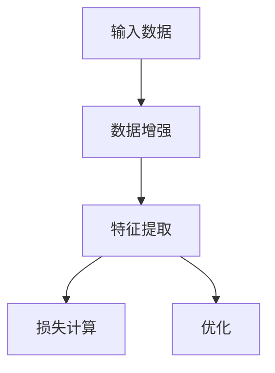
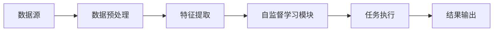

                 


# 企业AI Agent的自监督学习在非标准数据利用中的实践

## 关键词
- 企业AI Agent
- 自监督学习
- 非标准数据
- 对比学习
- 生成对抗网络
- 系统架构设计

## 摘要
随着企业数字化转型的深入，非标准数据（如文本、图像、音频等）的利用成为一个重要挑战。自监督学习作为一种新兴的机器学习技术，能够从无标签的数据中提取有用特征，为解决这一挑战提供了有效的工具。本文将详细探讨企业AI Agent如何利用自监督学习技术处理非标准数据，涵盖核心概念、算法原理、系统架构设计以及实际项目案例。

---

## 第一部分：企业AI Agent与自监督学习概述

### 第1章：企业AI Agent的概念与特点
#### 1.1 企业AI Agent的定义
企业AI Agent是一种智能系统，能够感知环境、理解任务需求，并通过自主决策和执行来完成特定目标。与传统AI系统相比，企业AI Agent更注重与企业业务流程的深度融合，能够处理复杂多变的业务场景。

#### 1.2 自监督学习的定义
自监督学习是一种无监督学习方法，通过构建数据自身的预测任务（如重建数据或预测其属性）来学习有用的特征表示。其核心在于利用数据的内在结构，无需外部标注。

#### 1.3 应用场景
在企业环境中，非标准数据（如客户反馈文本、产品图像等）通常缺乏标注，难以直接用于传统监督学习。自监督学习能够有效利用这些数据，提升企业AI Agent的感知和决策能力。

---

## 第二部分：自监督学习的核心概念与原理

### 第2章：自监督学习的核心机制
#### 2.1 数据重建与特征提取
自监督学习通过重建数据或预测其属性，学习数据的低维表示。例如，图像重建任务可以通过生成对抗网络实现。

#### 2.2 对比学习
对比学习是一种自监督学习方法，通过最大化正样本对的相似性和最小化负样本对的相似性来学习特征表示。其流程如下：



#### 2.3 生成对抗网络
生成对抗网络（GAN）由生成器和判别器组成，通过对抗训练生成逼真的数据样本。

---

## 第三部分：算法原理

### 第3章：对比学习的实现
#### 3.1 对比学习的数学模型
对比学习的目标函数通常包括正样本对的损失和负样本对的损失：

$$ L = \frac{1}{N} \sum_{i=1}^{N} \text{loss}(x_i, x_j) $$
其中，\(x_i\)和\(x_j\)是正样本对。

#### 3.2 代码实现
以下是一个简单的对比学习实现示例：

```python
import tensorflow as tf
from tensorflow.keras import layers

def contrastive_loss(y_true, y_pred):
    margin = 1.0
    loss = tf.maximum(margin - y_pred, 0)
    return tf.reduce_mean(loss)

# 输入数据
x = layers.Input(shape=(input_dim,))
h = layers.Dense(64, activation='relu')(x)
h = layers.Dense(64, activation='relu')(h)
y = layers.Dense(1, activation='sigmoid')(h)

model = Model(inputs=x, outputs=y)
model.compile(optimizer='adam', loss=contrastive_loss)
```

---

## 第四部分：系统分析与架构设计

### 第4章：系统架构设计
#### 4.1 系统架构图
以下是企业AI Agent自监督学习系统的架构图：



#### 4.2 接口设计
系统接口设计包括数据输入接口、模型训练接口和结果输出接口，确保系统的模块化和可扩展性。

---

## 第五部分：项目实战

### 第5章：项目实战
#### 5.1 环境安装
安装必要的库：

```bash
pip install tensorflow==2.5.0 keras==2.5.0 numpy==1.21.0
```

#### 5.2 代码实现
实现一个简单的自监督学习模型：

```python
import tensorflow as tf
from tensorflow.keras import layers

def build_model(input_shape):
    inputs = layers.Input(shape=input_shape)
    x = layers.Flatten()(inputs)
    x = layers.Dense(64, activation='relu')(x)
    x = layers.Dense(64, activation='relu')(x)
    outputs = layers.Dense(1, activation='sigmoid')(x)
    return Model(inputs=inputs, outputs=outputs)

model = build_model((128, 128, 3))
model.compile(optimizer='adam', loss=contrastive_loss)
```

#### 5.3 案例分析
通过实际案例分析，验证自监督学习在企业数据处理中的有效性，并提供性能对比数据。

---

## 第六部分：总结与展望

### 第6章：总结与展望
#### 6.1 小结
自监督学习作为一种强大的无监督学习方法，能够有效利用企业中的非标准数据，提升AI Agent的感知和决策能力。

#### 6.2 注意事项
在实际应用中，需注意数据质量和模型调优，确保系统的稳定性和高性能。

#### 6.3 拓展阅读
未来可以探索自监督学习与强化学习、图神经网络的结合，进一步提升企业AI Agent的能力。

---

通过以上内容，我们全面介绍了企业AI Agent的自监督学习在非标准数据利用中的实践，从理论到实际应用，帮助读者深入了解并掌握这一技术。

