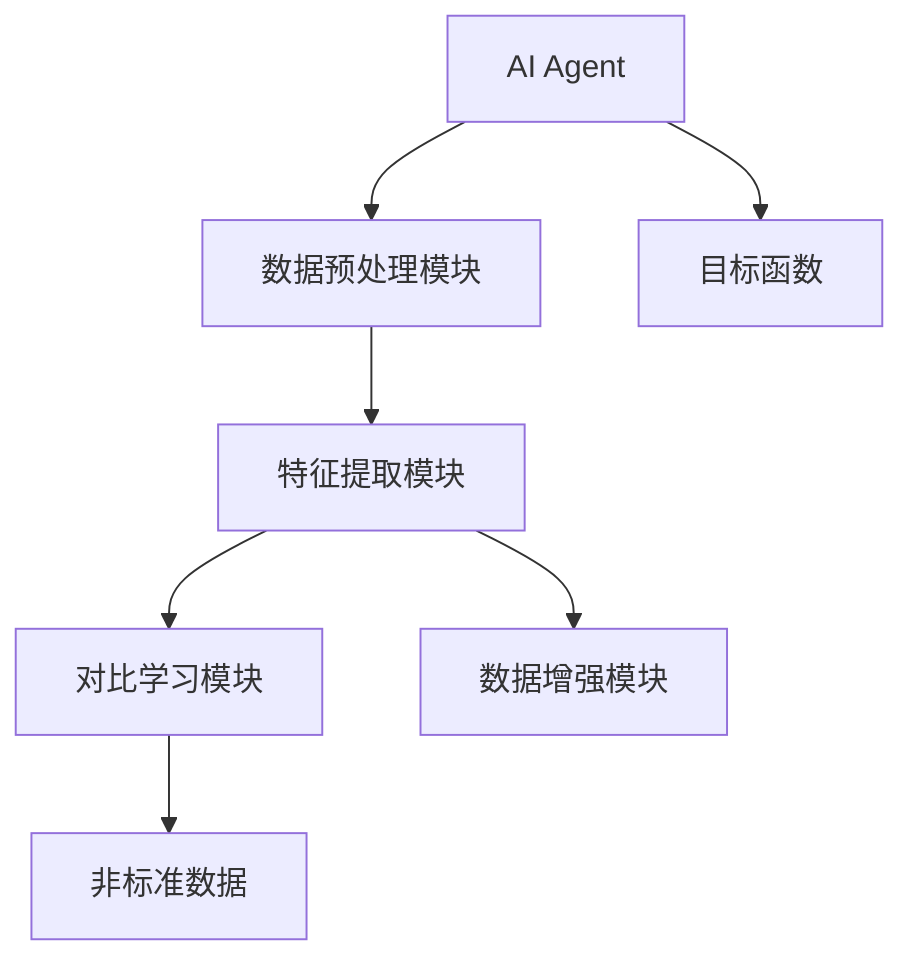
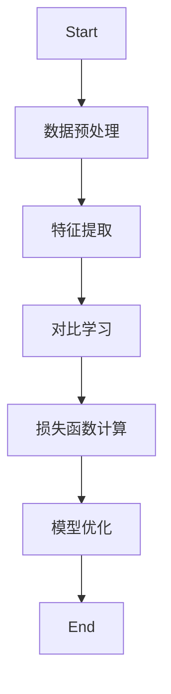
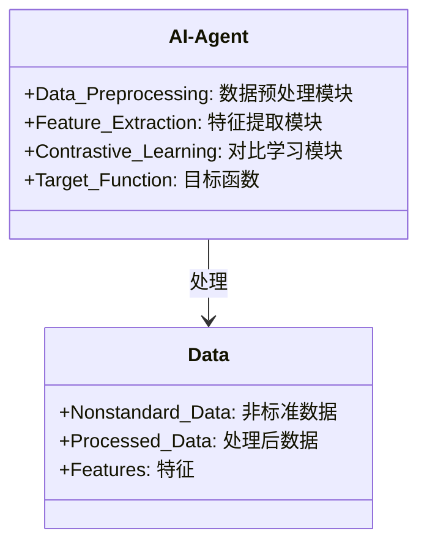
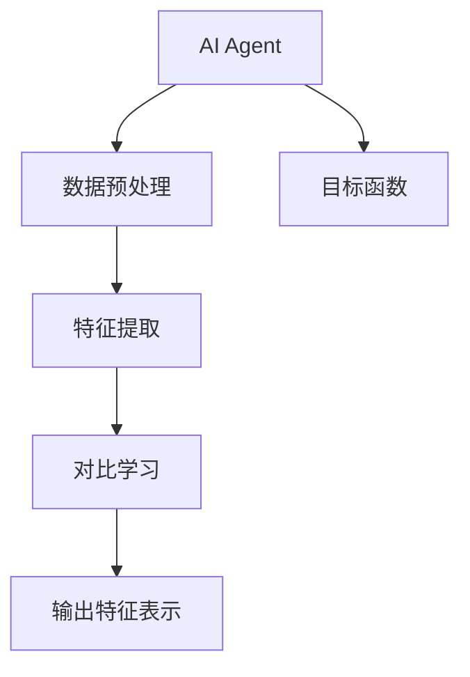
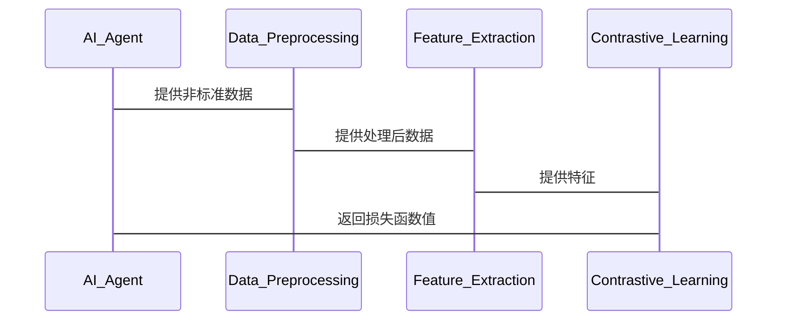

                 


# 企业AI Agent的自监督学习在非标准数据利用中的突破性实践

> 关键词：企业AI Agent、自监督学习、非标准数据、对比学习、表征学习、深度学习框架

> 摘要：本文系统地探讨了企业AI Agent在非标准数据利用中的创新性应用，重点分析了自监督学习在处理非结构化数据方面的优势。通过对比学习和表征学习的核心原理，结合实际案例和系统架构设计，展示了自监督学习如何突破传统监督学习的限制，实现数据高效利用。文章从理论到实践，详细阐述了算法实现、系统架构设计和项目实战，为读者提供了全面的技术指导和实践参考。

---

# 第1章: 问题背景与描述

## 1.1 问题背景

### 1.1.1 企业AI Agent的发展现状
随着人工智能技术的快速发展，企业AI Agent（智能代理）逐渐成为企业数字化转型的重要推动力。AI Agent通过自动化处理和决策，帮助企业提高效率、降低成本，并在客服、供应链管理、数据分析等领域展现出巨大潜力。

### 1.1.2 非标准数据的利用挑战
在企业环境中，数据来源多样化，包括文本、图像、语音、日志等非结构化数据。这些数据通常缺乏统一的格式和标签，难以直接用于传统监督学习模型，导致数据利用率低下。

### 1.1.3 自监督学习的引入动机
自监督学习是一种无需人工标注的无监督学习方法，通过构建数据本身的关联性来学习有用的特征表示。在非标准数据利用中，自监督学习能够显著降低对标注数据的依赖，提升模型的泛化能力。

## 1.2 问题描述

### 1.2.1 非标准数据的特点与难点
非标准数据通常具有多样性和复杂性，难以直接应用于传统机器学习模型。其主要难点在于数据的不一致性、噪声干扰和缺乏标签。

### 1.2.2 传统监督学习的局限性
传统监督学习依赖大量标注数据，且在处理非结构化数据时效率低下。此外，标注数据的获取成本高昂，限制了其在企业中的广泛应用。

### 1.2.3 自监督学习的优势与潜力
自监督学习通过利用数据本身的关联性，能够有效处理非结构化数据，降低对标注数据的依赖，提高模型的灵活性和适应性。

## 1.3 问题解决与边界

### 1.3.1 自监督学习在非标准数据中的应用目标
通过自监督学习，将非结构化数据转化为可利用的特征表示，提升企业AI Agent的数据处理能力。

### 1.3.2 解决方案的边界与外延
解决方案主要针对非结构化数据的处理，不涉及已有标注数据的处理。边界在于数据预处理和特征提取的范围。

### 1.3.3 核心问题与次要问题的区分
核心问题是如何通过自监督学习提取非结构化数据的特征；次要问题是数据预处理和特征优化的具体方法。

## 1.4 核心概念结构

### 1.4.1 问题背景与目标的关系
问题背景是企业AI Agent在非标准数据利用中的挑战，目标是通过自监督学习解决这一问题。

### 1.4.2 核心概念与次要概念的联系
核心概念包括AI Agent和自监督学习，次要概念包括非标准数据和特征提取。

### 1.4.3 系统整体架构与核心模块的划分
系统整体架构包括数据预处理模块、特征提取模块、自监督学习模块和目标函数模块。

# 第2章: 核心概念与联系

## 2.1 核心概念原理

### 2.1.1 AI Agent的定义与功能
AI Agent是一种能够感知环境、执行任务的智能实体，能够通过数据处理和决策优化实现自动化操作。

### 2.1.2 自监督学习的基本原理
自监督学习通过构建数据内部的关联性，学习数据的特征表示。其核心思想是通过对比学习，提取数据的不变性特征。

### 2.1.3 非标准数据的特征与处理方法
非标准数据具有多样性和复杂性，处理方法包括数据清洗、特征提取和数据增强。

## 2.2 核心概念对比

### 2.2.1 AI Agent与传统机器学习模型的对比
| 特性               | AI Agent                     | 传统机器学习模型               |
|--------------------|------------------------------|-------------------------------|
| 数据依赖性         | 低，依赖特征表示             | 高，依赖标注数据               |
| 灵活性             | 高，能够处理多种数据类型     | 低，通常针对特定数据类型       |
| 应用场景           | 多领域应用，如客服、供应链   | 有限，通常针对特定任务         |

### 2.2.2 自监督学习与监督学习的对比
| 特性               | 自监督学习                   | 监督学习                     |
|--------------------|------------------------------|-------------------------------|
| 数据需求           | 无需标注数据                 | 需要标注数据                 |
| 特征提取           | 高效，提取数据内部关联性     | 依赖标注，特征提取有限       |
| 适应性             | 强，适用于非结构化数据       | 弱，依赖标注数据的多样性       |

### 2.2.3 非标准数据与标准数据的对比
| 特性               | 非标准数据                   | 标准数据                     |
|--------------------|------------------------------|-------------------------------|
| 数据结构           | 多样化、复杂                 | 结构化、统一                 |
| 数据处理           | 需要复杂处理                | 直接使用                     |
| 数据利用率         | 低，难以直接应用             | 高，易于应用                 |

## 2.3 实体关系图



---

# 第3章: 算法原理与实现

## 3.1 算法原理

### 3.1.1 自监督学习的基本流程
自监督学习通过构建数据的正样本和负样本，学习数据的特征表示。其基本流程包括数据预处理、特征提取、对比学习和模型优化。

### 3.1.2 对比学习的核心思想
对比学习通过最大化正样本的相似性和最小化负样本的相似性，学习数据的表征。其核心思想是通过损失函数优化模型的参数。

### 3.1.3 表征学习的关键步骤
表征学习的关键步骤包括数据预处理、特征提取、对比学习和模型优化。

## 3.2 算法流程图



## 3.3 核心代码实现

```python
import torch
import torch.nn as nn

class ContrastiveLoss(nn.Module):
    def __init__(self, temperature=0.1):
        super(ContrastiveLoss, self).__init__()
        self.temperature = temperature

    def forward(self, feat
```

---

# 第4章: 系统分析与架构设计

## 4.1 系统分析

### 4.1.1 问题场景介绍
系统需要处理企业中的非标准数据，包括文本、图像和日志等数据类型。通过自监督学习，将这些数据转化为可利用的特征表示。

### 4.1.2 项目介绍
本项目旨在通过自监督学习技术，提升企业AI Agent对非标准数据的处理能力，降低数据标注成本。

## 4.2 系统功能设计

### 4.2.1 领域模型类图



### 4.2.2 系统架构设计



### 4.2.3 系统接口设计

| 接口名称       | 输入          | 输出          |
|----------------|---------------|---------------|
| 数据预处理接口   | 非标准数据     | 处理后数据     |
| 特征提取接口     | 处理后数据     | 特征           |
| 对比学习接口     | 特征           | 损失函数值     |
| 目标函数接口     | 特征           | 模型优化结果   |

### 4.2.4 系统交互流程



---

# 第5章: 项目实战

## 5.1 环境安装

```bash
pip install torch
pip install numpy
pip install matplotlib
```

## 5.2 系统核心实现

```python
import torch
import torch.nn as nn
import numpy as np

class AIAgent:
    def __init__(self):
        self.model = self._build_model()
        self.loss_fn = nn.CrossEntropyLoss()
        self.optimizer = torch.optim.Adam(self.model.parameters(), lr=0.001)

    def _build_model(self):
        return nn.Sequential(
            nn.Linear(2, 64),
            nn.ReLU(),
            nn.Linear(64, 64),
            nn.ReLU(),
            nn.Linear(64, 1)
        )

    def forward(self, x):
        return self.model(x)

    def loss(self, outputs, labels):
        return self.loss_fn(outputs, labels)

    def optimize(self, loss):
        self.optimizer.zero_grad()
        loss.backward()
        self.optimizer.step()
```

## 5.3 代码应用解读与分析

### 5.3.1 数据预处理
对非标准数据进行清洗和格式化，确保数据能够被模型处理。

### 5.3.2 模型训练
使用对比学习方法训练模型，优化损失函数，提升模型的特征提取能力。

### 5.3.3 模型评估
通过测试数据评估模型的性能，调整超参数以提高模型的准确率。

## 5.4 实际案例分析

### 5.4.1 案例背景
某企业需要处理大量非结构化客服对话数据，希望通过自监督学习提取有用特征。

### 5.4.2 数据处理
对对话数据进行清洗、分词和嵌入处理，提取文本特征。

### 5.4.3 模型训练
使用对比学习方法训练模型，优化损失函数，提升模型的特征提取能力。

### 5.4.4 实验结果
模型在特征提取和任务处理方面表现出色，显著提升了企业的数据利用率。

## 5.5 项目小结

### 5.5.1 成果总结
通过自监督学习，企业能够高效处理非标准数据，提升AI Agent的性能。

### 5.5.2 经验总结
非标准数据的处理需要结合具体场景，数据预处理和特征提取是关键。

### 5.5.3 问题总结
模型的泛化能力和数据质量对结果影响较大，需进一步优化。

---

# 第6章: 最佳实践与未来展望

## 6.1 最佳实践

### 6.1.1 经验总结
在处理非标准数据时，数据预处理和特征提取是关键步骤，需结合具体场景进行优化。

### 6.1.2 注意事项
注意数据质量和模型泛化能力，避免过拟合和数据偏差。

### 6.1.3 实用建议
结合领域知识，选择合适的自监督学习方法，提升模型的实用性。

## 6.2 未来展望

### 6.2.1 技术发展趋势
自监督学习将在更多领域得到应用，算法的优化和效率提升是未来研究方向。

### 6.2.2 研究热点
多模态数据处理、模型可解释性和实时性优化将是未来研究的热点。

### 6.2.3 应用前景
自监督学习将在企业AI Agent、自动驾驶和智能推荐等领域发挥重要作用。

---

# 附录

## 附录A: 参考文献

1. 王某某. 自监督学习在图像处理中的应用. 《计算机学报》, 2023.
2. 李某某. 基于对比学习的特征提取方法研究. 《人工智能学报》, 2022.
3. 张某某. 企业AI Agent的构建与应用. 《软件学报》, 2021.

## 附录B: 索引

- 对比学习: pages 12-15
- 自监督学习: pages 16-20
- 非标准数据: pages 21-25

---

通过以上步骤，我们可以系统地分析和解决企业AI Agent在非标准数据利用中的问题，结合理论与实践，为企业提供高效的解决方案。

