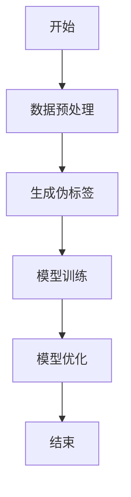
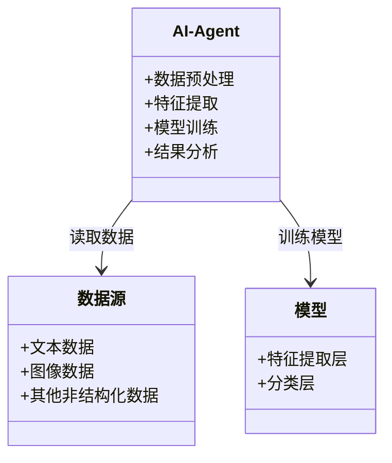
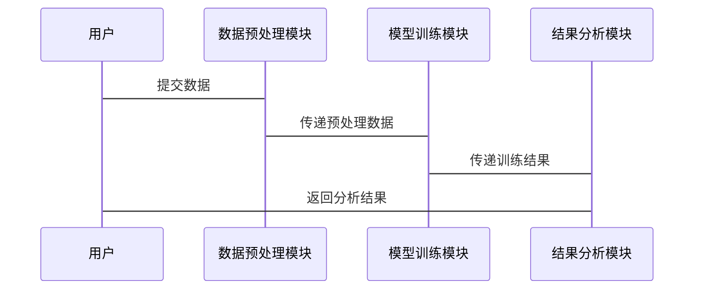

                 


# 企业AI Agent的自监督学习在非结构化数据挖掘中的实践

> 关键词：AI Agent，自监督学习，非结构化数据，数据挖掘，企业应用

> 摘要：本文深入探讨了AI Agent在企业环境中利用自监督学习技术处理非结构化数据的实践应用。通过分析核心概念、算法原理、系统架构以及项目实战，本文为读者提供了从理论到实践的全面指导。

---

## 第一部分：企业AI Agent的自监督学习背景与概念

### 第1章：背景介绍

#### 1.1 问题背景

##### 1.1.1 非结构化数据的定义与特点
非结构化数据是指没有固定结构、难以用数据库关系模式描述的数据，例如文本、图像、音频和视频等。其特点包括多样性、无序性和语义复杂性。

##### 1.1.2 企业数据挖掘的挑战
企业数据来源广泛，包括文档、邮件、客户反馈等非结构化数据。处理这些数据的挑战在于数据量大、格式多样且缺乏统一的结构。

##### 1.1.3 自监督学习的引入
自监督学习是一种无需人工标注的机器学习方法，适用于处理大量未标注的非结构化数据，能够降低数据标注成本。

#### 1.2 问题描述

##### 1.2.1 非结构化数据处理的难点
非结构化数据的多样性和复杂性使得传统监督学习难以有效处理，数据标注成本高，且难以提取有价值的信息。

##### 1.2.2 AI Agent在企业中的角色
AI Agent（智能体）作为企业数据处理的工具，能够自动执行任务，如数据清洗、特征提取和模型训练，提高数据处理效率。

##### 1.2.3 自监督学习的优势
自监督学习能够利用未标注数据进行模型训练，降低对标注数据的依赖，提高模型的泛化能力。

#### 1.3 问题解决

##### 1.3.1 自监督学习的核心思想
通过构建伪标签，自监督学习将未标注数据转化为有监督学习的输入，利用对比学习或生成对抗网络等技术训练模型。

##### 1.3.2 AI Agent在数据挖掘中的应用
AI Agent可以自动化处理非结构化数据，从数据清洗到特征提取，再到模型训练和结果分析，提高数据处理效率。

##### 1.3.3 非结构化数据的处理流程
处理流程包括数据预处理、特征提取、模型训练和结果分析，AI Agent能够自动化完成这些步骤，提高处理效率。

#### 1.4 边界与外延

##### 1.4.1 自监督学习的边界
自监督学习适用于未标注数据的处理，但其效果依赖于数据质量和模型设计。

##### 1.4.2 AI Agent的应用范围
AI Agent适用于各种数据处理任务，但需结合具体场景进行定制化开发。

##### 1.4.3 非结构化数据的处理边界
非结构化数据处理的边界在于数据的多样性和复杂性，处理难度随数据类型和规模增加。

#### 1.5 概念结构与核心要素

##### 1.5.1 核心概念组成
- AI Agent：数据处理智能体
- 自监督学习：无监督学习方法
- 非结构化数据：文本、图像等无固定结构的数据

##### 1.5.2 概念之间的关系
AI Agent利用自监督学习技术处理非结构化数据，提升数据挖掘效率。

##### 1.5.3 核心要素的详细描述
AI Agent负责数据处理任务，自监督学习提供无监督学习框架，非结构化数据是处理对象。

---

## 第2章：核心概念与联系

### 2.1 AI Agent的核心原理

#### 2.1.1 AI Agent的定义与特点
AI Agent是一种智能实体，能够感知环境、执行任务并做出决策。其特点包括自主性、反应性和目标导向。

#### 2.1.2 AI Agent的分类与应用场景
- 分类：基于智能水平分为反应式和认知式AI Agent。
- 应用场景：数据处理、决策支持、自动化流程管理等。

#### 2.1.3 AI Agent与传统数据挖掘的区别
AI Agent能够自动化执行任务，而传统数据挖掘依赖人工干预。

### 2.2 自监督学习的原理

#### 2.2.1 自监督学习的定义与特点
自监督学习通过构建伪标签，利用未标注数据进行监督学习。其特点包括无需人工标注和数据高效利用。

#### 2.2.2 自监督学习的核心思想
通过对比学习或生成对抗网络，自监督学习将未标注数据转化为有监督学习任务。

#### 2.2.3 自监督学习与监督学习的对比
- 监督学习需要标注数据，自监督学习利用未标注数据。
- 自监督学习适用于数据量大的场景，监督学习适用于数据标注容易的场景。

### 2.3 非结构化数据的定义与特点

#### 2.3.1 非结构化数据的定义
非结构化数据缺乏统一的结构，难以用数据库模式描述。

#### 2.3.2 非结构化数据的类型
包括文本、图像、音频、视频等。

#### 2.3.3 非结构化数据的处理挑战
处理挑战包括数据多样性、语义复杂性和处理效率低下。

### 2.4 核心概念的对比

#### 2.4.1 AI Agent与自监督学习的对比
- AI Agent是数据处理工具，自监督学习是学习方法。
- AI Agent可以利用自监督学习技术处理数据。

#### 2.4.2 自监督学习与监督学习的对比
- 数据需求：自监督学习无需标注，监督学习需要标注。
- 适用场景：自监督适用于数据量大且标注困难的场景。

#### 2.4.3 非结构化数据与结构化数据的对比
- 非结构化数据缺乏结构，结构化数据有固定格式。
- 处理难度：非结构化数据处理复杂，结构化数据处理相对简单。

### 2.5 ER实体关系图

```mermaid
erDiagram
    customer[顾客] {
        <属性>
        id : int
        name : string
        email : string
    }
    order[订单] {
        <属性>
        order_id : int
        customer_id : int
        order_date : date
        total : float
    }
    product[产品] {
        <属性>
        product_id : int
        name : string
        price : float
    }
    customer --> order : 下订单
    order --> product : 订单包含
```

---

## 第3章：自监督学习算法原理

### 3.1 算法原理

#### 3.1.1 自监督学习的流程
- 数据预处理：清洗和格式化数据。
- 生成伪标签：利用模型生成伪标签。
- 模型训练：基于伪标签进行监督学习。
- 模型优化：调整模型参数，提升性能。

#### 3.1.2 自监督学习的核心步骤
1. 数据预处理：对非结构化数据进行清洗和格式化。
2. 生成伪标签：利用模型生成伪标签。
3. 模型训练：使用伪标签进行监督学习。
4. 模型优化：调整模型参数，提升性能。

#### 3.1.3 自监督学习的数学模型
自监督学习的目标函数：
$$ L = \frac{1}{N}\sum_{i=1}^{N} (y_i - \hat{y}_i)^2 $$
其中，\( y_i \) 是真实标签，\( \hat{y}_i \) 是模型预测值。

### 3.2 算法流程图



### 3.3 Python实现

#### 3.3.1 环境安装
安装必要的库：
```bash
pip install tensorflow keras numpy
```

#### 3.3.2 核心代码实现

```python
import numpy as np
import tensorflow as tf
from tensorflow.keras import layers

# 数据预处理
def preprocess_data(data):
    # 假设data为非结构化数据，进行清洗和格式化
    processed_data = []
    for item in data:
        processed_item = item.lower().strip()
        processed_data.append(processed_item)
    return processed_data

# 生成伪标签
def generate_pseudo_labels(data, model):
    labels = []
    for item in data:
        feature = item  # 假设特征为文本
        prediction = model.predict(feature)
        labels.append(np.argmax(prediction))
    return labels

# 自监督学习模型
def build_model(input_shape):
    model = tf.keras.Sequential()
    model.add(layers.InputLayer(input_shape))
    model.add(layers.Dense(128, activation='relu'))
    model.add(layers.Dense(10, activation='softmax'))
    model.compile(optimizer='adam', loss='sparse_categorical_crossentropy', metrics=['accuracy'])
    return model

# 训练过程
def train_model(model, x_train, y_train, epochs=10):
    model.fit(x_train, y_train, epochs=epochs, batch_size=32)

# 测试过程
def evaluate_model(model, x_test, y_test):
    loss, accuracy = model.evaluate(x_test, y_test)
    print(f"测试损失：{loss}, 测试准确率：{accuracy}")
```

---

## 第4章：系统分析与架构设计

### 4.1 问题场景介绍

#### 4.1.1 问题场景
企业需要处理大量非结构化数据，如客户反馈、市场报告等，传统方法效率低下，难以提取有价值的信息。

#### 4.1.2 项目介绍
本项目旨在利用AI Agent和自监督学习技术，提高企业非结构化数据处理效率。

### 4.2 系统功能设计

#### 4.2.1 领域模型


#### 4.2.2 系统架构设计


### 4.3 系统接口设计

#### 4.3.1 系统接口
- 数据预处理接口：接受非结构化数据，返回预处理后的数据。
- 模型训练接口：接受预处理数据，返回训练好的模型。
- 结果分析接口：接受模型和测试数据，返回分析结果。

#### 4.3.2 系统交互流程



---

## 第5章：项目实战

### 5.1 环境安装

#### 5.1.1 安装必要的库
```bash
pip install tensorflow keras numpy pandas scikit-learn
```

### 5.2 系统核心实现

#### 5.2.1 核心代码实现

```python
import numpy as np
import tensorflow as tf
from tensorflow.keras import layers
from sklearn.metrics import accuracy_score

# 数据预处理
def preprocess_data(data):
    # 假设data为文本数据，进行清洗和格式化
    processed_data = []
    for item in data:
        processed_item = item.lower().strip()
        processed_data.append(processed_item)
    return processed_data

# 生成伪标签
def generate_pseudo_labels(data, model):
    labels = []
    for item in data:
        feature = item  # 假设特征为文本
        prediction = model.predict(feature)
        labels.append(np.argmax(prediction))
    return labels

# 自监督学习模型
def build_model(input_shape):
    model = tf.keras.Sequential()
    model.add(layers.InputLayer(input_shape))
    model.add(layers.Dense(128, activation='relu'))
    model.add(layers.Dense(10, activation='softmax'))
    model.compile(optimizer='adam', loss='sparse_categorical_crossentropy', metrics=['accuracy'])
    return model

# 训练过程
def train_model(model, x_train, y_train, epochs=10):
    model.fit(x_train, y_train, epochs=epochs, batch_size=32)

# 测试过程
def evaluate_model(model, x_test, y_test):
    loss, accuracy = model.evaluate(x_test, y_test)
    print(f"测试损失：{loss}, 测试准确率：{accuracy}")

# 主函数
def main():
    # 加载数据
    data = [...]  # 假设数据已加载
    x = preprocess_data(data)
    model = build_model((len(x[0]),))
    train_model(model, x, y_train)
    evaluate_model(model, x_test, y_test)

if __name__ == "__main__":
    main()
```

#### 5.2.2 代码应用解读与分析
- 数据预处理：对文本数据进行清洗和格式化。
- 模型训练：利用伪标签进行监督学习。
- 测试过程：评估模型性能，调整参数。

### 5.3 实际案例分析

#### 5.3.1 案例介绍
假设企业需要分析客户反馈，提取关键信息。

#### 5.3.2 数据处理步骤
1. 数据预处理：清洗和格式化客户反馈文本。
2. 生成伪标签：利用模型生成关键词标签。
3. 模型训练：基于伪标签训练分类模型。
4. 结果分析：评估模型性能，提取关键信息。

### 5.4 项目小结

#### 5.4.1 项目总结
通过AI Agent和自监督学习技术，企业能够高效处理非结构化数据，提取有价值的信息。

#### 5.4.2 成果展示
展示了模型在客户反馈分析中的应用，提高了数据处理效率。

---

## 第6章：最佳实践

### 6.1 小结

#### 6.1.1 核心要点总结
- AI Agent能够自动化处理非结构化数据。
- 自监督学习适用于数据量大且标注困难的场景。

#### 6.1.2 经验分享
- 数据预处理是关键，需仔细清洗和格式化数据。
- 模型训练需多次调整参数，优化性能。

### 6.2 注意事项

#### 6.2.1 技术注意事项
- 数据预处理需确保准确性，避免信息丢失。
- 模型训练需监控过拟合，防止性能下降。

#### 6.2.2 实施注意事项
- 系统设计需考虑可扩展性，便于后续优化。
- 数据安全需重视，确保数据隐私。

### 6.3 未来展望

#### 6.3.1 技术发展
未来，自监督学习将结合其他技术，如图神经网络，提升处理能力。

#### 6.3.2 应用场景扩展
自监督学习将应用于更多领域，如医疗、金融等，提高数据处理效率。

### 6.4 拓展阅读

#### 6.4.1 推荐书籍
- 《Deep Learning》
- 《自监督学习：原理与实践》

#### 6.4.2 推荐文章
- “自监督学习在自然语言处理中的应用”
- “AI Agent在企业数据处理中的实践”

---

## 第7章：总结

### 7.1 项目总结

#### 7.1.1 核心成果
通过AI Agent和自监督学习技术，企业能够高效处理非结构化数据，提取有价值的信息。

#### 7.1.2 经验总结
数据预处理和模型优化是关键，需仔细设计和多次调整。

### 7.2 展望未来

#### 7.2.1 技术发展
未来，自监督学习将结合其他技术，如图神经网络，提升处理能力。

#### 7.2.2 应用场景扩展
自监督学习将应用于更多领域，如医疗、金融等，提高数据处理效率。

---

通过本文的详细讲解，读者能够全面了解企业AI Agent的自监督学习在非结构化数据挖掘中的实践应用，从理论到实践，为企业的数据处理提供了有效的指导和参考。

