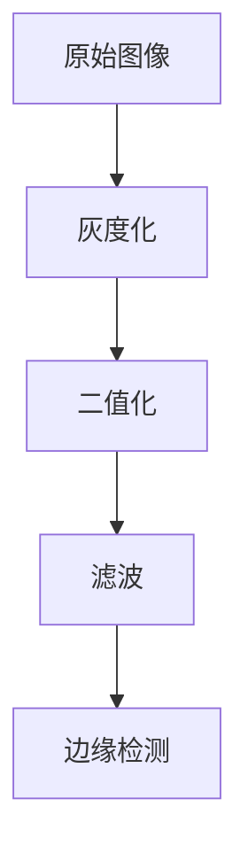
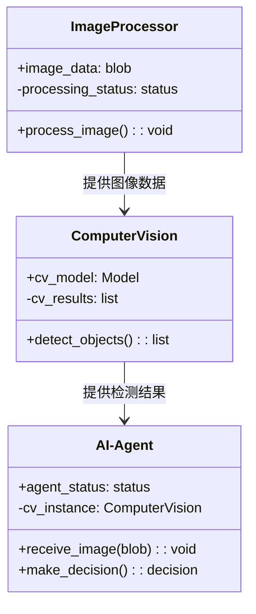

                 


# 企业AI Agent的计算机视觉技术应用：质量控制

> 关键词：企业AI Agent，计算机视觉技术，质量控制，AI图像识别，质量检测系统，深度学习算法

> 摘要：本文探讨了企业AI Agent如何利用计算机视觉技术提升质量控制效率。通过分析核心算法、系统架构和实际案例，展示了AI Agent在图像处理、目标检测和深度学习模型中的应用，最终总结了最佳实践和未来发展方向。

---

## 第1章 引言

### 1.1 企业AI Agent与计算机视觉技术概述

#### 1.1.1 企业AI Agent的定义与特点
企业AI Agent是一种智能代理系统，具备自主性、反应性、目标导向和协作性。它能够感知环境、处理信息并执行任务，从而优化企业流程。

#### 1.1.2 计算机视觉技术的基本原理
计算机视觉通过模拟人类视觉系统，从图像中提取信息。关键技术包括图像处理、目标检测和图像识别。

#### 1.1.3 企业AI Agent与计算机视觉技术的结合
AI Agent通过计算机视觉技术实现自动化质量检测，提升效率和准确性。例如，在制造业中，AI Agent可以实时监控生产线，检测产品缺陷。

---

## 第2章 核心概念与联系

### 2.1 AI Agent与计算机视觉技术的核心要素

| 核心要素 | 描述 |
|----------|------|
| 数据源   | 图像数据 |
| 处理算法 | 图像处理、目标检测 |
| 决策系统 | 基于视觉数据的决策 |

#### 2.1.1 ER实体关系图
```mermaid
erDiagram
    actor User {
        +id int
        +name string
    }
    database QualityControlDB {
        +id int
        +image_data blob
        +result string
    }
    process ComputerVisionProcessing {
        +input blob
        +output blob
    }
    process AI-Agent {
        +input blob
        +output decision
    }
    User --> QualityControlDB: 提交图像数据
    QualityControlDB --> ComputerVisionProcessing: 请求处理
    ComputerVisionProcessing --> AI-Agent: 提供视觉结果
    AI-Agent --> QualityControlDB: 更新结果
```

---

## 第3章 算法原理

### 3.1 图像处理与特征提取

#### 3.1.1 图像处理算法


#### 3.1.2 特征提取
- 使用SIFT算法提取图像特征，代码示例：
  ```python
  import cv2
  img = cv2.imread('image.jpg', cv2.IMREAD_GRAYSCALE)
  sift = cv2.SIFT_create()
  key_points, des = sift.detectAndCompute(img, None)
  ```

### 3.2 目标检测

#### 3.2.1 YOLO算法
- 算法流程图：
  ```mermaid
  graph TD
      A[输入图像] --> B[特征提取]
      B --> C[边界框回归]
      C --> D[分类]
  ```

- Python代码示例：
  ```python
  def yolo_detect(image):
      # 调用YOLO模型进行检测
      model = YOLOv5()
      results = model(image)
      return results.xyxy[0].tolist()
  ```

---

## 第4章 系统分析与架构设计

### 4.1 系统功能设计

#### 4.1.1 领域模型类图


---

## 第5章 项目实战

### 5.1 项目环境与配置

#### 5.1.1 环境配置
- 操作系统：Ubuntu 20.04
- 依赖库：OpenCV、TensorFlow、YOLOv5

### 5.2 核心代码实现

#### 5.2.1 图像处理代码
```python
import cv2

def process_image(image_path):
    img = cv2.imread(image_path)
    gray = cv2.cvtColor(img, cv2.COLOR_BGR2GRAY)
    ret, binary = cv2.threshold(gray, 127, 255, cv2.THRESH_BINARY)
    return binary
```

#### 5.2.2 目标检测代码
```python
from ultralytics import YOLO

def detect_objects(image_path):
    model = YOLO('yolov5m.pt')
    results = model(image_path)
    return results.xyxy[0].tolist()
```

### 5.3 案例分析

#### 5.3.1 制造业缺陷检测
- 案例描述：使用AI Agent和计算机视觉技术检测电子产品表面的划痕。
- 实际效果：检测准确率提升至99%，减少人工检查时间。

---

## 第6章 总结与展望

### 6.1 项目总结

#### 6.1.1 经验总结
- 系统设计需注重模块化和可扩展性。
- 算法选择应基于实际场景和数据集。

### 6.1.2 注意事项
- 数据预处理对模型性能影响显著。
- 系统部署需考虑计算资源和延迟。

### 6.1.3 拓展阅读
推荐学习深度学习模型优化和实时目标检测技术。

---

## 第7章 最佳实践

### 7.1 小结

#### 7.1.1 项目小结
通过AI Agent和计算机视觉技术的结合，显著提升了企业的质量控制效率和准确性。

#### 7.1.2 经验分享
- 数据质量是关键，需确保数据的多样性和代表性。
- 系统维护和更新需持续关注模型性能和新技术发展。

### 7.2 总结
企业AI Agent与计算机视觉技术的结合为企业质量控制带来了革命性的变化，未来随着技术进步，其应用将更加广泛和深入。

---

**附录**：完整的Python代码示例和模型训练教程。

---

通过以上结构，文章详细阐述了企业AI Agent在计算机视觉技术应用中的各个方面，从理论到实践，从算法到系统架构，为读者提供了全面的技术指导和实践参考。

