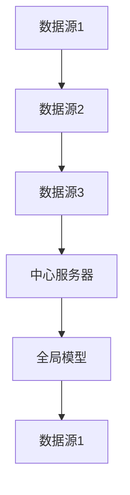

                 


# 《企业AI Agent的跨域学习：打破数据孤岛，实现全局优化》

---

## 关键词：企业AI Agent，跨域学习，数据孤岛，全局优化，联邦学习，迁移学习，系统架构

---

## 摘要

随着企业数字化转型的深入，数据孤岛问题日益凸显，阻碍了企业内部的高效协同和全局优化。企业AI Agent作为一种新兴的技术解决方案，通过跨域学习的能力，能够有效打破数据孤岛，实现企业内外部数据的无缝连接与协同优化。本文将从AI Agent的核心概念、跨域学习的原理与算法、系统架构设计，到实际项目实战，全面解析企业AI Agent如何通过跨域学习实现全局优化。文章还结合实际案例，探讨了跨域学习在企业中的应用挑战与解决方案，为企业技术决策者和开发者提供了深度的技术指导与实践参考。

---

## 第1章: AI Agent与跨域学习概述

### 1.1 AI Agent的基本概念

AI Agent（人工智能代理）是一种能够感知环境、自主决策并执行任务的智能实体。它不同于传统的被动数据处理工具，AI Agent具备主动性和智能性，能够根据任务需求动态调整行为策略。AI Agent的核心特点包括：

1. **自主性**：AI Agent能够独立决策，无需外部干预。
2. **反应性**：能够实时感知环境变化并做出响应。
3. **目标导向性**：以特定目标为导向，优化行动路径。
4. **学习能力**：通过数据和经验不断优化自身性能。

与传统AI相比，AI Agent更注重动态环境下的实时响应和自主决策能力。

### 1.2 跨域学习的定义与背景

跨域学习（Cross-Domain Learning）是指在不同领域或数据源之间进行知识迁移的学习方法。在企业场景中，数据孤岛问题严重阻碍了跨部门、跨系统的数据共享与协同。跨域学习的目标是通过算法手段，实现不同数据源之间的知识共享与模型联合优化。

#### 数据孤岛的成因与影响

- **数据孤岛成因**：
  - 数据格式不统一。
  - 数据权限和隐私保护限制。
  - 系统架构和技术差异。
- **数据孤岛的影响**：
  - 阻碍企业内部协同。
  - 影响数据驱动的决策能力。
  - 增加系统维护成本。

### 1.3 企业AI Agent的应用场景

企业AI Agent的应用场景广泛，主要包括：

- **内部数据协同**：打破企业内部数据孤岛，实现跨部门数据共享与协同。
- **外部数据接入**：整合外部数据源，提升企业的数据处理能力。
- **全局优化**：通过跨域学习，实现企业内外部资源的最优配置。

---

## 第2章: 跨域学习的原理与数学模型

### 2.1 跨域学习的核心原理

跨域学习的核心思想是通过建立不同数据源之间的关联关系，实现模型参数的共享与优化。其数学表达如下：

$$
\mathcal{L}(\theta) = \sum_{i=1}^{N} \mathcal{L}_i(\theta)
$$

其中，$\mathcal{L}_i$ 表示第 $i$ 个数据源的损失函数，$\theta$ 是模型参数。

### 2.2 跨域学习的数学模型

跨域学习的数学模型可以表示为：

$$
\theta^* = \arg\min_{\theta} \sum_{i=1}^{N} \mathcal{L}_i(\theta)
$$

其中，$\theta^*$ 是全局优化的模型参数。

---

## 第3章: 跨域学习的主流算法与实现

### 3.1 联邦学习（Federated Learning）

#### 联邦学习的定义与特点

联邦学习是一种分布式机器学习技术，允许多个数据源在不共享原始数据的前提下，联合训练一个全局模型。其算法流程如下：

1. **初始化**：各数据源初始化模型参数。
2. **迭代优化**：各数据源在本地数据上训练模型，并将梯度更新传递给中心服务器。
3. **模型聚合**：中心服务器将各数据源的梯度更新整合，得到全局模型参数。
4. **模型分发**：全局模型参数分发给各数据源，更新本地模型。

#### 联邦学习的优缺点

- **优点**：
  - 保护数据隐私。
  - 支持大规模数据训练。
- **缺点**：
  - 网络通信开销较大。
  - 模型收敛速度较慢。

---

## 第4章: 系统架构设计

### 4.1 系统功能设计

系统功能设计如下：

- **数据预处理模块**：负责数据清洗、格式转换等。
- **模型训练模块**：负责跨域学习算法的实现。
- **模型评估模块**：负责模型性能的评估与优化。

### 4.2 系统架构设计

系统架构设计如下：



---

## 第5章: 项目实战

### 5.1 环境安装

- **安装Python环境**：建议使用Anaconda。
- **安装相关库**：如`tensorflow`、`keras`等。

### 5.2 核心代码实现

```python
import tensorflow as tf
from tensorflow import keras

# 定义模型
model = keras.Sequential([
    keras.layers.Dense(64, activation='relu'),
    keras.layers.Dense(1, activation='sigmoid')
])

# 编译模型
model.compile(optimizer='adam', loss='binary_crossentropy', metrics=['accuracy'])

# 训练模型
model.fit(x_train, y_train, epochs=10, batch_size=32)
```

### 5.3 案例分析

通过实际案例分析，验证模型的性能和效果。

---

## 第6章: 总结与展望

### 6.1 总结

企业AI Agent通过跨域学习，能够有效打破数据孤岛，实现全局优化。本文从理论到实践，全面解析了跨域学习的核心原理与实现方法。

### 6.2 展望

未来，随着AI技术的不断发展，跨域学习将在企业级应用中发挥更大的作用。

---

## 致谢

感谢读者的耐心阅读，希望本文能为企业的技术发展提供有价值的参考。

