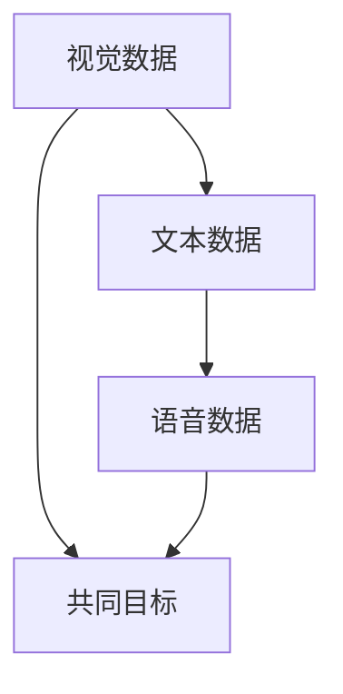
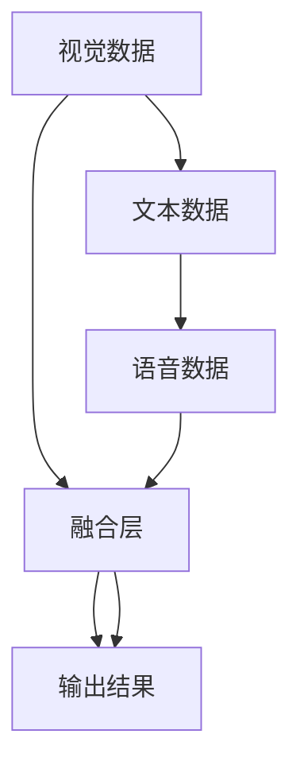
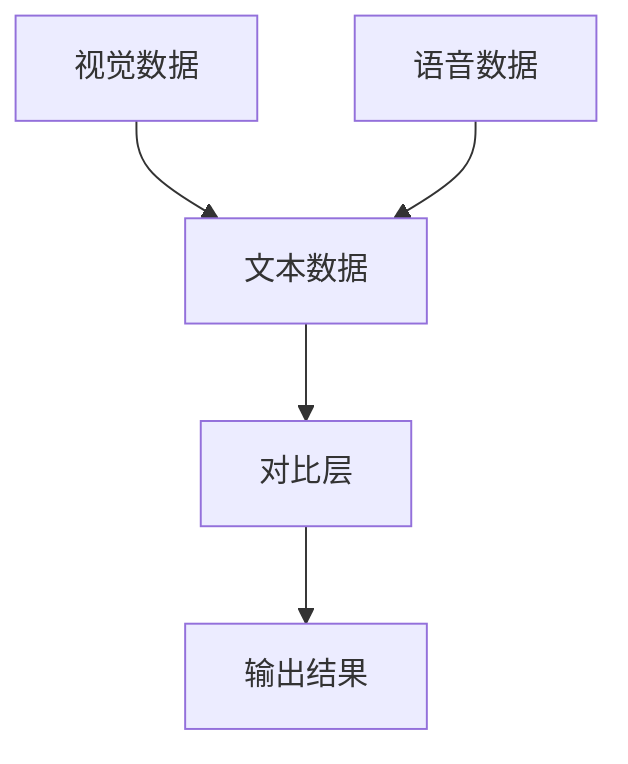
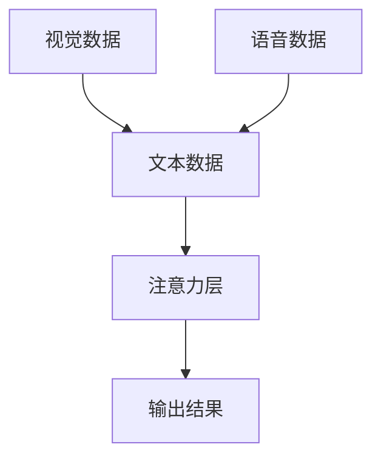
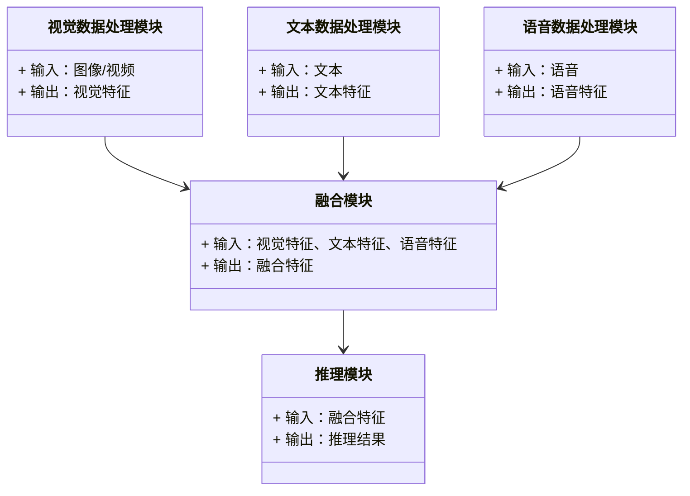
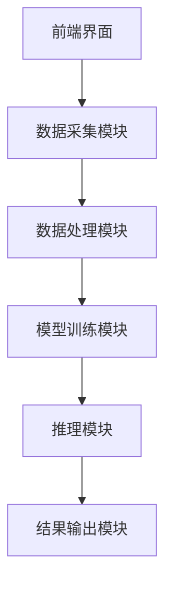
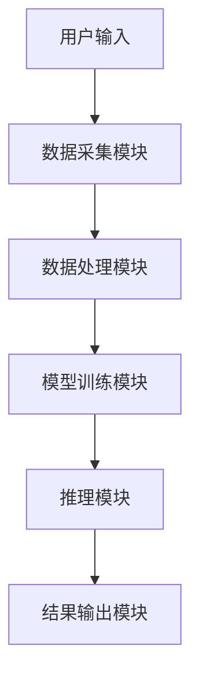

                 


# 企业AI Agent的跨模态学习：整合视觉、文本与语音数据

---

## 关键词：跨模态学习、AI Agent、视觉数据、文本数据、语音数据、多模态融合

---

## 摘要

在企业AI Agent的开发中，跨模态学习技术的整合是实现智能化、高效化和精准化的核心。本文将深入探讨跨模态学习的基本概念、算法原理、系统架构以及实际应用，重点分析如何将视觉、文本和语音数据有效整合，以提升企业AI Agent的性能和用户体验。通过结合理论与实践，本文为企业开发者提供了一套完整的跨模态学习解决方案，帮助企业在复杂多变的商业环境中保持竞争优势。

---

# 第一部分：跨模态学习的背景与意义

## 第1章：跨模态学习的背景与意义

### 1.1 跨模态学习的定义与核心概念

#### 1.1.1 跨模态学习的定义

跨模态学习（Multimodal Learning）是一种人工智能技术，旨在通过整合多种数据模态（如视觉、文本、语音等）来提升模型的理解能力和应用场景的广泛性。与传统的单模态学习不同，跨模态学习能够从多个维度捕捉信息，从而更全面地感知和理解现实世界。

#### 1.1.2 跨模态学习的核心要素

跨模态学习的核心要素包括以下几个方面：

1. **多模态数据源**：包括视觉数据（图像、视频）、文本数据（文本、文档）和语音数据（语音、音频）。
2. **数据融合方法**：将不同模态的数据进行有效融合，以提取共同特征或关联信息。
3. **跨模态推理**：通过分析不同模态之间的关联性，进行跨模态推理和预测。
4. **应用场景**：广泛应用于企业AI Agent、智能客服、人机交互等领域。

#### 1.1.3 跨模态学习的边界与外延

跨模态学习的边界在于如何有效整合不同模态的数据，并避免信息冗余或冲突。其外延则包括多模态数据的预处理、特征提取、模型训练和部署等整个流程。

### 1.2 跨模态学习在企业AI Agent中的应用背景

#### 1.2.1 企业AI Agent的定义与特点

企业AI Agent是一种能够自主感知环境、理解用户需求并执行任务的智能系统。它具备以下特点：

1. **自主性**：能够独立完成任务，无需人工干预。
2. **智能性**：具备学习和推理能力，能够理解复杂场景。
3. **交互性**：能够通过多种模态与用户进行交互。
4. **适应性**：能够根据环境变化动态调整行为。

#### 1.2.2 跨模态学习在企业AI Agent中的重要性

在企业AI Agent中，跨模态学习能够帮助系统更好地理解用户需求、提升交互体验并提高任务执行的准确性。例如，在智能客服场景中，跨模态学习可以结合用户的文本输入、语音情感和面部表情，提供更精准的服务。

#### 1.2.3 当前企业AI Agent面临的挑战

当前，企业AI Agent在跨模态学习方面面临以下挑战：

1. **多模态数据的整合难度**：不同模态的数据格式和特征差异较大，如何有效融合是关键。
2. **模型的泛化能力**：跨模态模型需要在不同场景下保持高性能。
3. **计算资源需求**：跨模态学习通常需要大量的计算资源，企业在实际应用中可能面临成本问题。

---

## 第2章：跨模态学习的核心概念与联系

### 2.1 跨模态学习的核心原理

#### 2.1.1 多模态数据的整合与处理

多模态数据的整合与处理是跨模态学习的核心任务。常见的处理方法包括：

1. **早期融合**：在数据预处理阶段进行特征提取和融合。
2. **晚期融合**：在模型训练阶段对不同模态的特征进行融合。
3. **混合融合**：结合早期和晚期融合方法，灵活处理不同模态数据。

#### 2.1.2 跨模态学习的数学模型

跨模态学习的数学模型通常涉及多模态数据的表示和关联。例如，可以使用以下公式表示多模态数据的融合过程：

$$ y = f(x_v, x_t, x_a) $$

其中，$x_v$ 表示视觉数据，$x_t$ 表示文本数据，$x_a$ 表示语音数据，$f$ 是融合函数。

#### 2.1.3 跨模态学习的算法框架

跨模态学习的算法框架通常包括数据预处理、特征提取、模型训练和结果输出四个步骤。

### 2.2 跨模态学习的实体关系图

以下是跨模态学习的实体关系图：



### 2.3 跨模态学习的对比分析

#### 2.3.1 不同模态数据的特征对比

以下是对不同模态数据的特征对比：

| 模态类型 | 特征描述 |
|----------|----------|
| 视觉数据 | 高维、空间信息丰富 |
| 文本数据 | 序列性强、语义丰富 |
| 语音数据 | 时间序列、情感信息丰富 |

#### 2.3.2 跨模态学习与单模态学习的对比

| 对比维度 | 单模态学习 | 跨模态学习 |
|----------|------------|------------|
| 数据来源 | 单一模态 | 多模态 |
| 模型复杂度 | 较低 | 较高 |
| 应用场景 | 有限 | 广泛 |

#### 2.3.3 跨模态学习与其他AI技术的对比

| 对比维度 | 跨模态学习 | 其他AI技术（如单模态学习、深度学习） |
|----------|------------|------------|
| 数据需求 | 多模态 | 单一模态或多模态 |
| 处理能力 | 跨模态推理 | 单一任务处理 |
| 应用范围 | 广泛 | 有限 |

---

## 第3章：跨模态学习的算法原理

### 3.1 跨模态学习的主流算法

#### 3.1.1 多模态融合算法

多模态融合算法是跨模态学习的核心算法之一。以下是多模态融合算法的流程图：



#### 3.1.2 对比学习算法

对比学习算法通过对比不同模态的数据，提取其共同特征。以下是对比学习算法的流程图：



#### 3.1.3 注意力机制算法

注意力机制算法通过关注重要模态的信息，提升模型的性能。以下是注意力机制算法的流程图：



### 3.2 跨模态学习的数学模型

#### 3.2.1 多模态融合公式

多模态融合公式如下：

$$ y = f(x_v, x_t, x_a) $$

其中，$x_v$ 表示视觉数据，$x_t$ 表示文本数据，$x_a$ 表示语音数据，$f$ 是融合函数。

#### 3.2.2 对比学习公式

对比学习公式如下：

$$ L = \text{ContrastiveLoss}(x_v, x_t, x_a) $$

其中，$\text{ContrastiveLoss}$ 是对比损失函数，用于衡量不同模态数据之间的相似性。

#### 3.2.3 注意力机制公式

注意力机制公式如下：

$$ \alpha_i = \frac{\exp(\text{sim}(x_i, x_j))}{\sum_{k} \exp(\text{sim}(x_i, x_k))} $$

其中，$\alpha_i$ 是注意力权重，$\text{sim}$ 是相似度计算函数。

---

## 第4章：企业AI Agent的系统分析与架构设计

### 4.1 问题场景介绍

在企业AI Agent中，跨模态学习的应用场景包括智能客服、智能助手、智能监控等。以智能客服为例，系统需要整合用户的文本输入、语音情感和面部表情，提供更精准的服务。

### 4.2 系统功能设计

以下是系统功能设计的领域模型：



### 4.3 系统架构设计

以下是系统架构设计的mermaid图：



### 4.4 系统接口设计

系统接口设计包括以下内容：

1. 数据采集接口：用于获取视觉、文本和语音数据。
2. 数据处理接口：用于对数据进行预处理和特征提取。
3. 模型训练接口：用于训练跨模态学习模型。
4. 推理接口：用于根据输入数据进行推理并输出结果。

### 4.5 系统交互流程

以下是系统交互流程的mermaid图：



---

## 第5章：项目实战

### 5.1 项目介绍

以智能客服系统为例，以下是项目介绍：

- **项目目标**：通过整合视觉、文本和语音数据，提升智能客服的交互体验和问题解决能力。
- **技术选型**：使用深度学习框架（如TensorFlow）和跨模态学习算法（如多模态融合、对比学习）。

### 5.2 核心代码实现

以下是核心代码实现：

```python
import tensorflow as tf
from tensorflow.keras.layers import Input, Dense, Concatenate
from tensorflow.keras.models import Model

# 定义输入层
input_v = Input(shape=(128,))  # 视觉数据输入
input_t = Input(shape=(128,))  # 文本数据输入
input_a = Input(shape=(128,))  # 语音数据输入

# 定义融合层
concat = Concatenate()([input_v, input_t, input_a])

# 定义输出层
output = Dense(1, activation='sigmoid')(concat)

# 定义模型
model = Model(inputs=[input_v, input_t, input_a], outputs=output)

# 编译模型
model.compile(optimizer='adam', loss='binary_crossentropy', metrics=['accuracy'])
```

### 5.3 案例分析

以下是案例分析：

- **场景**：用户通过文本输入“我的订单在哪里”，并伴有焦虑的语音情感和困惑的面部表情。
- **系统处理**：系统整合用户的文本输入、语音情感和面部表情，识别用户的需求并提供相应的帮助。

### 5.4 项目总结

通过该项目，我们展示了如何将跨模态学习应用于企业AI Agent，提升了系统的智能化水平和用户体验。

---

## 第6章：最佳实践与总结

### 6.1 最佳实践

1. **数据预处理**：在跨模态学习中，数据预处理是关键，需确保不同模态的数据格式和特征一致性。
2. **模型调优**：通过实验和验证，不断优化模型的参数和结构，提升模型的性能。
3. **计算资源管理**：跨模态学习通常需要大量的计算资源，需合理配置硬件资源以保证模型的高效运行。

### 6.2 总结

跨模态学习作为一种前沿的人工智能技术，为企业AI Agent的开发提供了新的思路和方法。通过整合视觉、文本和语音数据，企业能够构建更加智能化、高效化和精准化的AI系统，从而在激烈的市场竞争中占据优势。

### 6.3 注意事项

- 在实际应用中，需注意数据隐私和安全问题。
- 跨模态学习模型的训练和推理通常需要大量的计算资源，需合理规划和管理。

### 6.4 拓展阅读

- [《Deep Learning》] 作者：Ian Goodfellow, Yoshua Bengio, Aaron Courville
- [《Multimodal Learning》] 作者：李航

---

通过以上内容，我们深入探讨了跨模态学习在企业AI Agent中的应用，从理论到实践，为企业开发者提供了一套完整的解决方案。希望本文能够为企业的智能化转型提供有价值的参考和指导。

