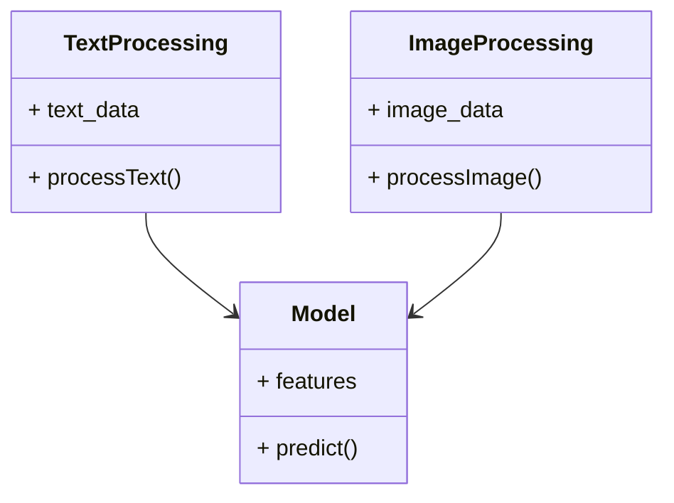

                 


# 企业AI Agent的跨模态学习：融合非结构化数据的决策支持

**关键词**：企业AI Agent，跨模态学习，非结构化数据，决策支持，多模态数据融合，AI系统架构

**摘要**：本文深入探讨了企业AI Agent如何利用跨模态学习技术融合非结构化数据，以提供高效的决策支持。通过分析跨模态学习的核心概念、算法原理和系统架构，结合实际项目案例，本文为读者提供了从理论到实践的全面指导，展示了如何在企业环境中构建和优化跨模态AI系统。

---

# 第一部分：企业AI Agent与跨模态学习概述

## 第1章：企业AI Agent与跨模态学习概述

### 1.1 企业AI Agent的定义与背景

#### 1.1.1 什么是企业AI Agent
企业AI Agent是一种智能代理系统，能够感知企业内外环境，执行任务以支持或优化企业的决策过程。它通常具备自主性、反应性和目标导向性。

#### 1.1.2 企业AI Agent的核心特征
- **自主性**：能够在无外部干预的情况下自主运行。
- **反应性**：能实时感知环境变化并调整行为。
- **目标导向性**：以明确的目标为导向，执行特定任务。

#### 1.1.3 跨模态学习的定义与特点
跨模态学习是指在同一学习任务中，利用来自不同模态（如文本、图像、音频等）的数据进行训练，以提升模型的综合理解和决策能力。其特点包括：
- **数据异构性**：不同模态的数据具有不同的特征和结构。
- **对齐挑战**：需要将不同模态的数据进行语义对齐。
- **联合学习**：通过融合多模态数据，提升模型的泛化能力。

---

### 1.2 跨模态学习在企业决策中的作用

#### 1.2.1 非结构化数据的挑战
企业中存在大量非结构化数据（如文本、图像、音频），这些数据难以直接用于传统决策模型，需通过跨模态学习进行处理。

#### 1.2.2 跨模态学习如何解决企业决策问题
通过融合多模态数据，跨模态学习能够提供更全面的决策支持，提升模型的准确性和鲁棒性。

#### 1.2.3 跨模态学习的应用场景
- **客户服务**：通过文本和语音数据，提升客户意图识别的准确性。
- **风险管理**：利用文本、图像数据，识别潜在风险。
- **市场分析**：融合文本、图像数据，分析市场趋势。

---

### 1.3 本章小结
本章介绍了企业AI Agent的定义和核心特征，阐述了跨模态学习的定义、特点及其在企业决策中的重要性。

---

# 第二部分：跨模态学习的核心概念与原理

## 第2章：跨模态学习的核心概念

### 2.1 多模态数据的定义与分类

#### 2.1.1 文本数据
- **结构化文本**：如表格数据。
- **非结构化文本**：如自由文本。

#### 2.1.2 图像数据
- **图像分类**：识别图像中的物体。
- **图像分割**：分割图像中的区域。

#### 2.1.3 音频数据
- **语音识别**：将语音转换为文本。
- **语音情感分析**：分析语音中的情感。

#### 2.1.4 结构化数据
- **数据库**：如关系型数据库中的表格数据。
- **日志数据**：如系统日志。

---

### 2.2 跨模态学习的关键技术

#### 2.2.1 数据融合方法
- **早期融合**：在特征提取阶段融合数据。
- **晚期融合**：在高层特征或决策阶段融合数据。

#### 2.2.2 模型联合学习
- **多任务学习**：同时学习多个相关任务。
- **联合表示学习**：将不同模态的数据映射到同一特征空间。

#### 2.2.3 对齐机制
- **显式对齐**：通过特定的对齐模型将不同模态的数据对齐。
- **隐式对齐**：通过共享特征或参数实现对齐。

---

### 2.3 跨模态学习的挑战与解决方案

#### 2.3.1 数据异构性问题
- **挑战**：不同模态的数据格式和特征空间差异大。
- **解决方案**：使用跨模态对齐技术，如双线性映射。

#### 2.3.2 模型鲁棒性问题
- **挑战**：单个模态数据不足或噪声大时，模型性能下降。
- **解决方案**：采用多模态数据融合和鲁棒优化方法。

#### 2.3.3 性能优化策略
- **策略一**：利用预训练模型提升特征提取能力。
- **策略二**：通过数据增强技术增强模型的泛化能力。

---

### 2.4 本章小结
本章详细介绍了多模态数据的分类及其在跨模态学习中的应用，探讨了跨模态学习的关键技术及其面临的挑战和解决方案。

---

# 第三部分：跨模态学习的算法原理

## 第3章：跨模态学习的数学模型与算法

### 3.1 多模态数据融合的数学模型

#### 3.1.1 线性组合模型
$$ y = w_1 x_1 + w_2 x_2 + b $$
其中，$x_1$ 和 $x_2$ 是两种模态的特征，$w_1$ 和 $w_2$ 是对应的权重。

#### 3.1.2 对齐模型
$$ f(x_1, x_2) = \text{similarity}(x_1, x_2) $$
其中，$\text{similarity}$ 是衡量两种模态数据相似性的函数。

#### 3.1.3 联合表示模型
$$ z = g(x_1, x_2) $$
其中，$g$ 是一个联合编码器，将两种模态的数据编码为一个共同的表示$z$。

---

### 3.2 跨模态学习的算法流程

#### 3.2.1 数据预处理
1. 数据清洗：去除噪声数据。
2. 数据归一化：将不同模态的数据标准化。

#### 3.2.2 特征提取
1. 文本特征提取：使用词袋模型或词嵌模型。
2. 图像特征提取：使用CNN提取图像特征。

#### 3.2.3 对齐与融合
1. 对齐：将不同模态的特征对齐。
2. 融合：将对齐后的特征融合。

#### 3.2.4 模型训练与优化
1. 使用优化算法（如Adam）训练模型。
2. 使用验证集进行模型调优。

---

### 3.3 本章小结
本章通过数学公式和算法流程图，详细讲解了跨模态学习的数学模型和算法流程。

---

## 第4章：跨模态学习的系统架构与设计

### 4.1 系统功能设计

#### 4.1.1 领域模型


#### 4.1.2 系统架构设计
```mermaid
client --> Agent: 请求
Agent --> TextProcessing: 处理文本数据
Agent --> ImageProcessing: 处理图像数据
TextProcessing --> Model: 提供文本特征
ImageProcessing --> Model: 提供图像特征
Model --> Agent: 返回结果
Agent --> client: 返回结果
```

---

## 第5章：项目实战：企业AI Agent的跨模态学习实现

### 5.1 环境安装
1. 安装Python和相关库（如TensorFlow、Keras、Pillow）。
2. 安装Jupyter Notebook用于开发和调试。

### 5.2 系统核心实现源代码

```python
import numpy as np
from tensorflow import keras
from tensorflow.keras import layers

# 定义模型
def build_model():
    text_input = keras.Input(shape=(100,))
    image_input = keras.Input(shape=(64,64,3))

    text_features = layers.Embedding(1000, 64)(text_input)
    image_features = layers.Conv2D(32, (3,3), activation='relu')(image_input)

    # 对齐层
    text_features = layers.Dense(32, activation='relu')(text_features)
    image_features = layers.Flatten()(image_features)

    # 融合层
    combined = layers.concatenate([text_features, image_features])
    output = layers.Dense(1, activation='sigmoid')(combined)

    model = keras.Model(inputs=[text_input, image_input], outputs=output)
    model.compile(optimizer='adam', loss='binary_crossentropy', metrics=['accuracy'])
    return model

# 训练模型
model = build_model()
model.fit([text_data, image_data], labels, epochs=10, batch_size=32)
```

---

## 第6章：最佳实践与注意事项

### 6.1 最佳实践
1. **数据预处理**：确保数据质量，进行归一化处理。
2. **模型选择**：根据任务选择合适的模型架构。
3. **性能优化**：通过数据增强和超参数调优提升模型性能。

### 6.2 小结
本文通过理论与实践结合，详细讲解了企业AI Agent的跨模态学习技术，为读者提供了从理论到实践的全面指导。

---

通过以上目录结构和内容，您可以逐步展开每章的详细内容，确保文章逻辑清晰、结构紧凑，符合技术博客的专业性和可读性要求。

