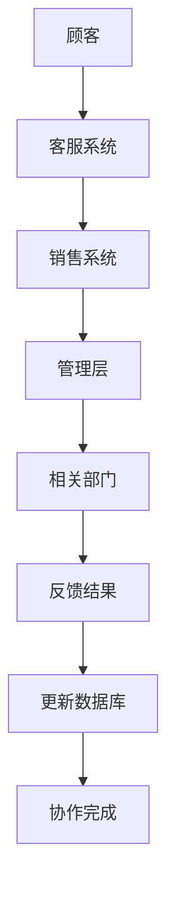
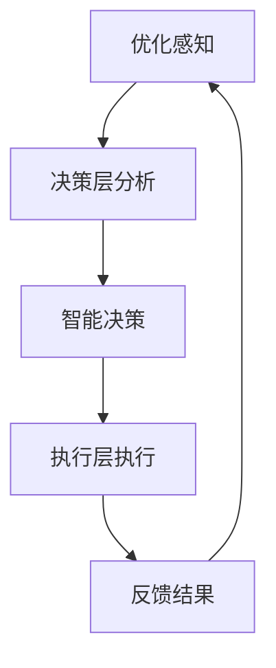
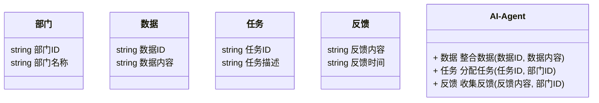
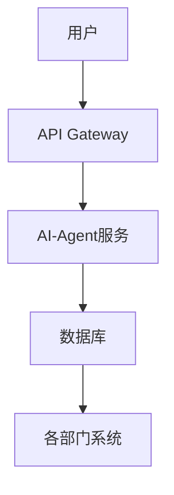
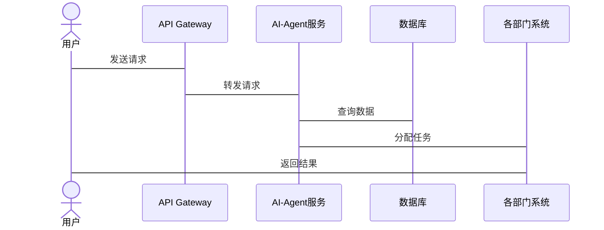

                 


```markdown
# 企业AI Agent的跨部门协作功能：打破信息孤岛

## 关键词：AI Agent, 跨部门协作, 信息孤岛, 数据共享, 智能决策

## 摘要：本文深入探讨了企业AI Agent在跨部门协作中的应用，分析了信息孤岛的形成原因及其对企业发展的影响。通过详细介绍AI Agent的核心概念、算法原理和系统架构设计，展示了如何利用AI技术打破信息孤岛，实现高效协作。文章还通过实际案例和项目实战，进一步阐述了AI Agent在企业中的具体应用场景和实施方法。

## 第1章: 背景介绍

### 1.1 问题背景
#### 1.1.1 企业信息孤岛的现状
企业内部的部门之间由于信息不共享，导致数据分散在不同的系统中，形成了信息孤岛。这种现象不仅降低了企业的运营效率，还可能导致决策失误。

#### 1.1.2 跨部门协作的痛点
- 数据分散：不同部门使用不同的系统，数据格式和标准不统一。
- 信息滞后：部门之间的信息传递不及时，导致决策延迟。
- 协作低效：缺乏有效的沟通机制，导致任务执行效率低下。

#### 1.1.3 信息孤岛对企业效率的影响
- 增加了沟通成本：部门之间需要反复确认信息，浪费时间和资源。
- 降低决策效率：由于信息不全，决策者无法及时做出准确决策。
- 影响企业竞争力：信息孤岛导致企业难以快速响应市场变化。

### 1.2 问题描述
#### 1.2.1 跨部门协作中的主要问题
- 数据孤岛：各部门的数据无法共享，导致信息重复录入。
- 协作障碍：部门之间的协作流程不畅，导致任务执行困难。
- 沟通不畅：缺乏有效的沟通工具，导致信息传递不准确。

#### 1.2.2 信息孤岛的具体表现
- 数据分散：同一企业在不同部门使用不同的系统，数据无法统一。
- 信息不透明：部门之间对彼此的数据和进展不了解。
- 协作低效：由于信息不共享，导致协作效率低下。

#### 1.2.3 问题对企业发展的潜在威胁
- 影响企业运营效率：信息孤岛导致企业无法快速响应市场需求。
- 增加运营成本：由于信息不共享，导致重复劳动和资源浪费。
- 影响企业竞争力：信息孤岛使得企业在市场中处于劣势。

### 1.3 问题解决
#### 1.3.1 AI Agent的核心作用
- 数据整合：AI Agent可以整合企业内部的分散数据，实现数据共享。
- 自动化协作：AI Agent可以自动分配任务，协调各部门的工作。
- 智能决策：AI Agent可以根据整合的数据，提供智能决策支持。

#### 1.3.2 跨部门协作功能的设计目标
- 实现数据共享：打破信息孤岛，实现各部门数据的互联互通。
- 提高协作效率：通过自动化流程，减少人工干预，提高协作效率。
- 支持智能决策：利用AI技术，提供决策支持，提高决策的准确性和及时性。

#### 1.3.3 解决信息孤岛的具体方法
- 数据标准化：统一数据格式和标准，方便数据共享。
- 建立共享平台：搭建企业级的数据共享平台，实现数据的统一管理和共享。
- 优化协作流程：通过自动化流程，减少人工干预，提高协作效率。

### 1.4 边界与外延
#### 1.4.1 AI Agent的边界定义
- AI Agent的功能范围：AI Agent专注于数据整合和协作功能，不涉及企业的核心业务逻辑。
- 数据处理范围：AI Agent处理的企业内部数据，不涉及外部数据。
- 适用场景：AI Agent适用于需要跨部门协作的企业场景。

#### 1.4.2 跨部门协作的范围界定
- 协作范围：AI Agent可以协调多个部门的工作，但不涉及部门内部的具体操作。
- 协作流程：AI Agent可以优化协作流程，但不改变企业的组织结构。

#### 1.4.3 信息孤岛的外延扩展
- 信息孤岛的形成原因：信息孤岛的形成主要是由于企业内部的信息系统不统一，数据格式和标准不统一。
- 信息孤岛的解决方法：通过数据标准化和建立共享平台，实现数据共享，打破信息孤岛。

### 1.5 核心概念结构与组成
#### 1.5.1 AI Agent的基本组成
- 感知层：负责数据的采集和分析。
- 决策层：负责基于感知层的数据进行智能决策。
- 执行层：负责根据决策层的指令，执行具体的任务。

#### 1.5.2 跨部门协作的功能模块
- 数据共享模块：负责整合各部门的数据，实现数据共享。
- 任务分配模块：负责根据任务需求，自动分配任务给相关部门。
- 协作反馈模块：负责收集各部门的反馈，优化协作流程。

#### 1.5.3 信息孤岛的形成机制
- 数据孤岛：各部门使用不同的系统，数据无法共享。
- 信息不透明：部门之间缺乏有效的沟通机制，导致信息不透明。
- 协作低效：由于信息孤岛，协作流程不畅，效率低下。

## 第2章: 核心概念与联系

### 2.1 AI Agent的基本原理
#### 2.1.1 感知层
AI Agent通过感知层获取企业内部的数据，包括各部门的业务数据和协作数据。

#### 2.1.2 决策层
基于感知层获取的数据，决策层利用AI算法进行智能决策，确定最优的协作方案。

#### 2.1.3 执行层
根据决策层的指令，执行层协调各部门的工作，确保协作任务的顺利完成。

### 2.2 跨部门协作的实现机制
#### 2.2.1 数据共享机制
AI Agent通过数据共享模块，整合各部门的数据，实现数据的统一管理和共享。

#### 2.2.2 任务分配机制
AI Agent根据任务需求，自动分配任务给相关部门，并协调各部门的工作进度。

#### 2.2.3 协作反馈机制
协作反馈模块收集各部门的反馈，优化协作流程，提高协作效率。

### 2.3 信息孤岛的消解方法
#### 2.3.1 数据标准化
通过统一数据格式和标准，实现数据的互联互通。

#### 2.3.2 信息共享平台
搭建企业级的信息共享平台，实现数据的统一管理和共享。

#### 2.3.3 协作流程优化
通过自动化流程，减少人工干预，提高协作效率。

### 2.4 核心概念对比表
```markdown
| 概念          | 属性              | 描述                                         |
|---------------|-------------------|----------------------------------------------|
| AI Agent      | 感知能力          | 数据采集与分析                              |
|               | 决策能力          | 智能决策                                    |
|               | 执行能力          | 任务执行                                    |
| 跨部门协作    | 数据共享          | 整合各部门数据，实现数据共享                |
|               | 任务分配          | 自动分配任务                                |
|               | 协作反馈          | 收集反馈，优化协作流程                      |
| 信息孤岛      | 数据分散          | 数据分散在不同系统，无法共享                |
|               | 信息不透明        | 部门之间信息不透明                          |
|               | 协作低效          | 协作效率低下                                |
```

### 2.5 ER实体关系图架构
```mermaid
erDiagram
    actor 顾客 {
        string 用户名
        string 密码
    }
    actor 管理员 {
        string 用户名
        string 密码
    }
    database 企业数据 {
        integer 数据ID
        string 数据内容
    }
    database 部门数据 {
        integer 部门ID
        string 部门名称
        integer 上级部门ID
    }
    actor 客服 {
        integer 员工ID
        string 员工姓名
    }
    actor 销售 {
        integer 员工ID
        string 员工姓名
    }
    boundary 跨部门协作系统 {
        + 函数 整合数据(数据ID, 数据内容)
        + 函数 分配任务(部门ID, 任务ID)
        + 函数 反馈结果(部门ID, 反馈内容)
    }
```

### 2.6 跨部门协作流程图


## 第3章: 算法原理讲解

### 3.1 AI Agent的算法流程


### 3.2 算法实现
```python
class AI-Agent:
    def __init__(self):
        self.data = {}
        self.tasks = []

    def perceive(self, data):
        self.data.update(data)
        return self.data

    def decide(self, task):
        # 假设决策基于规则
        if task == '销售':
            return '销售团队'
        elif task == '客服':
            return '客服团队'
        else:
            return '其他团队'

    def execute(self, team):
        # 假设执行任务
        self.tasks.append(team)
        return self.tasks

# 示例使用
agent = AI-Agent()
agent.perceive({'客户信息': '客户A'})
agent.decide('销售')
agent.execute('销售团队')
```

### 3.3 数学模型和公式
```latex
$$P(A|B) = \frac{P(B|A)P(A)}{P(B)}$$

其中：
- P(A|B) 是在B条件下A发生的概率。
- P(B|A) 是在A条件下B发生的概率。
- P(A) 是A发生的先验概率。
- P(B) 是B发生的先验概率。
```

### 3.4 典型案例
假设企业需要协调销售和客服部门处理客户投诉。AI Agent首先感知到客户投诉信息，然后决定将任务分配给客服部门，客服部门处理后反馈结果，AI Agent根据反馈结果优化协作流程。

## 第4章: 系统分析与架构设计方案

### 4.1 问题场景介绍
企业中的销售和客服部门由于使用不同的系统，导致客户投诉信息无法及时共享，影响了协作效率。

### 4.2 系统功能设计


### 4.3 系统架构设计


### 4.4 系统接口设计
- API接口：AI-Agent服务提供RESTful API，供各部门系统调用。
- 数据格式：统一使用JSON格式，确保数据共享的兼容性。

### 4.5 系统交互流程图


## 第5章: 项目实战

### 5.1 环境安装
安装Python和必要的库：
```bash
pip install flask
pip install requests
pip install json
```

### 5.2 核心代码实现
```python
from flask import Flask
import requests
import json

app = Flask(__name__)

@app.route('/api/integrate_data', methods=['POST'])
def integrate_data():
    data = json.loads(request.get_data())
    # 整合数据
    return json.dumps({'status': 'success', 'message': '数据整合成功'})

@app.route('/api/assign_task', methods=['POST'])
def assign_task():
    task = json.loads(request.get_data())
    # 分配任务
    return json.dumps({'status': 'success', 'message': '任务分配成功'})

@app.route('/api/collect_feedback', methods=['POST'])
def collect_feedback():
    feedback = json.loads(request.get_data())
    # 收集反馈
    return json.dumps({'status': 'success', 'message': '反馈收集成功'})

if __name__ == '__main__':
    app.run()
```

### 5.3 代码解读与分析
- `/api/integrate_data`：负责整合各部门的数据。
- `/api/assign_task`：负责分配协作任务。
- `/api/collect_feedback`：负责收集各部门的反馈。

### 5.4 实际案例分析
以销售和客服部门为例：
1. 客服部门收到客户投诉，通过API Gateway调用AI-Agent的`/api/integrate_data`接口，整合客户信息。
2. AI-Agent通过`/api/assign_task`接口，将任务分配给销售部门处理。
3. 销售部门处理后，通过`/api/collect_feedback`接口反馈结果。
4. AI-Agent根据反馈结果优化协作流程。

### 5.5 项目小结
通过实际案例的分析，展示了AI-Agent在企业中的具体应用场景。通过API接口和数据共享，实现了跨部门协作，打破了信息孤岛。

## 第6章: 最佳实践与总结

### 6.1 最佳实践
- 数据安全：确保数据共享过程中的安全性，防止数据泄露。
- 模型优化：定期优化AI-Agent的决策算法，提高决策的准确性和及时性。
- 用户培训：对各部门员工进行培训，确保他们能够正确使用AI-Agent。

### 6.2 小结
本文详细探讨了企业AI-Agent在跨部门协作中的应用，分析了信息孤岛的形成原因及其对企业发展的影响。通过详细介绍AI-Agent的核心概念、算法原理和系统架构设计，展示了如何利用AI技术打破信息孤岛，实现高效协作。

### 6.3 注意事项
- 在实际应用中，需要根据企业的具体情况调整AI-Agent的功能模块。
- 数据安全和隐私保护是实施过程中需要重点关注的问题。
- 在系统设计时，需要充分考虑各部门的需求和特点，确保系统能够满足实际需求。

### 6.4 拓展阅读
- 推荐阅读《企业架构与设计模式》。
- 推荐阅读《人工智能在企业中的应用》。
```

# 结语

通过本文的详细讲解，读者可以全面了解企业AI-Agent在跨部门协作中的重要作用。从背景介绍到算法实现，从系统设计到项目实战，本文为读者提供了一个完整的解决方案。希望本文能够为企业的信息化建设提供有益的参考和指导。

