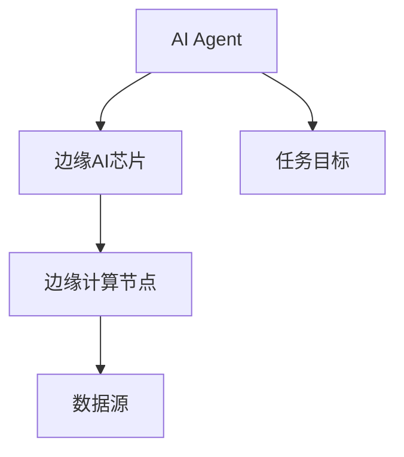
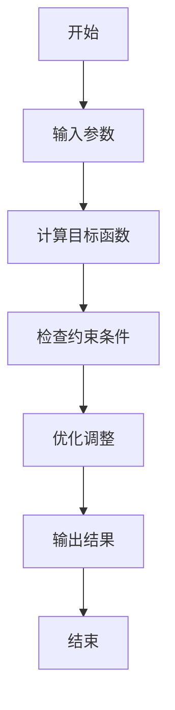
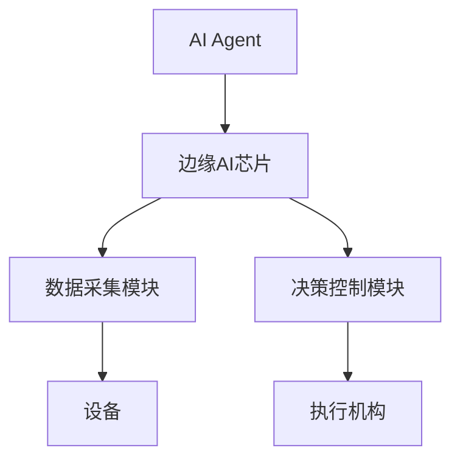

                 


---

# 企业AI Agent的边缘AI芯片优化策略

---

## 关键词：
- 企业AI Agent  
- 边缘AI芯片  
- 优化策略  
- 算法原理  
- 系统架构设计  

---

## 摘要：
本文系统地探讨了企业AI Agent在边缘AI芯片优化中的应用策略。从背景介绍、核心概念、算法原理到系统架构设计，再到项目实战，全面分析了如何通过优化边缘AI芯片性能，提升企业AI Agent的效率与智能化水平。通过详细的技术分析和实际案例，本文为读者提供了从理论到实践的完整解决方案。

---

# 第1章: 企业AI Agent概述

## 1.1 AI Agent的定义与特点
### 1.1.1 AI Agent的核心功能
- **定义**：AI Agent是一种智能实体，能够感知环境、自主决策并执行任务。
- **特点**：
  - 智能性：基于AI算法，具备学习和推理能力。
  - 自主性：无需人工干预，自动完成任务。
  - 反应性：实时感知环境变化并做出响应。

## 1.2 边缘AI芯片的基本概念
### 1.2.1 边缘计算的定义
- **定义**：边缘计算是一种分布式计算范式，将计算能力从云端延伸至数据生成的边缘端。
- **特点**：
  - 低延迟：减少数据传输到云端的时间。
  - 高实时性：快速响应边缘端的需求。
  - 高效性：充分利用边缘资源，降低云端负担。

---

# 第2章: 企业AI Agent与边缘AI芯片的结合

## 2.1 企业AI Agent的边缘计算需求
### 2.1.1 边缘计算的优势
- **低延迟**：边缘计算能够快速处理数据，减少响应时间。
- **高实时性**：适用于需要实时决策的任务，如工业自动化、智能交通等。
- **数据隐私**：边缘计算可以本地处理数据，减少数据传输过程中的隐私泄露风险。

## 2.2 边缘AI芯片在企业AI Agent中的作用
### 2.2.1 边缘AI芯片的优势
- **高性能**：边缘AI芯片专为AI计算设计，具备高效的并行计算能力。
- **低功耗**：适合边缘设备的能源限制。
- **灵活性**：支持多种AI模型和任务。

---

# 第3章: 企业AI Agent边缘AI芯片优化的背景与意义

## 3.1 当前企业AI Agent边缘AI芯片优化的背景
### 3.1.1 企业AI Agent发展的现状
- **需求增长**：随着企业数字化转型的推进，对AI Agent的需求不断增加。
- **技术进步**：边缘AI芯片的技术日益成熟，为优化提供了基础。

## 3.2 优化的意义
### 3.2.1 提高企业AI Agent的效率
- **资源利用率提升**：通过优化边缘AI芯片，减少计算资源浪费。
- **任务处理速度加快**：优化后的芯片能够更快地完成AI Agent的任务。

## 3.3 优化的目标
### 3.3.1 性能提升
- **目标函数**：最大化AI Agent的任务完成效率。
- **约束条件**：满足企业对实时性、隐私性和成本的要求。

---

# 第4章: 企业AI Agent边缘AI芯片优化的核心概念与联系

## 4.1 核心概念的原理
### 4.1.1 AI Agent的决策机制
- **定义**：AI Agent通过感知环境信息，利用AI算法做出决策。
- **实现方式**：基于深度学习、强化学习等算法。

### 4.1.2 边缘AI芯片的计算模型
- **定义**：边缘AI芯片通过并行计算加速AI模型的推理过程。
- **实现方式**：支持TensorFlow、PyTorch等框架的硬件加速。

## 4.2 核心概念的对比分析
### 4.2.1 AI Agent与边缘AI芯片的属性特征对比
| 属性 | AI Agent | 边缘AI芯片 |
|------|----------|------------|
| 功能 | 决策与执行任务 | 加速AI模型推理 |
| 优势 | 智能性、自主性 | 高性能、低功耗 |
| 应用场景 | 智能助手、工业自动化 | 边缘计算、实时处理 |

## 4.3 实体关系图


---

# 第5章: 企业AI Agent边缘AI芯片优化的算法原理

## 5.1 优化算法的数学模型
### 5.1.1 目标函数
$$ \text{目标函数} = \text{最大化性能} - \text{最小化能耗} $$

### 5.1.2 约束条件
$$ \text{约束条件} = \{ \text{计算资源}, \text{能耗}, \text{延迟} \} $$

## 5.2 算法流程图


## 5.3 算法实现代码
```python
def optimize_ai_agent():
    import numpy as np
    from sklearn import metrics

    # 初始化参数
    parameters = {
        'learning_rate': 0.01,
        'epochs': 100,
        'batch_size': 32
    }

    # 训练模型
    model = AIModel(parameters)
    model.train()

    # 优化芯片性能
    chip_optimizer = ChipOptimizer(model)
    chip_optimizer.apply_optimization()

    # 输出结果
    print(f"优化后的性能提升：{model.performance_improvement}%")

optimize_ai_agent()
```

---

# 第6章: 企业AI Agent边缘AI芯片优化的系统分析与架构设计

## 6.1 项目场景介绍
### 6.1.1 问题背景
- **目标**：提升企业AI Agent在边缘设备上的性能。
- **场景**：智能工厂中的设备监控系统。

## 6.2 系统功能设计
### 6.2.1 功能模块
| 模块 | 功能描述 |
|------|----------|
| 数据采集 | 采集设备状态数据 |
| AI推理 | 使用边缘AI芯片进行实时推理 |
| 决策控制 | 根据推理结果做出控制决策 |

## 6.3 系统架构图


---

# 第7章: 企业AI Agent边缘AI芯片优化的项目实战

## 7.1 环境安装
### 7.1.1 安装Python环境
```bash
python -m pip install --upgrade pip
pip install numpy scikit-learn tensorflow
```

## 7.2 核心代码实现
### 7.2.1 AI Agent的核心代码
```python
class AIAgent:
    def __init__(self):
        self.model = self.load_model()
        self.chip = EdgeAIChip()

    def load_model(self):
        # 加载预训练模型
        return Model.load_from_checkpoint()

    def process_data(self, data):
        # 数据预处理
        processed_data = self.model.preprocess(data)
        return processed_data

    def make_decision(self, processed_data):
        # 调用边缘AI芯片进行推理
        result = self.chip.inference(processed_data)
        return result
```

---

# 第8章: 总结与展望

## 8.1 最佳实践
### 8.1.1 性能调优
- **硬件优化**：选择适合的边缘AI芯片，如NVIDIA Jetson、Google Coral等。
- **软件优化**：优化AI模型，减少计算量。

### 8.1.2 安全性考虑
- **数据加密**：确保边缘数据的安全传输和存储。
- **访问控制**：限制对边缘AI芯片的访问权限。

## 8.2 未来展望
### 8.2.1 技术发展趋势
- **AI芯片的进一步优化**：更高的性能、更低的能耗。
- **AI Agent的智能化提升**：更复杂的决策能力和自适应能力。

---

通过以上章节的详细分析与实践，读者可以全面理解企业AI Agent的边缘AI芯片优化策略，并能够在实际项目中灵活运用这些优化方法，提升企业的智能化水平和竞争力。

