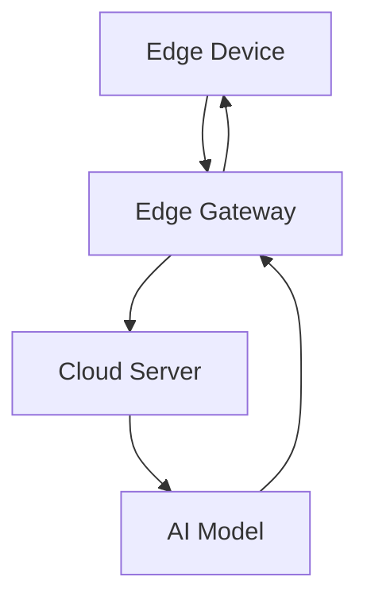

                 


# 企业AI Agent的边缘智能与云智能协同策略

> 关键词：企业AI Agent，边缘智能，云智能，协同策略，算法原理

> 摘要：本文探讨了企业AI Agent在边缘智能与云智能协同中的应用策略。通过分析边缘计算与云计算的优势，提出了协同机制、算法模型和系统架构的设计方法，并提供了实际案例和代码实现。

---

# 第一部分：企业AI Agent的边缘智能与云智能协同背景

## 第1章：企业AI Agent的基本概念

### 1.1 AI Agent的定义与特点
AI Agent是一种智能体，能够感知环境并采取行动以实现目标。其特点包括自主性、反应性、目标导向和学习能力。

### 1.2 企业级AI Agent的应用场景
在企业中，AI Agent用于流程自动化、智能客服、预测分析和决策支持等领域。

## 第2章：边缘智能与云智能的定义与特点

### 2.1 边缘智能的定义
边缘智能是指在数据生成端进行实时处理和决策，具有低延迟、高实时性特点。

### 2.2 云智能的定义
云智能利用云计算资源进行深度数据处理和分析，具备强大的计算能力和数据存储。

### 2.3 边缘与云智能的协同背景
企业智能化转型需要结合边缘的实时性和云的深度分析能力，推动AI Agent的高效协同。

---

# 第二部分：企业AI Agent的边缘智能与云智能协同核心概念

## 第3章：边缘智能与云智能的协同模型

### 3.1 协同模型的定义
协同模型描述边缘与云端的交互和数据流，包括数据传输、模型训练和结果反馈。

### 3.2 协同模型的分类
分为数据驱动型、模型驱动型和服务驱动型，根据需求选择合适的协同方式。

### 3.3 协同模型的实现方式
通过API接口和消息队列实现数据和模型的同步，确保实时性和高效性。

---

# 第三部分：企业AI Agent的边缘智能与云智能协同算法原理

## 第4章：边缘与云智能协同的算法基础

### 4.1 协同学习算法
协同学习通过分布式的训练方式，保护数据隐私，提升模型性能。

### 4.2 联邦学习（Federated Learning）的实现

#### 4.2.1 算法流程
1. 边缘设备收集数据。
2. 云端启动模型训练。
3. 边缘设备上传模型更新。
4. 云端聚合模型参数。

#### 4.2.2 代码实现
```python
import numpy as np

# 模型初始化
model = LinearModel()

# 联邦学习过程
for round in rounds:
    # 边缘设备上传梯度
    gradients = collect_gradients()
    # 云端聚合梯度
    aggregate_gradients(gradients)
    # 更新模型
    model.update()

# 推理阶段
predictions = model.predict(test_data)
```

### 4.3 联邦学习的数学模型
$$ \theta_{new} = \theta_{old} - \eta \cdot \frac{1}{n} \sum_{i=1}^{n} g_i $$

---

# 第四部分：企业AI Agent的边缘智能与云智能协同系统架构

## 第5章：系统架构设计

### 5.1 系统功能设计
- 边缘层：数据采集、初步处理。
- 云端：深度分析、模型训练。
- 通信层：数据传输、模型同步。
- 应用层：业务逻辑实现。

### 5.2 系统架构图


### 5.3 系统交互流程
1. 边缘设备采集数据。
2. 上传到边缘网关。
3. 网关转发到云端。
4. 云端处理后，反馈结果到网关。
5. 网关将结果发送给边缘设备执行。

---

# 第五部分：企业AI Agent的边缘智能与云智能协同项目实战

## 第6章：项目实战：智能物流系统

### 6.1 环境安装
安装边缘计算框架（如Kaa、FogFlow）和云计算平台（如AWS、Azure）。

### 6.2 核心代码实现
```python
# 边缘设备数据采集
class EdgeDevice:
    def collect_data(self):
        return self.sensor_data

# 云端模型训练
class CloudModel:
    def train(self, data):
        # 使用TensorFlow训练模型
        pass

# 协同学习过程
def federated_learning():
    edge_devices = [EdgeDevice() for _ in range(10)]
    cloud = CloudModel()
    for _ in range(10):
        data = [device.collect_data() for device in edge_devices]
        cloud.train(data)
```

### 6.3 案例分析
通过智能物流系统的案例，展示边缘与云端协同实现包裹跟踪和路径优化。

---

# 第六部分：总结与展望

## 第7章：总结

### 7.1 核心要点回顾
- AI Agent在企业中的重要性。
- 边缘智能与云智能的协同优势。
- 联邦学习算法的应用。

## 7.2 展望
未来将探索更高效的协同机制和算法，提升企业的智能化水平。

---

# 结语

企业AI Agent的边缘智能与云智能协同策略为企业智能化转型提供了新思路。通过合理设计协同机制和算法，企业能够高效利用边缘和云端资源，推动业务创新。

