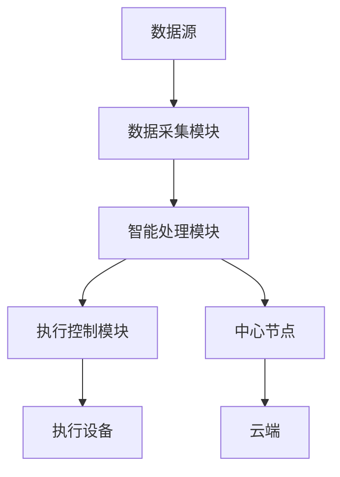

                 


# 企业AI Agent的边缘智能部署策略

> 关键词：企业AI Agent, 边缘智能, 部署策略, 系统架构, 项目实战

> 摘要：本文详细探讨了企业在部署AI Agent时如何利用边缘智能技术，分析了AI Agent的核心原理、边缘智能的技术特点以及系统架构设计，并通过实际案例展示了部署策略的实施过程。文章旨在为企业提供从理论到实践的全面指导，帮助企业在数字化转型中高效利用AI Agent实现智能决策和执行。

---

## 第一部分: 企业AI Agent的边缘智能部署概述

### 第1章: 企业AI Agent与边缘智能概述

#### 1.1 AI Agent的基本概念

- **1.1.1 AI Agent的定义**
  - AI Agent（人工智能代理）是指能够感知环境、做出决策并执行操作的智能实体。
  - 典型AI Agent：推荐系统、智能助手、自动化机器人。

- **1.1.2 AI Agent的核心特征**
  - **自主性**：无需人工干预，自主决策。
  - **反应性**：实时感知环境变化并做出响应。
  - **学习能力**：通过数据和经验不断优化自身模型。

- **1.1.3 企业级AI Agent的应用场景**
  - **智能制造**：设备故障预测、生产优化。
  - **智慧城市**：交通调度、环境监测。
  - **金融服务**：智能投顾、风险预警。

#### 1.2 边缘智能的基本概念

- **1.2.1 边缘计算的定义**
  - 边缘计算是在靠近数据源的地方进行数据处理和计算的技术。
  - 边缘节点：靠近数据源的设备，如传感器、边缘服务器。

- **1.2.2 边缘智能的特点**
  - **低延迟**：实时处理数据，减少传输延迟。
  - **高可用性**：边缘节点独立运行，确保系统可靠性。
  - **隐私保护**：数据在边缘处理，减少传输过程中的隐私泄露风险。

- **1.2.3 边缘智能与云计算的区别**
  - **处理位置**：边缘计算在数据源附近，云计算在云端。
  - **延迟**：边缘计算低延迟，云计算延迟较高。
  - **数据量**：边缘计算处理小数据，云计算处理大数据。

#### 1.3 企业AI Agent边缘智能部署的背景

- **1.3.1 传统企业IT架构的局限性**
  - 数据中心集中处理，延迟高，带宽占用大。
  - 中心化架构难以满足实时性和本地化需求。

- **1.3.2 边缘计算对企业的影响**
  - 提高实时响应能力，降低带宽成本。
  - 支持分布式架构，提升系统的灵活性和扩展性。

- **1.3.3 AI Agent在边缘计算中的作用**
  - 实现数据的实时感知和智能决策。
  - 提供本地化的智能服务，提升用户体验。

#### 1.4 本章小结

- 本章介绍了AI Agent和边缘智能的基本概念，分析了企业部署AI Agent的背景和意义。

---

## 第二部分: AI Agent的核心原理与技术

### 第2章: AI Agent的核心原理

#### 2.1 AI Agent的感知机制

- **2.1.1 数据采集与处理**
  - 数据源：传感器、数据库、API接口。
  - 数据预处理：清洗、归一化、特征提取。

- **2.1.2 感知模型的构建**
  - 感知模型：用于理解环境状态。
  - 模型选择：基于任务需求选择回归、分类或聚类模型。

- **2.1.3 感知结果的分析**
  - 数据分析：统计分析、机器学习分析。
  - 可视化展示：图表、仪表盘。

#### 2.2 AI Agent的决策机制

- **2.2.1 决策算法的选择**
  - 确定性算法：规则引擎、决策树。
  - 非确定性算法：强化学习、遗传算法。

- **2.2.2 决策逻辑的设计**
  - 逻辑框架：基于规则的决策树。
  - 多目标优化：考虑多个决策目标，如成本、效率、风险。

- **2.2.3 多目标优化的实现**
  - 加权函数：将多个目标转化为一个综合目标。
  - � Pareto最优：在多个目标之间找到平衡点。

#### 2.3 AI Agent的执行机制

- **2.3.1 执行动作的规划**
  - 动作规划：路径规划、任务分配。
  - 动作优先级：基于任务重要性排序。

- **2.3.2 执行过程的监控**
  - 实时跟踪：监控执行进度和状态。
  - 异常处理：检测异常并触发备用方案。

- **2.3.3 执行结果的反馈**
  - 反馈机制：将结果反馈给感知和决策模块。
  - 模型优化：根据反馈结果优化感知和决策模型。

#### 2.4 本章小结

- 本章详细讲解了AI Agent的核心原理，包括感知、决策和执行三个主要环节。

---

## 第三部分: 边缘智能的技术实现

### 第3章: 边缘计算的技术特点

#### 3.1 边缘计算的体系结构

- **3.1.1 边缘计算的分层架构**
  - 边缘节点：靠近数据源的设备。
  - 边缘网关：连接边缘节点和云端的中间层。
  - 云端：处理无法在边缘完成的任务。

- **3.1.2 边缘节点的功能划分**
  - 数据采集：传感器数据的采集与预处理。
  - 本地计算：在边缘节点进行数据处理和模型推理。
  - 通信：与边缘网关或云端进行数据交互。

- **3.1.3 边缘计算的资源分配**
  - 资源调度：动态分配计算资源。
  - 负载均衡：确保各节点负载均衡。

#### 3.2 边缘计算的关键技术

- **3.2.1 边缘数据的实时处理**
  - 流数据处理：实时处理数据流。
  - 分布式计算：在多个边缘节点上并行处理数据。

- **3.2.2 边缘计算的安全性保障**
  - 数据加密：传输和存储数据的加密。
  - 访问控制：限制对边缘节点的访问权限。
  - 安全监控：实时监控边缘节点的安全状态。

- **3.2.3 边缘计算的可扩展性设计**
  - 弹性扩展：根据需求动态扩展计算资源。
  - 模块化设计：各功能模块独立，便于扩展。

#### 3.3 边缘智能的核心技术

- **3.3.1 边缘AI模型的轻量化**
  - 模型剪枝：删除模型中不必要的参数。
  - 模型量化：将模型参数压缩为低精度表示。

- **3.3.2 边缘模型的更新与优化**
  - 模型训练：在边缘节点上进行模型微调。
  - 模型迭代：定期更新模型以适应新数据。

- **3.3.3 边缘设备的智能协同**
  - 设备协同：多个边缘设备协同工作。
  - 协同算法：分布式协同学习、联邦学习。

#### 3.4 本章小结

- 本章分析了边缘计算的技术特点，并探讨了如何在边缘环境中实现AI模型的轻量化和优化。

---

## 第四部分: 企业AI Agent边缘智能部署的系统架构

### 第4章: 系统架构设计

#### 4.1 系统整体架构

- **4.1.1 系统功能模块划分**
  - 数据采集模块：负责采集环境数据。
  - 智能处理模块：负责数据处理和模型推理。
  - 执行控制模块：负责决策和动作执行。

- **4.1.2 系统架构的分层设计**
  - 感知层：数据采集和预处理。
  - 决策层：模型推理和决策制定。
  - 执行层：动作执行和反馈。

- **4.1.3 系统架构的可扩展性**
  - 模块化设计：各模块独立，便于扩展。
  - 异构支持：支持多种类型的数据源和执行设备。

#### 4.2 系统功能设计

- **4.2.1 数据采集模块**
  - 功能：采集传感器数据，如温度、湿度、压力等。
  - 实现：通过物联网协议（如MQTT）接收数据。

- **4.2.2 智能处理模块**
  - 功能：对采集的数据进行处理和模型推理。
  - 实现：使用轻量化AI模型进行实时推理。

- **4.2.3 执行控制模块**
  - 功能：根据推理结果制定执行计划。
  - 实现：通过API调用执行设备完成动作。

#### 4.3 系统通信机制

- **4.3.1 边缘节点间的通信协议**
  - 协议选择：MQTT、HTTP、WebSocket。
  - 通信方式：点对点通信、广播通信。

- **4.3.2 中心节点与边缘节点的通信**
  - 数据同步：边缘节点定期向中心节点同步数据。
  - 模型更新：中心节点向边缘节点分发最新模型。

#### 4.4 系统架构图



#### 4.5 本章小结

- 本章详细设计了企业AI Agent的系统架构，包括功能模块划分、通信机制和系统架构图。

---

## 第五部分: 企业AI Agent边缘智能部署的项目实战

### 第5章: 项目实战

#### 5.1 项目背景

- **项目目标**：实现一个基于边缘智能的设备故障预测系统。
- **项目需求**：
  - 实时采集设备运行数据。
  - 在边缘节点进行故障预测。
  - 发出报警信号并执行修复动作。

#### 5.2 环境搭建

- **硬件环境**：
  - 边缘节点：树莓派或工业级边缘设备。
  - 云端：阿里云、AWS或本地服务器。
- **软件环境**：
  - 操作系统：Linux或Windows。
  - 开发工具：Python、Jupyter Notebook。
  - 依赖库：TensorFlow、Keras、Flask。

#### 5.3 核心实现

- **5.3.1 数据采集模块**
  ```python
  import serial

  # 串口通信读取传感器数据
  ser = serial.Serial('COM3', 9600)
  data = ser.readline().decode().strip()
  ```

- **5.3.2 智能处理模块**
  ```python
  import tensorflow as tf
  model = tf.keras.models.load_model('edge_model.h5')
  prediction = model.predict(data)
  ```

- **5.3.3 执行控制模块**
  ```python
  import requests

  # 发送指令到执行设备
  response = requests.post('http://localhost:8000/execute', json=prediction)
  ```

#### 5.4 项目小结

- 本章通过一个实际案例展示了企业AI Agent的边缘智能部署过程，从环境搭建到核心代码实现，再到结果分析，帮助读者更好地理解理论知识。

---

## 第六部分: 总结与展望

### 第6章: 总结与展望

#### 6.1 本章总结

- 本文详细探讨了企业AI Agent的边缘智能部署策略，分析了AI Agent的核心原理、边缘智能的技术特点，并通过实际案例展示了部署过程。

#### 6.2 最佳实践 tips

- **模型优化**：定期更新模型，保持模型的准确性。
- **安全性保障**：加强边缘节点的安全防护，防止数据泄露。
- **可扩展性设计**：采用模块化设计，便于后续扩展。

#### 6.3 未来展望

- **边缘智能的进一步发展**：随着5G和物联网技术的普及，边缘智能将更加广泛地应用于各个行业。
- **AI Agent的智能化提升**：通过强化学习等技术，进一步提升AI Agent的自主决策能力。

#### 6.4 本章小结

- 本章总结了全文的主要内容，并对未来的研究方向提出了展望。

---

## 参考文献

- [1]《深度学习》—— Ian Goodfellow
- [2]《边缘计算：原理与实践》—— 李海雄
- [3]《人工智能：一种现代的方法》—— Stuart Russell

---

## END

---

通过以上详细的内容设计，您将能够撰写出一篇结构清晰、内容详实的专业技术博客文章，涵盖从理论到实践的各个方面，帮助读者全面理解企业AI Agent的边缘智能部署策略。

