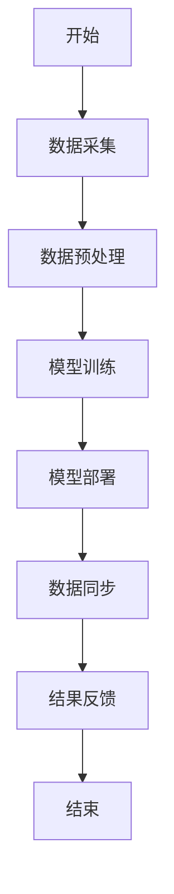
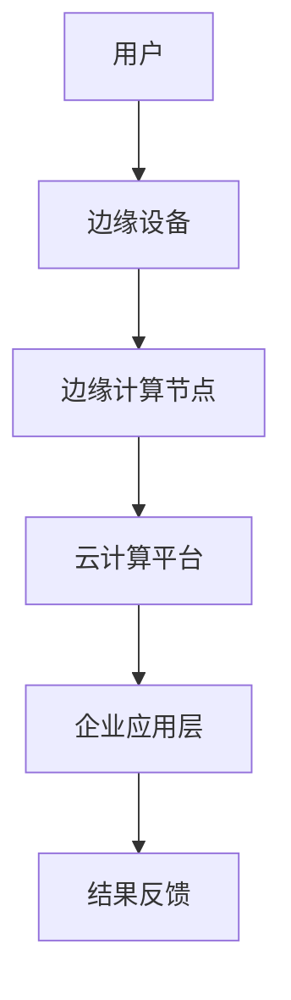
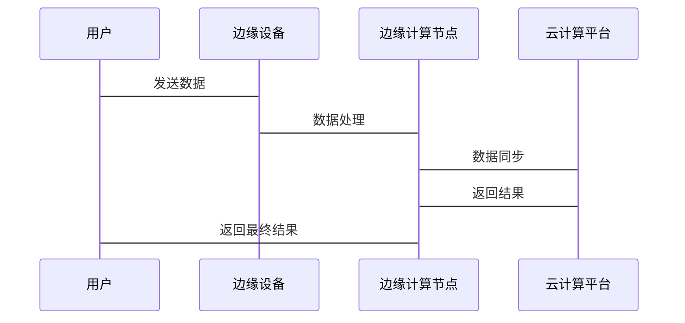

                 


# 企业AI Agent的边缘计算与云计算协同策略

> 关键词：企业AI Agent，边缘计算，云计算，协同策略，算法设计，系统架构

> 摘要：随着企业智能化转型的加速，AI Agent在企业中的应用日益广泛。本文从企业AI Agent的核心概念出发，详细分析了边缘计算与云计算协同的实现机制，探讨了其在企业中的应用场景，并通过实际案例展示了如何设计和实现这一协同策略。文章还提供了丰富的数学模型、算法流程图和系统架构图，为读者提供了全面的技术参考。

---

## 第一部分：企业AI Agent的背景与概念

### 第1章：企业AI Agent的背景与概念

#### 1.1 问题背景与描述

当前，企业AI Agent作为智能化转型的重要工具，正在被广泛应用于各个行业。然而，随着企业规模的不断扩大和业务复杂度的增加，AI Agent的计算需求也在快速增长。传统的云计算模式虽然能够提供强大的计算能力，但在实时性、延迟和带宽方面存在不足。边缘计算的出现，为企业提供了一种新的解决方案，能够将计算能力下沉到靠近数据源的边缘设备，从而实现低延迟、高实时性的AI处理。

#### 1.2 问题解决与边界

企业AI Agent的核心问题是如何在边缘计算与云计算之间实现协同，以满足企业对实时性、计算能力、数据隐私和成本控制的多重需求。通过将AI Agent的部分计算任务分配到边缘设备，同时利用云计算平台进行数据存储和大规模计算，企业能够实现资源的最优分配和计算任务的高效执行。

#### 1.3 核心概念与结构

企业AI Agent的系统架构通常包括边缘计算节点、云计算平台和企业应用层。边缘计算节点负责处理实时性要求高的任务，云计算平台则用于存储、分析和处理大规模数据。AI Agent通过边缘计算和云计算的协同，能够实现数据的实时处理、智能决策和任务执行。

---

## 第二部分：核心概念与联系

### 第2章：AI Agent的核心原理与属性

#### 2.1 AI Agent的原理分析

AI Agent的工作原理可以分为以下几个步骤：数据采集、数据预处理、模型训练、模型部署和结果反馈。在边缘计算与云计算协同的模式下，AI Agent能够将部分数据处理任务分配到边缘设备，同时利用云计算平台进行数据存储和模型训练。

#### 2.2 核心概念对比分析

通过对比分析，可以发现边缘计算和云计算在以下几个方面存在显著差异：计算位置、数据存储、计算能力、延迟和带宽。边缘计算能够提供低延迟和高实时性的计算能力，而云计算则能够提供强大的存储和计算能力。

#### 2.3 ER实体关系图

以下是一个简单的ER实体关系图，展示了企业AI Agent系统的主要实体及其关系：

```mermaid
erDiagram
    actor 用户
    actor 系统管理员
    actor 云服务提供商
    actor 边缘设备
    system 企业AI Agent系统
    system 边缘计算节点
    system 云计算平台
    用户 --> 企业AI Agent系统: 请求处理
    系统管理员 --> 企业AI Agent系统: 系统管理
    云服务提供商 --> 云计算平台: 提供计算资源
    边缘设备 --> 边缘计算节点: 数据处理
    边缘计算节点 --> 云计算平台: 数据同步
```

---

## 第三部分：算法原理与数学模型

### 第3章：AI Agent的算法原理

#### 3.1 算法原理概述

企业AI Agent的算法设计需要考虑边缘计算和云计算的协同机制。以下是基于边缘计算的AI Agent算法和基于云计算的AI Agent算法的对比：

- **基于边缘计算的AI Agent算法**：该算法主要在边缘设备上进行数据采集和实时处理，适用于低延迟和高实时性的场景。
- **基于云计算的AI Agent算法**：该算法主要在云计算平台上进行大规模数据存储和模型训练，适用于需要大量计算资源的场景。

#### 3.2 算法流程图

以下是一个AI Agent算法的流程图：



#### 3.3 算法实现代码

以下是AI Agent算法的Python实现示例：

```python
def edge_agent_algorithm(data):
    # 数据预处理
    preprocessed_data = preprocess(data)
    # 模型训练
    model = train_model(preprocessed_data)
    # 模型部署
    result = execute_model(model, data)
    return result

def cloud_agent_algorithm(data):
    # 数据同步
    preprocessed_data = preprocess(data)
    # 模型训练
    model = train_model(preprocessed_data)
    # 模型部署
    result = execute_model(model, data)
    return result
```

---

## 第四部分：系统架构设计

### 第4章：系统架构设计

#### 4.1 问题场景介绍

企业AI Agent的系统架构设计需要考虑以下几个问题：数据的实时性、计算能力的分配、数据隐私的保护以及系统的可扩展性。通过边缘计算和云计算的协同，企业能够实现资源的最优分配和计算任务的高效执行。

#### 4.2 系统功能设计

以下是企业AI Agent系统的功能设计：

- 数据采集与预处理
- 模型训练与部署
- 数据同步与结果反馈
- 系统管理与监控

#### 4.3 系统架构图

以下是企业AI Agent系统的架构图：



#### 4.4 系统接口设计

以下是系统接口设计的示意图：



---

## 第五部分：项目实战与案例分析

### 第5章：项目实战与案例分析

#### 5.1 环境安装

以下是项目实战所需的环境安装步骤：

1. 安装Python和必要的Python库（如TensorFlow、Flask）。
2. 安装边缘计算框架（如Kubernetes、Docker）。
3. 安装云计算平台（如AWS、Azure）。

#### 5.2 核心实现代码

以下是AI Agent的核心实现代码：

```python
def preprocess(data):
    # 数据预处理
    processed_data = data cleaning and transformation
    return processed_data

def train_model(data):
    # 模型训练
    model = build_model()
    model.fit(data)
    return model

def execute_model(model, data):
    # 模型执行
    result = model.predict(data)
    return result
```

#### 5.3 案例分析

以下是企业AI Agent在智能制造中的应用案例：

- **问题场景**：某制造企业需要实时监控生产线上的设备状态。
- **解决方案**：使用AI Agent在边缘设备上实时采集设备数据，并通过云计算平台进行数据分析和预测。
- **结果**：实现了设备状态的实时监控和故障预测，减少了设备停机时间，提高了生产效率。

---

## 第六部分：最佳实践与小结

### 第6章：最佳实践与小结

#### 6.1 小结

企业AI Agent的边缘计算与云计算协同策略是一种高效的计算模式，能够满足企业对实时性、计算能力和数据隐私的多重需求。通过合理设计系统架构和算法，企业能够实现资源的最优分配和计算任务的高效执行。

#### 6.2 注意事项

- 在设计系统架构时，需要充分考虑数据隐私和安全性。
- 在实现算法时，需要确保计算任务的高效分配和协同。
- 在实际应用中，需要根据企业的具体需求进行定制化设计。

#### 6.3 拓展阅读

- 《边缘计算与云计算协同》
- 《企业AI Agent的设计与实现》
- 《AI Agent在企业中的应用》

---

通过本文的分析和阐述，读者可以深入了解企业AI Agent的边缘计算与云计算协同策略的核心概念、算法设计和系统架构，为实际应用提供了有力的技术支持。

