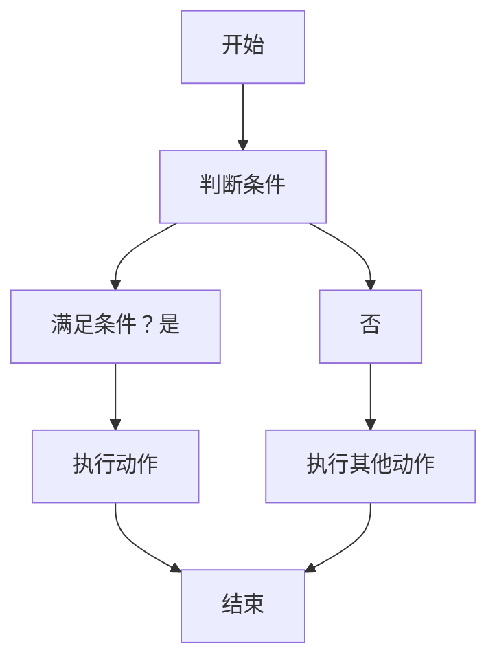
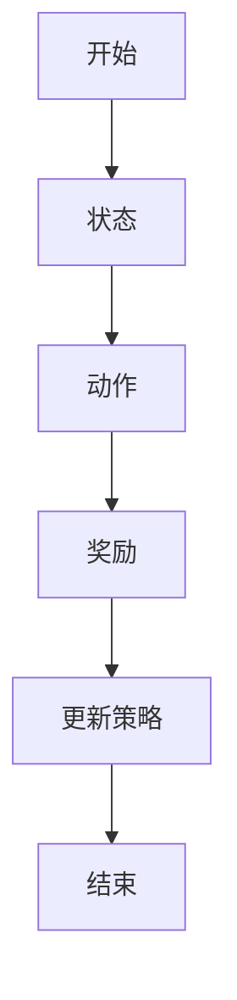
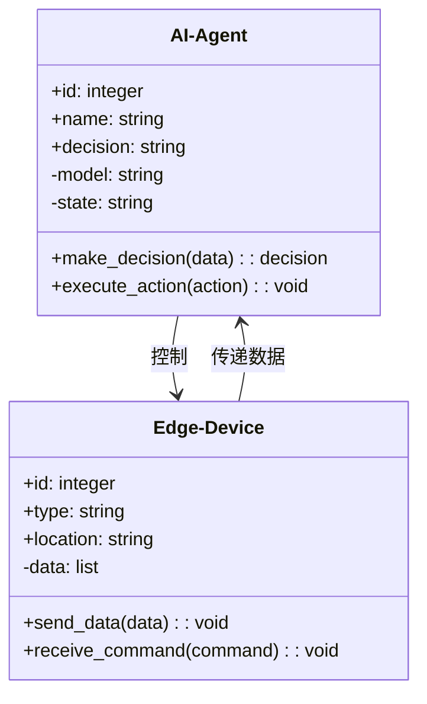
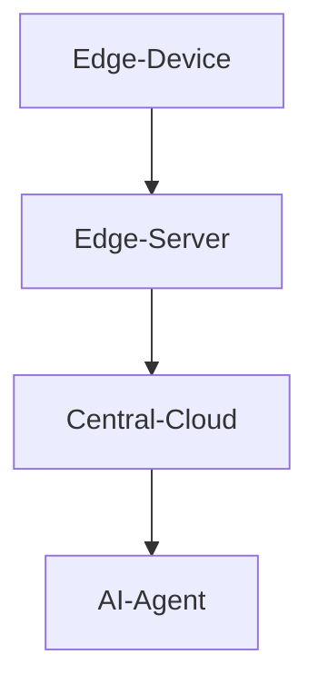
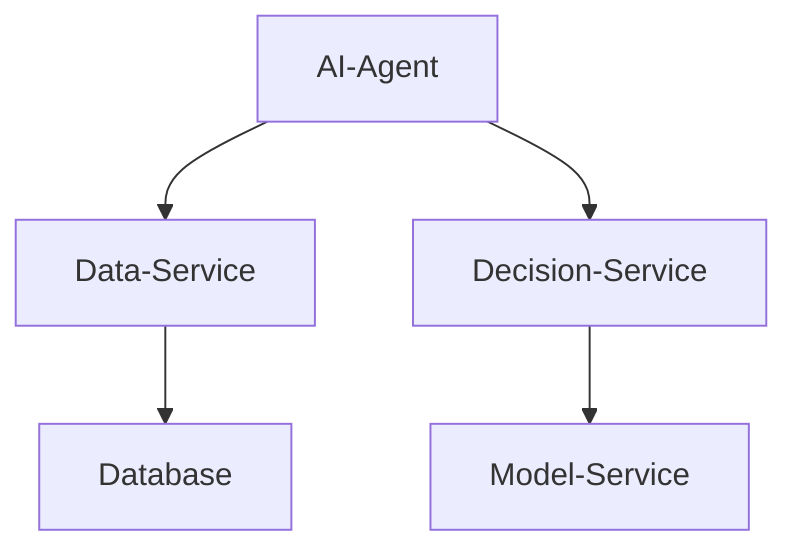

                 


# 企业AI Agent的边缘计算在工业物联网中的实践

> 关键词：企业AI Agent，边缘计算，工业物联网，实时性，数据处理，智能决策

> 摘要：本文探讨了企业AI Agent与边缘计算在工业物联网中的融合应用，详细介绍了AI Agent的基本概念、边缘计算的核心特征，以及它们在工业物联网中的协同工作原理。通过分析核心概念、算法原理和系统架构，结合实际项目案例，展示了如何在工业物联网中实现高效的智能决策和实时数据处理。本文旨在为技术从业者提供理论与实践相结合的深度解析。

---

## 目录大纲

1. [企业AI Agent与边缘计算概述](#企业AI-Agent与边缘计算概述)
   - [1.1 企业AI Agent的基本概念](#11-企业AI-Agent的基本概念)
   - [1.2 边缘计算的基本概念](#12-边缘计算的基本概念)
   - [1.3 工业物联网的基本概念](#13-工业物联网的基本概念)
   - [1.4 企业AI Agent与边缘计算的融合](#14-企业AI-Agent与边缘计算的融合)
   - [1.5 本章小结](#15-本章小结)

2. [企业AI Agent的边缘计算核心概念](#企业AI-Agent的边缘计算核心概念)
   - [2.1 AI Agent与边缘计算的核心要素](#21-AI-Agent与边缘计算的核心要素)
   - [2.2 核心概念对比分析](#22-核心概念对比分析)
   - [2.3 实体关系图（ER图）分析](#23-实体关系图ER图分析)
   - [2.4 本章小结](#24-本章小结)

3. [企业AI Agent的边缘计算算法原理](#企业AI-Agent的边缘计算算法原理)
   - [3.1 AI Agent的决策算法](#31-AI-Agent的决策算法)
   - [3.2 边缘计算中的数据处理算法](#32-边缘计算中的数据处理算法)
   - [3.3 算法流程图分析](#33-算法流程图分析)
   - [3.4 算法实现代码示例](#34-算法实现代码示例)
   - [3.5 本章小结](#35-本章小结)

4. [企业AI Agent的边缘计算系统架构](#企业AI-Agent的边缘计算系统架构)
   - [4.1 系统功能设计](#41-系统功能设计)
   - [4.2 系统架构设计](#42-系统架构设计)
   - [4.3 系统接口设计](#43-系统接口设计)
   - [4.4 本章小结](#44-本章小结)

5. [企业AI Agent的边缘计算项目实战](#企业AI-Agent的边缘计算项目实战)
   - [5.1 项目背景与目标](#51-项目背景与目标)
   - [5.2 项目环境与工具安装](#52-项目环境与工具安装)
   - [5.3 项目核心实现](#53-项目核心实现)
   - [5.4 项目案例分析](#54-项目案例分析)
   - [5.5 项目小结](#55-项目小结)

6. [总结与展望](#总结与展望)
   - [6.1 本章总结](#61-本章总结)
   - [6.2 未来展望](#62-未来展望)
   - [6.3 注意事项与最佳实践](#63-注意事项与最佳实践)

---

## 正文内容

### 第1章: 企业AI Agent与边缘计算概述

#### 1.1 企业AI Agent的基本概念

企业AI Agent是指在企业环境中，通过人工智能技术实现自主决策、问题解决和任务执行的智能实体。它能够根据环境信息和目标需求，自主选择最优行动方案，并通过与外部系统或人类交互，完成预定任务。

**核心特征：**
1. **自主性**：AI Agent能够独立感知环境并做出决策。
2. **反应性**：能够实时响应环境变化。
3. **智能性**：具备学习和推理能力，能够优化决策策略。
4. **协作性**：能够与其他Agent或系统协同工作。

#### 1.2 边缘计算的基本概念

边缘计算是一种分布式计算范式，数据在靠近数据源的边缘设备上进行处理，而非全部传输到云端。边缘计算的特点包括：
1. **低延迟**：减少数据传输到云端的时间。
2. **高实时性**：能够快速响应本地事件。
3. **本地化处理**：数据在边缘节点上进行处理，降低网络负担。

#### 1.3 工业物联网的基本概念

工业物联网（IIoT）是物联网技术在工业领域的应用，通过连接各种工业设备、传感器和系统，实现设备间的数据交换和协同工作。工业物联网的体系结构通常包括感知层、网络层、数据层和应用层。

**应用场景：**
1. **设备监控与维护**：实时监控设备运行状态，预测维护时间。
2. **生产优化**：通过数据分析优化生产流程。
3. **质量控制**：实时检测产品质量，减少缺陷率。

#### 1.4 企业AI Agent与边缘计算的融合

AI Agent与边缘计算的结合，能够充分发挥两者的优势。AI Agent在边缘设备上运行，能够快速响应本地事件，同时利用边缘计算的实时性优势，实现高效的数据处理和智能决策。

**协同工作流程：**
1. **数据采集**：边缘设备采集工业物联网中的实时数据。
2. **数据处理**：AI Agent对数据进行分析，生成决策建议。
3. **决策执行**：根据决策结果，触发相关设备或系统的动作。

#### 1.5 本章小结

本章介绍了企业AI Agent、边缘计算和工业物联网的基本概念，并探讨了它们的融合方式。通过理解这些概念，我们可以为后续的系统设计和项目实现打下坚实基础。

---

### 第2章: 企业AI Agent的边缘计算核心概念

#### 2.1 AI Agent与边缘计算的核心要素

**AI Agent的核心要素：**
1. **感知能力**：通过传感器或API获取环境数据。
2. **决策能力**：基于数据进行智能决策。
3. **执行能力**：通过API或指令执行决策。

**边缘计算的核心要素：**
1. **边缘设备**：包括传感器、网关等设备。
2. **本地计算能力**：边缘设备具备一定的计算能力。
3. **数据通信**：通过本地网络进行数据传输。

#### 2.2 核心概念对比分析

**对比表格：**

| **核心要素** | **AI Agent** | **边缘计算** |
|--------------|--------------|--------------|
| **数据处理** | 中央化       | 分布式       |
| **计算能力** | 高           | 中           |
| **延迟要求** | 低           | 极低         |

**特征对比：**
- AI Agent注重智能性和决策能力，边缘计算注重实时性和分布式处理。

#### 2.3 实体关系图（ER图）分析

```mermaid
erDiagram
    customer[企业AI Agent] {
        ++ id : integer
        ++ name : string
        ++ decision : string
    }
    device[边缘设备] {
        ++ id : integer
        ++ type : string
        ++ location : string
    }
    sensor[传感器] {
        ++ id : integer
        ++ type : string
        ++ value : float
    }
    customer --> device : 控制
    device --> sensor : 连接
```

---

### 第3章: 企业AI Agent的边缘计算算法原理

#### 3.1 AI Agent的决策算法

**基于规则的决策算法：**


**基于机器学习的决策算法：**
```python
def decision_algorithm(data):
    # 数据预处理
    processed_data = preprocess(data)
    # 模型预测
    prediction = model.predict(processed_data)
    return prediction
```

**基于强化学习的决策算法：**


#### 3.2 边缘计算中的数据处理算法

**数据预处理：**
```python
def preprocess(data):
    # 去除异常值
    filtered_data = data[abs(data - data.mean()) < 2*data.std()]
    return filtered_data
```

**数据压缩：**
```python
def compress_data(data):
    # 使用压缩算法（如gzip）
    import gzip
    compressed_data = gzip.compress(data)
    return compressed_data
```

---

### 第4章: 企业AI Agent的边缘计算系统架构

#### 4.1 系统功能设计

**功能模块：**
1. **数据采集模块**：采集工业物联网中的实时数据。
2. **数据处理模块**：对数据进行预处理和分析。
3. **决策模块**：基于数据生成决策建议。
4. **执行模块**：根据决策结果执行相应操作。

**领域模型：**


#### 4.2 系统架构设计

**分层架构：**


**微服务架构：**


---

### 第5章: 企业AI Agent的边缘计算项目实战

#### 5.1 项目背景与目标

**背景：** 一家制造企业希望通过AI Agent和边缘计算技术，实现设备的预测性维护。

**目标：**
1. 实时监控设备状态。
2. 预测设备故障时间。
3. 自动触发维护流程。

#### 5.2 项目环境与工具安装

**环境要求：**
- 操作系统：Linux/Windows
- 开发工具：Python 3.8+
- 依赖库：TensorFlow, scikit-learn, pandas, numpy

**安装步骤：**
```bash
pip install tensorflow scikit-learn pandas numpy
```

#### 5.3 项目核心实现

**数据采集代码：**
```python
import serial

def read_data(port, baudrate):
    ser = serial.Serial(port, baudrate)
    data = ser.readline().decode().strip()
    ser.close()
    return data
```

**决策算法代码：**
```python
from sklearn.ensemble import RandomForestClassifier

def train_model(X_train, y_train):
    model = RandomForestClassifier()
    model.fit(X_train, y_train)
    return model
```

#### 5.4 项目案例分析

**案例：**
假设我们有设备运行数据，包括温度、振动、压力等指标。通过AI Agent分析这些数据，预测设备是否需要维护。

**数据分析：**
```python
import pandas as pd

data = pd.read_csv('device_data.csv')
print(data.head())
```

**模型预测：**
```python
model = train_model(X_train, y_train)
prediction = model.predict(X_test)
print(prediction)
```

---

### 第6章: 总结与展望

#### 6.1 本章总结

本文详细探讨了企业AI Agent与边缘计算在工业物联网中的融合应用，通过理论分析和项目实践，展示了如何在工业场景中实现高效的智能决策和实时数据处理。

#### 6.2 未来展望

未来，随着AI和边缘计算技术的不断进步，企业AI Agent将在工业物联网中发挥更加重要的作用。特别是在智能制造、智慧城市等领域，AI Agent与边缘计算的结合将推动工业智能化的进一步发展。

#### 6.3 注意事项与最佳实践

1. **数据安全**：确保数据在传输和处理过程中的安全性。
2. **算法优化**：不断优化AI Agent的决策算法，提高准确性和效率。
3. **系统维护**：定期维护和更新系统，确保其稳定性和可靠性。

---

通过以上内容，本文为读者提供了一个全面的企业AI Agent边缘计算在工业物联网中的实践指南，从理论到实践，帮助读者更好地理解和应用这些技术。

