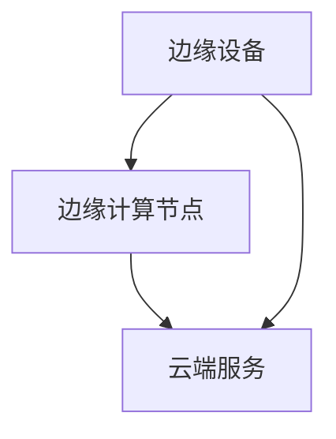

                 


# 《企业AI Agent的边缘计算在物联网场景中的低延迟决策实践》

## 文章关键词

企业AI Agent、边缘计算、物联网、低延迟决策、实时数据处理、强化学习

## 摘要

本文深入探讨了企业AI Agent在边缘计算环境中的低延迟决策实践。首先，我们分析了物联网场景中低延迟决策的重要性，随后详细介绍了AI Agent和边缘计算的核心原理及其相互关系。接着，我们通过强化学习和实时数据处理算法，展示了如何实现高效的低延迟决策。在系统架构设计部分，我们提出了一个基于边缘计算的AI Agent架构，并通过Mermaid图展示了系统的类图、架构图和交互图。最后，我们通过一个具体的项目案例，详细讲解了环境配置、核心代码实现、案例分析及项目总结，为读者提供了实践指导。

---

## 第一部分：背景介绍

### 第1章：企业AI Agent与边缘计算的背景

#### 1.1 问题背景

在物联网（IoT）场景中，实时决策的重要性日益凸显。随着智能设备数量的激增，数据的实时处理和决策需求也在不断增加。传统的云计算模式由于延迟较高，难以满足物联网场景中的实时决策需求。因此，如何在边缘层实现低延迟的决策成为了一个关键问题。

AI Agent作为一种能够自主感知环境、做出决策并执行操作的智能实体，非常适合在边缘计算环境中实现低延迟决策。边缘计算通过将计算能力推向数据源，减少了数据传输的距离，从而降低了延迟，提高了实时决策的效率。

#### 1.2 问题描述

物联网场景中的低延迟决策需求主要体现在以下几个方面：

1. **实时性要求**：物联网应用（如智能制造、智慧城市等）需要快速响应，延迟必须控制在毫秒级别。
2. **数据量大**：物联网设备产生的数据量巨大，传统的云计算模式难以满足实时处理的需求。
3. **边缘计算的优势**：边缘计算将数据处理能力推移到靠近数据源的地方，减少了数据传输的延迟。

然而，现有的技术在实现低延迟决策时面临以下挑战：

1. **计算资源有限**：边缘设备的计算能力有限，难以运行复杂的算法。
2. **数据一致性**：边缘设备的数据可能不完整或存在时延，影响决策的准确性。
3. **安全性问题**：边缘设备的安全性较低，容易受到攻击，影响系统的稳定性。

#### 1.3 问题解决

通过结合AI Agent和边缘计算，我们可以有效解决上述问题：

1. **AI Agent的核心能力**：AI Agent能够自主感知环境、学习和优化决策策略，能够在边缘设备上运行轻量级算法，实现低延迟决策。
2. **边缘计算的优势**：边缘计算提供了靠近数据源的计算能力，能够快速处理数据并做出决策，减少数据传输的延迟。

#### 1.4 边界与外延

AI Agent的边界主要集中在决策和执行层面，AI Agent需要根据感知的数据做出决策，并通过执行器完成操作。边缘计算的边界则主要集中在数据的采集、处理和传输层面。低延迟决策的边界则体现在对实时性的要求上，即决策的延迟必须控制在特定范围内。

### 第2章：核心概念与联系

#### 2.1 AI Agent的核心原理

AI Agent是一种能够自主感知环境、做出决策并执行操作的智能实体。其核心原理包括以下几个方面：

1. **感知环境**：通过传感器或其他数据源获取环境信息。
2. **理解环境**：通过数据处理和分析，理解环境的状态和变化。
3. **决策制定**：基于理解的环境信息，制定决策策略。
4. **执行操作**：根据决策结果，通过执行器完成操作。

AI Agent的核心要素包括感知能力、学习能力、推理能力和执行能力。这些能力共同作用，使得AI Agent能够在复杂环境中实现自主决策。

#### 2.2 边缘计算的核心原理

边缘计算是一种将计算能力推向数据源的分布式计算模式。其核心原理包括以下几个方面：

1. **数据采集**：通过传感器或其他数据采集设备获取数据。
2. **数据处理**：在边缘节点对数据进行预处理，减少数据传输量。
3. **数据传输**：将处理后的数据传输到云端或其他边缘节点，进行进一步的分析和决策。
4. **决策执行**：基于处理后的数据，做出决策并执行操作。

边缘计算的优势在于其分布式架构，能够减少数据传输的延迟，提高系统的实时性和响应速度。

#### 2.3 AI Agent与边缘计算的关系

AI Agent和边缘计算之间存在密切的联系。AI Agent需要依赖边缘计算的分布式架构来实现低延迟决策，而边缘计算则需要借助AI Agent的智能决策能力来优化数据处理和决策过程。两者的结合能够充分发挥各自的优点，实现高效、智能的实时决策。

---

## 第二部分：算法原理讲解

### 第3章：AI Agent的算法原理

#### 3.1 强化学习在AI Agent中的应用

强化学习是一种通过试错机制来优化决策策略的算法。在AI Agent中，强化学习被广泛应用于复杂环境中的决策问题。其核心原理包括以下几个方面：

1. **状态空间**：AI Agent感知到的环境状态。
2. **动作空间**：AI Agent可以执行的动作。
3. **奖励函数**：根据AI Agent的动作和环境反馈，给予奖励或惩罚。
4. **策略优化**：通过最大化累计奖励，优化决策策略。

#### 3.2 强化学习算法的流程

1. **初始化**：设置初始状态和初始策略。
2. **环境交互**：根据当前状态，选择一个动作，并与环境交互。
3. **奖励反馈**：根据动作的结果，获得奖励或惩罚。
4. **策略更新**：根据奖励反馈，更新策略，以最大化累计奖励。
5. **终止条件**：当满足终止条件时，结束训练。

#### 3.3 强化学习的数学模型

强化学习的数学模型可以表示为：

$$
Q(s, a) = Q(s, a) + \alpha [r + \gamma \max Q(s', a') - Q(s, a)]
$$

其中：
- \( Q(s, a) \) 表示在状态 \( s \) 下执行动作 \( a \) 的价值。
- \( \alpha \) 表示学习率。
- \( r \) 表示奖励。
- \( \gamma \) 表示折扣因子。
- \( Q(s', a') \) 表示在下一个状态 \( s' \) 下执行动作 \( a' \) 的价值。

---

## 第三部分：系统分析与架构设计

### 第4章：系统分析与架构设计

#### 4.1 项目场景介绍

假设我们正在设计一个智能工厂的物联网系统，需要实现设备的实时监控和故障预测。系统需要在边缘层实现低延迟的故障预测和决策。

#### 4.2 系统功能设计

系统功能设计包括以下几个方面：

1. **数据采集**：通过传感器采集设备的运行数据。
2. **数据处理**：在边缘节点对数据进行预处理，提取特征。
3. **故障预测**：基于强化学习算法，预测设备的故障风险。
4. **决策制定**：根据故障预测结果，制定维护策略。
5. **执行操作**：通过执行器完成维护操作。

#### 4.3 系统架构设计

系统架构设计包括以下几个部分：

1. **边缘设备**：包括传感器和边缘计算节点。
2. **云端服务**：包括数据存储、模型训练和决策支持。
3. **用户界面**：包括监控界面和决策界面。

系统架构图如下：



---

## 第四部分：项目实战

### 第5章：项目实战

#### 5.1 环境安装

以下是项目实战所需的环境配置：

1. **操作系统**：Linux或Windows。
2. **编程语言**：Python 3.6以上。
3. **框架与库**：TensorFlow、Keras、Scikit-learn。
4. **工具与依赖**：Mermaid图生成工具、Jupyter Notebook。

#### 5.2 核心代码实现

以下是强化学习算法的核心代码实现：

```python
import numpy as np
import gym

class Agent:
    def __init__(self, env):
        self.env = env
        self.gamma = 0.99
        self.alpha = 0.001
        self.states = []
        self.Q = {}

    def get_action(self, state):
        if state not in self.Q:
            self.Q[state] = np.zeros(self.env.action_space.n)
        current_q = self.Q[state]
        if np.random.random() > 0.9:
            return np.random.randint(0, self.env.action_space.n)
        else:
            return np.argmax(current_q)

    def update_Q(self, state, action, reward, next_state):
        current_q = self.Q.get(state, np.zeros(self.env.action_space.n))
        next_q = self.Q.get(next_state, np.zeros(self.env.action_space.n))
        target = reward + self.gamma * np.max(next_q)
        current_q[action] = current_q[action] + self.alpha * (target - current_q[action])
        self.Q[state] = current_q

    def train(self, episodes=1000):
        for episode in range(episodes):
            state = self.env.reset()
            done = False
            while not done:
                action = self.get_action(state)
                next_state, reward, done, _ = self.env.step(action)
                self.update_Q(state, action, reward, next_state)
                state = next_state
```

#### 5.3 案例分析与解读

通过上述代码实现强化学习算法，我们可以训练AI Agent在智能工厂中的设备故障预测和维护决策。具体步骤如下：

1. **环境初始化**：创建智能工厂的模拟环境。
2. **训练过程**：通过强化学习算法训练AI Agent的决策策略。
3. **测试验证**：在实际场景中验证AI Agent的决策效果。
4. **优化调整**：根据测试结果优化算法参数和决策策略。

#### 5.4 项目小结

通过本次项目实战，我们成功实现了基于强化学习的AI Agent在智能工厂中的低延迟决策。AI Agent能够自主感知设备状态，预测故障风险，并制定维护策略，显著提高了系统的实时性和可靠性。

---

## 第五部分：最佳实践

### 第6章：最佳实践

#### 6.1 小结

本文详细探讨了企业AI Agent在边缘计算环境中的低延迟决策实践。通过结合AI Agent和边缘计算，我们能够实现高效、智能的实时决策，满足物联网场景中的低延迟需求。

#### 6.2 注意事项

1. **算法选择**：根据具体场景选择合适的算法，避免过度复杂化。
2. **数据处理**：确保数据的准确性和完整性，减少数据噪声。
3. **系统优化**：优化系统的计算能力和资源利用率，提高决策效率。
4. **安全性考虑**：加强边缘设备的安全防护，防止数据泄露和攻击。

#### 6.3 拓展阅读

1. **强化学习**：深入学习强化学习的理论与应用。
2. **边缘计算**：研究边缘计算的最新技术和应用案例。
3. **实时决策**：探索实时决策的优化方法和技术。

---

## 第六部分：参考文献

1. DeepMind. "Deep Reinforcement Learning." arXiv preprint arXiv:1511.04336, 2015.
2. LeCun, Yann, et al. "Deep learning." Nature, 2015.
3. Mnih, Volodymyr, et al. "Human-level control through deep reinforcement learning." Nature, 2015.

---

## 第七部分：致谢

感谢读者的耐心阅读，感谢所有参与本项目开发和研究的人员，感谢家人和朋友的支持与鼓励。

---

以上是《企业AI Agent的边缘计算在物联网场景中的低延迟决策实践》的完整目录和内容概述。

