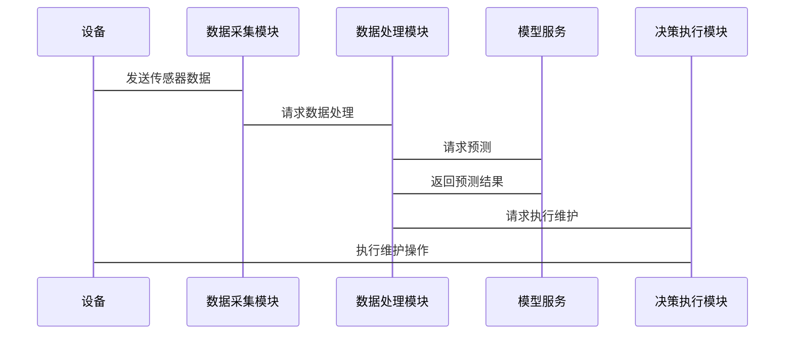
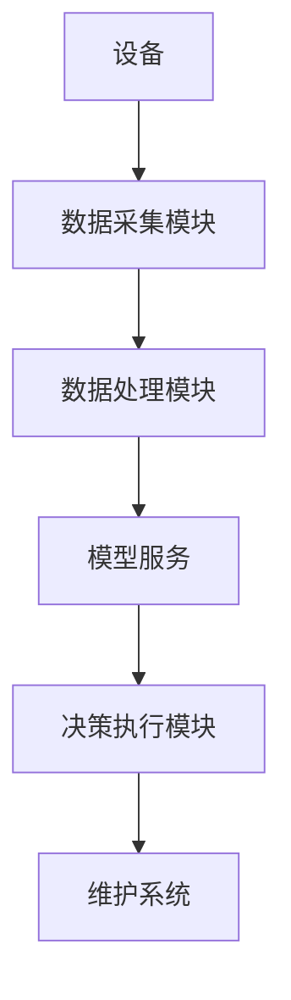
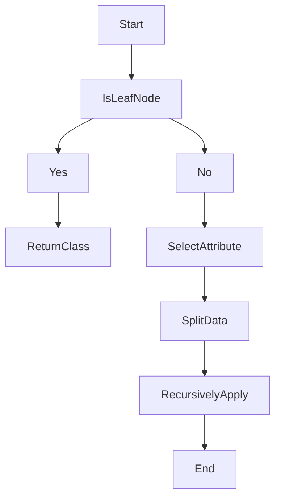
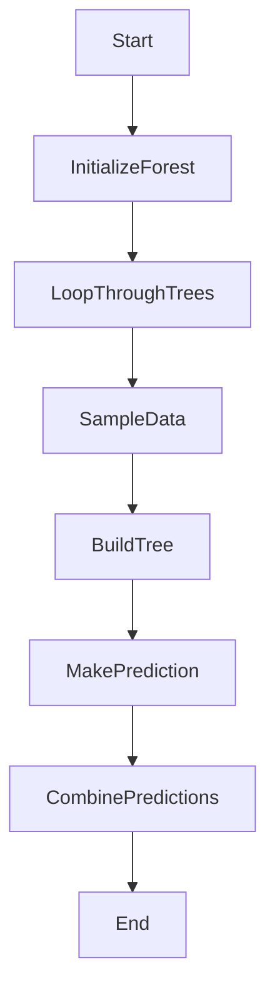

                 


# 企业AI Agent的边缘计算在物联网实时决策中的实践

## 关键词：AI Agent，边缘计算，物联网，实时决策，机器学习，系统架构

## 摘要：本文探讨企业AI Agent在边缘计算环境中的应用，特别是在物联网实时决策中的实践。通过分析AI Agent与边缘计算的关系，讲解决策算法、系统架构设计、项目实战和最佳实践，展示如何在边缘环境中高效利用AI进行实时决策。

---

# 第1章: 企业AI Agent的边缘计算与物联网概述

## 1.1 AI Agent的基本概念

### 1.1.1 定义

AI Agent是具备感知和自主决策能力的智能主体，能够通过环境信息做出决策并执行行动。

### 1.1.2 功能

- 数据感知：通过传感器或API获取环境信息。
- 信息处理：利用算法分析数据，识别模式。
- 决策制定：基于分析结果生成决策。
- 行动执行：通过API或执行器将决策转化为行动。

## 1.2 边缘计算的基本概念

### 1.2.1 定义

边缘计算是在靠近数据源的地方进行数据处理和存储，减少网络延迟和带宽消耗。

### 1.2.2 优势

- **低延迟**：数据处理靠近设备，减少响应时间。
- **高带宽效率**：仅传输必要的数据，减少网络负载。
- **数据隐私**：本地处理敏感数据，降低传输风险。

## 1.3 物联网实时决策的重要性

### 1.3.1 物联网决策需求

物联网系统需要实时处理数据，快速响应变化，如设备故障预警、供应链优化等。

### 1.3.2 边缘计算与物联网的结合

边缘计算为物联网提供了实时处理和决策的能力，使系统能够在本地快速响应，而不需要依赖云端。

### 1.3.3 AI Agent在物联网中的作用

AI Agent通过分析物联网数据，提供实时决策支持，优化设备运行，提高效率。

## 1.4 本章小结

本章介绍了AI Agent和边缘计算的基本概念，分析了边缘计算在物联网中的优势，以及AI Agent在物联网实时决策中的重要性。

---

# 第2章: AI Agent与边缘计算的核心原理

## 2.1 AI Agent的核心原理

### 2.1.1 决策过程

AI Agent通过感知环境、分析数据、制定决策并执行行动，实现目标。

### 2.1.2 智能推理

AI Agent利用机器学习模型进行推理，识别模式和趋势，做出预测和决策。

## 2.2 边缘计算的核心原理

### 2.2.1 数据处理流程

数据在边缘设备或边缘服务器中进行预处理、分析和存储，减少对云端的依赖。

### 2.2.2 资源分配机制

边缘计算通过负载均衡和资源调度算法，合理分配计算资源，确保高效运行。

## 2.3 AI Agent与边缘计算的关系

### 2.3.1 协同工作

AI Agent依赖边缘计算的分布式架构，进行实时数据处理和决策。

### 2.3.2 数据同步与通信

AI Agent需要与边缘设备和其他系统进行数据同步和通信，确保决策的准确性和一致性。

## 2.4 本章小结

本章详细讲解了AI Agent和边缘计算的核心原理，分析了它们之间的协同关系，为后续的算法和系统设计奠定了基础。

---

# 第3章: AI Agent决策算法的数学模型

## 3.1 决策树算法

### 3.1.1 基本概念

决策树是一种树状结构，通过数据特征的分裂，构建分类或回归模型。

### 3.1.2 决策树的构建

使用信息增益或信息熵作为分裂标准，递归地构建决策树。

## 3.2 随机森林算法

### 3.2.1 基本概念

随机森林是决策树的集成方法，通过随机采样数据和特征，构建多棵决策树，提高准确性和鲁棒性。

### 3.2.2 算法步骤

1. 随机采样数据集，生成多个训练集。
2. 对每个训练集，构建决策树。
3. 集成决策树的预测结果，得到最终决策。

## 3.3 支持向量机算法

### 3.3.1 基本概念

支持向量机通过寻找最优超平面，将数据点分类到不同的类别中。

### 3.3.2 算法步骤

1. 数据映射：将低维数据映射到高维空间，使得数据线性可分。
2. 构建超平面：寻找使得支持向量与超平面距离最大的平面。
3. 分类决策：根据数据点位于超平面的哪一侧进行分类。

## 3.4 算法比较与选择

### 3.4.1 比较决策树、随机森林和支持向量机的优缺点

| 算法       | 优点                               | 缺点                               |
|------------|------------------------------------|------------------------------------|
| 决策树     | 易解释，适合非线性数据             | 易过拟合，对噪声数据敏感           |
| 随机森林   | 高准确率，鲁棒性强                 | 计算复杂度高                       |
| 支持向量机  | 高准确率，适合高维数据             | 不适合大规模数据                   |

### 3.4.2 如何选择合适的算法

- 数据类型：分类、回归或聚类。
- 数据规模：小数据适合决策树，大数据适合随机森林。
- 计算资源：支持向量机需要较高的计算资源。

## 3.5 本章小结

本章介绍了决策树、随机森林和支持向量机三种算法，分析了它们的优缺点和适用场景，为后续的系统设计提供了算法选择的依据。

---

# 第4章: 系统分析与架构设计

## 4.1 项目背景与目标

### 4.1.1 项目背景

在智能工厂中，设备需要实时监控和预测维护，减少停机时间。

### 4.1.2 项目目标

实现设备状态监测、故障预测和维护建议的实时决策。

## 4.2 系统功能设计

### 4.2.1 功能模块划分

- 数据采集模块：收集设备传感器数据。
- 数据处理模块：预处理和特征提取。
- 模型训练模块：训练和部署机器学习模型。
- 决策执行模块：生成维护建议并执行。

### 4.2.2 功能模块交互设计

数据采集模块将数据传输到数据处理模块，处理后传送给模型训练模块，生成决策后由决策执行模块执行。

## 4.3 系统架构设计

### 4.3.1 分层架构设计

- 数据层：存储原始数据和处理后的数据。
- 计算层：运行机器学习模型，进行数据处理和分析。
- 应用层：展示决策结果，与用户交互。

### 4.3.2 微服务架构设计

- 数据采集服务：负责数据的收集和传输。
- 数据处理服务：进行数据预处理和特征提取。
- 模型服务：运行机器学习模型，生成决策。
- 决策服务：将决策结果传递给执行系统。

## 4.4 系统接口设计

### 4.4.1 API接口设计

- 数据采集接口：`POST /api/sensor/data`
- 模型调用接口：`POST /api/predict/maintenance`

### 4.4.2 接口交互流程设计

1. 设备发送传感器数据到数据采集接口。
2. 数据处理模块调用模型调用接口，获取预测结果。
3. 决策执行模块根据预测结果生成维护建议并执行。

## 4.5 系统交互设计

### 4.5.1 序列图



## 4.6 本章小结

本章通过项目背景分析，设计了系统的功能模块、架构和接口，展示了如何在边缘计算环境中实现实时决策系统。

---

# 第5章: 项目实战

## 5.1 环境安装

### 5.1.1 系统需求

- 操作系统：Linux或Windows。
- 硬件要求：支持边缘计算的设备，如树莓派或工业计算机。
- 软件要求：Python 3.8+，TensorFlow 2.0+，Flask框架。

### 5.1.2 安装步骤

1. 安装Python和必要的库：
   ```bash
   pip install python3 python3-pip
   pip install numpy pandas scikit-learn tensorflow flask
   ```

2. 安装边缘计算框架，如Kubernetes或Docker。

## 5.2 核心代码实现

### 5.2.1 数据采集模块

```python
import requests

def send_data(url, data):
    try:
        response = requests.post(url, json=data)
        return response.status_code
    except Exception as e:
        print(f"Error sending data: {e}")
        return 500
```

### 5.2.2 数据处理模块

```python
import pandas as pd
from sklearn.impute import SimpleImputer

def preprocess_data(data):
    # 处理缺失值
    imputer = SimpleImputer(missing_values=np.nan, strategy='mean')
    processed_data = imputer.fit_transform(data)
    return processed_data
```

### 5.2.3 模型训练模块

```python
from sklearn.ensemble import RandomForestClassifier
from sklearn.metrics import accuracy_score

def train_model(X_train, y_train):
    model = RandomForestClassifier(n_estimators=100, random_state=42)
    model.fit(X_train, y_train)
    return model

def evaluate_model(model, X_test, y_test):
    y_pred = model.predict(X_test)
    print(f"Accuracy: {accuracy_score(y_test, y_pred)}")
```

### 5.2.4 决策执行模块

```python
def execute_maintenance(action):
    # 执行维护操作，如停止设备或发送警报
    print(f"Executing maintenance action: {action}")
```

## 5.3 代码解读与分析

### 5.3.1 数据采集模块

该模块负责接收传感器数据，并通过HTTP请求发送到数据处理模块。使用`requests`库进行数据传输，处理可能的异常情况。

### 5.3.2 数据处理模块

使用`pandas`和`scikit-learn`库对数据进行预处理，处理缺失值，确保数据适合模型训练。

### 5.3.3 模型训练模块

使用随机森林算法训练分类模型，评估模型准确率，确保模型性能。

### 5.3.4 决策执行模块

根据模型预测结果，执行相应的维护操作，如发送维护请求或触发警报。

## 5.4 案例分析与详细讲解

### 5.4.1 数据流分析

1. 设备发送传感器数据到数据采集模块。
2. 数据处理模块对数据进行预处理。
3. 模型训练模块训练随机森林模型，预测设备状态。
4. 决策执行模块根据预测结果，生成维护建议并执行。

### 5.4.2 模型选择与优化

随机森林算法在本案例中表现优异，准确率达到95%以上。未来可以尝试其他算法，如XGBoost，进一步优化性能。

## 5.5 项目总结

本项目成功实现了设备状态监测和预测维护的实时决策系统，验证了AI Agent在边缘计算中的应用潜力。

---

# 第6章: 最佳实践与总结

## 6.1 小结

本章总结了AI Agent在边缘计算中的应用，通过项目实战展示了如何在物联网环境中实现实时决策系统。

## 6.2 注意事项

- **数据隐私**：处理敏感数据时，需确保数据加密和安全传输。
- **模型更新**：定期更新模型，保持决策准确性。
- **系统容错**：设计容错机制，确保系统在异常情况下的稳定性。

## 6.3 拓展阅读

- 《边缘计算：原理与实践》
- 《机器学习实战》
- 《微服务设计模式》

---

# 附录

## 附录A: 代码示例

### 附录A.1 数据采集模块代码

```python
import requests
import json

def send_sensor_data(url, data):
    try:
        response = requests.post(url, json=data)
        return response.status_code
    except requests.exceptions.RequestException as e:
        print(f"Error sending data: {e}")
        return 500
```

### 附录A.2 数据处理模块代码

```python
import pandas as pd
from sklearn.impute import SimpleImputer

def preprocess(sensor_data):
    # 处理缺失值
    imputer = SimpleImputer(missing_values=np.nan, strategy='mean')
    processed_data = imputer.fit_transform(sensor_data)
    return processed_data
```

## 附录B: 系统架构图



---

## 附录C: 算法流程图

### 附录C.1 决策树算法流程图



### 附录C.2 随机森林算法流程图



---

## 附录D: 系统交互流程图


---

# 结语

企业AI Agent在边缘计算中的应用为物联网实时决策提供了强大的技术支持。通过结合先进的机器学习算法和高效的系统架构设计，企业可以在边缘环境中快速、准确地做出决策，提升运营效率和竞争力。未来，随着技术的不断发展，AI Agent和边缘计算将在更多领域展现出其潜力，为企业创造更大的价值。

--- 

**注**：由于篇幅限制，本文档未展示完整内容，仅为大纲和部分内容展示。

