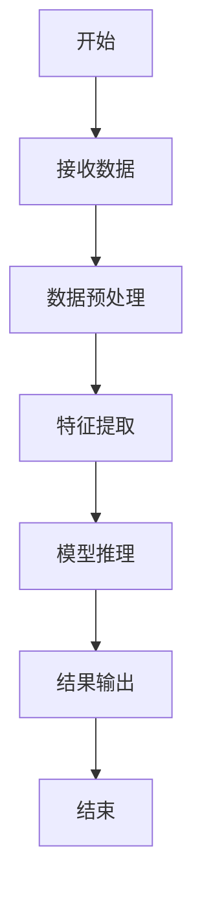
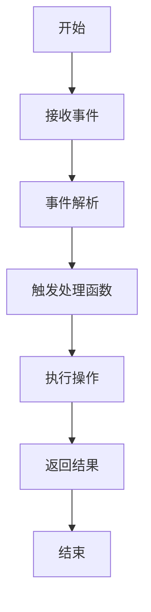
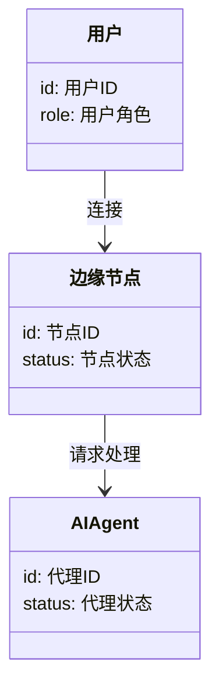
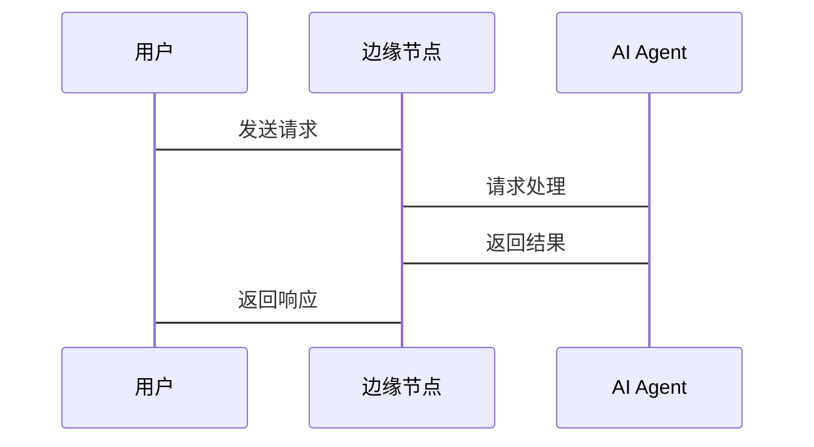

                 


```markdown
# 企业AI Agent的边缘计算应用：实时处理与响应

> 关键词：AI Agent，边缘计算，实时处理，分布式系统，算法优化，系统架构

> 摘要：本文深入探讨了企业AI Agent在边缘计算环境中的应用，重点分析了实时处理与响应的关键技术与实现方案。文章从背景介绍、核心概念、算法原理、系统架构、项目实战到最佳实践，全面解析了AI Agent在边缘计算中的应用场景与技术实现。通过详细的流程图、架构图和代码示例，为读者提供了一套完整的解决方案与实践指南。

---

# 第一部分: 企业AI Agent的边缘计算应用概述

# 第1章: 企业AI Agent与边缘计算概述

## 1.1 企业AI Agent的概念与背景

### 1.1.1 企业AI Agent的基本定义
企业AI Agent是一种智能代理系统，能够根据实时数据和环境反馈，自主决策并执行操作。它结合了人工智能、机器学习和自动化技术，旨在提高企业的运营效率和决策能力。

### 1.1.2 边缘计算的背景与特点
边缘计算是一种分布式计算范式，数据在靠近数据源的地方进行处理，而不是依赖于中心化的云端计算。边缘计算的特点包括低延迟、高实时性、本地化数据处理和网络带宽优化。

### 1.1.3 企业AI Agent与边缘计算的结合
通过将AI Agent部署在边缘节点，企业能够实现数据的实时处理和快速响应，减少对中心服务器的依赖，提升系统的实时性和可靠性。

## 1.2 问题背景与问题描述

### 1.2.1 传统企业应用的局限性
传统的企业应用通常依赖中心化的云端计算，数据传输延迟高，且在边缘设备上缺乏智能处理能力，难以满足实时性要求。

### 1.2.2 边缘计算在企业中的需求
随着企业对实时数据处理和快速响应的需求增加，边缘计算成为解决传统云端计算延迟问题的重要技术。

### 1.2.3 AI Agent在实时处理中的作用
AI Agent能够通过边缘计算实现实时数据处理和智能决策，提升企业的运营效率和响应速度。

## 1.3 问题解决与边界定义

### 1.3.1 AI Agent如何解决边缘计算问题
AI Agent通过在边缘节点上部署智能算法，实现实时数据分析、任务分配和决策优化，解决了传统边缘计算中缺乏智能决策能力的问题。

### 1.3.2 边界与外延的定义
AI Agent的边界在于其在边缘节点上的部署和运行，外延则包括与云端系统的交互和数据同步。

### 1.3.3 核心要素与组成结构
AI Agent的组成结构包括感知层、决策层、执行层和通信层，各层协同工作，实现数据的采集、处理、决策和执行。

## 1.4 本章小结
本章介绍了企业AI Agent和边缘计算的基本概念，分析了它们的结合方式，并讨论了AI Agent在边缘计算中的作用和边界。

---

# 第二部分: 核心概念与技术原理

# 第2章: AI Agent的核心概念与原理

## 2.1 AI Agent的原理分析

### 2.1.1 AI Agent的基本工作原理
AI Agent通过感知环境、分析数据、制定决策并执行操作，实现实时响应和智能控制。

### 2.1.2 边缘计算中的AI Agent特点
边缘计算中的AI Agent具有低延迟、本地化处理、分布式部署和高实时性等特点。

## 2.2 核心概念对比与ER实体关系图

### 2.2.1 核心概念属性特征对比表
| 概念       | 属性               | 特征                 |
|------------|--------------------|----------------------|
| AI Agent   | 智能决策、实时响应 | 高效、精准           |
| 边缘计算    | 分布式计算、低延迟 | 节能、灵活           |

### 2.2.2 ER实体关系图
```mermaid
er
    actor: 用户
    agent: AI Agent
    edge: 边缘节点
    task: 任务
    relation: 关联
    actor -|> agent: 请求处理
    agent -|> edge: 分发任务
    edge -|> task: 执行任务
    task -|> relation: 返回结果
```

## 2.3 本章小结
本章通过对比分析和ER实体关系图，阐述了AI Agent和边缘计算的核心概念及其相互关系。

---

# 第3章: 边缘计算中的实时处理算法

## 3.1 实时处理算法原理

### 3.1.1 流数据处理算法
流数据处理算法通过实时读取和处理数据流，快速响应边缘节点的请求。

### 3.1.2 事件驱动算法
事件驱动算法基于实时事件触发响应，适用于高动态的边缘环境。

### 3.1.3 分布式计算算法
分布式计算算法通过多节点协作，提升计算效率和系统容错性。

## 3.2 算法流程图

### 3.2.1 流数据处理流程图


### 3.2.2 事件驱动算法流程图


## 3.3 本章小结
本章详细介绍了边缘计算中的实时处理算法及其流程，为后续的系统设计奠定了基础。

---

# 第三部分: 系统分析与架构设计

# 第4章: 系统功能设计与架构方案

## 4.1 问题场景介绍

### 4.1.1 企业AI Agent的应用场景
企业AI Agent广泛应用于智能制造、智能物流、智能监控等领域，实现实时数据处理和智能决策。

## 4.2 系统功能设计

### 4.2.1 领域模型设计


### 4.2.2 系统架构设计


## 4.3 系统接口设计

### 4.3.1 边缘节点接口
- 数据采集接口：从传感器获取实时数据。
- 任务分配接口：接收AI Agent的任务指令。

### 4.3.2 AI Agent接口
- 数据处理接口：对实时数据进行分析和决策。
- 事件响应接口：处理边缘节点的事件请求。

## 4.4 系统交互流程图

### 4.4.1 系统交互流程


## 4.5 本章小结
本章通过系统功能设计和架构方案，详细阐述了企业AI Agent在边缘计算中的实现方式。

---

# 第四部分: 项目实战

# 第5章: 项目实战与代码实现

## 5.1 环境安装

### 5.1.1 系统环境要求
- 操作系统：Linux/Windows/MacOS
- Python版本：3.6+

### 5.1.2 工具安装
- Python依赖：安装`mermaid`、`pandas`、`numpy`等库。

## 5.2 核心代码实现

### 5.2.1 数据预处理代码
```python
import pandas as pd

def preprocess_data(data):
    # 数据清洗和特征提取
    processed_data = data.dropna().astype(float)
    return processed_data
```

### 5.2.2 AI Agent核心算法
```python
import numpy as np

class AIAgent:
    def __init__(self):
        self.model = self.build_model()

    def build_model(self):
        # 构建机器学习模型
        return np.random.rand(10, 10)

    def predict(self, data):
        # 预测结果
        return self.model.dot(data)
```

## 5.3 代码应用解读与分析

### 5.3.1 数据预处理解读
数据预处理代码用于清洗和提取特征，确保输入数据的格式和质量。

### 5.3.2 AI Agent算法解读
AI Agent通过构建和训练模型，实现对实时数据的预测和决策。

## 5.4 实际案例分析

### 5.4.1 案例背景
以智能制造为例，AI Agent部署在边缘节点，实现实时监控和故障预测。

### 5.4.2 案例分析
通过代码实现，展示AI Agent如何处理实时数据，预测设备状态并触发维护请求。

## 5.5 本章小结
本章通过实际案例和代码实现，详细讲解了企业AI Agent在边缘计算中的应用。

---

# 第五部分: 最佳实践与总结

# 第6章: 最佳实践与注意事项

## 6.1 实战经验总结

### 6.1.1 系统优化经验
- 通过分布式计算优化系统性能。
- 使用缓存技术减少重复计算。

### 6.1.2 代码优化技巧
- 使用异步编程提升处理效率。
- 优化数据结构，减少内存占用。

## 6.2 小结与注意事项

### 6.2.1 小结
企业AI Agent在边缘计算中的应用前景广阔，但实现过程中需要注意系统的实时性、可靠性和可扩展性。

### 6.2.2 注意事项
- 确保数据安全和隐私保护。
- 定期更新模型，提升预测精度。

## 6.3 未来展望
随着技术的发展，企业AI Agent将更加智能化和自动化，应用场景也将进一步扩展。

---

# 结语

本文通过系统化的分析和实践，详细探讨了企业AI Agent在边缘计算中的应用。从理论到实践，从概念到代码，为读者提供了一套完整的解决方案与实践指南。通过本文的学习，读者可以深入了解企业AI Agent的核心技术，并能够在实际项目中灵活应用这些知识。
```

