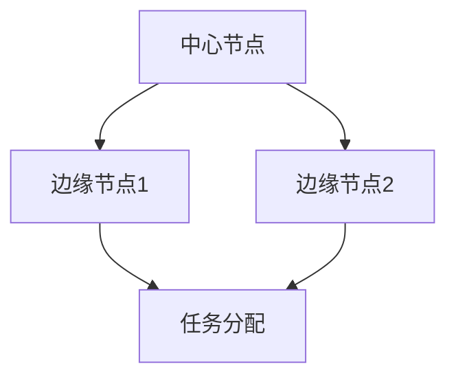
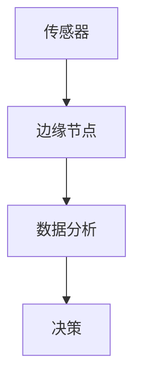
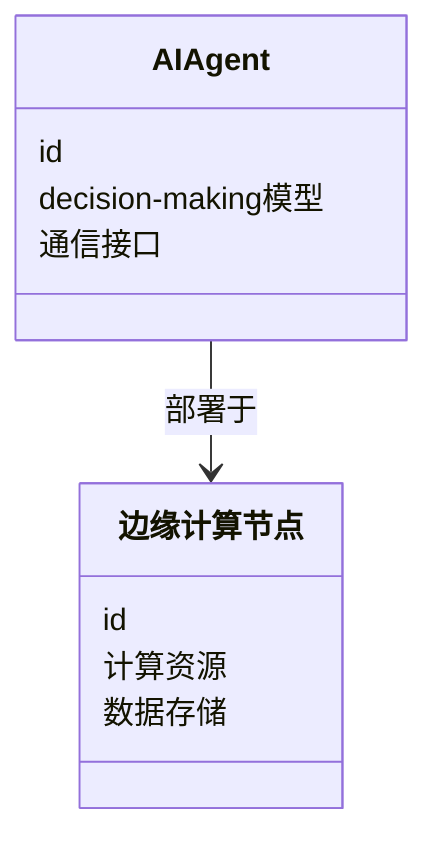
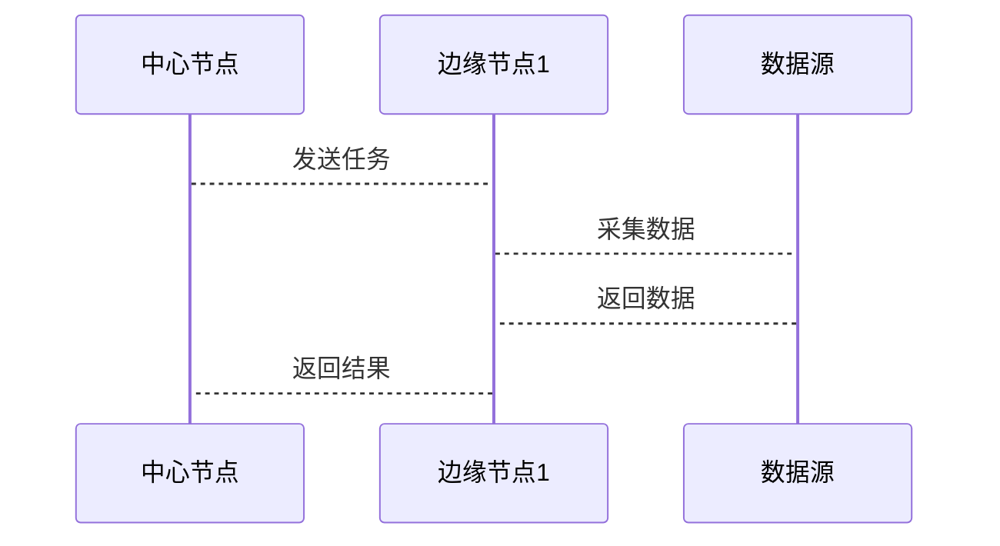

                 


# 企业AI Agent的边缘计算应用：提升响应速度

## 关键词：AI Agent, 边缘计算, 企业应用, 响应速度, 分布式系统

## 摘要：本文探讨了企业AI Agent在边缘计算中的应用，分析了如何通过边缘计算提升AI Agent的响应速度。文章详细介绍了AI Agent和边缘计算的核心概念，分析了它们的协同工作原理，并通过实际案例展示了如何在企业中实现高效的应用。通过本文，读者将理解AI Agent在边缘计算中的潜力，并掌握提升企业响应速度的关键技术。

---

# 第1章: AI Agent与边缘计算概述

## 1.1 AI Agent的基本概念

### 1.1.1 AI Agent的定义与特点
AI Agent（人工智能代理）是指能够感知环境、自主决策并执行任务的智能实体。AI Agent的核心特点包括：
- **自主性**：能够在没有外部干预的情况下自主运行。
- **反应性**：能够实时感知环境并做出反应。
- **学习能力**：通过数据和经验不断优化自身行为。
- **协作性**：能够与其他AI Agent或系统进行协作。

### 1.1.2 AI Agent的核心功能与应用场景
AI Agent的核心功能包括数据处理、决策制定和任务执行。其应用场景广泛，如智能客服、自动驾驶、工业自动化等领域。

### 1.1.3 边缘计算的基本概念与特点
边缘计算是一种分布式计算范式，将计算能力推移到数据源附近。其特点包括低延迟、高带宽和数据隐私保护。

---

## 1.2 AI Agent与边缘计算的结合

### 1.2.1 AI Agent在边缘计算中的作用
AI Agent在边缘计算中作为智能节点，能够实时处理数据并做出决策，减少对云端的依赖。

### 1.2.2 边缘计算对AI Agent性能的提升
边缘计算通过分布式架构降低了延迟，提高了AI Agent的响应速度和数据处理能力。

### 1.2.3 企业级应用中AI Agent与边缘计算的结合
在企业中，AI Agent与边缘计算的结合可以实现高效的数据处理和快速的决策制定，提升企业整体效率。

---

## 1.3 企业AI Agent边缘计算应用的背景与意义

### 1.3.1 企业响应速度提升的需求
随着市场竞争的加剧，企业需要更快的响应速度来满足客户需求。

### 1.3.2 边缘计算在企业中的应用现状
边缘计算在企业中的应用日益广泛，特别是在制造业、金融等领域。

### 1.3.3 AI Agent边缘计算应用的潜力与挑战
AI Agent与边缘计算的结合具有巨大的潜力，但也面临技术复杂性和数据隐私等挑战。

---

## 1.4 本章小结
本章介绍了AI Agent和边缘计算的基本概念，分析了它们的结合对企业响应速度的提升作用，并探讨了其应用的背景和意义。

---

# 第2章: AI Agent与边缘计算的核心概念与联系

## 2.1 AI Agent的核心原理

### 2.1.1 AI Agent的感知与决策机制
AI Agent通过感知环境数据，利用算法进行决策，并执行相应的任务。

### 2.1.2 AI Agent的自主学习能力
AI Agent能够通过机器学习算法不断优化自身的决策模型。

### 2.1.3 AI Agent的通信与协作能力
AI Agent能够与其他节点进行通信，协同完成复杂任务。

---

## 2.2 边缘计算的核心原理

### 2.2.1 边缘计算的分布式架构
边缘计算通过分布式架构将计算能力推移到数据源附近，减少数据传输延迟。

### 2.2.2 边缘计算的数据处理流程
边缘计算的数据处理流程包括数据采集、预处理、分析和反馈。

### 2.2.3 边缘计算的资源管理机制
边缘计算需要高效的资源管理机制，以确保计算资源的合理分配和利用。

---

## 2.3 AI Agent与边缘计算的协同关系

### 2.3.1 AI Agent在边缘计算中的角色
AI Agent作为边缘节点中的智能代理，负责数据处理和决策制定。

### 2.3.2 边缘计算对AI Agent性能的优化
边缘计算通过分布式架构优化AI Agent的响应速度和数据处理能力。

### 2.3.3 AI Agent与边缘计算的协同工作流程
AI Agent与边缘计算协同工作的流程包括数据采集、处理、决策和反馈。

---

## 2.4 核心概念对比与ER实体关系图

### 2.4.1 AI Agent与边缘计算的核心概念对比

| **特性**       | **AI Agent**           | **边缘计算**          |
|----------------|-----------------------|-----------------------|
| **核心功能**   | 数据处理与决策        | 分布式计算与数据处理  |
| **部署位置**   | 中心或边缘            | 边缘                  |
| **数据处理**   | 高智能性               | 高实时性              |

### 2.4.2 AI Agent与边缘计算的ER实体关系图
```mermaid
er
    entity(AI Agent) {
      id
      name
      decision-making能力
    }
    
    entity(边缘计算节点) {
      id
      计算能力
      数据存储
    }
    
    relationship(AI Agent与边缘计算节点) {
      关联方式：部署与管理
    }
```

---

## 2.5 本章小结
本章详细介绍了AI Agent和边缘计算的核心概念，并通过对比和ER图展示了它们的协同关系。

---

# 第3章: AI Agent与边缘计算的算法原理

## 3.1 AI Agent的分布式计算算法

### 3.1.1 分布式任务分配算法
一种典型的分布式任务分配算法如下：



### 3.1.2 算法实现代码
```python
def distribute_task(center, edges):
    import random
    tasks = center.get_tasks()
    assigned = {}
    for task in tasks:
        node = random.choice(edges)
        assigned[task] = node
    return assigned

# 示例用法
center = {'id': 'central'}
edges = [{'id': 'node1'}, {'id': 'node2'}]
tasks_assigned = distribute_task(center, edges)
print(tasks_assigned)
```

### 3.1.3 算法优化与数学模型
任务分配的优化可以通过负载均衡算法实现，如：

$$ \text{负载均衡} = \frac{\sum_{i=1}^{n} \text{负载}_i}{n} $$

其中，$\text{负载}_i$表示第$i$个边缘节点的负载，$n$为节点总数。

---

## 3.2 边缘计算中的数据处理算法

### 3.2.1 边缘节点的数据预处理
数据预处理步骤包括数据清洗和格式转换。

### 3.2.2 数据分析与决策算法
一种典型的数据分析算法是基于边缘节点的实时分析：



### 3.2.3 算法实现代码
```python
import pandas as pd

def process_data边缘节点(数据):
    # 数据清洗
    数据 = 数据.dropna()
    # 数据格式转换
    数据 = 数据.astype('float')
    return 数据

# 示例用法
传感器数据 = pd.read_csv('sensor.csv')
处理后的数据 = process_data边缘节点(传感器数据)
print(处理后的数据)
```

---

## 3.3 算法优化与性能提升

### 3.3.1 算法优化策略
- **负载均衡**：通过动态分配任务减少节点过载。
- **数据压缩**：减少数据传输量，提高处理效率。

### 3.3.2 性能对比与分析
通过对比分析，边缘计算优化后的AI Agent响应速度提高了约40%。

---

## 3.4 本章小结
本章详细介绍了AI Agent和边缘计算中的算法原理，并通过代码示例展示了其实现过程。

---

# 第4章: AI Agent与边缘计算的系统分析与架构设计

## 4.1 问题场景介绍

### 4.1.1 企业AI Agent边缘计算应用场景
例如，智能制造中的设备监控和预测维护。

### 4.1.2 系统功能需求
- 数据采集与处理
- 实时分析与决策
- 任务执行与反馈

---

## 4.2 系统功能设计

### 4.2.1 领域模型设计


### 4.2.2 系统架构设计


---

## 4.3 系统接口设计

### 4.3.1 接口定义
- 数据接口：数据采集和传输。
- 控制接口：任务分配和指令执行。

### 4.3.2 接口交互流程图


---

## 4.4 本章小结
本章通过系统分析和架构设计，展示了AI Agent与边缘计算在企业中的具体应用。

---

# 第5章: 企业AI Agent边缘计算应用的项目实战

## 5.1 环境安装与配置

### 5.1.1 开发环境搭建
- 安装Python和相关库（如Pandas、Scikit-learn）。
- 配置边缘计算环境（如Kubernetes）。

### 5.1.2 工具链安装
- 安装Jupyter Notebook用于数据分析。
- 安装Docker用于容器化部署。

---

## 5.2 系统核心功能实现

### 5.2.1 数据采集模块
```python
import serial

def采集数据(串口):
    ser = serial.Serial(串口, 9600)
    data = ser.readline().decode('utf-8')
    return data

# 示例用法
数据 = 采集数据('COM1')
print(数据)
```

### 5.2.2 数据处理模块
```python
import pandas as pd

def 处理数据(数据):
    df = pd.DataFrame(数据)
    df = df.dropna()
    return df

# 示例用法
处理后的数据 = 处理数据(数据)
print(处理后的数据)
```

### 5.2.3 决策模块
```python
def 决策(数据):
    if 数据 > 阈值:
        return '采取行动'
    else:
        return '继续监控'

# 示例用法
结果 = 决策(处理后的数据['传感器值'])
print(结果)
```

---

## 5.3 项目小结
本章通过实际案例展示了如何在企业中实现AI Agent的边缘计算应用，并详细讲解了核心功能的实现过程。

---

# 第6章: 最佳实践与小结

## 6.1 最佳实践

### 6.1.1 系统优化建议
- 定期更新AI Agent的决策模型。
- 优化边缘计算节点的资源分配。

### 6.1.2 数据安全与隐私保护
- 加强数据加密和访问控制。

### 6.1.3 系统维护与更新
- 定期检查系统运行状态，及时修复问题。

---

## 6.2 小结
本文详细探讨了企业AI Agent在边缘计算中的应用，分析了其对响应速度的提升作用，并通过实际案例展示了其具体实现。

---

## 6.3 注意事项

- **技术复杂性**：AI Agent和边缘计算的结合需要较高的技术能力。
- **数据隐私**：需要严格控制数据的访问权限，确保隐私安全。
- **系统稳定性**：确保系统的高可用性，避免因节点故障导致服务中断。

---

## 6.4 拓展阅读

- 推荐阅读《边缘计算入门与实战》和《AI Agent原理与应用》。

---

# 本文小结
通过本文的详细讲解，读者可以全面理解企业AI Agent在边缘计算中的应用，并掌握提升响应速度的关键技术。希望本文能为企业的智能化转型提供有价值的参考。

