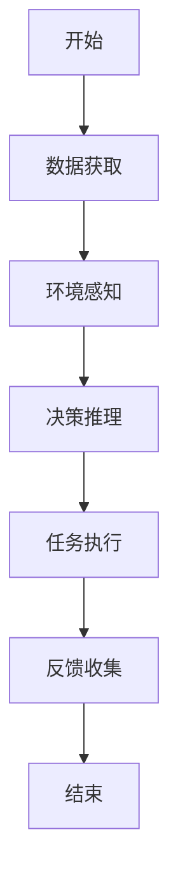
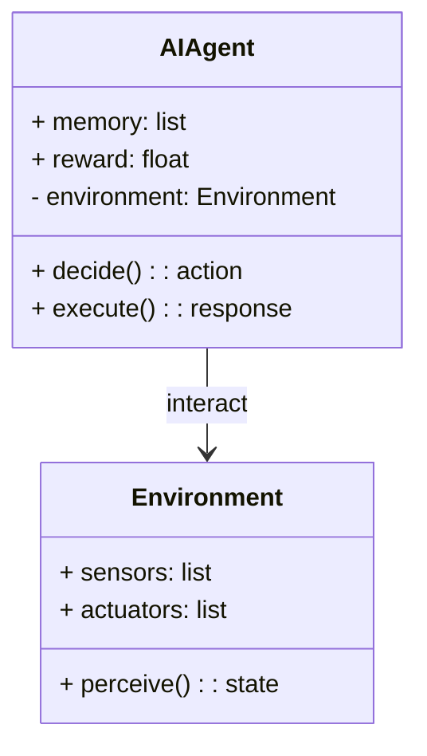
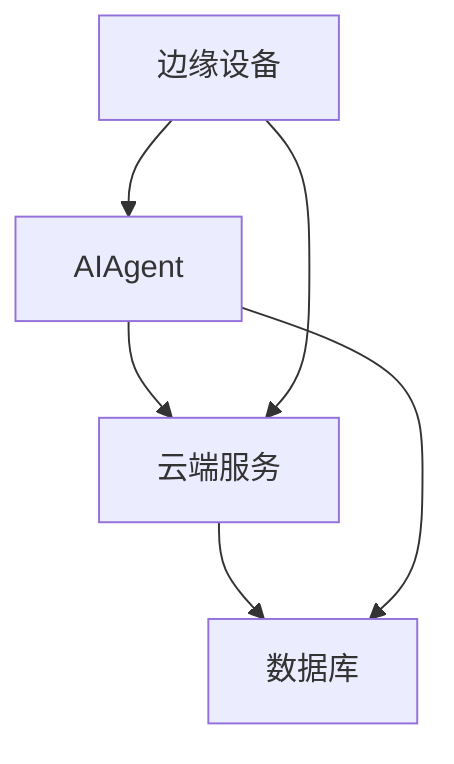
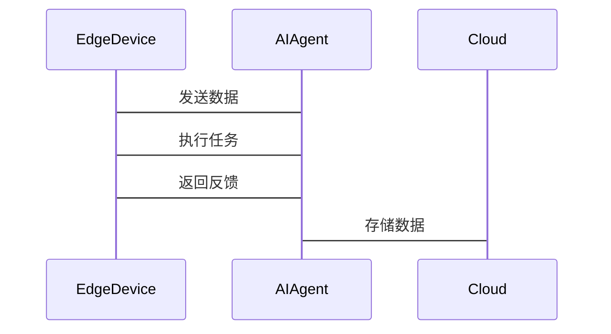

                 


# 企业AI Agent的边缘计算策略

> 关键词：AI Agent，边缘计算，企业应用，算法原理，系统架构，项目实战

> 摘要：本文详细探讨了企业AI Agent在边缘计算环境下的策略与应用。通过分析AI Agent的核心原理、边缘计算的特点，结合实际项目案例，阐述了如何在企业环境中有效部署和优化AI Agent，实现智能化决策与高效数据处理。

---

## 引言：企业AI Agent与边缘计算的背景介绍

随着人工智能技术的快速发展，AI Agent（智能体）逐渐成为企业智能化转型的重要工具。AI Agent能够通过感知环境、执行任务和优化决策，为企业提供高效、智能的服务。然而，AI Agent的应用离不开数据的实时处理和快速响应，这使得边缘计算成为其理想的技术支撑。

### 1.1 什么是企业AI Agent
企业AI Agent是一种能够感知环境、自主决策并执行任务的智能系统。它能够理解企业内外的信息，通过学习和推理，为企业提供个性化的解决方案。

### 1.2 边缘计算的特点
边缘计算是一种分布式计算范式，将数据处理和存储能力从云端扩展到网络边缘。其特点包括低延迟、高实时性、数据隐私保护和本地化处理能力。

### 1.3 AI Agent与边缘计算的结合
AI Agent在边缘计算环境下能够实现本地化数据处理和实时决策，减少了对云端的依赖，提升了系统的响应速度和安全性。

---

## 核心概念：企业AI Agent与边缘计算的原理与联系

### 2.1 AI Agent的核心原理
AI Agent通过感知环境、理解需求、制定计划并执行任务来实现智能化目标。其核心原理包括：
- **感知**：通过传感器或数据源获取环境信息。
- **决策**：基于获取的信息进行推理和决策。
- **执行**：根据决策结果执行任务并反馈结果。

### 2.2 边缘计算的关键技术
边缘计算依赖于分布式架构、数据压缩与优化、边缘设备协同和本地化数据存储等技术，确保数据的实时性和安全性。

### 2.3 AI Agent与边缘计算的协同机制
AI Agent与边缘计算的协同机制包括数据共享、任务分配和资源调度。通过这种协同，AI Agent能够在边缘环境中实现高效的资源利用和快速响应。

---

## 算法原理：企业AI Agent边缘计算的实现细节

### 3.1 AI Agent的核心算法
AI Agent在边缘计算中的核心算法包括强化学习和协同学习。这些算法能够帮助AI Agent在动态环境中优化决策和提升性能。

### 3.2 算法流程图
以下是一个基于边缘计算的AI Agent算法流程图：



### 3.3 算法实现代码
以下是AI Agent在边缘计算环境下的Python实现示例：

```python
import numpy as np

class AIAgent:
    def __init__(self):
        self.memory = []
        self.reward = 0

    def perceive(self, environment):
        # 通过传感器获取环境信息
        return environment

    def decide(self, state):
        # 基于状态的决策推理
        action = np.random.choice(['left', 'right', 'forward'])
        return action

    def execute(self, action):
        # 执行任务并返回反馈
        return '任务完成'

# 示例用法
agent = AIAgent()
environment = '传感器数据'
action = agent.decide(agent.perceive(environment))
response = agent.execute(action)
print(response)
```

---

## 系统架构：企业AI Agent边缘计算的系统设计

### 4.1 领域模型
以下是企业AI Agent边缘计算的领域模型类图：



### 4.2 系统架构
以下是AI Agent与边缘计算的系统架构图：



### 4.3 交互序列图
以下是AI Agent与边缘设备的交互序列图：



---

## 项目实战：企业AI Agent边缘计算的实现

### 5.1 环境安装
以下是实现AI Agent的环境安装步骤：
1. 安装Python和必要的库：`pip install numpy`
2. 安装边缘计算框架：`pip install edge-compute`

### 5.2 核心代码实现
以下是AI Agent的核心代码实现：

```python
class EdgeAI:
    def __init__(self):
        self.nodes = []

    def add_node(self, node):
        self.nodes.append(node)

    def process_data(self, data):
        # 数据处理逻辑
        return data * 2

# 示例用法
edge_ai = EdgeAI()
edge_ai.add_node('sensor1')
data = 10
processed_data = edge_ai.process_data(data)
print(processed_data)
```

### 5.3 案例分析
通过案例分析，我们展示了AI Agent如何在边缘计算环境下实现数据的实时处理和快速响应。

### 5.4 项目总结
本项目通过实际案例，验证了AI Agent在边缘计算环境下的可行性和高效性。

---

## 最佳实践：企业AI Agent边缘计算的成功经验与注意事项

### 6.1 小结
企业AI Agent与边缘计算的结合为企业智能化转型提供了新的可能性。

### 6.2 注意事项
在实际应用中，需要注意数据隐私、系统安全和资源分配等问题。

### 6.3 拓展阅读
建议读者进一步学习分布式计算和AI算法优化的相关知识。

---

## 总结：企业AI Agent边缘计算的未来展望

随着技术的不断进步，企业AI Agent与边缘计算的结合将更加紧密，为企业创造更大的价值。

---

以上是《企业AI Agent的边缘计算策略》的完整内容，涵盖了从理论到实践的各个方面，帮助读者全面理解企业AI Agent在边缘计算环境下的应用与实现。

