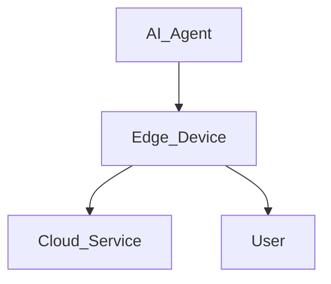
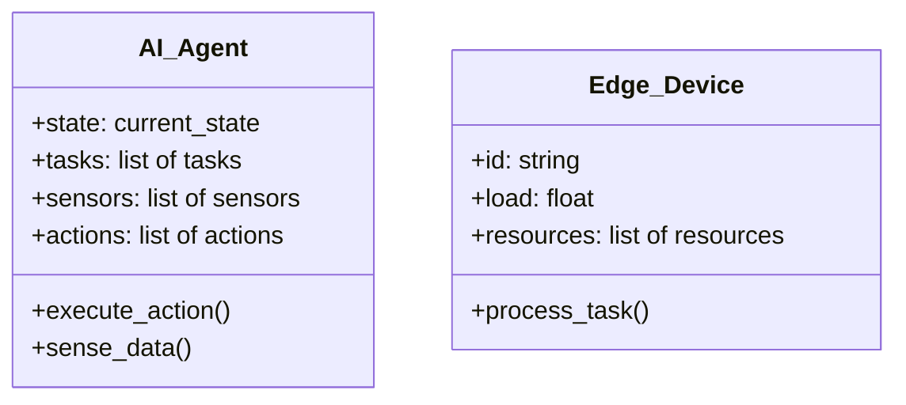
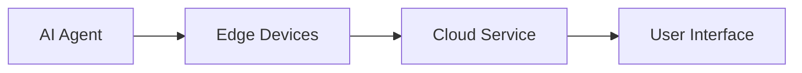
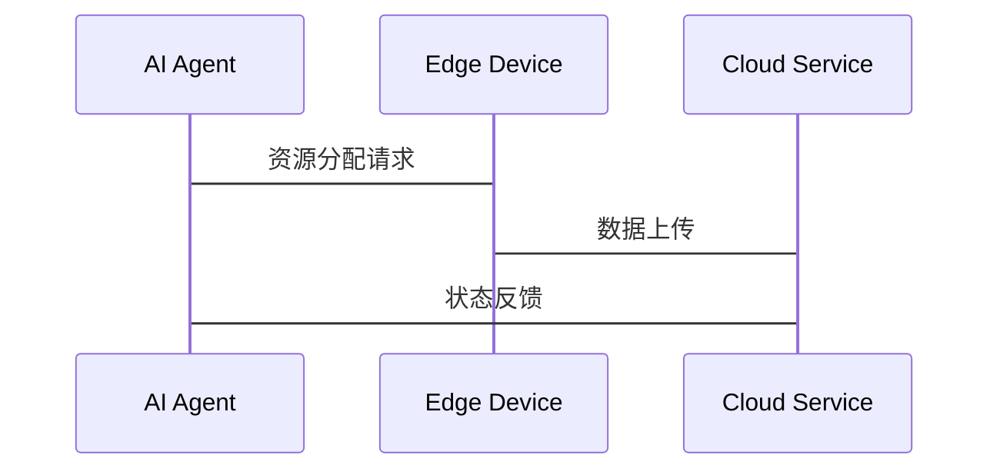

                 


# 企业AI Agent的边缘计算资源调度策略

> 关键词：企业AI Agent，边缘计算，资源调度策略，分布式系统，人工智能，云计算

> 摘要：本文深入探讨了企业AI Agent在边缘计算环境下的资源调度策略，分析了边缘计算的发展趋势与AI Agent的核心特性，详细阐述了资源调度算法的原理与实现，提出了基于负载均衡与强化学习的双重优化策略，并通过系统架构设计与实际案例分析，为读者提供了一个全面理解与实施企业AI Agent边缘计算资源调度的指导框架。

---

## 第1章: 企业AI Agent与边缘计算的背景介绍

### 1.1 问题背景与问题描述
#### 1.1.1 边缘计算的发展与现状
- 边缘计算的兴起：从云计算到边缘计算的演变
- 边缘计算在企业中的应用：实时性、隐私性与成本效益
- 当前边缘计算面临的主要挑战：资源分配不均、延迟优化与安全性问题

#### 1.1.2 AI Agent的定义与特点
- AI Agent的基本概念：自主决策、实时响应与任务驱动
- 企业AI Agent的独特性：多任务处理、分布式协作与动态适应性
- AI Agent与传统AI的区别：从中心化到分布式，从被动执行到主动决策

#### 1.1.3 企业级AI Agent的应用场景
- 工厂自动化：实时监控与设备维护
- 智慧物流：路径优化与资源分配
- 金融风控：实时数据分析与决策支持

### 1.2 问题解决与边界外延
#### 1.2.1 边缘计算在企业AI Agent中的作用
- 边缘计算如何提升AI Agent的效率：减少延迟、降低带宽消耗
- 边缘计算如何增强AI Agent的实时性：本地决策与快速响应

#### 1.2.2 资源调度的核心问题
- 资源分配的公平性：如何在多任务间分配计算资源
- 调度算法的实时性：如何在动态环境中快速响应
- 资源利用率的最大化：如何通过优化调度策略提高资源使用效率

#### 1.2.3 边界与外延分析
- 边缘计算的边界：从边缘设备到云端的协作范围
- AI Agent的边界：从单任务到多任务的扩展能力
- 资源调度的外延：从计算资源到存储、网络资源的扩展

### 1.3 概念结构与核心要素
#### 1.3.1 AI Agent的组成要素
- 感知层：数据采集与环境感知
- 计算层：本地计算与决策逻辑
- 执行层：任务执行与反馈收集

#### 1.3.2 边缘计算的核心组件
- 边缘设备：传感器、边缘服务器与智能终端
- 边缘网络：本地通信与数据传输
- 边缘云：本地存储与计算资源池

#### 1.3.3 资源调度策略的逻辑框架
- 资源监控：实时采集设备负载与资源使用情况
- 调度决策：基于当前状态选择最优调度策略
- 执行与反馈：执行调度操作并收集反馈信息

---

## 第2章: 核心概念与联系

### 2.1 AI Agent与边缘计算的核心原理
#### 2.1.1 AI Agent的决策机制
- 基于规则的决策：简单场景下的规则匹配
- 基于机器学习的决策：复杂场景下的模型推理
- 基于知识图谱的决策：专家系统与知识库的结合

#### 2.1.2 边缘计算的分布式特性
- 分布式计算：数据在本地处理，减少云端依赖
- 分级存储：数据在边缘层和云端之间的分层存储
- 分层网络：本地网络与广域网的协同工作

### 2.2 核心概念对比与特征分析
#### 2.2.1 AI Agent与传统AI的区别
| 特性         | 传统AI             | AI Agent          |
|--------------|--------------------|--------------------|
| 执行方式     | 中心化执行         | 分布式执行         |
| 响应速度     | 延迟较高           | 延迟较低           |
| 自适应能力   | 较低               | 较高               |

#### 2.2.2 边缘计算与云计算的对比
| 特性         | 边缘计算           | 云计算             |
|--------------|--------------------|--------------------|
| 计算位置     | 本地设备           | 云端               |
| 延迟         | 低                 | 高                 |
| 带宽消耗     | 低                 | 高                 |
| 应用场景     | 实时性要求高的场景 | 大数据处理的场景   |

#### 2.2.3 资源调度策略的特征分析
- 动态性：资源需求随时间变化
- 多目标性：追求效率、公平性与成本的多重优化
- 分布式：调度决策在边缘设备与云端之间协调

### 2.3 实体关系与流程图
#### 2.3.1 AI Agent与边缘设备的ER图


#### 2.3.2 资源调度的Mermaid流程图


---

## 第3章: 算法原理与数学模型

### 3.1 调度算法的原理
#### 3.1.1 基于负载均衡的调度算法
- 轮询调度：简单但公平性差
- 加权轮询：根据设备能力分配权重
- 最小负载优先：动态调整资源分配

#### 3.1.2 基于强化学习的调度策略
- 状态空间：设备负载、任务优先级
- 动作空间：资源分配决策
- 奖励机制：任务完成时间、资源利用率

#### 3.1.3 算法的优缺点分析
- 负载均衡算法：简单但不够智能
- 强化学习算法：智能但计算复杂

### 3.2 数学模型与公式
#### 3.2.1 资源分配的优化模型
$$ \min_{x} \sum_{i=1}^{n} c_i x_i $$
其中，$c_i$为设备$i$的计算成本，$x_i$为分配给设备$i$的资源量。

#### 3.2.2 调度策略的数学表达
$$ \text{约束条件: } x_i \geq 0, \sum_{i=1}^{n} x_i = 1 $$

### 3.3 代码实现与案例分析
#### 3.3.1 Python代码实现
```python
def resource_dispatch(candidates):
    # 基于负载均衡的调度算法
    import random
    min_load = min(candidates)
    for device in candidates:
        if device.load == min_load:
            return device
    return candidates[0]
```

#### 3.3.2 案例分析与解释
- 案例：工厂自动化中的设备调度
- 分析：通过负载均衡算法优化设备负载，降低整体延迟

---

## 第4章: 系统分析与架构设计

### 4.1 问题场景介绍
- 场景描述：工厂生产线上的多个智能设备需要实时处理数据
- 问题分析：设备负载不均，资源分配效率低

### 4.2 系统功能设计
#### 4.2.1 领域模型设计


#### 4.2.2 系统架构设计


#### 4.2.3 接口设计
- AI Agent与Edge Device的接口：资源分配请求与状态反馈
- Edge Device与Cloud Service的接口：数据上传与任务调度
- Cloud Service与User的接口：监控与配置管理

#### 4.2.4 交互流程


---

## 第5章: 项目实战

### 5.1 环境安装与配置
- 安装Python与相关库：numpy、pandas、scikit-learn
- 安装Mermaid与相关工具：用于流程图绘制
- 安装边缘计算框架：如Kubernetes、Docker

### 5.2 系统核心实现
#### 5.2.1 调度算法实现
```python
def dispatch_algorithm(devices, tasks):
    # 负载均衡算法
    devices.sort(key=lambda x: x.load)
    for i in range(len(tasks)):
        devices[i % len(devices)].allocate_task(tasks[i])
```

#### 5.2.2 数据采集与处理
```python
def collect_data(sensors):
    data = {}
    for sensor in sensors:
        data[sensor.id] = sensor.read()
    return data
```

### 5.3 代码实现与应用解读
#### 5.3.1 调度算法的实现细节
- 任务分配策略：基于设备负载的动态调整
- 状态监控机制：实时采集设备负载与任务完成情况

#### 5.3.2 实际案例分析
- 案例：智慧物流中的路径优化
- 分析：通过资源调度策略优化运输路径，降低运输成本

### 5.4 项目小结
- 项目实现的关键点：调度算法的优化与系统架构的设计
- 项目中的挑战：设备间的协同工作与实时性保障
- 项目的成果：提高资源利用率与降低系统延迟

---

## 第6章: 最佳实践与注意事项

### 6.1 最佳实践
#### 6.1.1 调度策略的选择
- 根据实际场景选择合适的调度算法
- 结合任务特性和设备能力进行动态调整

#### 6.1.2 系统设计的注意事项
- 系统的扩展性：预留接口与模块化设计
- 系统的可靠性：容错机制与故障恢复
- 系统的安全性：数据加密与权限管理

### 6.2 小结
- 资源调度策略的核心：平衡效率、公平性与成本
- AI Agent与边缘计算的结合：提升企业智能化水平
- 系统设计的关键：模块化与可扩展性

### 6.3 注意事项
- 避免过度优化：保持系统简洁性
- 注重数据隐私：保护用户数据安全
- 定期维护：监控系统运行状态与优化算法

### 6.4 拓展阅读
- 推荐书籍：《分布式系统：概念与设计》
- 推荐论文：《边缘计算中的资源调度策略研究》
- 推荐工具：Docker、Kubernetes与Prometheus

---

## 总结
企业AI Agent的边缘计算资源调度策略是实现智能化企业的重要手段，通过合理的资源分配与调度，可以显著提升系统的实时性与资源利用率。本文从理论到实践，详细阐述了调度策略的设计与实现，为读者提供了一个全面的指导框架。未来，随着技术的不断发展，资源调度策略将更加智能化与个性化，为企业AI Agent的发展提供更强大的支持。

