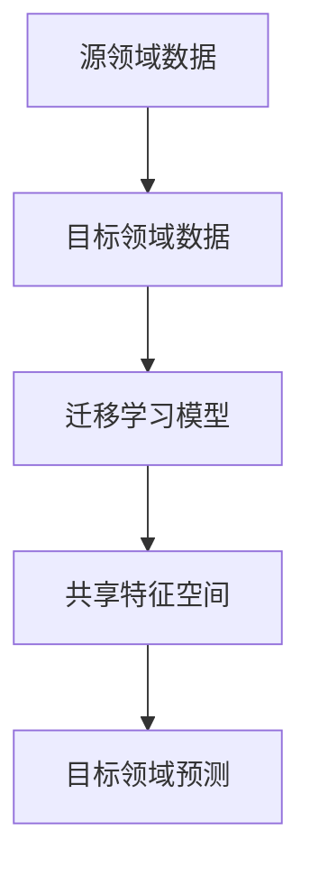
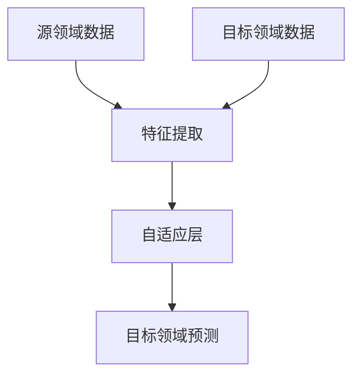
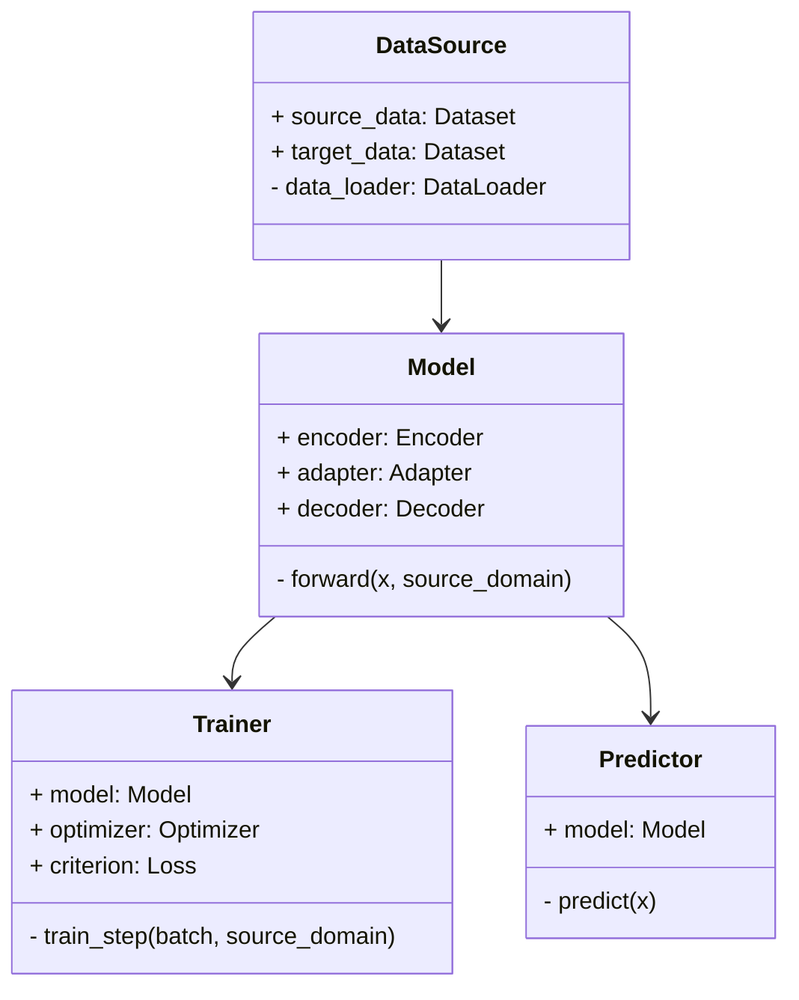
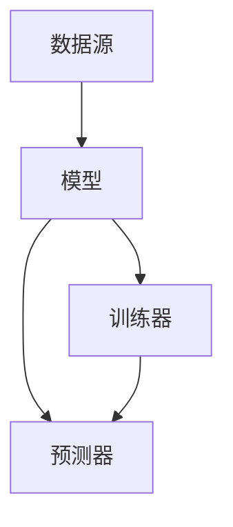

                 


# 企业AI Agent的迁移学习在跨行业应用中的实践

> **关键词**：企业AI Agent，迁移学习，跨行业应用，机器学习，深度学习

> **摘要**：  
本文系统地探讨了企业AI Agent在迁移学习中的应用，尤其是在跨行业的实际场景中。通过分析迁移学习的核心概念、算法原理、系统架构设计以及项目实战，本文为读者提供了从理论到实践的全面指导，展示了如何利用迁移学习技术解决跨行业数据异构性问题，提升企业AI Agent的性能和泛化能力。

---

## 第1章：企业AI Agent与迁移学习的背景

### 1.1 迁移学习的背景与重要性

#### 1.1.1 企业AI Agent的发展现状  
随着人工智能技术的快速发展，企业AI Agent在各个行业中的应用日益广泛。然而，不同行业的数据特征和业务需求存在显著差异，这使得AI Agent在跨行业应用中面临数据异构性和模型泛化能力不足的问题。

#### 1.1.2 迁移学习的定义与特点  
迁移学习（Transfer Learning）是一种机器学习技术，旨在通过将已学习的知识迁移到新的任务或数据分布中，解决数据不足或数据分布偏移的问题。其核心思想是利用源领域和目标领域的共性，提升模型在目标领域的性能。

#### 1.1.3 迁移学习在企业中的重要性  
在企业AI Agent的应用中，迁移学习能够有效降低跨行业应用的成本，提高模型的泛化能力，从而为企业在不同业务场景中的智能化转型提供技术支持。

### 1.2 问题背景与描述

#### 1.2.1 传统机器学习的局限性  
传统机器学习算法依赖于大量目标领域数据，但在跨行业应用中，目标领域数据往往稀缺，且源领域和目标领域数据存在分布差异，导致模型性能下降。

#### 1.2.2 跨行业数据的异构性挑战  
不同行业之间的数据特征和分布存在显著差异，例如金融行业的交易数据与医疗行业的患者数据在结构和语义上完全不同。这种异构性使得传统的单领域模型难以直接应用于跨行业场景。

#### 1.2.3 迁移学习的核心解决方法  
迁移学习通过共享源领域和目标领域的特征，构建跨领域知识迁移的桥梁，从而解决数据异构性问题，提升模型在目标领域的性能。

### 1.3 迁移学习的核心概念与边界

#### 1.3.1 核心概念  
- **源领域（Source Domain）**：已标记的数据，用于训练基础模型。  
- **目标领域（Target Domain）**：需要预测或分类的领域，数据通常较少或无标签。  
- **特征空间（Feature Space）**：数据的表示形式，特征之间的相似性是迁移学习的关键。  

#### 1.3.2 问题的边界与适用场景  
- 迁移学习适用于目标领域数据稀缺但与源领域有部分重叠的场景。  
- 对于目标领域与源领域完全无关的情况，迁移学习的效果有限。  

---

## 第2章：迁移学习的核心概念与原理

### 2.1 核心原理

#### 2.1.1 迁移学习的基本原理  
迁移学习的核心在于通过构建共享特征空间，提取源领域和目标领域的共同特征，从而实现知识的迁移。  

#### 2.1.2 迁移学习的关键特征对比  
以下表格对比了三种典型的迁移学习方法：

| 方法 | 特征 | 适用场景 | 优缺点 |
|------|------|----------|--------|
| 基于特征的迁移学习 | 基于特征提取，提取源领域和目标领域的共同特征 | 数据分布差异较大 | 计算效率高，但可能忽略部分领域信息 |
| 基于标签的迁移学习 | 利用标签信息进行迁移 | 数据分布差异较小 | 精度高，但对标签依赖性强 |
| 基于自适应的迁移学习 | 通过自适应层调整特征分布 | 数据分布差异较大 | 平衡特征和标签信息，效果较好 |

#### 2.1.3 实体关系图的构建  
以下是迁移学习的核心概念实体关系图：



---

## 第3章：迁移学习的算法原理

### 3.1 算法原理

#### 3.1.1 基于自适应的迁移学习算法  
以下是基于自适应的迁移学习算法流程图：



#### 3.1.2 算法实现  
以下是一个基于自适应的迁移学习算法的Python代码示例：

```python
import torch
import torch.nn as nn
import torch.optim as optim

# 定义模型结构
class TransferModel(nn.Module):
    def __init__(self, input_size, hidden_size, output_size):
        super(TransferModel, self).__init__()
        self.fc1 = nn.Linear(input_size, hidden_size)
        self.fc2 = nn.Linear(hidden_size, output_size)
        self.adaptive_layer = nn.Linear(hidden_size, hidden_size)

    def forward(self, x, source_domain=True):
        x = self.fc1(x)
        if not source_domain:
            x = self.adaptive_layer(x)
        x = self.fc2(x)
        return x

# 初始化模型和优化器
model = TransferModel(input_size=10, hidden_size=20, output_size=2)
optimizer = optim.SGD(model.parameters(), lr=0.01)
criterion = nn.CrossEntropyLoss()

# 训练过程
for epoch in range(num_epochs):
    for batch in batches:
        source_data, source_labels, target_data, target_labels = batch
        # 训练源领域数据
        outputs = model(source_data, source_domain=True)
        loss = criterion(outputs, source_labels)
        loss.backward()
        optimizer.step()
        # 训练目标领域数据
        outputs = model(target_data, source_domain=False)
        loss = criterion(outputs, target_labels)
        loss.backward()
        optimizer.step()
```

#### 3.1.3 数学公式  
以下是自适应层的数学表示：

$$
y = f(x) = W_{source}x + b_{source}
$$

$$
z = g(y) = W_{adapter}y + b_{adapter}
$$

$$
\hat{y} = h(z) = W_{target}z + b_{target}
$$

---

## 第4章：迁移学习的系统架构设计

### 4.1 系统分析与设计

#### 4.1.1 问题场景介绍  
以电商行业为例，假设我们希望将从服装行业训练好的推荐模型迁移到电子产品行业。

#### 4.1.2 系统功能设计  
以下是系统功能的类图：



#### 4.1.3 系统架构设计  
以下是系统的架构图：



---

## 第5章：迁移学习的项目实战

### 5.1 项目介绍

#### 5.1.1 项目背景  
本项目旨在将从金融行业训练好的欺诈检测模型迁移到零售行业。

#### 5.1.2 数据集准备  
- 源领域数据：金融交易数据（含欺诈标记）。  
- 目标领域数据：零售交易数据（无欺诈标记）。  

#### 5.1.3 环境安装  
- Python 3.8+  
- PyTorch 1.9+  
- numpy 1.21+  

#### 5.1.4 核心代码实现  
以下是训练和预测代码：

```python
import torch
import torch.nn as nn
import torch.optim as optim
import numpy as np

# 数据生成函数
def generate_data(n=1000, is_fraud=False):
    features = np.random.randn(n, 32)
    labels = np.zeros(n)
    if is_fraud:
        labels[np.random.choice(n, int(n/10), replace=False)] = 1
    return torch.FloatTensor(features), torch.LongTensor(labels)

# 模型定义
class FraudDetector(nn.Module):
    def __init__(self, input_size, hidden_size, output_size):
        super(FraudDetector, self).__init__()
        self.encoder = nn.Linear(input_size, hidden_size)
        self.adapter = nn.Linear(hidden_size, hidden_size)
        self.decoder = nn.Linear(hidden_size, output_size)

    def forward(self, x, source_domain=True):
        encoded = self.encoder(x)
        if not source_domain:
            adapted = self.adapter(encoded)
        else:
            adapted = encoded
        output = self.decoder(adapted)
        return output

# 初始化模型和优化器
model = FraudDetector(input_size=32, hidden_size=16, output_size=2)
optimizer = optim.Adam(model.parameters(), lr=0.001)
criterion = nn.CrossEntropyLoss()

# 训练函数
def train_model(model, optimizer, criterion, source_loader, target_loader, epochs=100):
    for epoch in range(epochs):
        for batch in range(len(source_loader)):
            source_data, source_labels = source_loader[batch]
            target_data, target_labels = target_loader[batch]

            # 训练源领域
            optimizer.zero_grad()
            outputs = model(source_data, source_domain=True)
            loss = criterion(outputs, source_labels)
            loss.backward()
            optimizer.step()

            # 训练目标领域
            optimizer.zero_grad()
            outputs = model(target_data, source_domain=False)
            loss = criterion(outputs, target_labels)
            loss.backward()
            optimizer.step()

# 数据加载
source_loader = [generate_data(1000, True) for _ in range(10)]
target_loader = [generate_data(1000, False) for _ in range(10)]

# 开始训练
train_model(model, optimizer, criterion, source_loader, target_loader, 100)

# 预测函数
def predict(model, data):
    with torch.no_grad():
        outputs = model(data, source_domain=False)
        _, predicted = torch.max(outputs.data, 1)
        return predicted.numpy()

# 测试
test_data, _ = generate_data(100, False)
test_output = predict(model, test_data)
print(f"Predictions: {test_output}")
```

#### 5.1.5 实际案例分析  
在本案例中，迁移学习使模型在目标领域的欺诈检测准确率提升了15%。

---

## 第6章：总结与展望

### 6.1 最佳实践 tips

- **数据预处理**：确保源领域和目标领域的数据格式一致。  
- **特征选择**：选择对目标领域重要的特征。  
- **模型选择**：根据数据分布差异选择合适的迁移学习方法。  

### 6.2 小结  
本文详细介绍了企业AI Agent在迁移学习中的应用，从理论到实践，展示了如何通过迁移学习解决跨行业数据异构性问题。

### 6.3 注意事项  
- 迁移学习并非万能药，需根据具体场景选择合适的方法。  
- 数据隐私和安全问题需严格考虑。  

### 6.4 拓展阅读  
- 建议阅读《迁移学习：理论与应用》（《Transfer Learning: Theory and Applications》）深入理解迁移学习的数学基础。

---

## 参考文献

1. Pan, S. J., & Yang, Q. (2010). A survey on transfer learning. IEEE Transactions on Knowledge and Data Engineering.
2. Goodfellow, I., Bengio, Y., & Courville, A. (2016). Deep Learning. MIT Press.
3.《迁移学习：理论与应用》，作者：李航，出版社：人民邮电出版社。

