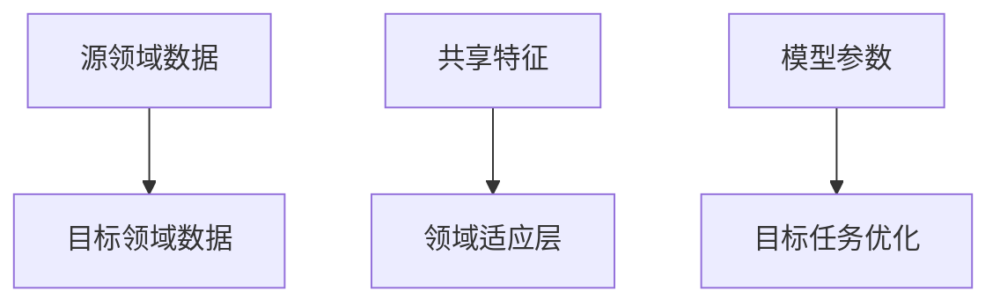
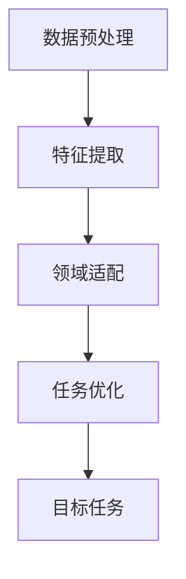

                 


# 企业AI Agent的迁移学习应用：跨领域知识转移

> **关键词**：迁移学习、企业AI Agent、跨领域知识转移、深度学习、知识图谱、领域适应、系统架构

> **摘要**：  
> 近年来，随着人工智能技术的快速发展，企业AI Agent（智能代理）在各行业的应用日益广泛。迁移学习作为一种能够有效处理跨领域知识转移的关键技术，为企业AI Agent的能力提升提供了新的可能性。本文将深入探讨迁移学习的核心原理、应用场景，以及在企业AI Agent中的具体实现。通过结合实际案例，分析迁移学习如何帮助企业实现跨领域的知识共享与任务优化，为企业技术决策者和开发者提供理论与实践相结合的参考。

---

## 目录大纲

1. **背景介绍**  
   - 1.1 问题背景与描述  
   - 1.2 迁移学习的定义与目标  
   - 1.3 迁移学习的特点  
   - 1.4 迁移学习与其他技术的关系  
   - 1.5 应用领域与挑战  

2. **核心概念与联系**  
   - 2.1 迁移学习的原理分析  
   - 2.2 迁移学习方法对比  
   - 2.3 迁移学习的实体关系图  

3. **算法原理讲解**  
   - 3.1 基于样本的迁移学习算法  
   - 3.2 基于特征的迁移学习算法  
   - 3.3 基于模型的迁移学习算法  
   - 3.4 算法的数学模型与公式  

4. **系统分析与架构设计**  
   - 4.1 企业AI Agent的迁移学习系统架构  
   - 4.2 系统功能设计与实现  
   - 4.3 系统接口设计与交互流程  
   - 4.4 系统优化与性能分析  

5. **项目实战与案例分析**  
   - 5.1 项目背景与目标  
   - 5.2 核心代码实现与解读  
   - 5.3 实际案例分析与效果评估  
   - 5.4 项目总结与经验分享  

6. **总结与展望**  
   - 6.1 迁移学习的应用总结  
   - 6.2 企业AI Agent的发展趋势  
   - 6.3 进一步研究的方向  

---

## 第1章: 背景介绍

### 1.1 问题背景与描述

随着企业数字化转型的深入，AI Agent（智能代理）在各行业的应用逐渐普及。然而，AI Agent的能力往往局限于单一领域，难以快速适应跨领域任务的需求。例如，一个在金融领域优化客户风险评估的AI Agent，若要快速适应保险领域的类似任务，往往需要重新训练模型，这不仅耗时，且成本高昂。迁移学习作为一种能够有效解决跨领域知识转移的技术，为企业AI Agent的能力扩展提供了新的解决方案。

#### 核心问题
- 如何利用迁移学习技术，实现跨领域的知识共享与任务优化？  
- 如何在保持原有领域性能的同时，快速提升新领域的任务表现？  

### 1.2 迁移学习的定义与目标

迁移学习（Transfer Learning）是一种机器学习技术，旨在通过将从源领域（Source Domain）学到的知识，迁移到目标领域（Target Domain），以提高目标领域模型的性能。其核心目标在于减少对目标领域数据的依赖，提升模型的泛化能力。

#### 迁移学习的三要素
1. **源领域（Source Domain）**：已标注或部分标注的数据，用于训练初始模型。  
2. **目标领域（Target Domain）**：需要预测或优化的领域，数据可能有限或未标注。  
3. **任务（Task）**：目标领域需要解决的问题，可以是分类、回归或聚类等。  

### 1.3 迁移学习的特点

1. **数据高效性**：通过利用源领域的数据，减少对目标领域数据的需求。  
2. **领域相关性**：源领域与目标领域应具有一定的相似性，否则迁移效果可能不佳。  
3. **适应性**：能够根据不同领域的需求，灵活调整模型参数。  

### 1.4 迁移学习与其他技术的关系

1. **与深度学习的关系**：  
   迁移学习可以基于深度学习模型（如CNN、RNN）进行，通过微调预训练模型参数，实现知识的迁移。  

2. **与领域适应（Domain Adaptation）的关系**：  
   领域适应是迁移学习的一种特殊情况，专注于处理源领域与目标领域之间的分布差异。  

3. **与数据增强的关系**：  
   数据增强技术可以辅助迁移学习，通过生成更多样化的训练数据，提升模型的泛化能力。  

### 1.5 应用领域与挑战

#### 应用领域
- **自然语言处理**：跨语言文本分类、多语言模型训练。  
- **计算机视觉**：跨领域图像识别、目标检测。  
- **推荐系统**：跨领域用户行为分析、个性化推荐。  

#### 挑战
- **领域差异**：源领域与目标领域的数据分布差异较大时，迁移效果不佳。  
- **数据量**：目标领域数据量不足时，难以有效迁移。  
- **模型选择**：不同任务可能需要不同的迁移学习策略。  

---

## 第2章: 核心概念与联系

### 2.1 迁移学习的原理分析

迁移学习的核心在于通过共享特征或参数，实现跨领域知识的转移。以下是三种主要的迁移学习范式：

1. **直接迁移法（Direct Transfer）**：  
   直接使用源领域的模型参数，应用于目标领域任务。适用于目标领域与源领域数据分布相似的场景。  

2. **领域适配法（Domain Adaptation）**：  
   在源领域与目标领域之间构建适配层，调整模型参数，使模型在目标领域表现更好。  

3. **多任务学习（Multi-task Learning）**：  
   同时学习多个相关任务，通过共享任务间的特征或参数，实现跨领域知识的迁移。  

#### 迁移学习的三要素模型
$$
\text{迁移效果} = f(\text{源领域数据}, \text{目标领域数据}, \text{任务})
$$

---

### 2.2 迁移学习方法对比

以下表格对比了三种主要的迁移学习方法：

| 方法 | 描述 | 优点 | 缺点 |
|------|------|------|------|
| 直接迁移法 | 直接使用源领域模型 | 简单易实现 | 易受领域差异影响 |
| 领域适配法 | 在源领域与目标领域之间构建适配层 | 能有效减少领域差异 | 实现复杂 |
| 多任务学习 | 同时学习多个任务 | 适合任务间有相关性 | 计算资源消耗大 |

---

### 2.3 迁移学习的实体关系图



---

## 第3章: 算法原理讲解

### 3.1 基于样本的迁移学习算法

#### 3.1.1 直接迁移法

直接迁移法的核心思想是直接使用源领域的模型参数，应用于目标领域任务。其优点是简单高效，缺点是当领域差异较大时，迁移效果可能不佳。

#### 示例代码

```python
# 示例：直接迁移法在文本分类中的应用
import torch
import torch.nn as nn
from torch.utils.data import DataLoader

# 源领域数据集
class SourceDataset(torch.utils.data.Dataset):
    def __init__(self, x, y):
        self.x = x
        self.y = y
    def __len__(self):
        return len(self.x)
    def __getitem__(self, idx):
        return self.x[idx], self.y[idx]

# 目标领域数据集
class TargetDataset(TargetDataset):
    def __init__(self, x, y):
        self.x = x
        self.y = y
    def __len__(self):
        return len(self.x)
    def __getitem__(self, idx):
        return self.x[idx], self.y[idx]

# 模型定义
class SimpleClassifier(nn.Module):
    def __init__(self, input_dim, output_dim):
        super(SimpleClassifier, self).__init__()
        self.linear = nn.Linear(input_dim, output_dim)
    def forward(self, x):
        return self.linear(x)

# 训练函数
def train_model(model, optimizer, criterion, dataloader, num_epochs=10):
    for epoch in range(num_epochs):
        for inputs, labels in dataloader:
            outputs = model(inputs)
            loss = criterion(outputs, labels)
            optimizer.zero_grad()
            loss.backward()
            optimizer.step()
    return model

# 迁移学习过程
source_x = torch.randn(100, 10)  # 源领域输入
source_y = torch.randint(0, 2, (100,))  # 源领域标签
target_x = torch.randn(50, 10)    # 目标领域输入
target_y = torch.randint(0, 2, (50,))   # 目标领域标签

# 定义数据加载器
source_loader = DataLoader(SourceDataset(source_x, source_y), batch_size=32, shuffle=True)
target_loader = DataLoader(TargetDataset(target_x, target_y), batch_size=32, shuffle=True)

# 初始化模型
model = SimpleClassifier(10, 2)
optimizer = torch.optim.Adam(model.parameters(), lr=0.001)
criterion = nn.CrossEntropyLoss()

# 训练模型
trained_model = train_model(model, optimizer, criterion, source_loader)

# 在目标领域上评估
with torch.no_grad():
    outputs = trained_model(target_x)
    _, predicted = torch.max(outputs.data, 1)
    accuracy = (predicted == target_y).sum().item() / target_y.size(0)
    print(f"Accuracy on target domain: {accuracy}")
```

---

#### 3.1.2 基于分布的迁移学习

基于分布的迁移学习方法通过调整数据分布，使源领域与目标领域的数据更接近。常用的技术包括对抗训练（Adversarial Training）和最大均值差异（Maximum Mean Discrepancy，MMD）。

#### 对抗训练示例代码

```python
# 示例：对抗训练实现领域适配
import torch
import torch.nn as nn
from torch.utils.data import DataLoader

# 对抗网络定义
class Discriminator(nn.Module):
    def __init__(self, input_dim):
        super(Discriminator, self).__init__()
        self.fc = nn.Linear(input_dim, 1)
    def forward(self, x):
        return torch.sigmoid(self.fc(x))

# 迁移学习过程
source_x = torch.randn(100, 10)  # 源领域输入
source_y = torch.randint(0, 2, (100,))  # 源领域标签
target_x = torch.randn(50, 10)    # 目标领域输入
target_y = torch.randint(0, 2, (50,))   # 目标领域标签

# 初始化对抗网络
discrim = Discriminator(10)
optimizer_d = torch.optim.Adam(discrim.parameters(), lr=0.001)

# 训练对抗网络
for epoch in range(100):
    # 随机选择一批数据
    idx = torch.randint(0, source_x.size(0), (32,))
    x_s = source_x[idx]
    x_t = target_x[idx]
    
    # 预测领域
    discrim_s = discrim(x_s)
    discrim_t = discrim(x_t)
    
    # 计算损失
    loss = -torch.mean(torch.log(discrim_s) + torch.log(1 - discrim_t))
    optimizer_d.zero_grad()
    loss.backward()
    optimizer_d.step()

# 提取特征
extracted_features = discrim(torch.cat([source_x, target_x], dim=0))
```

---

## 第4章: 系统分析与架构设计

### 4.1 系统架构设计

企业AI Agent的迁移学习系统通常包含以下几个关键模块：

1. **数据预处理模块**：对源领域和目标领域的数据进行清洗、归一化等预处理。  
2. **特征提取模块**：利用深度学习模型提取数据的共享特征。  
3. **领域适配模块**：通过对抗训练或其它方法，调整模型参数以适应目标领域。  
4. **任务优化模块**：针对目标任务进行模型微调，提升任务性能。  

#### 系统架构图



---

## 第5章: 项目实战与案例分析

### 5.1 项目背景与目标

假设我们正在开发一个跨领域的文本分类系统，目标是将源领域的新闻分类模型迁移到目标领域的科技论文分类任务。

---

### 5.2 核心代码实现

以下是一个简单的迁移学习代码示例：

```python
# 示例：文本分类的迁移学习
import torch
import torch.nn as nn
from torch.utils.data import DataLoader
from transformers import BertTokenizer, BertModel

# 数据集定义
class TextDataset(torch.utils.data.Dataset):
    def __init__(self, texts, labels, tokenizer):
        self.texts = texts
        self.labels = labels
        self.tokenizer = tokenizer
    def __len__(self):
        return len(self.texts)
    def __getitem__(self, idx):
        tokens = self.tokenizer.encode_plus(self.texts[idx], return_tensors='pt')
        return tokens['input_ids'].squeeze(), tokens['attention_mask'].squeeze(), self.labels[idx]

# 模型定义
class TextClassifier(nn.Module):
    def __init__(self, bert_model, num_classes):
        super(TextClassifier, self).__init__()
        self.bert = bert_model
        self.dropout = nn.Dropout(0.1)
        self.classifier = nn.Linear(self.bert.config.hidden_size, num_classes)
    def forward(self, input_ids, attention_mask):
        outputs = self.bert(input_ids=input_ids, attention_mask=attention_mask)
        pooled_output = outputs.last_hidden_state[:, 0, :]
        pooled_output = self.dropout(pooled_output)
        return self.classifier(pooled_output)

# 迁移学习过程
tokenizer = BertTokenizer.from_pretrained('bert-base-uncased')
source_texts = [...]  # 源领域文本
source_labels = [...]  # 源领域标签
target_texts = [...]  # 目标领域文本
target_labels = [...]  # 目标领域标签

# 初始化模型
bert_model = BertModel.from_pretrained('bert-base-uncased')
model = TextClassifier(bert_model, num_classes=2)
optimizer = torch.optim.Adam(model.parameters(), lr=2e-5)
criterion = nn.CrossEntropyLoss()

# 训练模型
source_dataset = TextDataset(source_texts, source_labels, tokenizer)
source_loader = DataLoader(source_dataset, batch_size=16, shuffle=True)
model.train()
for epoch in range(3):
    for batch in source_loader:
        input_ids, attention_mask, labels = batch
        outputs = model(input_ids, attention_mask)
        loss = criterion(outputs, labels)
        optimizer.zero_grad()
        loss.backward()
        optimizer.step()

# 迁移至目标领域
target_dataset = TextDataset(target_texts, target_labels, tokenizer)
target_loader = DataLoader(target_dataset, batch_size=16, shuffle=False)
model.eval()
total_correct = 0
total = 0
with torch.no_grad():
    for batch in target_loader:
        input_ids, attention_mask, labels = batch
        outputs = model(input_ids, attention_mask)
        _, predicted = torch.max(outputs.data, 1)
        total_correct += (predicted == labels).sum().item()
        total += len(labels)
accuracy = total_correct / total
print(f"Accuracy on target domain: {accuracy}")
```

---

## 第6章: 总结与展望

### 6.1 迁移学习的应用总结

迁移学习作为一种强大的技术，已经在企业AI Agent的多个领域得到了广泛应用。通过迁移学习，企业能够显著降低跨领域任务的开发成本，提高模型的泛化能力。

### 6.2 企业AI Agent的发展趋势

随着迁移学习、多模态学习等技术的不断进步，企业AI Agent的能力将更加智能化和通用化。未来，AI Agent将能够更高效地处理跨领域任务，为企业创造更大的价值。

### 6.3 进一步研究的方向

1. **多任务迁移学习**：研究如何在多个任务之间进行知识共享，提升模型的多领域适应能力。  
2. **自适应迁移学习**：探索如何动态调整迁移策略，以应对快速变化的目标领域需求。  
3. **可解释性迁移学习**：研究如何提高迁移学习的可解释性，满足企业对模型透明度的需求。  

---

**结论**  
企业AI Agent的迁移学习应用为企业带来了巨大的潜力，但同时也面临诸多挑战。通过深入理解迁移学习的核心原理，结合实际应用场景，企业能够更好地发挥这一技术的优势，推动AI Agent在更多领域的落地与创新。

